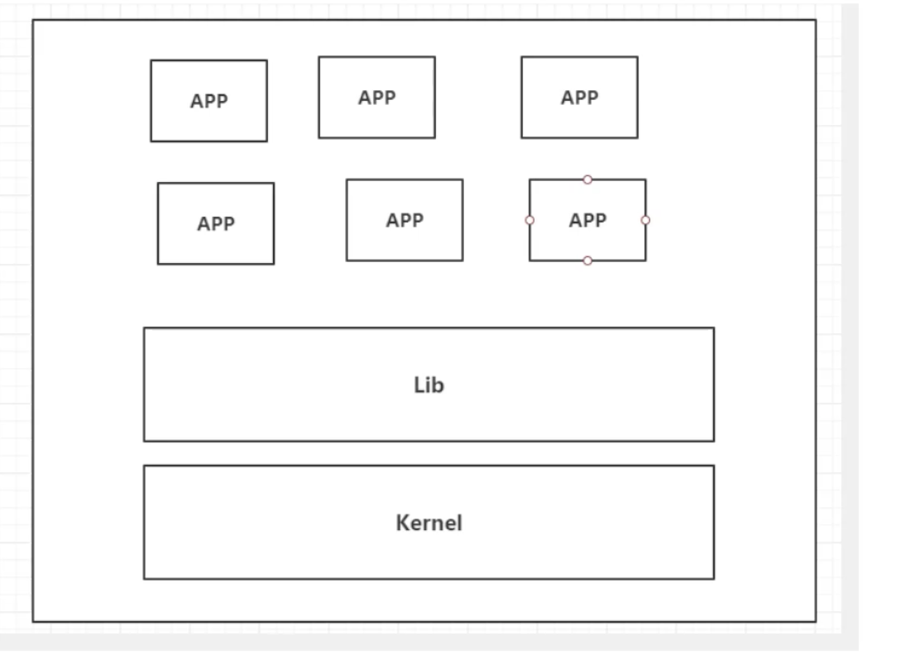
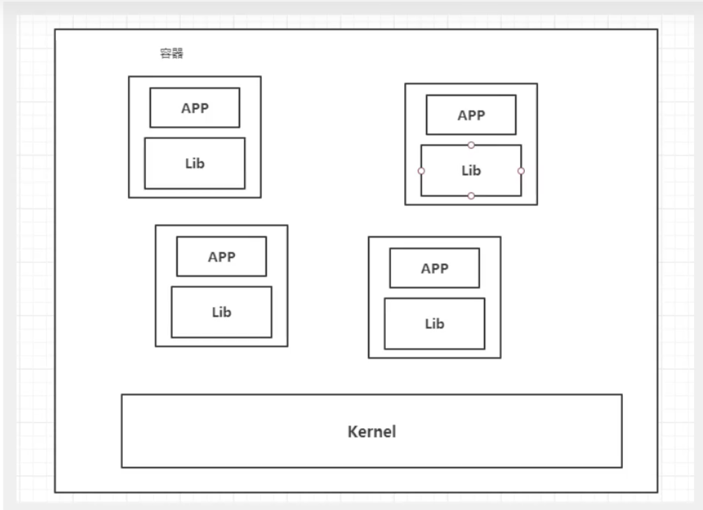

## 入门

三体里有一句话：***弱小和无知不是生存的障碍，傲慢才是***

***知道的越多，不知道的也越多***

***所有的技术都是因为出现了一些问题，我需要去解决，才回去学习！***

 docker的思想来源于集装箱，

**核心思想**：打包装箱，每个箱子都是隔离的，通过隔离机制，可以将服务器利用到极致 

## 历史

2010年，几个小伙在美国成立了dotCloud的公司

2013年，开源源代码

2014年，docker1.0发布啦，火啦！

在容器技术出来之前，我们都是使用虚拟机技术；

虚拟机，是通过vmare等软件，虚拟出一台或者多台电脑，非常笨重，

虚拟机也是属于虚拟化技术，Docker容器化技术，也是属于虚拟化技术 

## Docker能干嘛

### 虚拟机技术

###### 缺点：

1、资源占用十分多

2、冗余步骤多

3、启动很慢

### 容器化技术

容器化技术并不是一个完整的操作系统

比较虚拟机和docker技术的不同：

- 传统的虚拟机，虚拟出一条硬件，运行一个完整的操作系统，然后在这个系统上安装和运行软件
- 容器内的应用是直接运行在宿主机的内容，容器是没有自己的内核的，也没有虚拟我们的硬件，所以就轻量啦
- 每个容器都是互相隔离的，每个容器都一个属于自己的系统，互补影响

##### DevOps（开发，运维）

##### 1、应用更快速的交付和部署

传统：一堆帮助文档，安装程序

docker：打包镜像发布测试，一键运行

##### 2、更便捷的升级和扩缩容

使用docker之后，我们的部署应用就思想和搭积木一样

项目打包为一个镜像，扩展服务器A，服务器B

##### 3、更简单的系统运维

在容器化之后，我们的开发，测试环境都是高度一致的

4、更高效的计算资源利用

docker是内核级的虚拟化，可以在一个物理机上运行很多的容器化实例，服务器的性能可以被压缩到极致

 

