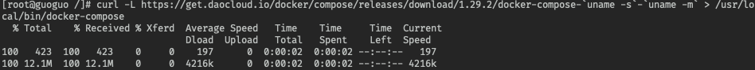
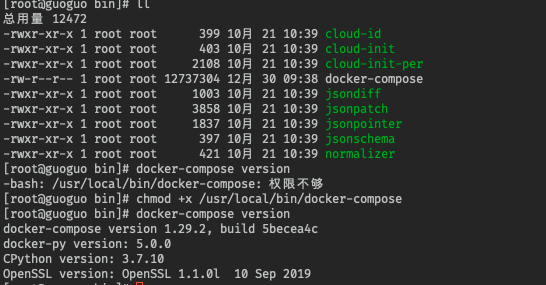
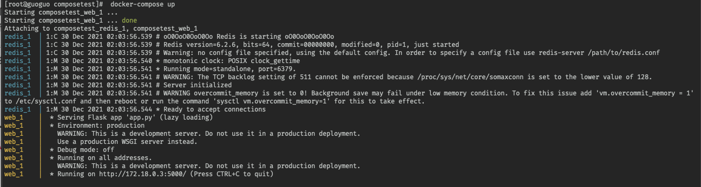
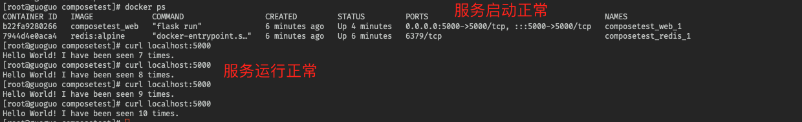
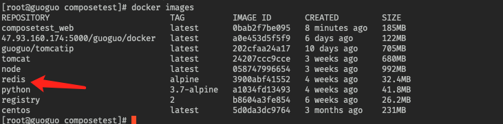
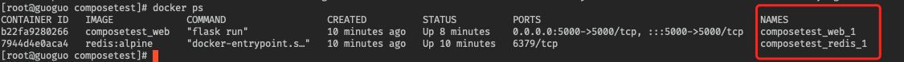
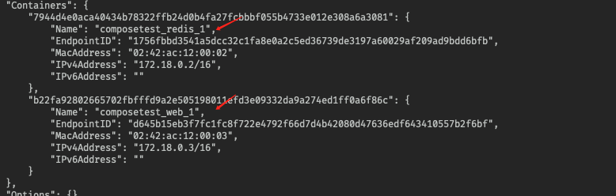
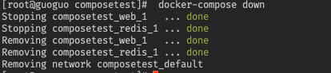
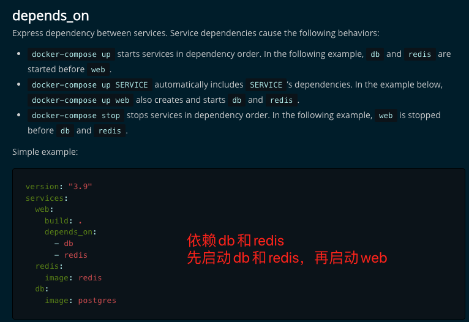

## docker 进阶

### Docker compose

Docker

Dockerfile build run 手动操作，单个容器！

微服务，100 个微服务，服务之间依赖关系。

Docker Compose 来轻松高效的管理容器。定义运行多个容器。

> 官网介绍

定义运行多个容器

YAML file 配置文件

single command 命令有哪些

Compose is a tool for defining and running multi-container Docker applications. With Compose, you use a YAML file to configure your application’s services. Then, with a single command, you create and start all the services from your configuration. To learn more about all the features of Compose, see [the list of features](https://docs.docker.com/compose/#features).

所有的环境都可以使用 compose

Compose works in all environments: production, staging, development, testing, as well as CI workflows. You can learn more about each case in [Common Use Cases](https://docs.docker.com/compose/#common-use-cases).

**三步骤**

Using Compose is basically a three-step process:

1. Define your app’s environment with a `Dockerfile` so it can be reproduced anywhere.

   - Dockerfile 文件保证我们的项目在任何地方都可以运行。

2. Define the services that make up your app in `docker-compose.yml` so they can be run together in an isolated environment.

   - services 什么是服务？

   - docker-compose.yaml 这个文件怎么写？

3. Run `docker compose up` and the [Docker compose command](https://docs.docker.com/compose/cli-command/) starts and runs your entire app. You can alternatively run `docker-compose up` using the docker-compose binary.

   - 启动项目

###### 作用：批量容器编排

> 自己理解

Compose 是 Docker 官方的开源项目，需要安装@

`Dockerfile` 让程序在任何地方运行，web 服务，redis，mysql....多个容器， run...

Compose

```dockerfile
version: "3.9"  # optional since v1.27.0
services:
  web:
    build: .
    ports:
      - "5000:5000"
    volumes:
      - .:/code
      - logvolume01:/var/log
    links:
      - redis
  redis:
    image: redis
volumes:
  logvolume01: {}
```

docker-compose up 100 个服务

Compose： 重要的概念

- 服务 service，容器，应用。（web，redis，mysql....）
- 项目 project，一组关联的容器，博客，web，mysql

##### 安装

1、下载

```shell
# 官方地址
curl -L "https://github.com/docker/compose/releases/download/1.29.2/docker-compose-$(uname -s)-$(uname -m)" -o /usr/local/bin/docker-compose

 # 国内地址
curl -L https://get.daocloud.io/docker/compose/releases/download/1.29.2/docker-compose-`uname -s`-`uname -m` > /usr/local/bin/docker-compose
```



2、对二进制文件应用可执行权限，然后就安装成功啦



##### 体验

入门体验：https://docs.docker.com/compose/gettingstarted/

Python 应用，计数器，redis！

1、应用 app.py

2、Dockerfile 应用打包为镜像

3、Docker-compose.yml 文件 （定义整个服务，需要的环境，web，redis），完整的上线服务

4、启动 compose 项目 （docker-compose up）

5、停止 compose 项目（docker-compose down ctrl+c）

###### 流程：

1、创建网络

2、执行 Docker-compose.yml

3、 启动服务

docker-compose.yml

Creating composites_web_1 ...done

Creating composites_redis_1 ...done



###### 1、文件名 composetest

###### 2、服务

```shell
version: "3.9"
services:
  web:
    build: .
    ports:
      - "5000:5000"
  redis:
    image: "redis:alpine"
```

自动的默认规则



docker images【依赖的镜像会自动下载】



```shell
[root@guoguo composetest]#  docker service ls
Error response from daemon: This node is not a swarm manager. Use "docker swarm init" or "docker swarm join" to connect this node to swarm and try again.
```

docker ps



默认的服务名：文件名\_ 服务名 \_num

多个服务器，集群，A，B \_num 副本数量

集群状态，服务都不可能只有一个运行实例，弹性， 10 HA（高可用） 高并发

kubecli service 负载均衡

###### 3、网络规则


10 个服务 =》服务（项目中的内容都在同一的网络下，域名访问）



停止项目 docker-compose down / ctrl+c



docker-compose

以前都是单个 docker run 启动容器

docker-compose， 通过 docker-compose 编写 yaml 配置文件，可以通过 compose 一键启动所有的服务或者停止

##### Docker 小结：

1、docker 镜像， run =》容器

2、Dockerfile 构建镜像（服务打包）

3、docker-compose 启动项目（编排，多个微服务/环境）

4、Docker 网络

#### yaml 规则

docker-compose.yaml 核心。

https://docs.docker.com/compose/compose-file/compose-file-v3/

```dockerfile
# 3层

version: '' # 版本
service:    # 服务
	服务1: web
	# 服务配置
	image
	build
	network
	...

	服务2:
	...

	服务3:
	...
# 其他配置
volume:
network:
configs:
```



学习要掌握规律！

只要多学，多看，compose.yaml 配置！

#### 开源项目

##### 博客

下载程序，安装数据库，配置...

compose 应用 => 一键启动

1、下载项目（docker-compose.yaml）

2、如果需要文件，Dockerfile

3、文件准备齐全（直接一键启动项目）

```shell
# 前台启动

docker-compose up
docker-compse up -d

# 重新构建
docker-compose up --build
```

##### 总结

###### 工程、服务、容器

项目 compose：三层

- 工程 project
- 服务、服务
- 容器运行的实例。docker， k8s， 容器，pods 等


<font color="red">需要购买好几台服务器啦...下面大家自行学习吧！</font>

### Docker Swarm

集群方式的部署，4 台服务器

### Docker Stack

### Docker secret

### Docker config
