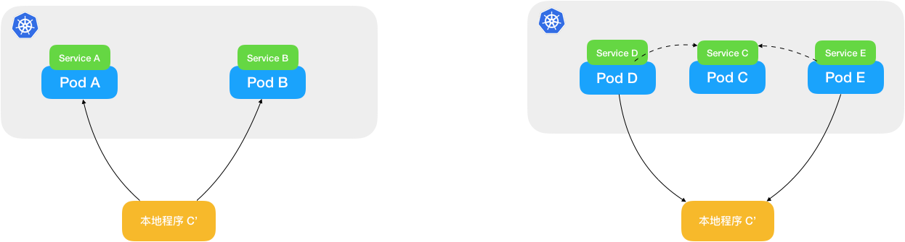
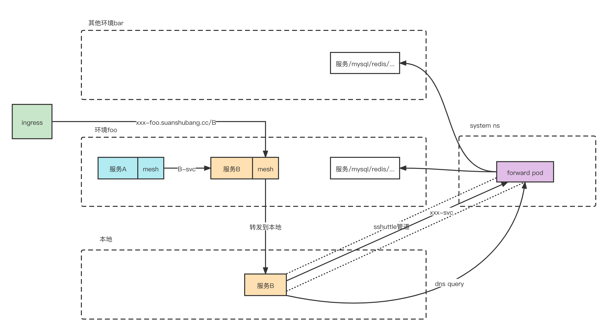

## kt-connect

官网地址：https://alibaba.github.io/kt-connect/#/

### 介绍

ktctl可以让开发者在本地运行的服务与Kubernetes集群中的服务双向互通的工具。

### 背景

#### [本地联调测试](https://alibaba.github.io/kt-connect/#/zh-cn/guide/quickstart)

对于使用了Kubernetes作为应用运行环境的开发者而言，在同一个集群中我们可以使用命名空间（Namespace）快速创建多套隔离环境，在相同命名空间下，服务间使用Service的内部DNS域名进行相互访问。 基于Kubernetes强大的隔离以及服务编排能力，可以实现一套定义编排（YAML）多处部署的能力。不过，一般来说Kubernetes使用的容器网络与开发者的所在的办公网络并不能直接连通。 因此，如何高效的利用Kubernetes进行服务间的联调测试，成为在日常开发工作中一道绕不开的坎。本文我们就来聊一聊，如何加速基于Kubernetes的研发效率。

#### 使用自动化流水线

为了能够让开发者能够更快的将修改的代码部署到集群测试环境中，一般来说我们会引入持续交付流水线，将代码的编译，镜像的打包上传以及部署通过自动化的方式来解决。如下所示：

从一定程度上来说，这种方式可以避免开发人员进行大量重复性的工作。但是，虽然整个过程自动化了，但是开发人员也不得不每次进行代码变更之后都需要等待流水线的运行。对于开发人员来说，每次代码变更后等待流水线运行或许已经成为整个开发任务过程中体验最糟糕的部分。

#### 打破网络限制，本地联调

理想状态下是开发者可以直接在本地启动服务，并且这个服务就可以无缝的和远程的kubernetes集群中的各个其它服务实现互相调用。需要解决两个问题：

- 我依赖了其它的服务：运行在本地的代码可以直接通过podIP，clusterIP甚至是Kubernetes集群内的DNS地址访问到部署在集群中的其它应用，如下图左；
- 其它的服务依赖了我：运行在Kubernetes集群中的其它应用可以在不做任何改变的情况下访问我到运行的本地的代码，如下图右:

要实现这两种本地联调方式，主要需要解决以下3个问题：

- 本地网络与Kubernetes集群网络的直接连通
- 在本地实现Kubernetes中内部服务的DNS解析
- 将对集群中其它Pod访问的流量转移到本地

### 核心功能

双向互通

- 直接访问Kubernetes集群，开发者通过KT可以直接连接Kubernetes集群内部网络，在不修改代码的情况下完成本地联调测试

- 转发集群流量到本地，开发者可以将集群中的流量转发到本地，使得集群中的服务访问本地服务

### 架构图

