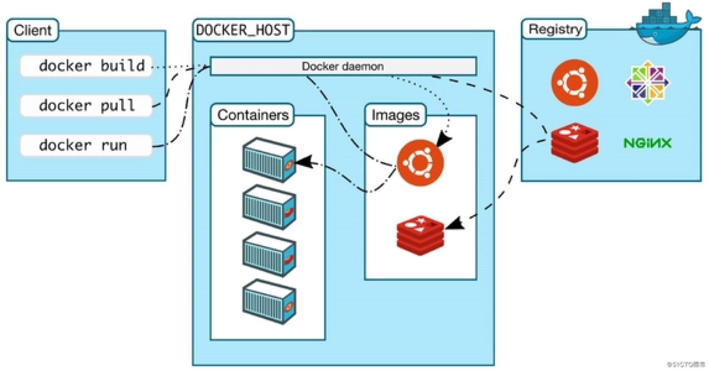
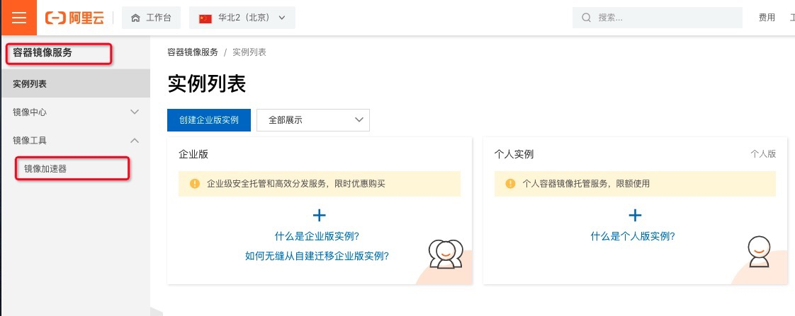
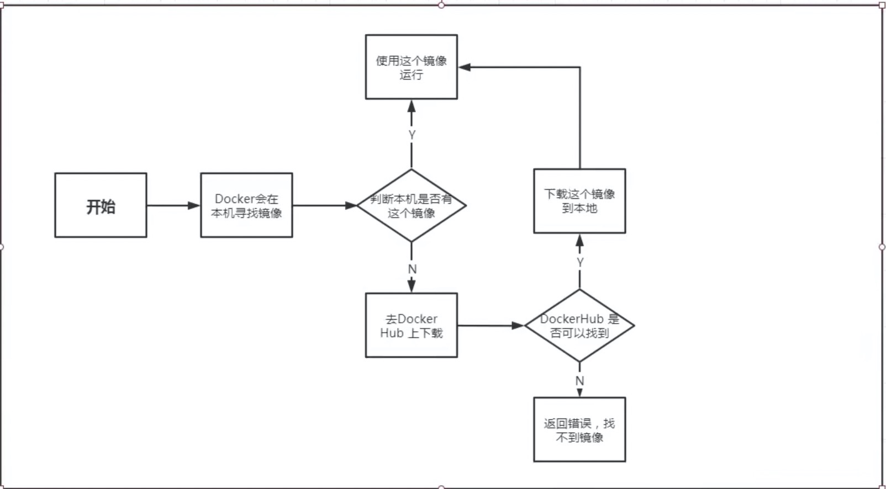
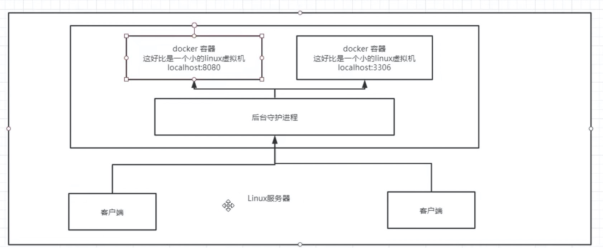
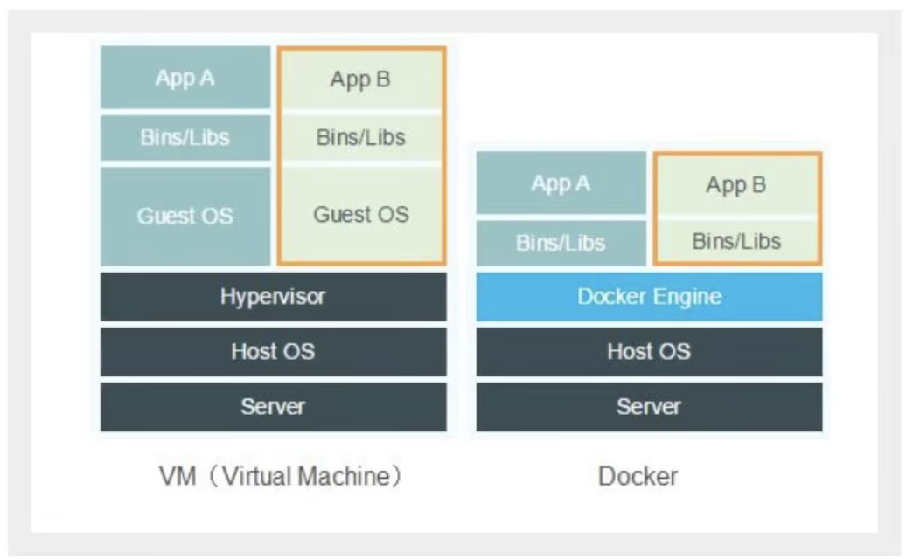
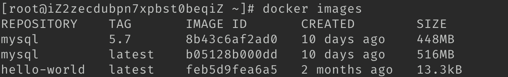
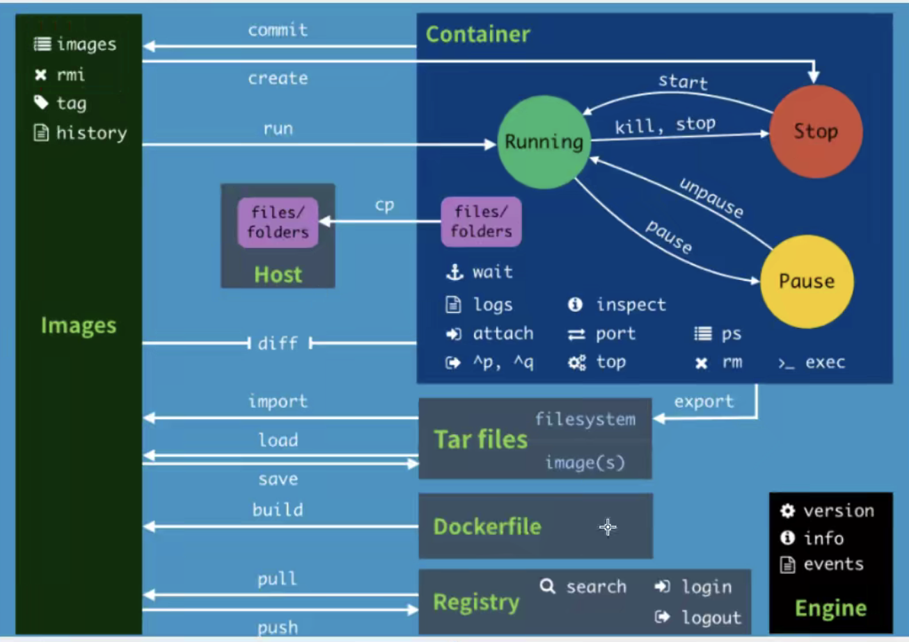
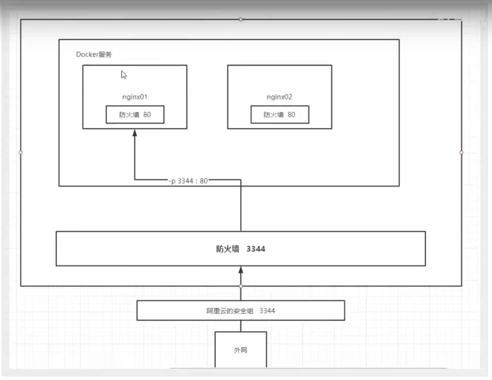

### Docker的基本组成



**镜像（image）**

docker镜像就好比是一个模版，可以通过这个模版来创建容器服务，tomcat服务镜像 ==> run ==>tomcat01容器（提供服务器），通过这个镜像就可以创建多个容器（最终服务运行或者项目运行在容器中的）

**容器（container）**

Docker利用容器技术，独立运行一个或者一组应用，通过镜像来创建的，

启动，停止，删除，基本命令！

目前就可以把这个容器理解为就是一个简易的linux系统

**仓库（repository）**

仓库就是存放镜像的地方！

仓库分为共有仓库和私有仓库！

Docker Hub（默认是国内的）！

阿里云....都是有容器服务的（配置镜像加速）


### 安装Docker

> 环境查看

```shell
#  查看系统内核
[root@iZ2zecdubpn7xpbst0beqiZ guoguo]# uname -r
3.10.0-1160.45.1.el7.x86_64
```

```shell
# 系统版本
[root@iZ2zecdubpn7xpbst0beqiZ guoguo]# cat /etc/os-release
NAME="CentOS Linux"
VERSION="7 (Core)"
ID="centos"
ID_LIKE="rhel fedora"
VERSION_ID="7"
PRETTY_NAME="CentOS Linux 7 (Core)"
ANSI_COLOR="0;31"
CPE_NAME="cpe:/o:centos:centos:7"
HOME_URL="https://www.centos.org/"
BUG_REPORT_URL="https://bugs.centos.org/"

CENTOS_MANTISBT_PROJECT="CentOS-7"
CENTOS_MANTISBT_PROJECT_VERSION="7"
REDHAT_SUPPORT_PRODUCT="centos"
REDHAT_SUPPORT_PRODUCT_VERSION="7"
```

> 安装 [官方地址](https://docs.docker.com/engine/install/centos/)

```shell
# 1、卸载之前的软件
yum remove docker \
          docker-client \
          docker-client-latest \
          docker-common \
          docker-latest \
          docker-latest-logrotate \
          docker-logrotate \
          docker-engine

# 2、需要的安装包
yum install -y yum-utils

# 3、设置仓库
yum-config-manager --add-repo https://download.docker.com/linux/centos/docker-ce.repo
	# 推荐使用国内的
yum-config-manager --add-repo http://mirrors.aliyun.com/docker-ce/linux/centos/docker-ce.repo

# 4、安装docker相关的，docker-ce 社区版   ee是企业版
yum install docker-ce docker-ce-cli containerd.io

# 5、启动docker
systemctl start docker

# 6、使用docker version 来测试是否安装成功
docker version

# 7、 测试hello-world
docker run hello-world

# 8、查看一下下载的 hello-world 镜像
docker images
```

> 卸载

```shell
# 1、 卸载服务依赖
yum remove docker-ce docker-ce-cli containerd.io

# 2、 移除本地资源文件夹
rm -rf /var/lib/docker
rm -rf /var/lib/containerd

# /var/lib/docker docker的默认工作路径
```


### 阿里云镜像加速

###### 1、阿里云 => 弹性计算 => 容器镜像服务 => 管理控制台 => 镜像工具 => 镜像加速器



###### 2、配置镜像加速器

```shell
sudo mkdir -p /etc/docker
sudo tee /etc/docker/daemon.json <<-'EOF'
{
  "registry-mirrors": ["https://wexxz432.mirror.aliyuncs.com"]
}
EOF
sudo systemctl daemon-reload
sudo systemctl restart docker
```


### 回顾hello-world流程

```shell
docker run hello-world
```




###  底层原理

#### Docker是什么工作的

Docker螫一个Client-server结构的系统，Docker的守护进程运行在主机上，通过socket从客户端访问！

DockerServer 接收到Docker Client的指令，就会执行这个命令



Docker为什么比vm更快

1、Docker有着比虚拟机更少的抽象层

2、docker利用的是宿主机的内核，vm需要的是Guest OS。



所以说，新建一个容器的时候，docker不需要像虚拟机一样重新加载一个操作系统的系统内核，避免引导，

 虚拟机是加载Guest OS，分钟级别的，而docker 是利用宿主机的操作系统，省略了这个复杂的过程，秒级.

### Docker的常用命令

#### 帮助命令

```shelll
docker version      # 显示docker的版本信息
docker info         # 显示docker的系统信息，包括镜像和容器的数量
docker 命令 --help   # 万能命令
```

[帮助文档地址](https://docs.docker.com/engine/reference/run/)： https://docs.docker.com/engine/reference/run/


### 镜像命令

##### docker images 查看所有本地的主机上的镜像

```shell
# docker images

REPOSITORY    TAG       IMAGE ID       CREATED        SIZE
hello-world   latest    feb5d9fea6a5   2 months ago   13.3kB

#解释
REPOSITORY  镜像的仓库源
TAG         镜像的标签
IMAGE ID    镜像的id
CREATED     镜像的创建时间
SIZE        镜像的大小

# 可选项
-a , --all        # 列出所有的镜像
-q,  --quiet      # 只显示镜像的id
```

##### docker search  搜索镜像

```shell
# docker search mysql
[root@iZ2zecdubpn7xpbst0beqiZ ~]# docker search mysql
NAME                              DESCRIPTION                                     STARS     OFFICIAL   AUTOMATED
mysql                             MySQL is a widely used, open-source relation…   11736     [OK]
mariadb                           MariaDB Server is a high performing open sou…   4476      [OK]
mysql/mysql-server                Optimized MySQL Server Docker images. Create…   875                  [OK]

# 可选项， 通过搜索来过滤
--filter=STARS=3000  # 搜索出来的镜像就是STARTS大于3000的 
[root@iZ2zecdubpn7xpbst0beqiZ ~]# docker search mysql --filter=STARS=3000
NAME      DESCRIPTION                                     STARS     OFFICIAL   AUTOMATED
mysql     MySQL is a widely used, open-source relation…   11736     [OK]
mariadb   MariaDB Server is a high performing open sou…   4476      [OK]
```

#####  docker pull  下载镜像

```shell
# 下载镜像 
# docker pull 镜像名[:tag]
[root@iZ2zecdubpn7xpbst0beqiZ ~]# docker pull mysql
Using default tag: latest     # 如果不写tag， 默认就是latest
latest: Pulling from library/mysql 
a10c77af2613: Pull complete   # 分层下载，docker image的核心，联合文件系统
b76a7eb51ffd: Pull complete
258223f927e4: Pull complete
2d2c75386df9: Pull complete
63e92e4046c9: Pull complete
f5845c731544: Pull complete
bd0401123a9b: Pull complete
3ef07ec35f1a: Pull complete
c93a31315089: Pull complete
3349ed800d44: Pull complete
6d01857ca4c1: Pull complete
4cc13890eda8: Pull complete
Digest: sha256:aeecae58035f3868bf4f00e5fc623630d8b438db9d05f4d8c6538deb14d4c31b # 签名
Status: Downloaded newer image for mysql:latest # 真实地址
docker.io/library/mysql:latest 

# 等价于它
docker pull mysql
docker pull docker.io/library/mysql:latest 

#指定版本下载
[root@iZ2zecdubpn7xpbst0beqiZ ~]# docker pull mysql:5.7
5.7: Pulling from library/mysql
a10c77af2613: Already exists
b76a7eb51ffd: Already exists
258223f927e4: Already exists
2d2c75386df9: Already exists
63e92e4046c9: Already exists
f5845c731544: Already exists
bd0401123a9b: Already exists
2724b2da64fd: Pull complete
d10a7e9e325c: Pull complete
1c5fd9c3683d: Pull complete
2e35f83a12e9: Pull complete
Digest: sha256:7a3a7b7a29e6fbff433c339fc52245435fa2c308586481f2f92ab1df239d6a29
Status: Downloaded newer image for mysql:5.7
docker.io/library/mysql:5.7
```



docker rmi 删除镜像

```shell
[root@iZ2zecdubpn7xpbst0beqiZ ~]# docker rmi -f 镜像id                      # 删除指定的镜像
[root@iZ2zecdubpn7xpbst0beqiZ ~]# docker rmi -f 镜像id 镜像id                # 删除多个的镜像
[root@iZ2zecdubpn7xpbst0beqiZ ~]# docker rmi -f $(docker images -aq)        # 删除全部的镜像
```


### 容器命令

说明：我们有个镜像才可以创建容器，linux，下载一个centos镜像来测试学习

```shell
docker pull centos
```

##### 新建容器并启动

```shell
docker run [可选参数] image

# 参数说明
--name="Name"  容器名字，tomcat01 tomcat02.用于区分容器
-d             后台方式运行
-it            使用交互方式运行，进入容器查看内容
-p 						 指定容器的端口 -p 8080:8080
			-p ip:主机端口:容器端口
			-p 主机端口：容器端口（常用）
			-p 容器端口
			容器端口
-P              随机指定端口

# 调试、启动并进入容器
[root@iZ2zecdubpn7xpbst0beqiZ ~]# docker run -it centos /bin/bash
[root@30015cd4b9a2 /]# ls   # 查看容器内的centos，基础版本，很多命令都是不完整的
bin  dev  etc  home  lib  lib64  lost+found  media  mnt  opt  proc  root  run  sbin  srv  sys  tmp  usr  var

# 从容器中退回主机
[root@30015cd4b9a2 /]# exit
exit
[root@iZ2zecdubpn7xpbst0beqiZ ~]# ls
guoguo  test  test2
```

##### 列出所有运行的呃容器

```shell
# docker ps 命令
缺省		# 列出当前正在运行的容器
-a     # 剋出当前正在运行的容器 + 历史运行过的容器
-n=？   #  显示最近创建的n条容器 
-q      #  显示容器的编号
-s      # 显示容器的大小

[root@iZ2zecdubpn7xpbst0beqiZ ~]# docker ps
CONTAINER ID   IMAGE     COMMAND   CREATED   STATUS    PORTS     NAMES
[root@iZ2zecdubpn7xpbst0beqiZ ~]# docker ps -a
CONTAINER ID   IMAGE          COMMAND       CREATED         STATUS                     PORTS     NAMES
30015cd4b9a2   centos         "/bin/bash"   8 minutes ago   Exited (0) 7 minutes ago             vigilant_keldysh
bd365785903b   feb5d9fea6a5   "/hello"      4 days ago      Exited (0) 4 days ago                xenodochial_ishizaka
```

##### 退出容器

```shell
exit            # 退出容器停止并推出
Ctrl + P + Q    # 容器不停止退出 
```

##### 删除容器

```shell
docker rm 容器id          					# 删除指定的容器，不能删除正在运行的容器，如果强制删除 rm -f
docker rm -f $(docker ps -aq) 		 # 删除所有的容器
docker ps -a -q|xargs docker rm    # 通过管道的方式，删除所有的容器
```

##### 启动和停止容器的读写

```shel
docker start 容器id     # 启动容器
docker restart 容器id   # 重启容器
docker stop 容器id      # 停止当前正在运行的容器
docker kill 容器id      # 强制停止当前的容器
```


### 其他常用的命令

##### 后台启动容器

```shell
# 命令 docker run -d 镜像名
[root@iZ2zecdubpn7xpbst0beqiZ ~]# docker run -d centos

# 问题docker ps，发现 centos 已经停止啦

# 常见的坑，docker 容器使用后台运行，就必须要有一个前台进程，docker发现没有应用，就会自动停止
# nginx，容器启动后，发现自己没有提供服务，就会立刻停止，就是没有程序了
```

##### 查看日志

```shell
docker logs -t -f --tail n 容器id

# 自己编写一个shell脚本
[root@iZ2zecdubpn7xpbst0beqiZ ~]# docker run -d centos /bin/bash -c "while true; do echo guoguo; sleep 1; done";

[root@iZ2zecdubpn7xpbst0beqiZ ~]# docker ps
CONTAINER ID   IMAGE 
49f1354b72c4   centos   

# 显示日志
-tf            # 显示日志
--tail n。     # 现实日志的条数

[root@iZ2zecdubpn7xpbst0beqiZ ~]# docker logs -tf --tail 10 49f1354b72c4
2021-11-29T05:42:29.525519648Z guoguo
2021-11-29T05:42:30.527649519Z guoguo

```

##### 查看容器中的进程信息

```shell
# 命令 docker top。容器id
[root@iZ2zecdubpn7xpbst0beqiZ ~]# docker top 98e879605fec
UID                 PID                 PPID          
root                9549                9531           
root                9624                9549       
```

##### 查看镜像的元数据【很常用】

```shell
# docker inspect 容器id
[root@iZ2zecdubpn7xpbst0beqiZ ~]# docker inspect 98e879605fec
[
    {
        "Id": "98e879605fec76550828dc74c449cb655f19682da2d1a8687513355a2207d482",
        "Created": "2021-11-30T02:26:48.59505347Z",
        "Path": "/bin/bash",
        "Args": [
            "-c",
            "while true; do echo guoguo; sleep 1; done"
        ],
        "State": {
            "Status": "running",
            "Running": true,
            "Paused": false,
            "Restarting": false,
            "OOMKilled": false,
            "Dead": false,
            "Pid": 9549,
            "ExitCode": 0,
            "Error": "",
            "StartedAt": "2021-11-30T02:26:48.918803605Z",
            "FinishedAt": "0001-01-01T00:00:00Z"
        },
        "Image": "sha256:5d0da3dc976460b72c77d94c8a1ad043720b0416bfc16c52c45d4847e53fadb6",
        "ResolvConfPath": "/var/lib/docker/containers/98e879605fec76550828dc74c449cb655f19682da2d1a8687513355a2207d482/resolv.conf",
        "HostnamePath": "/var/lib/docker/containers/98e879605fec76550828dc74c449cb655f19682da2d1a8687513355a2207d482/hostname",
        "HostsPath": "/var/lib/docker/containers/98e879605fec76550828dc74c449cb655f19682da2d1a8687513355a2207d482/hosts",
        "LogPath": "/var/lib/docker/containers/98e879605fec76550828dc74c449cb655f19682da2d1a8687513355a2207d482/98e879605fec76550828dc74c449cb655f19682da2d1a8687513355a2207d482-json.log",
        "Name": "/vibrant_fermat",
        "RestartCount": 0,
        "Driver": "overlay2",
        "Platform": "linux",
        "MountLabel": "",
        "ProcessLabel": "",
        "AppArmorProfile": "",
        "ExecIDs": null,
        "HostConfig": {
            "Binds": null,
            "ContainerIDFile": "",
            "LogConfig": {
                "Type": "json-file",
                "Config": {}
            },
            "NetworkMode": "default",
            "PortBindings": {},
            "RestartPolicy": {
                "Name": "no",
                "MaximumRetryCount": 0
            },
            "AutoRemove": false,
            "VolumeDriver": "",
            "VolumesFrom": null,
            "CapAdd": null,
            "CapDrop": null,
            "CgroupnsMode": "host",
            "Dns": [],
            "DnsOptions": [],
            "DnsSearch": [],
            "ExtraHosts": null,
            "GroupAdd": null,
            "IpcMode": "private",
            "Cgroup": "",
            "Links": null,
            "OomScoreAdj": 0,
            "PidMode": "",
            "Privileged": false,
            "PublishAllPorts": false,
            "ReadonlyRootfs": false,
            "SecurityOpt": null,
            "UTSMode": "",
            "UsernsMode": "",
            "ShmSize": 67108864,
            "Runtime": "runc",
            "ConsoleSize": [
                0,
                0
            ],
            "Isolation": "",
            "CpuShares": 0,
            "Memory": 0,
            "NanoCpus": 0,
            "CgroupParent": "",
            "BlkioWeight": 0,
            "BlkioWeightDevice": [],
            "BlkioDeviceReadBps": null,
            "BlkioDeviceWriteBps": null,
            "BlkioDeviceReadIOps": null,
            "BlkioDeviceWriteIOps": null,
            "CpuPeriod": 0,
            "CpuQuota": 0,
            "CpuRealtimePeriod": 0,
            "CpuRealtimeRuntime": 0,
            "CpusetCpus": "",
            "CpusetMems": "",
            "Devices": [],
            "DeviceCgroupRules": null,
            "DeviceRequests": null,
            "KernelMemory": 0,
            "KernelMemoryTCP": 0,
            "MemoryReservation": 0,
            "MemorySwap": 0,
            "MemorySwappiness": null,
            "OomKillDisable": false,
            "PidsLimit": null,
            "Ulimits": null,
            "CpuCount": 0,
            "CpuPercent": 0,
            "IOMaximumIOps": 0,
            "IOMaximumBandwidth": 0,
            "MaskedPaths": [
                "/proc/asound",
                "/proc/acpi",
                "/proc/kcore",
                "/proc/keys",
                "/proc/latency_stats",
                "/proc/timer_list",
                "/proc/timer_stats",
                "/proc/sched_debug",
                "/proc/scsi",
                "/sys/firmware"
            ],
            "ReadonlyPaths": [
                "/proc/bus",
                "/proc/fs",
                "/proc/irq",
                "/proc/sys",
                "/proc/sysrq-trigger"
            ]
        },
        "GraphDriver": {
            "Data": {
                "LowerDir": "/var/lib/docker/overlay2/2becd0dc0a47e2dc33e64201beb3c1c731186bd4cb892c2dec93b34ba4f2cd2c-init/diff:/var/lib/docker/overlay2/b49adab0229560fff141d23cfdf11d73ce0cbb25ee1a6da8e1a92e83abc52456/diff",
                "MergedDir": "/var/lib/docker/overlay2/2becd0dc0a47e2dc33e64201beb3c1c731186bd4cb892c2dec93b34ba4f2cd2c/merged",
                "UpperDir": "/var/lib/docker/overlay2/2becd0dc0a47e2dc33e64201beb3c1c731186bd4cb892c2dec93b34ba4f2cd2c/diff",
                "WorkDir": "/var/lib/docker/overlay2/2becd0dc0a47e2dc33e64201beb3c1c731186bd4cb892c2dec93b34ba4f2cd2c/work"
            },
            "Name": "overlay2"
        },
        "Mounts": [],
        "Config": {
            "Hostname": "98e879605fec",
            "Domainname": "",
            "User": "",
            "AttachStdin": false,
            "AttachStdout": false,
            "AttachStderr": false,
            "Tty": false,
            "OpenStdin": false,
            "StdinOnce": false,
            "Env": [
                "PATH=/usr/local/sbin:/usr/local/bin:/usr/sbin:/usr/bin:/sbin:/bin"
            ],
            "Cmd": [
                "/bin/bash",
                "-c",
                "while true; do echo guoguo; sleep 1; done"
            ],
            "Image": "centos",
            "Volumes": null,
            "WorkingDir": "",
            "Entrypoint": null,
            "OnBuild": null,
            "Labels": {
                "org.label-schema.build-date": "20210915",
                "org.label-schema.license": "GPLv2",
                "org.label-schema.name": "CentOS Base Image",
                "org.label-schema.schema-version": "1.0",
                "org.label-schema.vendor": "CentOS"
            }
        },
        "NetworkSettings": {
            "Bridge": "",
            "SandboxID": "7d1f075b89f6ba03d39dc9d1f6dc8e51b8cf1b2751406468ee5f64fac366378d",
            "HairpinMode": false,
            "LinkLocalIPv6Address": "",
            "LinkLocalIPv6PrefixLen": 0,
            "Ports": {},
            "SandboxKey": "/var/run/docker/netns/7d1f075b89f6",
            "SecondaryIPAddresses": null,
            "SecondaryIPv6Addresses": null,
            "EndpointID": "e01fe8c244f0394f24f6861e6d5f8d4ab380dba783d4e9a8ea1f8d987bce65f7",
            "Gateway": "172.17.0.1",
            "GlobalIPv6Address": "",
            "GlobalIPv6PrefixLen": 0,
            "IPAddress": "172.17.0.2",
            "IPPrefixLen": 16,
            "IPv6Gateway": "",
            "MacAddress": "02:42:ac:11:00:02",
            "Networks": {
                "bridge": {
                    "IPAMConfig": null,
                    "Links": null,
                    "Aliases": null,
                    "NetworkID": "62681b67fff0ecce57ffe12cf706d6bc33da16fd7fb228b29d54c780c91899a7",
                    "EndpointID": "e01fe8c244f0394f24f6861e6d5f8d4ab380dba783d4e9a8ea1f8d987bce65f7",
                    "Gateway": "172.17.0.1",
                    "IPAddress": "172.17.0.2",
                    "IPPrefixLen": 16,
                    "IPv6Gateway": "",
                    "GlobalIPv6Address": "",
                    "GlobalIPv6PrefixLen": 0,
                    "MacAddress": "02:42:ac:11:00:02",
                    "DriverOpts": null
                }
            }
        }
    }
]
```

##### 进入当前正在运行的容器

我们通常容器都是使用后台方式进行运行的，需要进入容器，修改一些配置

```shell
# 方法一： docker exec -it 容器id bashShell 
docker exec -it 容器id bashShell   # 这个是新开一个终端
# 测试
[root@guoguo ~]# docker exec -it  98e879605fec /bin/bash
[root@98e879605fec /]# ls
bin  dev  etc  home  lib  lib64  lost+found  media  mnt  opt  proc  root  run  sbin  srv  sys  tmp  usr  var
[root@98e879605fec /]# ps -ef
UID        PID  PPID  C STIME TTY          TIME CMD
root         1     0  0 Nov30 ?        00:00:55 /bin/bash -c while true; do echo guoguo; sleep 1; done
root      9881     0  0 11:25 pts/0    00:00:00 /bin/bash
root      9899     1  0 11:25 ?        00:00:00 /usr/bin/coreutils --coreutils-prog-shebang=sleep /usr/bin/sleep 1
root      9900  9881  0 11:25 pts/0    00:00:00 ps -ef

# 退出当前容器 exit
[root@98e879605fec /]# exit
exit

# 方法二： docker attach 容器id
docker attach 容器id
# 测试
[root@98e879605fec /]# docker attach 98e879605fec
正在执行当前的代码...

# docker exec         # 进入容器开启一个新的终端，可以在里面操作（常用）
# docker attach。     # 进入容器正在执行的终端，不会启动新的进程
```

##### 从容器内拷贝到主机目录

```shell
# 命令： docker cp 容器id:目标文件 主机目录
# 测试
[root@guoguo ~]# docker ps
CONTAINER ID   IMAGE     COMMAND       CREATED         STATUS         PORTS     NAMES
a546ad960036   centos    "/bin/bash"   8 minutes ago   Up 8 minutes             cranky_saha
[root@guoguo ~]# docker attach a546ad960036
[root@a546ad960036 home]# ls
[root@a546ad960036 home]# touch a.txt
[root@guoguo ~]# docker cp a546ad960036:/home/a.txt /home
[root@guoguo ~]# cd /home
[root@guoguo home]# ls
a.txt

# 拷贝是一个手动过程，未来我们使用 -v 卷的技术，可以进行数据上同步
```


### 小结



##### 常用命令总结【直接输入docker，可以看commands】

```shell
attach           # 当前 shell 下 attach 连接指定运行镜像
build            # 通过Dockerfile 定制镜像
commit           # 提交当前容器为新的镜像
cp               # 从容器中拷贝指定文件或者目录到宿主机中
create           # 创建一个新的容器，同run，但是不启动容器
diff             # 查看 docker 容器变化
events           # 从 docker 服务获取容器实时事件
exec             # 在已存在的容器上运行命令，新起一个命令窗口
export           # 导出容器的内容流作为一个 tar 归档文件【对应import】
history          # 展示一个镜像的形成历史
images           # 列出系统当前的镜像
import           # 从 tar 包中的内容创建一个新的文件系统镜像【对应export】
info             # 显示系统相关信息
inspect          # 查看容器详细信息
kill             # kill 指定 docker 容器
load             # 从一个 tar 包中加载一个镜像【对应save】
login            # 注册或者登陆一个 docker 源服务器
logout           # 从当前 Docker register 退出
logs             # 输出当前容器的日志信息
port             # 查看映射端口对应容器内部的端口
pause            # 暂停容器
ps               # 列出容器列表
pull             # 从 docker 镜像源服务器啦去指定镜像或者库镜像
push             # 推送指定镜像或者库镜像至docker源服务器
restart          # 重启运行的容器
rm               # 移除一个或者多个容器
rmi              # 移除一个或者多个镜像【无容器使用该镜像才可以删除，否则需删除相关容器才可继续 或者 通过 -f强制删除】
run       			 # 创建一个新的容器并运行一个命令
save						 # 保存一个镜像为一个 tar 包【对应 load】
search           # 在 docker hub 中搜索容器
start            # 启动容器
stop             # 停止容器
tag              # 给源中镜像打标签
top						   # 查看容器中运行的进程信息
unpause 				 # 取消暂停的容器
version 				 # 查看 docker 版本号
wait						 # 截取容器停止时的退出状态值
```


### 练习

>Docker 安装 Nginx

```shell
# 1、搜索镜像 search 建议大家直接去docker官网搜索，可以看到帮助文档
# 2、下载拉取镜像
# 3、运行测试
[root@guoguo /]# docker pull nginx
[root@guoguo /]# docker images
[root@guoguo /]# docker run -d --name nginx01 -p 3344:80 nginx
de246bc1e70ef10b359c804c79f6865bf3af765b3f6eb464772059460765b1d7
# -d 后台运行
# --name 给容器命名
# -p 端口映射【宿主机端口:容器端口】
[root@guoguo /]# docker ps
[root@guoguo /]# curl localhost:3344

# 进入容器
[root@guoguo /]# docker ps
CONTAINER ID   IMAGE            PORTS                                   NAMES
de246bc1e70e   nginx     0.0.0.0:3344->80/tcp, :::3344->80/tcp       nginx01
[root@guoguo /]# docker exec -it nginx01 /bin/bash
root@de246bc1e70e:/# whereis nginx  # whereis 命令用于查找文件
nginx: /usr/sbin/nginx /usr/lib/nginx /etc/nginx /usr/share/nginx
root@de246bc1e70e:/# cd /etc/nginx/
root@de246bc1e70e:/etc/nginx# ls
conf.d	fastcgi_params	mime.types  modules  nginx.conf  scgi_params  uwsgi_params
```

端口暴露概念



> docker安装tomcat

```shell
# 官方使用
docker run -it --rm tomcat:9.0

# 我们之前的启动都是后台，停止容器之后，容器还是可以存在的，docker run -it --rm 一般用来测试，用完就删除

# 下载再启动
docker pull tomcat

# 启动运行
docker run -d -p 3355:8080 --name tomcat01 tomcat

# 测试访问没有问题

# 进入容器
[root@guoguo ~]# docker exec -it tomcat01 /bin/bash

# 问题：1、linux命令少了， 2、没有webapps，阿里云的镜像的原因，默认是最小的镜像，所有不必要的都提出掉了

root@f7bea1ba5ae9:/usr/local/tomcat# cp -r  webapps.dist/* webapps
```

### 可视化

- Portioner（先使用这个）

  ```shell
  docker run -d -p 8088:9000 \
  --restart=always -v /var/run/docker.sock:/var/run/docker.sock --privileged=true portainer/portainer
  ```

- Rancher（CI/CD再用）

##### 什么是portainer

Docker图形化界面管理工具！提供一个后台面板供我们操作

```shell
docker run -d -p 8088:9000 \
--restart=always -v /var/run/docker.sock:/var/run/docker.sock --privileged=true portainer/portainer
```

访问测试

http://ip:8088


