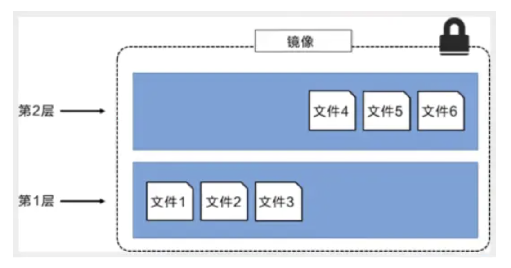
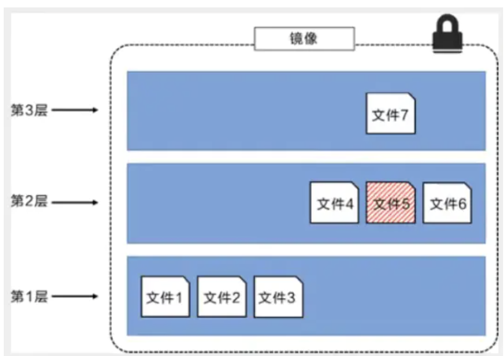

#### （1）分层的镜像

我们可以去下载一个镜像，注意观察下载的日志输出，可以看到Docker的镜像是一层一层的在下载。


思考：**为什么Docker镜像要采用这种分层的结构呢？**

最大的好处，我觉得莫过于是资源共享了！

比如有多个镜像都从相同的Base镜像构建而来，那么宿主机只需在磁盘上保留一份Base镜像，同时内存中也只需要加载一份Base镜像，这样就可以为所有的容器服务了，而且镜像的每一层都可以被共享。

查看镜像分层的方式可以通过`docker image inspect 镜像名`命令，如下：


```shell
[root@192 /]# docker image inspect redis:latest
[
    {
        "Id": "sha256:621ceef7494adfcbe0e523593639f6625795cc0dc91a750629367a8c7b3ccebb",
        "RepoTags": [
            "redis:latest"
        ],
        ... # 省略
        ... # 省略
        "RootFS": {
            "Type": "layers",
            "Layers": [ 
                "sha256:cb42413394c4059335228c137fe884ff3ab8946a014014309676c25e3ac86864",
                "sha256:8e14cb7841faede6e42ab797f915c329c22f3b39026f8338c4c75de26e5d4e82",
                "sha256:1450b8f0019c829e638ab5c1f3c2674d117517669e41dd2d0409a668e0807e96",
                "sha256:f927192cc30cb53065dc266f78ff12dc06651d6eb84088e82be2d98ac47d42a0",
                "sha256:a24a292d018421783c491bc72f6601908cb844b17427bac92f0a22f5fd809665",
                "sha256:3480f9cdd491225670e9899786128ffe47054b0a5d54c48f6b10623d2f340632"
            ]
        },
        ... # 省略
    }
]
```

可以看到RootFS属性中的Layers参数中，每一行代表一个镜像层，每个一镜像层都包含着一些操作步骤，最终合并成一个我们需要的系统环境和服务。

#### （2）加深理解

所有的Docker镜像都起始于一个基础镜像层，当进行修改或增加新的内容时，就会在当前镜像层之上，创建新的镜像层。

举一个简单的例子，假如基于Ubuntu Linux 16.04创建一个新的镜像，这就是新镜像的第一层；如果在该镜像中添加Python包，就会在基础镜像层之上创建第二个镜像层；如果继续添加一个安全补丁，就会创建第三个镜像层。

该镜像当前已经包含3个镜像层，如下图所示（这只是一个用于演示的很简单的例子）。


在添加额外的镜像层的同时，镜像始终保持是当前所有镜像的组合，理解这一点非常重要。下图中举了一个简单的例子，每个镜像层包含3个文件，而整体的镜像包含了来自两个镜像层的6个文件。



上图中的鏡像层跟之前图中的略有区别，主要目的是便于展示文件。

下图中展示了一个稍微复杂的三层镜像，在外部看来整个镜像只有6个文件，这是因为最上层中的文件7是文件5的一个更新版本。



这种情况下，上层镜像层中的文件覆盖了底层镜像层中的文件。这样就使得文件的更新版本作为一个新镜像层添加到镜像当中。

Docker通过存储引擎（新版本采用快照机制）的方式来实现镜像层堆栈，并保证多镜像层对外展示为统一的文件系统。

Linux上可用的存储引擎有AUFS，Overlay2，Device Mapper，Btrfs以及ZFS，顾名思义，每种存储引擎都基于Linux中对应的文件系统或者块设备技术，并且每种存储引擎都有其独有的性能特点。

Docker在Windows上仅支持windowsfilter一种存储引擎，该引擎基于NTFS文件系统之上实现了分层和Cow。

如上边的三层镜像，Docker最终会把所有镜像层堆叠并合并，对外提供统一的视图，如下图。


#### （3）特别说明

Docker镜像都是只读的，当容器启动时，一个新的可写层被加载到镜像的顶部，只有这个顶部是可写的。

而这一层就是我们通常说的容器层，容器之下的都叫镜像层。

如下图：


