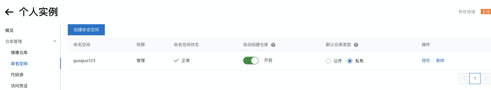
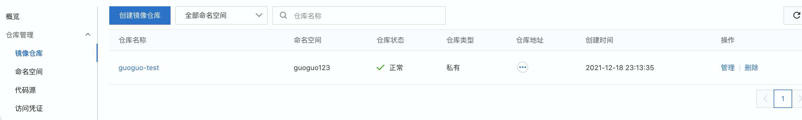
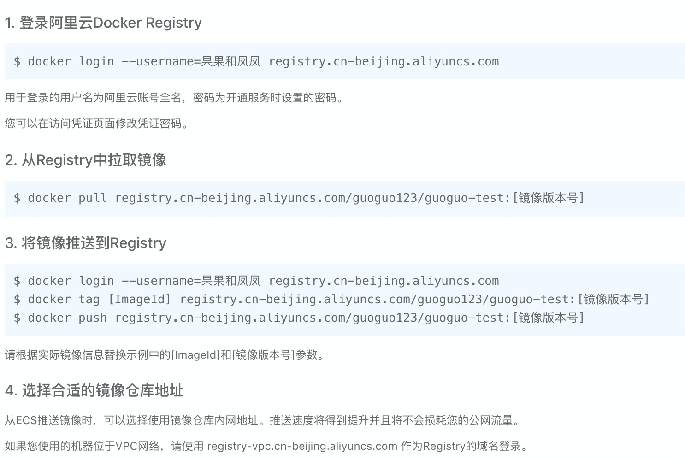
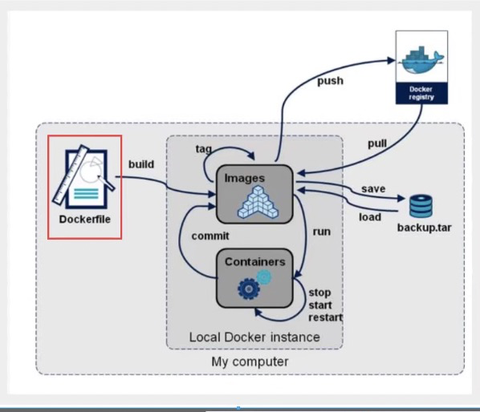

### 镜像发布

##### DockerHub发布

1、地址：https://hub.docker.com/ 注册自己的账号

2、确定这个账号可以进行登陆

3、在我们的服务器进行镜像提交

```shell
[root@guoguo docker-build-test]# docker login --help

Usage:  docker login [OPTIONS] [SERVER]

Log in to a Docker registry.
If no server is specified, the default is defined by the daemon.

Options:
  -p, --password string   Password
      --password-stdin    Take the password from stdin
  -u, --username string   Username
  

[root@guoguo docker-build-test]# docker login -u guoguo12345
Password:
WARNING! Your password will be stored unencrypted in /root/.docker/config.json.
Configure a credential helper to remove this warning. See
https://docs.docker.com/engine/reference/commandline/login/#credentials-store

Login Succeeded
```

4、登陆完毕，就可以提交镜像啦 docker push

```shell
# push已有镜像到服务器
[root@guoguo docker-build-test]# docker push guoguo/centos:1.0
The push refers to repository [docker.io/guoguo/centos]
74ddd0ec08fa: Preparing
denied: requested access to the resource is denied #拒绝

# 这个镜像可能已经存在，打个tag
[root@guoguo docker-build-test]# docker tag c37ffb5b6c1c guoguo12345/centos:1.0
[root@guoguo docker-build-test]# docker images
REPOSITORY             TAG       IMAGE ID       CREATED          SIZE
guoguo12345/centos     1.0       c37ffb5b6c1c   9 days ago       684MB

# docker push 上去，自己发布的镜像建议带上版本号，【分层上传】
[root@guoguo docker-build-test]# docker push guoguo12345/centos:1.0
The push refers to repository [docker.io/guoguo12345/centos]
8a027ed6a4e5: Pushed
0a62582891d7: Mounted from library/tomcat
516aad68a0ec: Mounted from library/tomcat
f79d29235239: Mounted from library/tomcat
5c81f9330d99: Mounted from library/tomcat
927f9fcef4cf: Mounted from library/tomcat
a81f1846a0d2: Mounted from library/tomcat
3b441d7cb46b: Mounted from library/node
d3710de04cb3: Mounted from library/node
91f7336bbfff: Mounted from library/node
e2e8c39e0f77: Mounted from library/node
1.0: digest: sha256:ce42591a57de512fd4e1ddb9885b91336cb033d990be3d0799d6812b95ceb7de size: 2633
```

##### 阿里云发布

1、登陆阿里云

2、找到容器镜像服务

3、创建命名空间



4、创建容器镜像



5、浏览阿里云



### 小结

