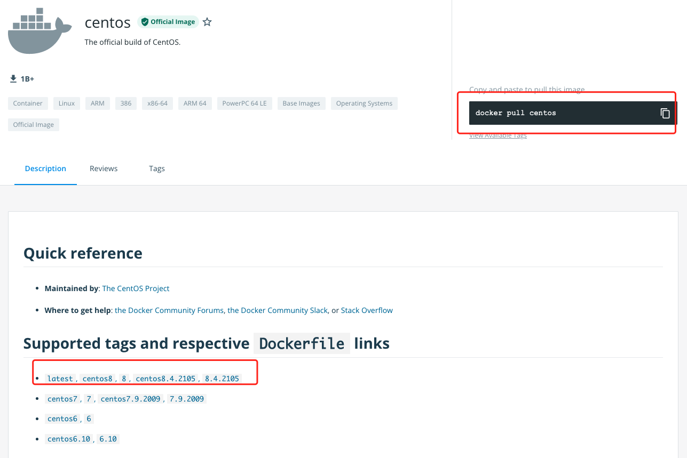
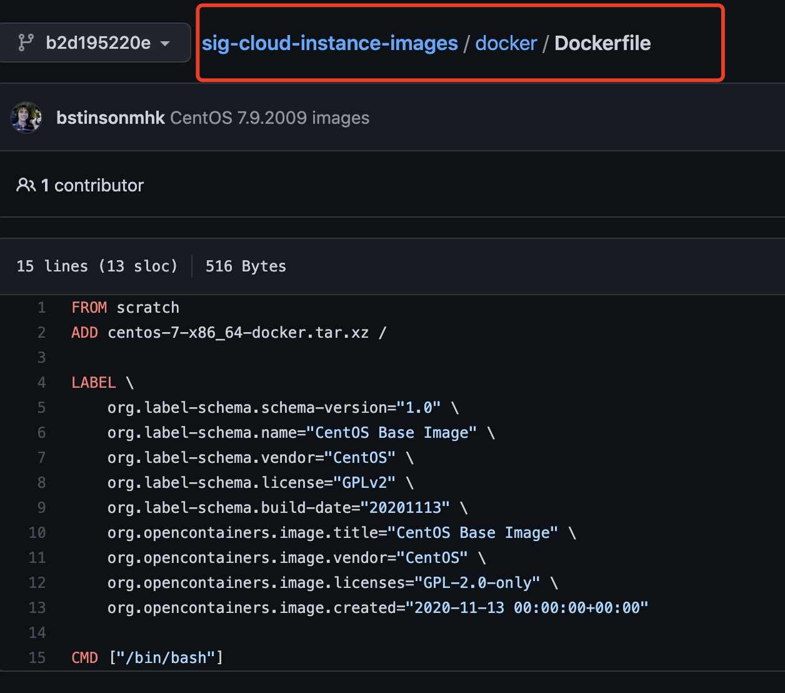
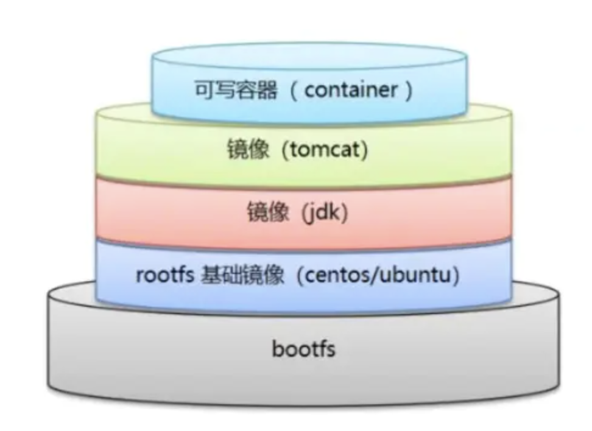
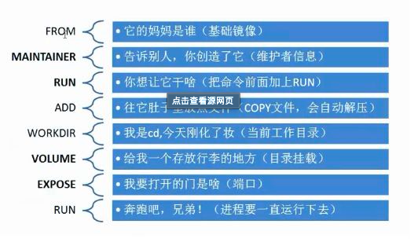
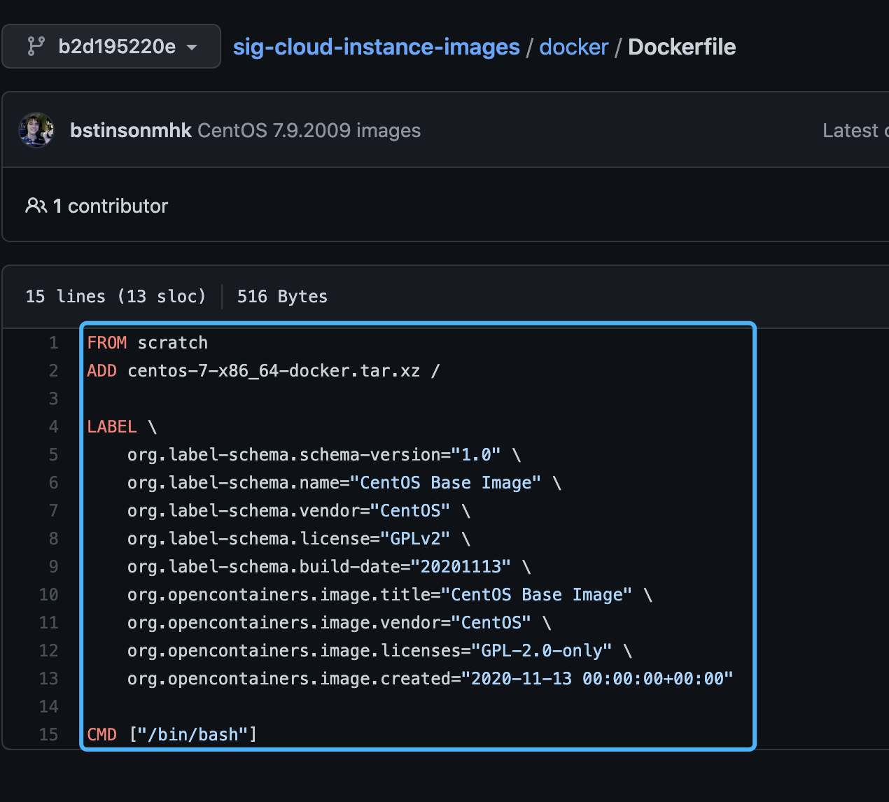

### Dockerfile介绍

dockerfile 是用来构建docker镜像的文件！命令参数脚本

##### 构建步骤

1、编写一个dockerfile文件

2、docker build 构建成为一个镜像

3、docker run 运行镜像

4、docker push 发布镜像（docker hub，阿里云镜像仓库）

查看一下官网的centos是怎么做的？



官方构建脚本



### Dockerfile构建过程

1、每个保留关键字（指令）都必须是大写字母

2、执行是从上到下顺序执行

3、# 表示注释

4、每一个指令都会创建提交一个新的镜像层，并提交



dockerfile是面向开发的，我们以后发布项目，做镜像，就需要编写dockerfile文件，这个文件十分简单

Docker镜像逐渐形成企业交付的标准，必须掌握！

步骤： 开发，部署，运维

Dockerfile： 构建文件，定义了一切的步骤，源代码

Docker Images： 通过dockerfile构建生成的镜像，最终发布和运行的产品

Docker容器： 容器就是镜像运行起来提供的服务器


### Dockerfile指令

```shell
FROM                     # 基础镜像，一起从这里开始
MAINTAINER							 # 镜像是谁写， 姓名+邮箱
RUN											 # 镜像构建的时候需要运行的命令
ADD											 # 步骤：tomcat镜像，这个是tomcat的压缩包，添加内容,
												 #	ADD 的优点：在执行 <源文件> 为 tar 压缩文件的话，压缩格式为 gzip, bzip2 以及 xz 的情况下，会自动复制并解压到 <目标路径>。
												 #  ADD 的缺点：在不解压的前提下，无法复制 tar 压缩文件。会令镜像构建缓存失效
WORKDIR									 # 镜像的工作目录
VOLUME									 # 挂载的目录
EXPOSE									 # 保留端口配置
CMD 										 # 制定这个容器启动的时候需要运行这个命令，只有最后一个生效，可被替代
ENTRYPOINT							 # 制定这个容器启动的时候需要运行这个命令，可以追加命令
ONBUILD 								 # 当构建一个被继承的 Dockerfile，这个时候就会运行 ONBUILD 的指令，触发指令
COPY										 # 类似 ADD， 将文件copy到镜像中
ENV											 # 构建时候设置环境变量
ARG											 # 构建参数吗，与ENV的作用一致，不过作用域不一样，ARG设置的环境变量仅对Dockerfile内有效，也就是说只有 docker build 的过程中有效，构建好的镜像内不存在此环境变量。
```




### 实战测试

Docker Hub中99%的镜像都是从基础镜像过的FROM scratch，然后通过配置环境变量进行构建

以centos为例：



 现在咱们启动的是docker hub拉取的镜像

```shell
[root@guoguo docker-build-test]# docker ps
CONTAINER ID   IMAGE     COMMAND       CREATED      STATUS         PORTS     NAMES
abd3aaf3f3dd   centos    "/bin/bash"   7 days ago   Up 2 minutes             magical_robinson
[root@guoguo docker-build-test]# docker exec -it abd3aaf3f3dd /bin/bash
[root@abd3aaf3f3dd /]# ifconfig
bash: ifconfig: command not found
[root@abd3aaf3f3dd /]# vim
bash: vim: command not found
```

发现有像ifconfig，vim这种指令是没有的，所以咱们自己制作一个简单的centos镜像

```shell
# 1、编写一个自己的centos
[root@guoguo docker-build-test]# cat dockerfile-vim
FROM centos
MAINTAINER guoguo<1872828785@qq.com>

ENV MYPATH /usr/local
WORKDIR $MYPATH

RUN yum -y install vim
RUN yum -y install net-tools

EXPOSE 80

CMD echo $MYPATH
CMD echo "------end------"
CMD /bin/bash

#2、打包构建，形成自己的镜像docker
# build -f dockerfile-vim -t guoguo/centos-vim .
# 命令： docker build -f 目标dockerfile文件 -t 命名空间/镜像名字:[tag] .
...
Successfully built c4692fa8fa8d
Successfully tagged guoguo/centos-vim:latest

#3、运行测试  
# docker run -it --name centosvim01 guoguo/centos-vim /bin/bash
[root@guoguo docker-build-test]# docker exec -it 8b27d5fc8fe0 /bin/bash
[root@8b27d5fc8fe0 local]# pwd
/usr/local
eth0: flags=4163<UP,BROADCAST,RUNNING,MULTICAST>  mtu 1500
        inet 172.17.0.2  netmask 255.255.0.0  broadcast 172.17.255.255
        ether 02:42:ac:11:00:02  txqueuelen 0  (Ethernet)
        RX packets 8  bytes 656 (656.0 B)
        RX errors 0  dropped 0  overruns 0  frame 0
        TX packets 0  bytes 0 (0.0 B)
        TX errors 0  dropped 0 overruns 0  carrier 0  collisions 0

lo: flags=73<UP,LOOPBACK,RUNNING>  mtu 65536
        inet 127.0.0.1  netmask 255.0.0.0
        loop  txqueuelen 1000  (Local Loopback)
        RX packets 0  bytes 0 (0.0 B)
        RX errors 0  dropped 0  overruns 0  frame 0
        TX packets 0  bytes 0 (0.0 B)
        TX errors 0  dropped 0 overruns 0  carrier 0  collisions 0
```

我们可以看一个镜像本地的变更或者说是构建记录

```shell
[root@guoguo docker-build-test]# docker history c4692fa8fa8d
IMAGE          CREATED          CREATED BY                                      SIZE      COMMENT
c4692fa8fa8d   14 minutes ago   /bin/sh -c #(nop)  CMD ["/bin/sh" "-c" "/bin…   0B
4a549349ac6b   14 minutes ago   /bin/sh -c #(nop)  CMD ["/bin/sh" "-c" "echo…   0B
5ebb536bde05   14 minutes ago   /bin/sh -c #(nop)  CMD ["/bin/sh" "-c" "echo…   0B
74f2490ebc0f   14 minutes ago   /bin/sh -c #(nop)  EXPOSE 80                    0B
cec23680dd3a   14 minutes ago   /bin/sh -c yum -y install net-tools             26.9MB
c39a8c6f05fc   14 minutes ago   /bin/sh -c yum -y install vim                   64MB
1ddfe41733bb   15 minutes ago   /bin/sh -c #(nop) WORKDIR /usr/local            0B
941839e3126d   15 minutes ago   /bin/sh -c #(nop)  ENV MYPATH=/usr/local        0B
1a34860e1c72   15 minutes ago   /bin/sh -c #(nop)  MAINTAINER guoguo<1872828…   0B
5d0da3dc9764   3 months ago     /bin/sh -c #(nop)  CMD ["/bin/bash"]            0B
<missing>      3 months ago     /bin/sh -c #(nop)  LABEL org.label-schema.sc…   0B
<missing>      3 months ago     /bin/sh -c #(nop) ADD file:805cb5e15fb6e0bb0…   231MB
```


### CMD 和 ENTRYPOINT 的区别

```shell
CMD						# 指定这个容器启动时候要运行的命令，只有最后一个生效，可以被替代，但是要完全的命令
ENTRYPOINT    # 指定这个容器启动时候要运行的命令，只有最后一个生效，可以对命令进行追加，
```

##### 测试cmd

```shell
# 编写dockerfile文件
[root@guoguo docker-build-test]# cat dockerfile-cmd
FROM centos
CMD ["ls","-a"]

# 构建镜像
[root@guoguo docker-build-test]# docker build -f dockerfile-cmd -t guoguo/centoscmd01 .
Sending build context to Docker daemon  4.096kB
...
Successfully built f3e647cd61e8
Successfully tagged guoguo/centoscmd01:latest

# 执行命令可以被替换，但是不能被追加  -l =>  ls -al
[root@guoguo docker-build-test]# docker run guoguo/centoscmd01 -l
docker: Error response from daemon: OCI runtime create failed: container_linux.go:380: starting container process caused: exec: "-l": executable file not found in $PATH: unknown.

# cmd的情况下，-l 替换了 CMD ["ls", "-a"]， -l 不是命令，所以报错 
```

##### 测试 ENTRYPOINT

```shell
# 编写dockerfile文件
[root@guoguo docker-build-test]# cat dockerfile-entrypoint
FROM centos
ENTRYPOINT ["ls","-a"]

# 编写dockerfile文件
[root@guoguo docker-build-test]# docker build -f dockerfile-entrypoint -t guoguo/centosentry01 .
...
Successfully built 9a18e6ba6bbb
Successfully tagged guoguo/centosentry01:latest

# 测试命令追加，我们的-l，就是追加在 CMD ["ls", "-a", "-l"]
[root@guoguo docker-build-test]# docker run guoguo/centosentry01 -l
total 56
drwxr-xr-x  1 root root 4096 Dec 18 14:12 .
drwxr-xr-x  1 root root 4096 Dec 18 14:12 ..
-rwxr-xr-x  1 root root    0 Dec 18 14:12 .dockerenv
lrwxrwxrwx  1 root root    7 Nov  3  2020 bin -> usr/bin
drwxr-xr-x  5 root root  340 Dec 18 14:12 dev
drwxr-xr-x  1 root root 4096 Dec 18 14:12 etc
```

Dockerfile中很多命令都十分相似，建议最好都上手测试一下


