### Docker 网络

官方拉取的tomcat镜像的没有ifconfig，ip，ping命令，咱们自己生成一个自己镜像

```shell
[root@guoguo docker-build-test]# docker pull tomcat
[root@guoguo docker-build-test]# docker run -it --name tomcat-test tomcat /bin/bash
root@11b1e6e7f46a:/usr/local/tomcat# apt-get update
root@11b1e6e7f46a:/usr/local/tomcat# apt install net-tools    # ifconfig
root@11b1e6e7f46a:/usr/local/tomcat# apt install iputil-ping  # ping
root@11b1e6e7f46a:/usr/local/tomcat# apt install -y iproute2  # ip
[root@guoguo docker-build-test]# docker commit -am"add ip,ping,ifconfig" 11b1e6e7f46a guoguo/tomcatip
[root@guoguo docker-build-test]# docker images
REPOSITORY        TAG       IMAGE ID       CREATED         SIZE
guoguo/tomcatip   latest    202cfaa24a17   5 minutes ago   705MB
```

理解Docker0

> 测试

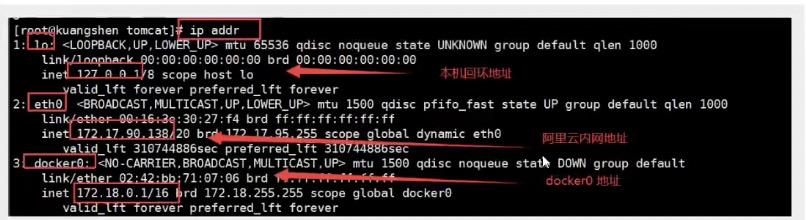

通过启动2个tomcat

```shell
# 启动容器
[root@guoguo docker-build-test]# docker run -d -P --name tomcat01 tomcat

# 容器内部分配的ip
root@9b3a35fc5409:/usr/local/tomcat# cat /etc/hosts
172.17.0.2	9b3a35fc5409

# linux ping 容器内部
[root@guoguo ~]# ping 172.17.0.2
PING 172.17.0.2 (172.17.0.2) 56(84) bytes of data.
64 bytes from 172.17.0.2: icmp_seq=1 ttl=64 time=0.076 ms
```

> 原理

1、我们每启动一个docker容器，docker就会为docker容器分配一个ip，我们只要安装了docker，就会有一个docker0

桥接模式，使用的技术就是evth-pair技术 

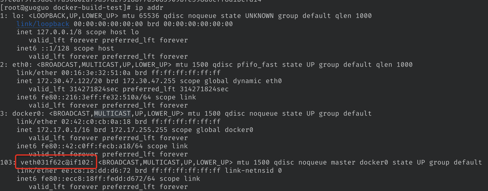

2、每多启动一个容器，就会多一个网卡

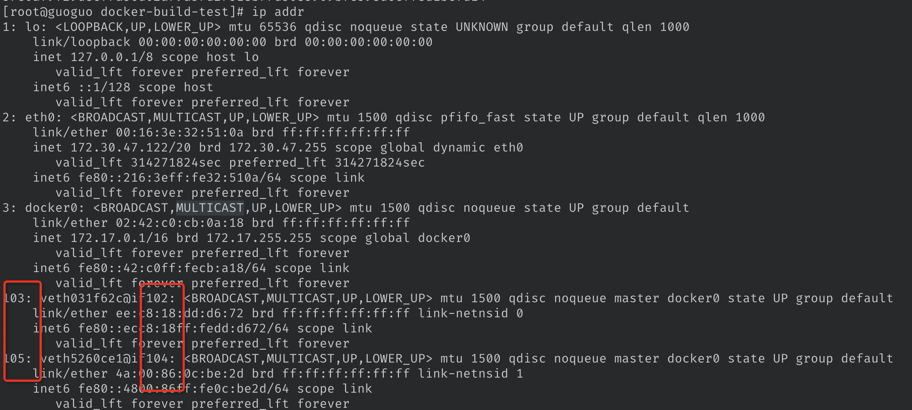

```shell
# 我们发现这个容器带的网卡，都是一对对的
# evth-pair 就是一堆的虚拟设备接口，他们都是成对出现的，一端连着协议，一端彼此相连
# 正是因为有这个特性，evth-pair 充当一个桥梁，连接各种虚拟网络设备
# OpenStac ，Docker 容器之间的连接，OVS的连接， 都是使用的 evth-pair 技术
```

3、容器和容器之间是可以进行ping通的

```shell
[root@guoguo docker-build-test]# docker exec tomcat02 ping 172.17.0.2
```

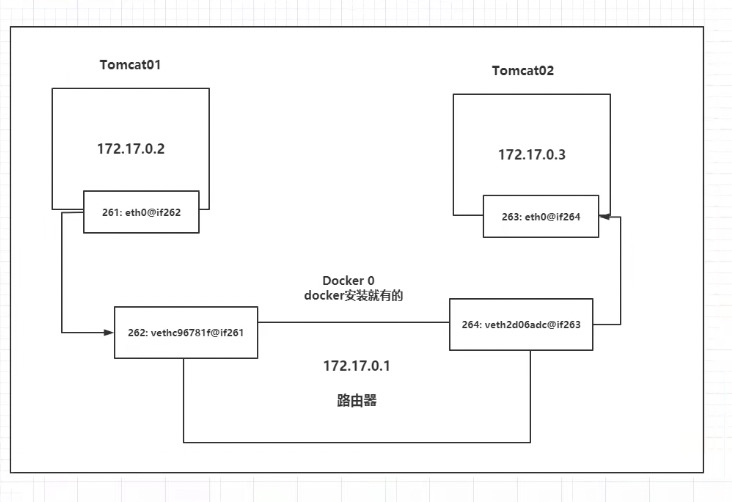

结论：tomcat01和tomcat02 是个公用的路由器，docker0

所有的容器在不指定网络的情况下，都是docker0路由的，docker会给我们的容器会分配一个可用的ip

1-255 A｜B｜C

255.255.0.1/16   16代表域，可分配的地址【255.255.0.1 - 255.255.255.2555】

00000000 0000000 0000000 0000000

> 小结

Docker 使用的螫linux的桥接，宿主机中是一个Docker0的网桥，如果不指定，就是docker0

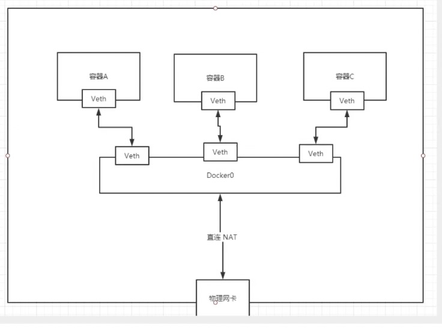

 Docker中的所有网桥接口都是虚拟的，虚拟的转发效率高（内网传递文件）

只要容器删除，对应的网桥一对就没有啦 

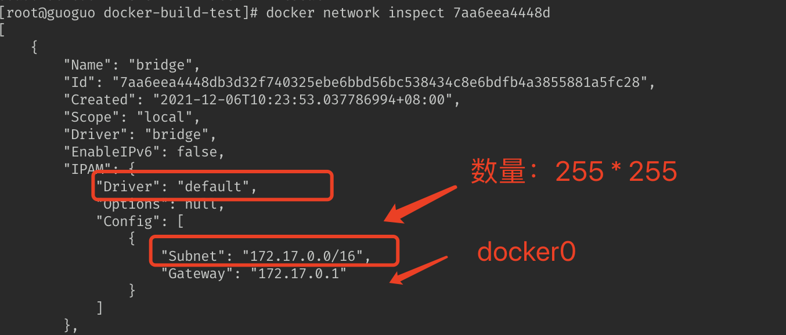


### --link

> 如果我们在项目，我们的里面的某个服务，比如mysql崩了，我们重启mysql，docker重启，就会分配了ip，但是，我们希望我们的项目不重启

名字 => ip 【只要名字不变，是不是就可以啦】

```shell
[root@guoguo docker-build-test]# docker ps
CONTAINER ID   IMAGE             COMMAND              NAMES
81486596505c   guoguo/tomcatip   "catalina.sh run"    tomcat02
e61337849018   guoguo/tomcatip   "/bin/bash"          tomcat01

[root@guoguo docker-build-test]# docker exec -it tomcat02 ping tomcat02
ping: tomcat02: Name or service not known

[root@guoguo docker-build-test]# docker exec -it tomcat01 ping tomcat02
ping: tomcat02: Name or service not known

# 怎么解决呢？
# 通过 --link 就可以解决了网络联通问题
[root@guoguo docker-build-test]# docker run -d -P --name tomcat03 --link tomcat02 guoguo/tomcatip
9d8ec8c8fa1a790d81042229fdab9dccaa907459fe17aba2b94081f42bd33d88
[root@guoguo docker-build-test]# docker exec -it tomcat03 ping tomcat02
PING tomcat02 (172.17.0.3) 56(84) bytes of data.
64 bytes from tomcat02 (172.17.0.3): icmp_seq=1 ttl=64 time=0.106 ms
64 bytes from tomcat02 (172.17.0.3): icmp_seq=2 ttl=64 time=0.069 ms

# 反向可以ping通么？因为docker02没有配置，不能反向ping
[root@guoguo docker-build-test]# docker exec -it tomcat02 ping tomcat03
ping: tomcat03: Name or service not known
```

##### 探究：inspct

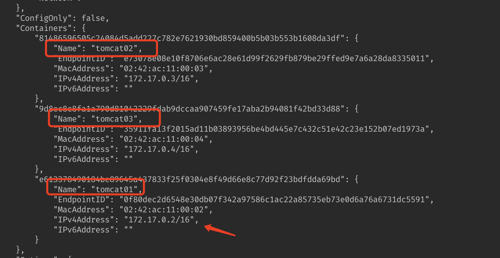

其实这个tomcat03就是在本地配置了tomcat02的配置？

```shell
# 查看hosts文件，我们在原理上就发现啦
[root@guoguo docker-build-test]# docker exec -it tomcat03 cat /etc/hosts
127.0.0.1	localhost
::1	localhost ip6-localhost ip6-loopback
fe00::0	ip6-localnet
ff00::0	ip6-mcastprefix
ff02::1	ip6-allnodes
ff02::2	ip6-allrouters
172.17.0.3	tomcat02 81486596505c    # 这里
172.17.0.4	9d8ec8c8fa1a

# tomcat02中没有03的映射，那么能不能互联呢？是可以，需要停止02，再重启02关联03就可以啦
[root@guoguo docker-build-test]# docker exec -it tomcat02 cat /etc/hosts
127.0.0.1	localhost
::1	localhost ip6-localhost ip6-loopback
fe00::0	ip6-localnet
ff00::0	ip6-mcastprefix
ff02::1	ip6-allnodes
ff02::2	ip6-allrouters
172.17.0.3	81486596505c
```

那么能

##### 本质探究

--link就在我们指定的容器hosts配置中添加了一个 `172.17.0.3	tomcat02 81486596505c`的映射

现在docker已经不建议使用--link，建议自定义网络（自己创建网络）

docker0的问题，他不支持容器名进行访问


### 自定义网络

> 查看所有的docker网络

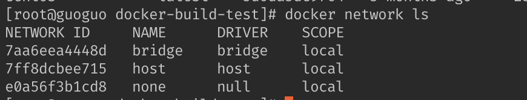

##### 网络模式

bridge :	桥接 docker （默认，自己创建也适用bridge模式）

none:  	不配置网络

host:       和宿主机共享网络

container: 容器网络联通（用的少，局限很大，自行了解）

##### 测试

```shell
# 我们直接启动的命令是 --net bridge ，这个就是我们的docker0
[root@guoguo docker-build-test]# docker run -d -P --name tomcat01 tomcat
[root@guoguo docker-build-test]# docker run -d -P --name tomcat01 tomcat --net bridge  

# docker0特点，默认，容器名不能访问，--link可以打通连接

# 我们可以自定义一个网络
#--driver bridge                       桥接模式
#--subnet 192.168.0.0/16               子网 192.168.0.1-192.168.255.2555
#--gateway 192.168.0.1                 网关，路由器的原理
[root@guoguo docker-build-test]# docker network create --driver bridge --subnet 192.168.0.0/16 --gateway 192.168.0.1 mynet

82cd39982c71a6c2b2ca3975aee4c98a0474cd7f5b0c202593e9640311ec6011
[root@guoguo docker-build-test]# docker network ls
NETWORK ID     NAME      DRIVER    SCOPE
7aa6eea4448d   bridge    bridge    local
7ff8dcbee715   host      host      local
82cd39982c71   mynet     bridge    local
e0a56f3b1cd8   none      null      local
```

我们查看我们自己创建的网络


```shell
[root@guoguo docker-build-test]# docker run -d -P --name tomcatnet01 --net mynet guoguo/tomcatip
00b6700d83a266d014b29830f0f81952771462ca43cb2763e77c31b70d281ad8
[root@guoguo docker-build-test]# docker run -d -P --name tomcatnet02 --net mynet guoguo/tomcatip
2c76c497d25f38bdb7d441583de6abe226a8cb9a0ce9b73ce236efdb4b63f3c7
[root@guoguo docker-build-test]# docker network inspect 82cd39982c71
[
    {
        "Name": "mynet",
        "Id": "82cd39982c71a6c2b2ca3975aee4c98a0474cd7f5b0c202593e9640311ec6011",
        "Created": "2021-12-19T13:04:30.532577755+08:00",
        "Scope": "local",
        "Driver": "bridge",
        "EnableIPv6": false,
        "IPAM": {
            "Driver": "default",
            "Options": {},
            "Config": [
                {
                    "Subnet": "192.168.0.0/16",
                    "Gateway": "192.168.0.1"
                }
            ]
        },
        "Internal": false,
        "Attachable": false,
        "Ingress": false,
        "ConfigFrom": {
            "Network": ""
        },
        "ConfigOnly": false,
        "Containers": {
            "00b6700d83a266d014b29830f0f81952771462ca43cb2763e77c31b70d281ad8": {
                "Name": "tomcatnet01",
                "EndpointID": "a5b7462e5fc1fa9fc03e4b6c934d59bc983e1ab1aa0be0e4369e5b361c62c611",
                "MacAddress": "02:42:c0:a8:00:02",
                "IPv4Address": "192.168.0.2/16",
                "IPv6Address": ""
            },
            "2c76c497d25f38bdb7d441583de6abe226a8cb9a0ce9b73ce236efdb4b63f3c7": {
                "Name": "tomcatnet02",
                "EndpointID": "ee846287e3ae0cf4133deed051cabf0e8f08aeda4a9cef7fdebaa5c4c9e69060",
                "MacAddress": "02:42:c0:a8:00:03",
                "IPv4Address": "192.168.0.3/16",
                "IPv6Address": ""
            }
        },
        "Options": {},
        "Labels": {}
    }
]

# 再次测试ping连接
[root@guoguo docker-build-test]# docker exec -it tomcatnet01 ping 192.168.0.3
PING 192.168.0.3 (192.168.0.3) 56(84) bytes of data.
64 bytes from 192.168.0.3: icmp_seq=1 ttl=64 time=0.103 ms
# 现在不使用--link也可以ping名字啦
[root@guoguo docker-build-test]# docker exec -it tomcatnet01 ping tomcatnet02
PING tomcatnet02 (192.168.0.3) 56(84) bytes of data.
64 bytes from tomcatnet02.mynet (192.168.0.3): icmp_seq=1 ttl=64 time=0.059 ms
```

我们自定义的网络docker都已经帮我们维护好对应的关系，推荐平时这样使用

好处：不同的集群使用不同的网络，保证集群的安全和健康的


### 网络联通

`docker network connent`：联通一个容器到网络

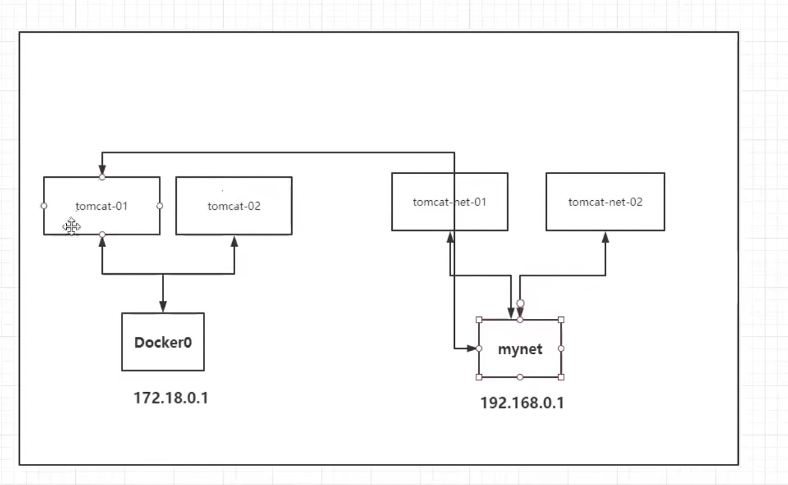


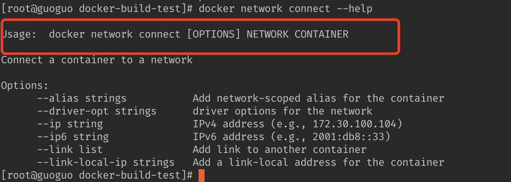

测试打通tomcat01

```shell
[root@guoguo docker-build-test]# docker network connect mynet tomcat01
[root@guoguo docker-build-test]# docker network inspect mynet

# 联通之后，就是将 `tomcat01` 放在 `mynet`下
# 一个容器2个ip： 类似阿里云的服务，公网ip     和 私网ip
```

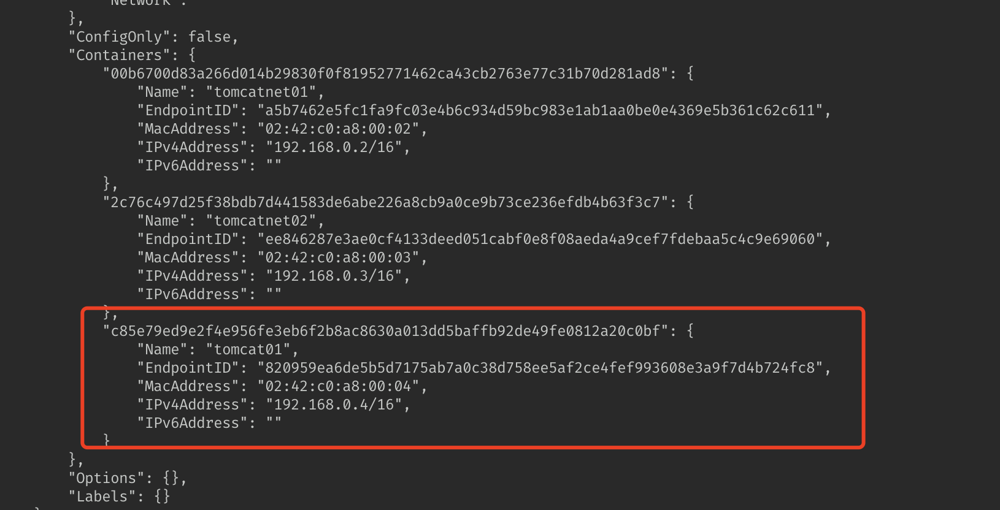

```shell
# tomcat01 连接ok
[root@guoguo docker-build-test]# docker exec -it tomcat01 ping tomcatnet02
PING tomcatnet02 (192.168.0.3) 56(84) bytes of data.
64 bytes from tomcatnet02.mynet (192.168.0.3): icmp_seq=1 ttl=64 time=0.065 ms
# tomcat02 不行，需要进行打通
[root@guoguo docker-build-test]# docker exec -it tomcat02 ping tomcatnet02
ping: tomcatnet02: Name or service not known
```

结论： 假设我们需要跨网去操作别人，就需要使用docker network connect 联通........