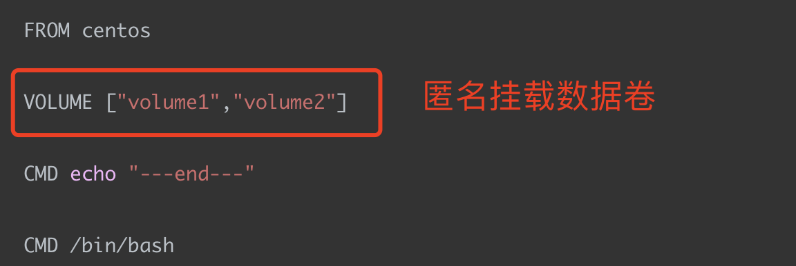
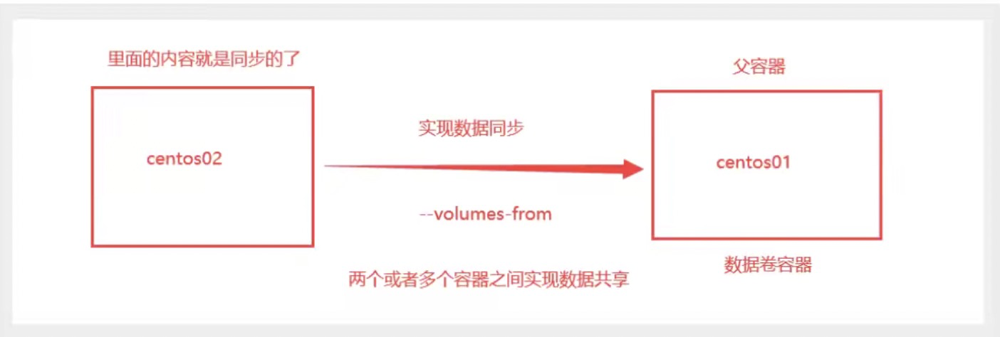
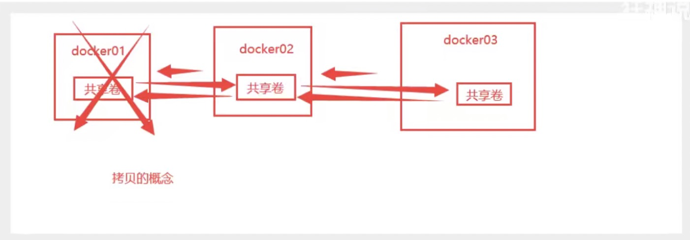

### 数据卷概念

Docker容器数据卷，即`Docker Volume（卷）`。

当Docker容器运行的时候，会产生一系列的数据文件，这些数据文件会在关闭Docker容器时，直接消失的。但是其中产生部分的数据内容，我们是希望能够把它给保存起来，另作它用的。

所以我们期望：

- 将应用与运行的环境打包形成容器运行，伴随着容器运行产生的数据，我们希望这些数据能够持久化。
- 希望容器之间也能够实现数据的共享。

根据我们之前所学，Docker容器产生的数据，如果不通过`docker commit`命令生成新的镜像，把数据做为镜像的一部分保存下来。那么当容器删除后，数据自然也就没有了。但为了能保存Docker容器中的数据，Docker为我们提供了卷技术（Volume）。

> 总结：Docker容器中产生的数据，同步到本地，这就是卷技术。也就是通过目录的挂载，将容器内的目录，挂载到Linux系统上面，实现容器数据的持久化。

### 数据卷的作用

​      数据卷就是目录或文件，存在于一个或多个容器中，由Docker挂载到容器，但不属于联合文件系统，因此能够绕过Union File System（联合文件系统），提供一些用于持续存储或共享数据的特性。

​       数据卷的设计目的就是为了Doeker容器中数据的持久化，完全独立于容器的生存周期，Docker不会在容器删除时，删除其挂载的数据卷。

数据卷

1. 数据卷可在容器之间共享或重用数据。
2. 数据卷中的更改可以直接生效。
3. 数据卷中的更改不会包含在镜像的更新中。
4. 数据卷的生命周期一直持续到没有容器使用它为止。

### 数据卷的使用

> 方式一： 直接使用命令来挂载

```shell
docker run -it -v 主机目录:容器目录

# 测试
[root@guoguo home]# docker run -it -v /home/ceshi:/home centos /bin/bash

# 启动起来我们可以通过docker inspect 容器id进行查看
[root@guoguo ceshi]# docker inspect abd3aaf3f3dd
[
    {
        "Id": "abd3aaf3f3ddf6ff50b6b191a404a2ed34a3ddb80e3a352ca4ae9cf68b52f6f1",
        "Created": "2021-12-09T12:26:25.907653943Z",
        "Path": "/bin/bash",
        "Args": [],
         ....
        "Mounts": [
            {
                "Type": "bind",
                "Source": "/home/ceshi",  #  主机地址
                "Destination": "/home",   # docker容器的地址
                "Mode": "",
                "RW": true,
                "Propagation": "rprivate"
            }
        ],
        ....
    }
]
```

好处：这样我们就不用每次都去docker里面去修改数据啦，直接在挂载文件进行修改就可以啦

提示：挂载的文件夹可以存在也可以不存在，不存在则会自动创建。

### 实战mysql

mysql数据持久化问题

```shell
# 获取镜像
[root@guoguo data]# docker pull mysql:5.7

# 运行容器，需要做数据挂载； 安装启动mysql，需要配置密码，
# 官方测试 ：$ docker run --name some-mysql -e MYSQL_ROOT_PASSWORD=my-secret-pw -d mysql:tag

[root@guoguo data]# docker run -d -p 3310:3306 -v /home/mysql/conf:/etc/mysql/conf.d -v /home/mysql/data:/var/lib/mysql -e MYSQL_ROOT_PASSWORD=123456  --name mysql02 mysql:5.7

-d 后台运行
-v 数据卷挂载，宿主机地址：容器内部需要挂载的地址
-e 设置环境变量
--name 设置name
```

即使当前容器删除了，我们挂载的本地数据卷也不会丢失，这也就实现了数据的持久话的功能


### 具名和匿名挂载

```shell
# 匿名挂载
[root@guoguo volumes]# docker run -d -P --name nginx01 -v /etc/nginx nginx
-v 容器内的路径
-P 随机分配端口号

# 查看所有的 volume 的情况
[root@guoguo volumes]# docker volume ls
DRIVER    VOLUME NAME
local     3f0179fb30ad51335880ae9e16017688bed6376735543e28eaeca293d5d0ded2
# 这里发现，如果只写容器内部的路径，会随机分配一个volume name

# 具名挂载
[root@guoguo volumes]# docker run -d -P --name nginx02 -v juming-nginx:/etc/nginx nginx
[root@guoguo volumes]# docker volume ls
DRIVER    VOLUME NAME
local     juming-nginx
# 通过-v 卷名:容器内的路径
# 查看一下这个卷
[root@guoguo volumes]# docker volume inspect juming-nginx
[
    {
        "CreatedAt": "2021-12-13T13:08:21+08:00",
        "Driver": "local",
        "Labels": null,
        "Mountpoint": "/var/lib/docker/volumes/juming-nginx/_data", # 宿主机挂载的地址
        "Name": "juming-nginx",
        "Options": null,
        "Scope": "local"
    }
]
```

我们所有的 docker 容器内的卷，没有指定目录的情况下都是在`/var/lib/docker/volumes/xxx/_data`这个路径下

我们通过具名挂载可以方便的找到我们的一个卷，大多数情况下使用具名挂载

```shell
# 如何确定是具名挂载还是匿名挂载，还是指定路径挂载
-v 容器内路径。       # 匿名挂载
-v 卷名:容器内的路径  # 具名挂载
-v /宿主机路径:容器内的路径。# 指定路径挂载
```

拓展

```shell
# 通过 -v 容器内路径： ro rw 改变读写权限
ro  readonly  # 只读
rw readwrite  # 可读可写

# 一旦这个设置了容器的权限，容器对我们挂载出来的内容就有限定啦
[root@guoguo volumes]# docker run -d -P --name nginx02 -v juming-nginx:/etc/nginx:ro nginx
[root@guoguo volumes]# docker run -d -P --name nginx02 -v juming-nginx:/etc/nginx:rw nginx

# ro 只要看到ro，就说明这个路径只能通过宿主机来操作，容器内部是无法进行操作的
```

### 

###  初识Dockerfile

Dockerfile就是用来构建docker镜像的构建文件，命令脚本

通过这个脚本可以生成镜像，镜像就是一层一层的，脚本一个个的命令，每个命令就是一层

```shell
# 创建一个dockerfile文件，名字可以随机，建议使用 Dockerfile

FROM centos

VOLUME ["volume1","volume2"]   # 没有没有这个路径，docker会在容器内部的根目录建立这2个目录，与宿主机对应目录同步

CMD echo "---end---"

CMD /bin/bash 
```

打包构建 【 一定不要忘记，最后还有一个点 】

```shell
[root@guoguo docker-build-test]# docker build -f  dockerfile1 -t guoguo/centos:1.0 .
Sending build context to Docker daemon  2.048kB
Step 1/4 : FROM centos
 ---> 5d0da3dc9764
Step 2/4 : VOLUME ["volume1","volume2"]
 ---> Running in 9f070f9bb50d
Removing intermediate container 9f070f9bb50d
 ---> 04eb463acfdb
Step 3/4 : CMD echo "---end---"
 ---> Running in 6d9d5aa5b5da
Removing intermediate container 6d9d5aa5b5da
 ---> 2407eafc4b42
Step 4/4 : CMD /bin/bash
 ---> Running in 9296fb27ddae
Removing intermediate container 9296fb27ddae
 ---> 8e9f9180134a
Successfully built 8e9f9180134a
Successfully tagged guoguo/centos:1.0
```



我们来查看一下

```shell
[root@guoguo docker-build-test]# docker ps
CONTAINER ID   IMAGE               COMMAND       CREATED          STATUS          PORTS     NAMES
39be41a67dc1   guoguo/centos:1.0   "/bin/bash"   13 minutes ago   Up 13 minutes             elegant_mirzakhani
[root@guoguo docker-build-test]# docker inspect 39be41a67dc1
...
			"Mounts": [
            {
                "Type": "volume",
                "Name": "90c6928461d176435b18782a9ef55c6f4fb18ecc49c90f8e42272c1637bfb1bf",
                "Source": "/var/lib/docker/volumes/90c6928461d176435b18782a9ef55c6f4fb18ecc49c90f8e42272c1637bfb1bf/_data",
                "Destination": "volume1",
                "Driver": "local",
                "Mode": "",
                "RW": true,
                "Propagation": ""
            },
            {
                "Type": "volume",
                "Name": "fef1d7f21dc07caafa6dbb13247dfbabf01ba7c661ebcc05e071fd9b3b8d9fc1",
                "Source": "/var/lib/docker/volumes/fef1d7f21dc07caafa6dbb13247dfbabf01ba7c661ebcc05e071fd9b3b8d9fc1/_data",
                "Destination": "volume2",
                "Driver": "local",
                "Mode": "",
                "RW": true,
                "Propagation": ""
            }
        ],
```

发现数据已经同步过来啦

这种方式未来使用的非常的多，因为我们通常会自己构建自己的镜像！

假设我们在构建镜像的时候没有挂载卷，那么我们就需要进行手动挂载，通过-v 卷名:容器内的路径


### 数据卷容器



```shell
# 启动3个容器，通过我们刚才自己写的镜像进行启动， 如果镜像指定版本，启动必须加版本，不然会拉取最新的镜像，可以用imagesId进行过启动

[root@guoguo ~]# docker run -it --name docker01 guoguo/centos:1.0
[root@guoguo ~]# docker run -it --name docker02 --volume-from docker01  8e9f9180134a
[root@guoguo ~]# docker run -it --name docker03 --volumes-from docker02  8e9f9180134a

# 可以发现这个3个容器的的数据卷挂载的数据是共享的，都是挂载在宿主机的固定目录下
# 3台docker的 Mounted 都是一个地址
[root@guoguo ~]# docker inspect 06605934e7a6
		"Mounts": [
            {
                "Type": "volume",
                "Name": "1a295f084672dacfb1276eb453e1e665805284777594cf7e8f55e0c51eaba0d0",
                "Source": "/var/lib/docker/volumes/1a295f084672dacfb1276eb453e1e665805284777594cf7e8f55e0c51eaba0d0/_data",
                "Destination": "volume1",
                "Driver": "local",
                "Mode": "",
                "RW": true,
                "Propagation": ""
            },
            {
                "Type": "volume",
                "Name": "54b469b58b1bd5b37bdf183a0404fd923add23752a6a7e3b29e1d44177751f9b",
                "Source": "/var/lib/docker/volumes/54b469b58b1bd5b37bdf183a0404fd923add23752a6a7e3b29e1d44177751f9b/_data",
                "Destination": "volume2",
                "Driver": "local",
                "Mode": "",
                "RW": true,
                "Propagation": ""
            }
        ],
```



多个mysql共享数据问题

```shell
[root@guoguo ~]#  docker  run -d -p 3306 -v /etc/mysql/conf.d -v /var/lib/mysql -e MYSQL_ROOT_PASSWORD=123456 --name mysql01 mysql:5.7
[root@guoguo ~]#  docker  run -d -p 3306 -e MYSQL_ROOT_PASSWORD=123456 --name mysql01 --volumes-from mysql01  mysql:5.7
```

##### 结论：

1、容器之间配置信息的传递，数据卷容器的生命周期一直持续到没有容器使用为止

2、但是一旦你持久化到本地，这个时候，本地的数据是不会删除的


