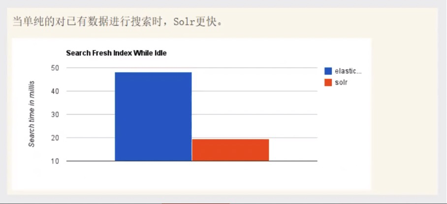
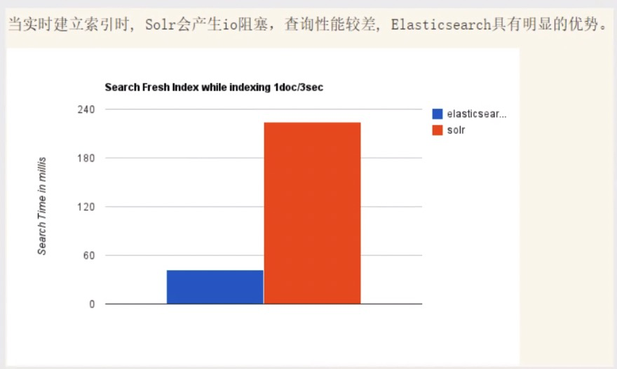
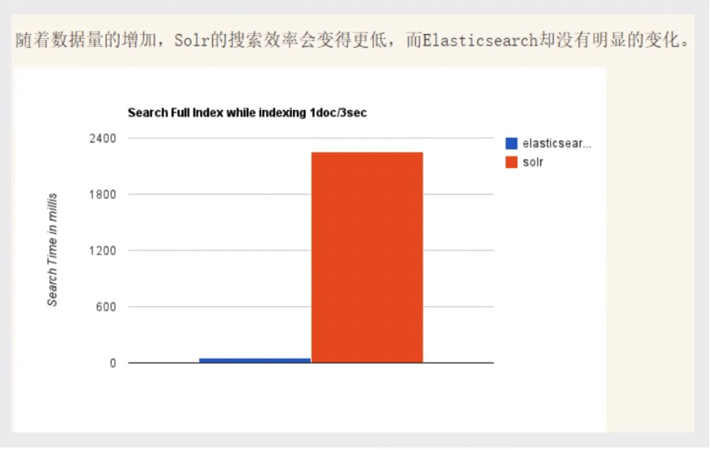

在学习ElasticSearch之前，先简单了解一下**Lucene**：

- **Doug Cutting开发**
- 是**apache软件基金会**4 jakarta项目组的一个子项目
- 是一个**开放源代码**的**全文检索引擎工具包**
- **不是一个完整的全文检索引擎，而是一个全文检索引擎的架构**，提供了完整的查询引擎和索引引擎，部分[文本分析](https://baike.baidu.com/item/文本分析/11046544)引擎（英文与德文两种西方语言）
- 当前以及最近几年最受欢迎的**免费Java信息检索程序库**。

**Lucene和ElasticSearch的关系：**

- ElasticSearch是基于Lucene 做了一下封装和增强

# 一、ElasticSearch概述

> 官网：https://www.elastic.co/cn/downloads/elasticsearch

**Elaticsearch**，简称为es，es是一个开源的**高扩展**的**分布式全文检索引擎**，它可以近乎**实时的存储**、**检索数据;**本身扩展性很好，可以扩展到上百台服务器，处理PB级别(大数据时代）的数据。es也使用java开发并使用Lucene作为其核心来实现所有索引和搜索的功能，但是它的**目的**是<mark>通过简单的**RESTful API**来隐藏Lucene的复杂性，从而让全文搜索变得简单</mark>。

据国际权威的数据库产品评测机构DB Engines的统计，在2016年1月，ElasticSearch已超过Solr等，成为**排名第一的搜索引擎类应用**。

> ### 历史

多年前，一个叫做Shay Banon的刚结婚不久的失业开发者，由于妻子要去伦敦学习厨师，他便跟着也去了。在他找工作的过程中，为了给妻子构建一个食谱的搜索引擎，他开始构建一个早期版本的Lucene。

直接基于Lucene工作会比较困难，所以Shay开始抽象Lucene代码以便lava程序员可以在应用中添加搜索功能。他发布了他的第一个开源项目，叫做“Compass”。

后来Shay找到一份工作，这份工作处在高性能和内存数据网格的分布式环境中，因此高性能的、实时的、分布式的搜索引擎也是理所当然需要的。然后他决定重写Compass库使其成为一个独立的服务叫做Elasticsearch。

第一个公开版本出现在2010年2月，在那之后Elasticsearch已经成为Github上最受欢迎的项目之一，代码贡献者超过300人。一家主营Elasticsearch的公司就此成立，他们一边提供商业支持一边开发新功能，不过Elasticsearch将永远开源且对所有人可用。

Shay的妻子依旧等待着她的食谱搜索…..

**谁在使用：**

1、维基百科,类似百度百科，全文检索,高亮,搜索推荐/2
2、The Guardian (国外新闻网站) ,类似搜狐新闻,用户行为日志(点击,浏览,收藏,评论) +社交网络数据(对某某新闻的相关看法) ,数据分析,给到每篇新闻文章的作者,让他知道他的文章的公众反馈(好,坏,热门，垃圾,鄙视，崇拜)
3、Stack Overflow (国外的程序异常讨论论坛) , IT问题,程序的报错,提交上去,有人会跟你讨论和回答,全文检索,搜索相关问题和答案,程序报错了,就会将报错信息粘贴到里面去,搜索有没有对应的答案
4、GitHub (开源代码管理),搜索 上千亿行代码
5、电商网站,检索商品
6、日志数据分析, logstash采集日志, ES进行复杂的数据分析, **ELK技术, elasticsearch+logstash+kibana**
7、商品价格监控网站,用户设定某商品的价格阈值,当低于该阈值的时候,发送通知消息给用户,比如说订阅牙膏的监控,如果高露洁牙膏的家庭套装低于50块钱,就通知我,我就去买
8、BI系统,商业智能, Business Intelligence。比如说有个大型商场集团，BI ,分析一下某某区域最近3年的用户消费 金额的趋势以及用户群体的组成构成,产出相关的数张报表, **区,最近3年,每年消费金额呈现100%的增长,而且用户群体85%是高级白领，开-个新商场。ES执行数据分析和挖掘, Kibana进行数据可视化
9、国内:站内搜索(电商,招聘,门户,等等),IT系统搜索(OA,CRM,ERP,等等),数据分析(ES热门
的一一个使用场景)

## ES和Solr

### ElasticSearch简介

- Elasticsearch是一个**实时分布式搜索和分析引擎**。 它让你以前所未有的速度处理大数据成为可能。
- 它用于<mark>**全文搜索、结构化搜索、分析**</mark>以及将这三者混合使用:
- `维基百科`使用Elasticsearch提供**全文搜索**并**高亮关键字**,以及输入**实时搜索**(search-asyou-type)和**搜索纠错**(did-you-mean)等搜索建议功能。
- `英国卫报`使用Elasticsearch结合用户日志和社交网络数据提供给他们的编辑以实时的反馈,以便及时了解公众对新发表的文章的回应。
- `StackOverflow`结合全文搜索与地理位置查询,以及more-like-this功能来找到相关的问题和答案。
- `Github`使用Elasticsearch检索1300亿行的代码。
- 但是Elasticsearch不仅用于大型企业，它还让像`DataDog`以及`Klout`这样的创业公司将最初的想法变成可扩展的解决方案。
- Elasticsearch可以在你的笔记本上运行,也可以在数以百计的服务器上处理PB级别的数据。
- Elasticsearch是一个基于Apache Lucene(TM)的开源搜索引擎。无论在开源还是专有领域, Lucene可被认为是迄今为止最先进、性能最好的、功能最全的搜索引擎库。
  - 但是, **Lucene只是一个库**。 想要使用它,你必须使用Java来作为开发语言并将其直接集成到你的应用中,更糟糕的是, Lucene非常复杂,你需要深入了解检索的相关知识来理解它是如何工作的。
- Elasticsearch也使用Java开发并使用Lucene作为其核心来实现所有索引和搜索的功能,但是它的**目的**是<mark>通过简单的**RESTful API**来隐藏Lucene的复杂性,从而让全文搜索变得简单。</mark>

### Solr简介

- Solr是Apache下的一个顶级开源项目,采用Java开发,它是**基于Lucene的全文搜索服务器**。Solr提供了比Lucene更为**丰富的查询语言**,同时实现了**可配置**、**可扩展**，并**对索引、搜索性能进行了优化**
- Solr可以**独立运行**,运行在letty. Tomcat等这些Selrvlet容器中 , Solr 索引的实现方法很简单,<mark>用POST方法向Solr服务器发送一个描述Field及其内容的XML文档, Solr根据xml文档**添加、删除、更新**索引</mark>。Solr 搜索只需要发送HTTP GET请求,然后对Solr返回xml、json等格式的查询结果进行解析,组织页面布局。
- Solr不提供构建UI的功能, **Solr提供了一个管理界面,通过管理界面可以查询Solr的配置和运行情况。**
- Solr是基于lucene开发企业级搜索服务器,实际上就是封装了lucene.
- Solr是一个独立的企业级搜索应用服务器,它**对外提供类似于Web-service的API接口**。用户可以通过http请求,向搜索引擎服务器提交-定格式的文件,生成索引;也可以通过提出查找请求,并得到返回结果。

### ElasticSearch与Solr比较

1、当单纯的对已有数据进行搜索时，Solr更快

2、`当实时建立索引时，Solr会产生io阻塞，查询性能较差，ElasticSearch具有明显的优势`

3、`随着数据量的增加，Solr的搜索效率会变得更低，而ElasticSearch却没有明显的变化`

4、`转变我们的搜索基础设施后从Solr ElasticSearch，我们看见一个即时~ 50x提高搜索性能！`

#### 总结

1、**es**基本是**开箱即用**(解压就可以用!) ,非常简单。Solr安装略微复杂一丢丢!
2、**Solr 利用Zookeeper进行分布式管理**,而**Elasticsearch<mark>自身带有分布式协调管理功能</mark>。**
3、Solr 支持更多格式的数据,比如JSON、XML、 CSV ,而**Elasticsearch仅支持json文件格式**。
4、Solr 官方提供的功能更多,而Elasticsearch本身更注重于核心功能，高级功能多有第三方插件提供，例如图形化界面需要kibana友好支撑

5、**Solr 查询快,但更新索引时慢(即插入删除慢)** ，用于电商等查询多的应用;

- **ES建立索引快(即查询慢)** ，即**实时性查询快**，用于facebook新浪等搜索。
- Solr是传统搜索应用的有力解决方案，但Elasticsearch更适用于新兴的实时搜索应用。

6、Solr比较成熟，有一个更大，更成熟的用户、开发和贡献者社区，而Elasticsearch相对开发维护者较少,更新太快,学习使用成本较高。

