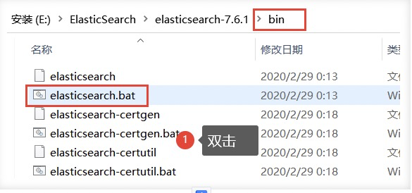
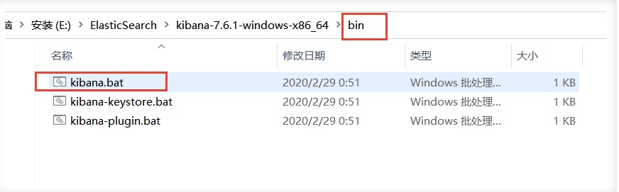

# 二、ElasticSearch安装

```
JDK8，最低要求
```

使用Java开发，必须保证`ElasticSearch`的版本与Java的核心jar包版本对应！（Java环境保证没错）

> 这里在windows上进行安装
>
> ### Windows下安装

#### 1、安装

下载地址：https://www.elastic.co/cn/downloads/

历史版本下载：https://www.elastic.co/cn/downloads/past-releases/

解压即可（尽量将ElasticSearch相关工具放在统一目录下）

#### 2、熟悉目录


```bash
bin 启动文件目录
config 配置文件目录
    1og4j2 日志配置文件
    jvm.options java 虚拟机相关的配置(默认启动占1g内存，内容不够需要自己调整,可以调整256M)
    elasticsearch.ym1 elasticsearch 的配置文件! 默认9200端口!跨域!
1ib 
    相关jar包
modules 功能模块目录
plugins 插件目录
    ik分词器
```

#### 3、启动

> 一定要检查自己的java环境是否配置好




### 安装可视化界面

```
elasticsearch-head
```

**使用前提**：需要安装nodejs

#### 1、下载地址

https://github.com/mobz/elasticsearch-head

#### 2、安装

解压即可（尽量将ElasticSearch相关工具放在统一目录下）

#### 3、启动

```bash
cd elasticsearch-head
# 安装依赖
npm install
# 启动
npm run start
# 访问
http://localhost:9100/
```

#### 4、**访问**

> 存在跨域问题（只有当两个页面同源，才能交互）
>
> 同源（端口，主机，协议三者都相同）
>
> https://blog.csdn.net/qq_38128179/article/details/84956552


#### 5、解决跨域

**开启跨域（在elasticsearch解压目录config下elasticsearch.yml中添加）**

```
# 开启跨域
	http.cors.enabled: true
# 所有人访问
	http.cors.allow-origin: "*"
```

#### 6、重启elasticsearch

**再次连接**


**如何理解上图：**

- 如果你是初学者

  - 索引 可以看做 “数据库”
  - 类型 可以看做 “表”
  - 文档 可以看做 “库中的数据（表中的行）”

- 这个head，我们只是把它

  当做可视化数据展示工具，之后所有的查询都在kibana中进行，因为不支持json格式化，不方便


### 安装kibana

Kibana是一个针对ElasticSearch的开源分析及可视化平台,用来搜索、查看交互存储在Elasticsearch索引中的数据。使用Kibana ,可以通过各种图表进行高级数据分析及展示。Kibana让海量数据更容易理解。它操作简单,基于浏览器的用户界面可以快速创建仪表板( dashboard )实时显示Elasticsearch查询动态。设置Kibana非常简单。无需编码或者额外的基础架构,几分钟内就可以完成Kibana安装并启动Elasticsearch索引监测。

#### 1、下载地址:

> 下载的版本需要与ElasticSearch版本对应

https://www.elastic.co/cn/downloads/

历史版本下载：https://www.elastic.co/cn/downloads/past-releases/

#### 2、安装

解压即可（尽量将ElasticSearch相关工具放在统一目录下）


#### 3、启动




**访问**

```
localhost:5601
```


#### 4、开发工具

（Postman、curl、head、谷歌浏览器插件）

> 可以使用 `Kibana`进行测试


> 如果说，你在英文方面不太擅长，kibana是支持汉化的

#### 5、kibana汉化

编辑器打开`kibana解压目录/config/kibana.yml`，添加

```
i18n.locale: "zh-CN"
```

> 重启kibana

**汉化成功**


### **了解ELK**

- ELK是

  Elasticsearch、Logstash、 Kibana三大开源框架首字母大写简称

  。市面上也被成为Elastic Stack。

  - 其中Elasticsearch是一个基于Lucene、分布式、通过Restful方式进行交互的近实时搜索平台框架。
    - 像类似百度、谷歌这种大数据全文搜索引擎的场景都可以使用Elasticsearch作为底层支持框架，可见Elasticsearch提供的搜索能力确实强大,市面上很多时候我们简称Elasticsearch为es。
  - Logstash是ELK的中央数据流引擎,用于从不同目标(文件/数据存储/MQ )收集的不同格式数据,经过过滤后支持输出到不同目的地(文件/MQ/redis/elasticsearch/kafka等)。
  - Kibana可以将elasticsearch的数据通过友好的页面展示出来 ,提供实时分析的功能。

- 市面上很多开发只要提到ELK能够一致说出它是一个日志分析架构技术栈总称 ,但实际上ELK不仅仅适用于日志分析,它还可以支持其它任何数据分析和收集的场景,日志分析和收集只是更具有代表性。并非唯一性。

```
收集清洗数据(Logstash) ==> 搜索、存储(ElasticSearch) ==> 展示(Kibana)
```


## Docker安装流程

```bash
# 创建私有网络
> docker network create elastic

# 安装elasticsearch，必须限制最大内存，不然就内存爆啦
> docker run -d --name elasticsearch --net elastic -p 9200:9200 -p 9300:9300 -e "discovery.type=single-node" -e ES_JAVA_OPTS="-Xms256m -Xmx256m" elasticsearch:7.17.7

# 安装可视化界面 elasticsearch-head
> docker run -d --name elasticsearch-head --net elastic -p 9100:9100 mobz/elasticsearch-head:5

# 解决调用不同端口跨域跨域
> docker exec -it elasticsearch /bin/sh
> vim config/elasticsearch.yml
http.cors.enabled: true
http.cors.allow-origin: "*"
> docker restart elasticsearch

# 如果没有vimvim
> apt-get update
> apt-get install vim

# 安装开源分析及可视化平台kibana 类似postman
docker run -d --name kibana --net elastic -p 9400:5601 kibana:7.17.7

# 搞定
> done
```


## 问题

### 1、kibana 406问题，

1、因为返回的的数据类型和接受的不一致导致，client无法解析

```
Content-Type header [application/x-www-form-urlencoded] is not supported
```

修改elasticsearch-head的_site/vendor.js文件
 将6886行与7574行

```bash
contentType: "application/x-www-form-urlencoded" 
```

修改为

```bash
contentType: "application/json;charset=UTF-8"
```

2、其实也可以改源代码，重新打包生成镜像

```bash
docker build -t guoguo12345/elasticsearch-head .
```

3、docker操作

```bash
docker cp elasticsearch-head:/usr/src/app/_site/vendor.js /root/docker/elastic-search/
docker cp  /root/docker/elastic-search/vendor.js  elasticsearch-head:/usr/src/app/_site/
```


