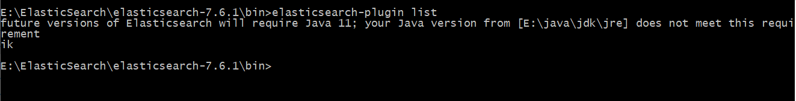

# **IK分词器：中文分词器**

分词：即把一段中文或者别的划分成一个个的关键字，我们在搜索时候会把自己的信息进行分词，会把数据库中或者索引库中的数据进行分词，然后进行一一个匹配操作，**默认的中文分词是将每个字看成一个词**（<mark>不使用用IK分词器的情况下</mark>），比如“我爱狂神”会被分为”我”，”爱”，”狂”，”神” ，这显然是不符合要求的，所以我们需要安装中文分词器ik来解决这个问题。

**IK提供了两个分词算法**: `ik_smart`和`ik_max_word` ,其中`ik_smart`为**最少切分**, `ik_max_word`为**最细粒度划分**!

### 1、下载

> 版本要与ElasticSearch版本对应

下载地址：https://github.com/medcl/elasticsearch-analysis-ik/releases

### 2、安装

> ik文件夹是自己创建的

解压即可（但是我们需要解压到ElasticSearch的plugins目录ik文件夹下）


### 3、重启ElasticSearch

> 加载了IK分词器


### 4、使用 `ElasticSearch安装补录/bin/elasticsearch-plugin` 可以查看插件

```
E:\ElasticSearch\elasticsearch-7.6.1\bin>elasticsearch-plugin list
```



### 5、使用kibana测试

`ik_smart`：最少切分


`ik_max_word`：最细粒度划分（穷尽词库的可能）


```bash
GET _analyze 
{
  "analyzer": "ik_smart",
  "text": "年轻人love果果"
}

GET _analyze 
{
  "analyzer": "ik_max_word",
  "text": "年轻人love果果"
}
```

> 从上面看，感觉分词都比较正常，但是大多数，分词都满足不了我们的想法，如下例


> 那么，我们需要手动将该词添加到分词器的词典当中

### 6、添加自定义的词添加到扩展字典中

```
elasticsearch目录/plugins/ik/config/IKAnalyzer.cfg.xml
```


打开 `IKAnalyzer.cfg.xml` 文件，扩展字典


创建字典文件，添加字典内容


重启ElasticSearch，再次使用kibana测试


```bash
GET _analyze 
{
  "analyzer": "ik_smart",
  "text": "年轻人love果果"
}

GET _analyze 
{
  "analyzer": "ik_max_word",
  "text": "年轻人love果果"
}
```

## Docker安装流程

```bash
# 1 去官网下载ik插件 [一定要和es的版本对应]
https://github.com/medcl/elasticsearch-analysis-ik

# 2、copy到ik分词插件到es容器中
> docker cp /root/docker/elastic-search/ik-7.17.7 elasticsearch:/usr/share/elasticsearch/plugins/

# 3、重启es
> docker restart elasticsearch
```


