# Restful风格说明

**一种软件架构风格**,而不是标准,只是提供了一组设计原则和约束条件。它主要用于客户端和服务器交互类的软件。基于这个风格设计的软件可以**更简洁**，**更有层次**，**更易于实现缓存**等机制。

### **基本Rest命令说明：**

|      method      |                     url地址                     |          描述          |
| :--------------: | :---------------------------------------------: | :--------------------: |
| PUT（创建,修改） |     localhost:9200/索引名称/类型名称/文档id     | 创建文档（指定文档id） |
|   POST（创建）   |        localhost:9200/索引名称/类型名称         | 创建文档（随机文档id） |
|   POST（修改）   | localhost:9200/索引名称/类型名称/文档id/_update |        修改文档        |
|  DELETE（删除）  |     localhost:9200/索引名称/类型名称/文档id     |        删除文档        |
|   GET（查询）    |     localhost:9200/索引名称/类型名称/文档id     |   查询文档通过文档ID   |
|   POST（查询）   | localhost:9200/索引名称/类型名称/文档id/_search |      查询所有数据      |

### 测试

#### 1、创建一个索引，添加

```
PUT /test1/type1/1{  "name" : "流柚",  "age" : 18}
```


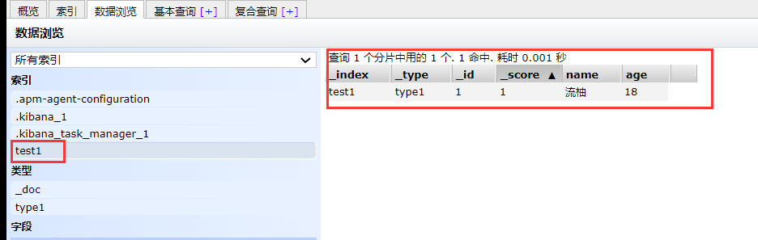

#### 2、字段数据类型

- 字符串类型

  - text、

    keyword

    - text：支持分词，全文检索,支持模糊、精确查询,不支持聚合,排序操作;text类型的最大支持的字符长度无限制,适合大字段存储；
    - keyword：不进行分词，直接索引、支持模糊、支持精确匹配，支持聚合、排序操作。keyword类型的最大支持的长度为——32766个UTF-8类型的字符,可以通过设置ignore_above指定自持字符长度，超过给定长度后的数据将不被索引，无法通过term精确匹配检索返回结果。

- 数值型

  - long、Integer、short、byte、double、float、**half float**、**scaled float**

- 日期类型

  - date

- te布尔类型

  - boolean

- 二进制类型

  - binary

- 等等…

#### 3、指定字段的类型（使用PUT）

> 类似于建库（建立索引和字段对应类型），也可看做规则的建立

```
PUT /test2{  "mappings": {    "properties": {      "name": {        "type": "text"      },      "age":{        "type": "long"      },      "birthday":{        "type": "date"      }    }  }}
```

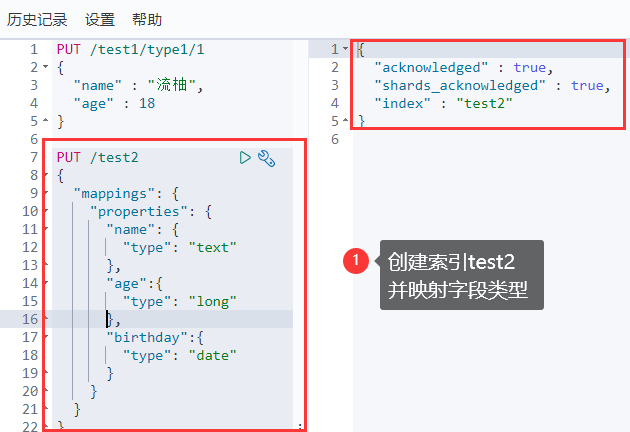

#### 4、获取3建立的规则

```
GET test2
```

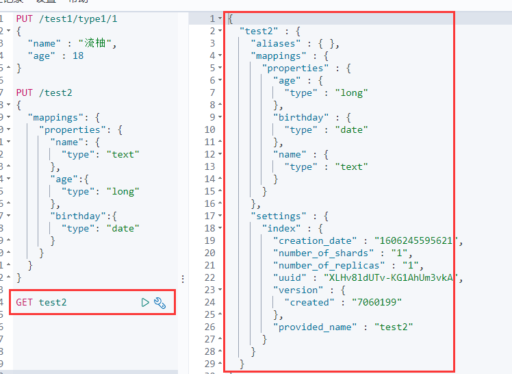

#### 5、获取默认信息

> `_doc` 默认类型（default type），type 在未来的版本中会逐渐弃用，因此产生一个默认类型进行代替

```
PUT /test3/_doc/1{  "name": "流柚",  "age": 18,  "birth": "1999-10-10"}GET test3
```

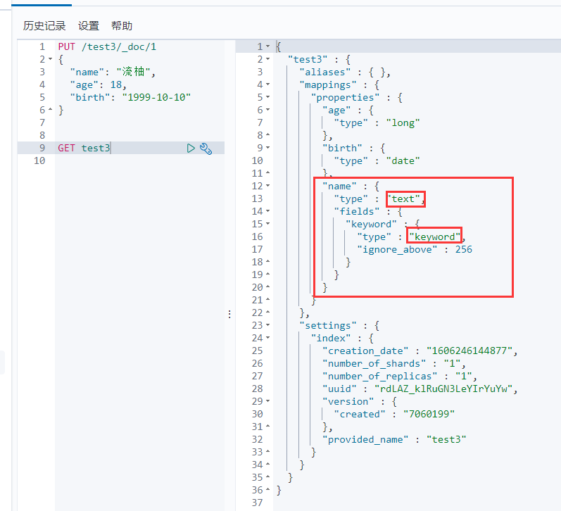

> 如果自己的文档字段没有被指定，那么ElasticSearch就会给我们默认配置字段类型

扩展：通过`get _cat/` 可以获取ElasticSearch的当前的很多信息！

```
GET _cat/indicesGET _cat/aliasesGET _cat/allocationGET _cat/countGET _cat/fielddataGET _cat/healthGET _cat/indicesGET _cat/masterGET _cat/nodeattrsGET _cat/nodesGET _cat/pending_tasksGET _cat/pluginsGET _cat/recoveryGET _cat/repositoriesGET _cat/segmentsGET _cat/shardsGET _cat/snapshotsGET _cat/tasksGET _cat/templatesGET _cat/thread_pool
```

#### 6、修改

> 两种方案

①旧的（使用put覆盖原来的值）

- 版本+1（_version）
- 但是如果漏掉某个字段没有写，那么更新是没有写的字段 ，会消失

```
PUT /test3/_doc/1{  "name" : "流柚是我的大哥",  "age" : 18,  "birth" : "1999-10-10"}GET /test3/_doc/1// 修改会有字段丢失PUT /test3/_doc/1{  "name" : "流柚"}GET /test3/_doc/1
```

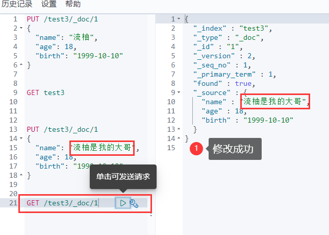

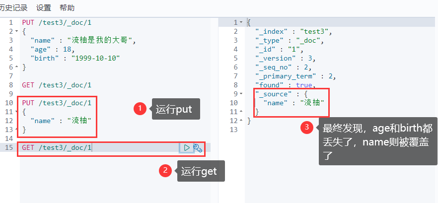

②新的（使用post的update）

- version不会改变
- 需要注意doc
- 不会丢失字段

```
POST /test3/_doc/1/_update{  "doc":{    "name" : "post修改，version不会加一",    "age" : 2  }}GET /test3/_doc/1
```

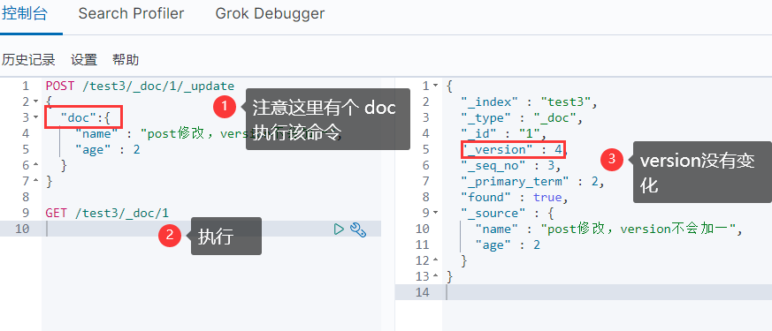

#### 7、删除

```
GET /test1DELETE /test1
```

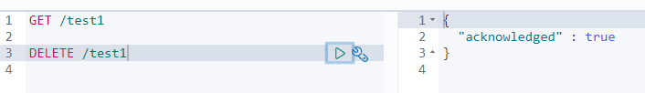

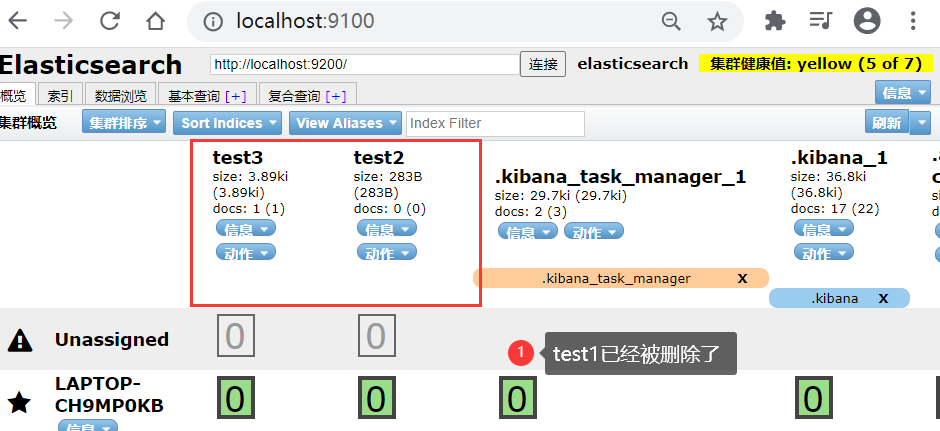

#### 8、查询（简单条件）

```
GET /test3/_doc/_search?q=name:流柚
```

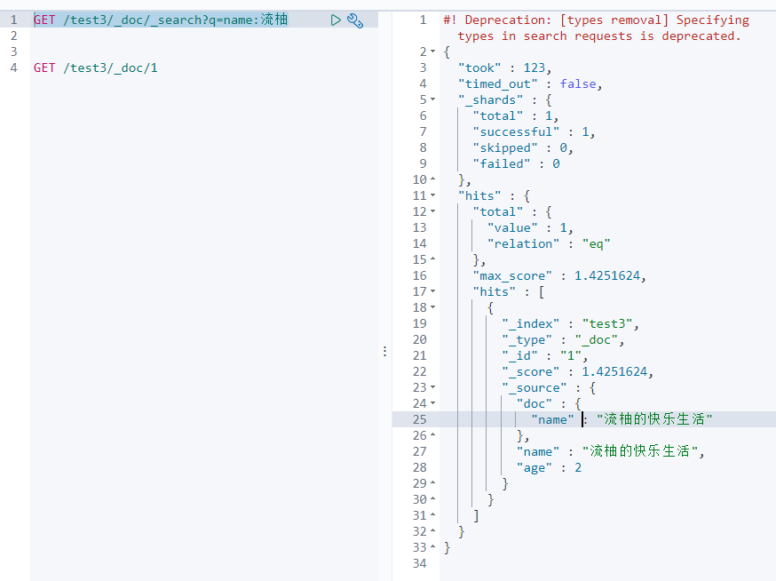

#### 9、复杂查询

> test3索引中的内容

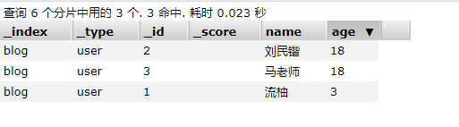

##### ①查询匹配

- `match`：匹配（会使用分词器解析（先分析文档，然后进行查询））
- `_source`：过滤字段
- `sort`：排序
- `form`、`size` 分页

```bash
GET /guoguo/user/_search
{
  "query": {
    "match": {
      "name": "果果"
    }
  },
  "_source": ["name", "desc", "age"],
  "sort": [
    {
      "age": {
        "order": "asc"
      }
    }
  ],
  "from": 0,
  "size": 1
}
```

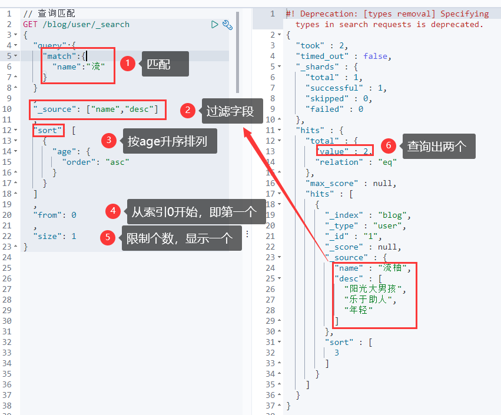

##### ②多条件查询（bool）

- `must` 相当于 `and`
- `should` 相当于 `or`
- `must_not` 相当于 `not (... and ...)`
- `filter` 过滤

```
GET /guoguo/user/_search
{
  "query": {
    "bool": {
        "must": [
          {
            "match": {
              "name": "果果"
            }
          },{
          	"match": {
          		"age": 19
          	}
          }
        ],
        "filter": [
          {"range": {
            "age": {
              "gte": 19,
              "lte": 20
            }
          }}
        ]
    }
  }
}
```

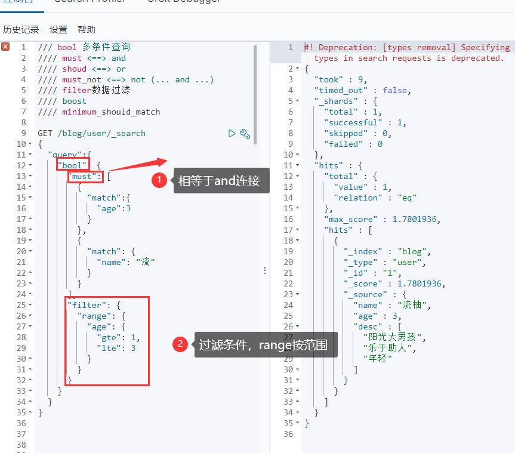

##### ③匹配多个条件

- 貌似不能与其它字段一起使用
- 可以多关键字查（空格隔开）— 匹配字段也是符合的
- `match` 会使用分词器解析（先分析文档，然后进行查询）
- 搜词

```
GET /guoguo/user/_search
{
  "query": {
    "match": {
      "tag": "技术 男"
    }
  }
}
```

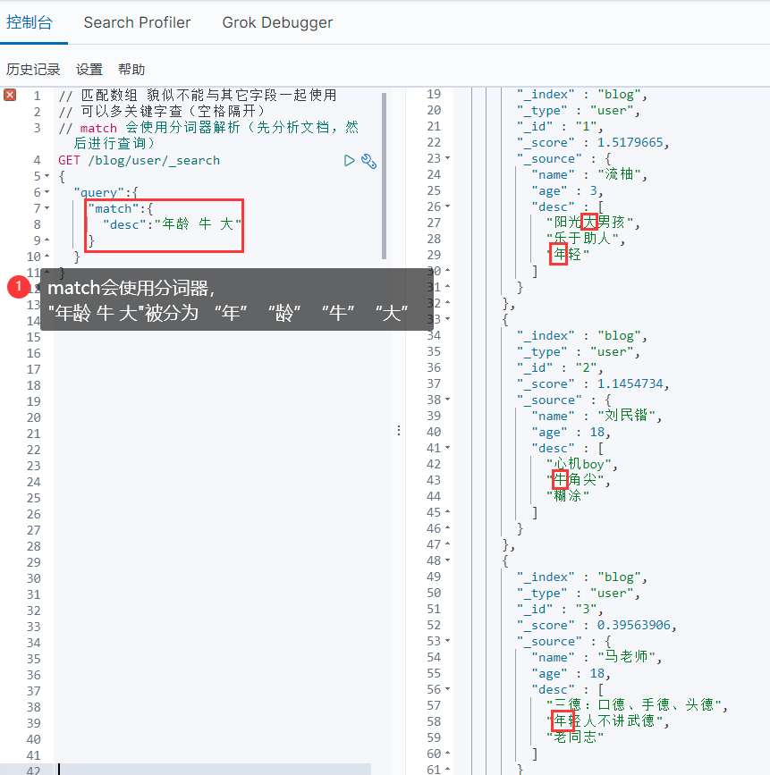

##### ④精确查询

- `term` 直接通过 倒排索引 指定**词条**查询
- 适合查询 number、date、keyword ，不适合text

```
// 精确查询（必须全部都有，而且不可分，即按一个完整的词查询）
// term 直接通过 倒排索引 指定的词条 进行精确查找的
GET /blog/user/_search
{
  "query":{
    "term":{
      "desc":"年 "
    }
  }
}
```

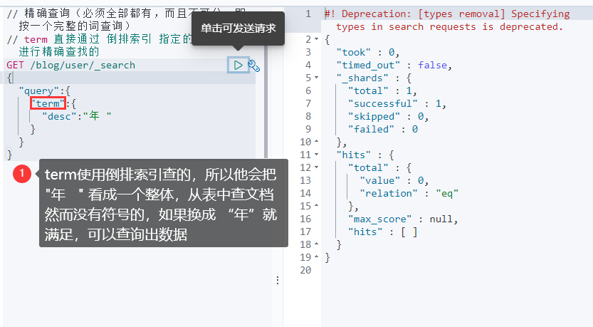

##### ⑤text和keyword

- text：
  - **支持分词**，**全文检索**、支持模糊、精确查询,不支持聚合,排序操作;
  - text类型的最大支持的字符长度无限制,适合大字段存储；
- keyword：
  - **不进行分词**，**直接索引**、支持模糊、支持精确匹配，支持聚合、排序操作。
  - keyword类型的最大支持的长度为——32766个UTF-8类型的字符,可以通过设置ignore_above指定自持字符长度，超过给定长度后的数据将不被索引，**无法通过term精确匹配检索返回结果**。

```bash
// 测试keyword和text是否支持分词
// 设置索引类型
PUT /test
{
  "mappings": {
    "properties": {
      "text":{
        "type":"text"
      },
      "keyword":{
        "type":"keyword"
      }
    }
  }
}
// 设置字段数据
PUT /test/_doc/1
{
  "text":"测试keyword和text是否支持分词",
  "keyword":"测试keyword和text是否支持分词"
}
// text 支持分词
// keyword 不支持分词
GET /test/_doc/_search
{
  "query":{
   "match":{
      "text":"测试"
   }
  }
}// 查的到
GET /test/_doc/_search
{
  "query":{
   "match":{
      "keyword":"测试"
   }
  }
}// 查不到，必须是 "测试keyword和text是否支持分词" 才能查到
GET _analyze
{
  "analyzer": "keyword",
  "text": ["测试liu"]
}// 不会分词，即 测试liu
GET _analyze
{
  "analyzer": "standard",
  "text": ["测试liu"]
}// 分为 测 试 liu
GET _analyze
{
  "analyzer":"ik_max_word",
  "text": ["测试liu"]
}// 分为 测试 liu
```

##### ⑥高亮查询

```bash
GET /guoguo/user/_search
{
  "query":{
    "match":{
      "name":"果前"
    }
  },
  "highlight": {
    "fields": {
      "name": {}
    }
  }
}

GET /guoguo/user/_search
{
  "query":{
    "match":{
      "name":"果前"
    }
  },
  "highlight": {
    "pre_tags": "<p class='key' style='color:red'>",
    "post_tags": "</p>", 
    "fields": {
      "name": {}
    }
  }
}

```

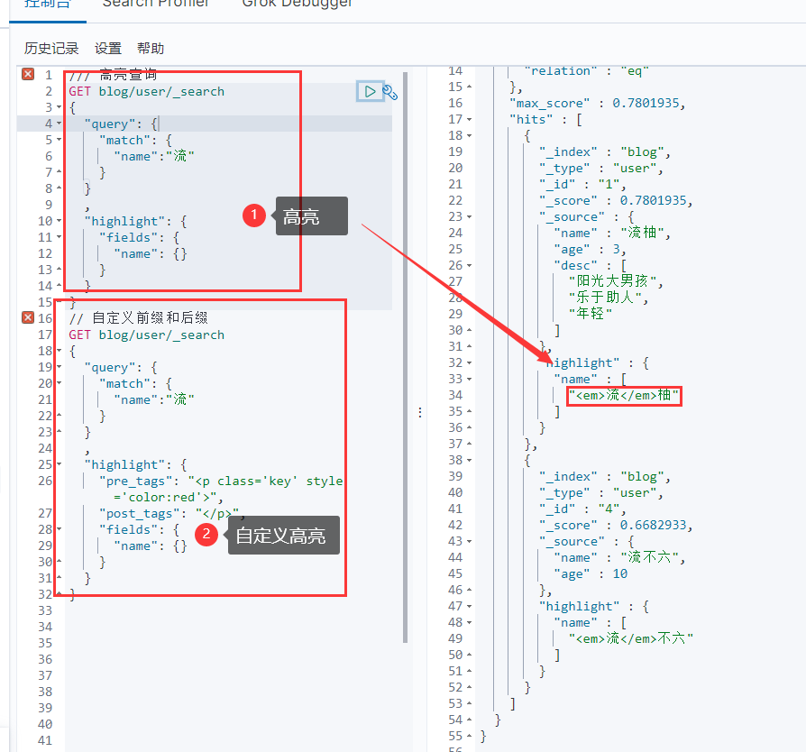
