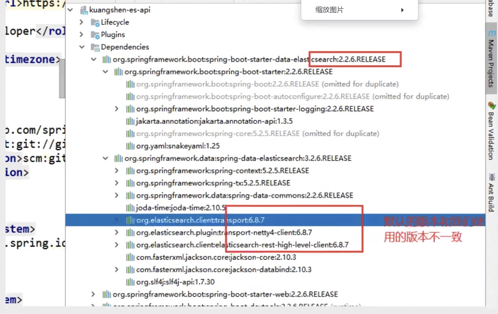
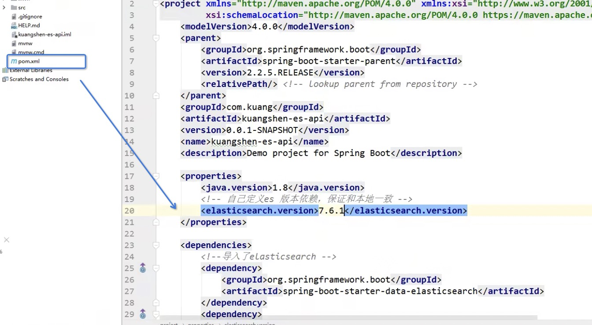

# SpringBoot整合

### 1、创建工程

 正常创建一个maven的spring boot项目即可【web， lombok，elasticsearch等基本依赖】

注意事项：

导入的ElasticSearch的jar包版本要和使用的版本保持一致





自定义版本号，刷新依赖

### 2、导入依赖

注意依赖版本和安装的版本一致

```xml
<properties>
    <java.version>1.8</java.version>
    <!-- 统一版本 -->
    <elasticsearch.version>7.17.7.1</elasticsearch.version>
</properties>
```

**导入elasticsearch**

```xml
<dependency>
    <groupId>org.springframework.boot</groupId>
    <artifactId>spring-boot-starter-data-elasticsearch</artifactId>
</dependency>
```

**提前导入fastjson、lombok**

```xml
<dependency>
    <groupId>com.alibaba</groupId>
    <artifactId>fastjson</artifactId>
    <version>1.2.70</version>
</dependency>
<!-- lombok需要安装插件 -->
<dependency>
    <groupId>org.projectlombok</groupId>
    <artifactId>lombok</artifactId>
    <optional>true</optional>
</dependency>
```

### 3、创建并编写配置类

```java
@Configuration
public class ElasticSearchConfig {
    // 注册 rest高级客户端 
    @Bean
    public RestHighLevelClient restHighLevelClient(){
        RestHighLevelClient client = new RestHighLevelClient(
                RestClient.builder(
                        new HttpHost("127.0.0.1",9200,"http")
                )
        );
        return client;
    }
}
```

### 4、创建并编写实体类

```
@Data
@NoArgsConstructor
@AllArgsConstructor
public class User implements Serializable {
    private static final long serialVersionUID = -3843548915035470817L;
    private String name;
    private Integer age;
}

```

### 5、测试

> 所有测试均在 `SpringbootElasticsearchApplicationTests`中编写

#### 注入 `RestHighLevelClient`

```
@Autowiredpublic RestHighLevelClient restHighLevelClient;
```

#### 索引的操作

##### 1、索引的创建

```
// 测试索引的创建， Request PUT liuyou_index
@Test
public void testCreateIndex() throws IOException {
    CreateIndexRequest request = new CreateIndexRequest("liuyou_index");
    CreateIndexResponse response = restHighLevelClient.indices().create(request, RequestOptions.DEFAULT);
    System.out.println(response.isAcknowledged());// 查看是否创建成功
    System.out.println(response);// 查看返回对象
    restHighLevelClient.close();
}
```

##### 2、索引的获取，并判断其是否存在

```bash
// 测试获取索引，并判断其是否存在
@Test
public void testIndexIsExists() throws IOException {
    GetIndexRequest request = new GetIndexRequest("index");
    boolean exists = restHighLevelClient.indices().exists(request, RequestOptions.DEFAULT);
    System.out.println(exists);// 索引是否存在
    restHighLevelClient.close();
}
```

##### 3、索引的删除

```
/ 测试索引删除
@Test
public void testDeleteIndex() throws IOException {
    DeleteIndexRequest request = new DeleteIndexRequest("liuyou_index");
    AcknowledgedResponse response = restHighLevelClient.indices().delete(request, RequestOptions.DEFAULT);
    System.out.println(response.isAcknowledged());// 是否删除成功
    restHighLevelClient.close();
}

```

#### 文档的操作

##### 1、文档的添加

```java
// 测试添加文档(先创建一个User实体类，添加fastjson依赖)
@Test
public void testAddDocument() throws IOException {
    // 创建一个User对象
    User liuyou = new User("liuyou", 18);
    // 创建请求
    IndexRequest request = new IndexRequest("liuyou_index");
    // 制定规则 PUT /liuyou_index/_doc/1
    request.id("1");// 设置文档ID
    request.timeout(TimeValue.timeValueMillis(1000));// request.timeout("1s")
    // 将我们的数据放入请求中
    request.source(JSON.toJSONString(liuyou), XContentType.JSON);
    // 客户端发送请求，获取响应的结果
    IndexResponse response = restHighLevelClient.index(request, RequestOptions.DEFAULT);
    System.out.println(response.status());// 获取建立索引的状态信息 CREATED
    System.out.println(response);// 查看返回内容 IndexResponse[index=liuyou_index,type=_doc,id=1,version=1,result=created,seqNo=0,primaryTerm=1,shards={"total":2,"successful":1,"failed":0}]
}
```

##### 2、文档信息的获取

```java
// 测试获得文档信息
@Test
public void testGetDocument() throws IOException {
    GetRequest request = new GetRequest("liuyou_index","1");
    GetResponse response = restHighLevelClient.get(request, RequestOptions.DEFAULT);
    System.out.println(response.getSourceAsString());// 打印文档内容
    System.out.println(request);// 返回的全部内容和命令是一样的
    restHighLevelClient.close();
}
```

##### 3、文档的获取，并判断其是否存在

```
// 获取文档，判断是否存在 get /liuyou_index/_doc/1
@Test
public void testDocumentIsExists() throws IOException {
    GetRequest request = new GetRequest("liuyou_index", "1");
    // 不获取返回的 _source的上下文了
    request.fetchSourceContext(new FetchSourceContext(false));
    request.storedFields("_none_");
    boolean exists = restHighLevelClient.exists(request, RequestOptions.DEFAULT);
    System.out.println(exists);
}
```

##### 4、文档的更新

```
// 测试更新文档内容
@Test
public void testUpdateDocument() throws IOException {
    UpdateRequest request = new UpdateRequest("liuyou_index", "1");
    User user = new User("lmk",11);
    request.doc(JSON.toJSONString(user),XContentType.JSON);
    UpdateResponse response = restHighLevelClient.update(request, RequestOptions.DEFAULT);
    System.out.println(response.status()); // OK
    restHighLevelClient.close();
}
```

##### 5、文档的删除

```
// 测试删除文档
@Test
public void testDeleteDocument() throws IOException {
    DeleteRequest request = new DeleteRequest("liuyou_index", "1");
    request.timeout("1s");
    DeleteResponse response = restHighLevelClient.delete(request, RequestOptions.DEFAULT);
    System.out.println(response.status());// OK
}
```

##### 6、批量添加数据

```java
// 上面的这些api无法批量增加数据（只会保留最后一个source）
@Test
public void test() throws IOException {
    IndexRequest request = new IndexRequest("bulk");// 没有id会自动生成一个随机ID
    request.source(JSON.toJSONString(new User("liu",1)),XContentType.JSON);
    request.source(JSON.toJSONString(new User("min",2)),XContentType.JSON);
    request.source(JSON.toJSONString(new User("kai",3)),XContentType.JSON);
    IndexResponse index = restHighLevelClient.index(request, RequestOptions.DEFAULT);
    System.out.println(index.status());// created
}

// 特殊的，真的项目一般会 批量插入数据
@Test
public void testBulk() throws IOException {
    BulkRequest bulkRequest = new BulkRequest();
    bulkRequest.timeout("10s");
    ArrayList<User> users = new ArrayList<>();
    users.add(new User("liuyou-1",1));
    users.add(new User("liuyou-2",2));
    users.add(new User("liuyou-3",3));
    users.add(new User("liuyou-4",4));
    users.add(new User("liuyou-5",5));
    users.add(new User("liuyou-6",6));
    // 批量请求处理
    for (int i = 0; i < users.size(); i++) {
        bulkRequest.add(
                // 这里是数据信息
                new IndexRequest("bulk")
                        .id(""+(i + 1)) // 没有设置id 会自定生成一个随机id
                        .source(JSON.toJSONString(users.get(i)),XContentType.JSON)
        );
    }
    BulkResponse bulk = restHighLevelClient.bulk(bulkRequest, RequestOptions.DEFAULT);
    System.out.println(bulk.status());// ok
}
```

##### 7、文档的查询

```java
// 查询
// SearchRequest 搜索请求
// SearchSourceBuilder 条件构造
// HighlightBuilder 高亮
// TermQueryBuilder 精确查询
// MatchAllQueryBuilder
// xxxQueryBuilder ...
@Test
public void testSearch() throws IOException {
    // 1.创建查询请求对象
    SearchRequest searchRequest = new SearchRequest();
    // 2.构建搜索条件
    SearchSourceBuilder searchSourceBuilder = new SearchSourceBuilder();
    // (1)查询条件 使用QueryBuilders工具类创建
    // 精确查询
    TermQueryBuilder termQueryBuilder = QueryBuilders.termQuery("name", "liuyou");
    //        // 匹配查询
    //        MatchAllQueryBuilder matchAllQueryBuilder = QueryBuilders.matchAllQuery();
    // (2)其他<可有可无>：（可以参考 SearchSourceBuilder 的字段部分）
    // 设置高亮
    searchSourceBuilder.highlighter(new HighlightBuilder());
    //        // 分页
    //        searchSourceBuilder.from();
    //        searchSourceBuilder.size();
    searchSourceBuilder.timeout(new TimeValue(60, TimeUnit.SECONDS));
    // (3)条件投入
    searchSourceBuilder.query(termQueryBuilder);
    // 3.添加条件到请求
    searchRequest.source(searchSourceBuilder);
    // 4.客户端查询请求
    SearchResponse search = restHighLevelClient.search(searchRequest, RequestOptions.DEFAULT);
    // 5.查看返回结果
    SearchHits hits = search.getHits();
    System.out.println(JSON.toJSONString(hits));
    System.out.println("=======================");
    for (SearchHit documentFields : hits.getHits()) {
        System.out.println(documentFields.getSourceAsMap());
    }
}
```

