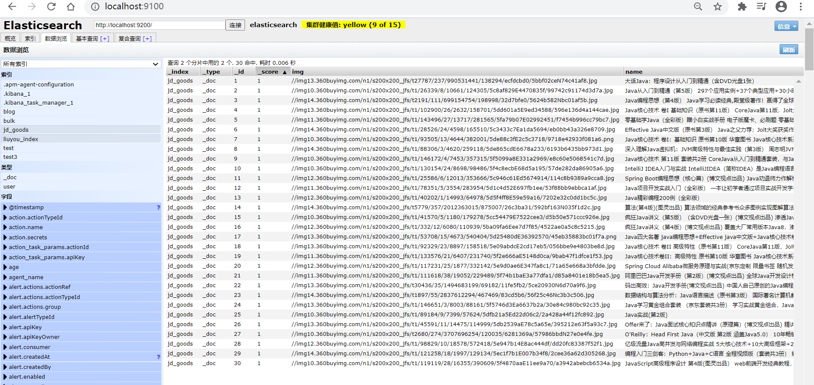

# ElasticSearch实战

## 防京东商城搜索（高亮）

### 1、工程创建（springboot）

创建一个maven构建的springboot项目，创建过程略

### 2、基本编码

#### ①导入依赖

```xml
<properties>
    <java.version>1.8</java.version>
    <elasticsearch.version>7.17.7</elasticsearch.version>
</properties>
<dependencies>
    <!-- jsoup解析页面 -->
    <!-- 解析网页 爬视频可 研究tiko -->
    <dependency>
        <groupId>org.jsoup</groupId>
        <artifactId>jsoup</artifactId>
        <version>1.10.2</version>
    </dependency>
    <!-- fastjson -->
    <dependency>
        <groupId>com.alibaba</groupId>
        <artifactId>fastjson</artifactId>
        <version>1.2.70</version>
    </dependency>
    <!-- ElasticSearch -->
    <dependency>
        <groupId>org.springframework.boot</groupId>
        <artifactId>spring-boot-starter-data-elasticsearch</artifactId>
    </dependency>
    <!-- thymeleaf -->
    <dependency>
        <groupId>org.springframework.boot</groupId>
        <artifactId>spring-boot-starter-thymeleaf</artifactId>
    </dependency>
    <!-- web -->
    <dependency>
        <groupId>org.springframework.boot</groupId>
        <artifactId>spring-boot-starter-web</artifactId>
    </dependency>
    <!-- devtools热部署 -->
    <dependency>
        <groupId>org.springframework.boot</groupId>
        <artifactId>spring-boot-devtools</artifactId>
        <scope>runtime</scope>
        <optional>true</optional>
    </dependency>
    <!--  -->
    <dependency>
        <groupId>org.springframework.boot</groupId>
        <artifactId>spring-boot-configuration-processor</artifactId>
        <optional>true</optional>
    </dependency>
    <!-- lombok 需要安装插件 -->
    <dependency>
        <groupId>org.projectlombok</groupId>
        <artifactId>lombok</artifactId>
        <optional>true</optional>
    </dependency>
    <!-- test -->
    <dependency>
        <groupId>org.springframework.boot</groupId>
        <artifactId>spring-boot-starter-test</artifactId>
        <scope>test</scope>
    </dependency>
</dependencies>
```

#### ②导入前端素材

有个压缩包，略

#### ③编写 `application.preperties`配置文件

```bash
# 更改端口，防止冲突
server.port=9999
# 关闭thymeleaf缓存
spring.thymeleaf.cache=false

```

#### ④测试controller和view

```java
@Controller
public class IndexController {
    @GetMapping({"/","index"})
    public String index(){
        return "index";
    }
}
```

访问 localhost:9999


到这里可以先去编写爬虫，编写之后，回到这里

#### ⑤编写Config

```java
@Configuration
public class ElasticSearchConfig {
    @Bean
    public RestHighLevelClient restHighLevelClient(){
        RestHighLevelClient client = new RestHighLevelClient(
                RestClient.builder(
                        new HttpHost("127.0.0.1",9200,"http")
                )
        );
        return client;
    }
}
```

#### ⑥编写service

因为是爬取的数据，那么就不走Dao，以下编写都不会编写接口，开发中必须严格要求编写

**ContentService**

```java
@Service
public class ContentService {
    @Autowired
    private RestHighLevelClient restHighLevelClient;
    // 1、解析数据放入 es 索引中
    public Boolean parseContent(String keyword) throws IOException {
        // 获取内容
        List<Content> contents = HtmlParseUtil.parseJD(keyword);
        // 内容放入 es 中
        BulkRequest bulkRequest = new BulkRequest();
        bulkRequest.timeout("2m"); // 可更具实际业务是指
        for (int i = 0; i < contents.size(); i++) {
            bulkRequest.add(
                    new IndexRequest("jd_goods")
                            .id(""+(i+1))
                            .source(JSON.toJSONString(contents.get(i)), XContentType.JSON)
            );
        }
        BulkResponse bulk = restHighLevelClient.bulk(bulkRequest, RequestOptions.DEFAULT);
        restHighLevelClient.close();
        return !bulk.hasFailures();
    }
        // 2、根据keyword分页查询结果
    public List<Map<String, Object>> search(String keyword, Integer pageIndex, Integer pageSize) throws IOException {
        if (pageIndex < 0){
            pageIndex = 0;
        }
        SearchRequest jd_goods = new SearchRequest("jd_goods");
        // 创建搜索源建造者对象
        SearchSourceBuilder searchSourceBuilder = new SearchSourceBuilder();
        // 条件采用：精确查询 通过keyword查字段name
        TermQueryBuilder termQueryBuilder = QueryBuilders.termQuery("name", keyword);
        searchSourceBuilder.query(termQueryBuilder);
        searchSourceBuilder.timeout(new TimeValue(60, TimeUnit.SECONDS));// 60s
        // 分页
        searchSourceBuilder.from(pageIndex);
        searchSourceBuilder.size(pageSize);
        // 高亮
        // ....
        // 搜索源放入搜索请求中
        jd_goods.source(searchSourceBuilder);
        // 执行查询，返回结果
        SearchResponse searchResponse = restHighLevelClient.search(jd_goods, RequestOptions.DEFAULT);
        restHighLevelClient.close();
        // 解析结果
        SearchHits hits = searchResponse.getHits();
        List<Map<String,Object>> results = new ArrayList<>();
        for (SearchHit documentFields : hits.getHits()) {
            Map<String, Object> sourceAsMap = documentFields.getSourceAsMap();
            results.add(sourceAsMap);
        }
        // 返回查询的结果
        return results;
    }
}

```

#### ⑦编写controller

```java
@Controller
public class ContentController {
    @Autowired
    private ContentService contentService;
    @ResponseBody
    @GetMapping("/parse/{keyword}")
    public Boolean parse(@PathVariable("keyword") String keyword) throws IOException {
        return contentService.parseContent(keyword);
    }
    @ResponseBody
    @GetMapping("/search/{keyword}/{pageIndex}/{pageSize}")
    public List<Map<String, Object>> parse(@PathVariable("keyword") String keyword,
                                           @PathVariable("pageIndex") Integer pageIndex,
                                           @PathVariable("pageSize") Integer pageSize) throws IOException {
        return contentService.search(keyword,pageIndex,pageSize);
    }
}
```

#### ⑧测试结果

##### 1、解析数据放入 es 索引中




##### 2、根据keyword分页查询结果

略

### 3、爬虫（jsoup）

> 数据获取：数据库、消息队列、爬虫、…

#### ①搜索京东搜索页面，并分析页面

```
http://search.jd.com/search?keyword=java
```

##### 页面如下


##### 审查页面元素

**页面列表id：J_goodsList**


**目标元素：img、price、name**


#### ②爬取数据（获取请求返回的页面信息，筛选出可用的）

##### 创建HtmlParseUtil，并简单编写

```java
public class HtmlParseUtil {
    public static void main(String[] args) throws IOException {
        /// 使用前需要联网
        // 请求url
        String url = "http://search.jd.com/search?keyword=java";
        // 1.解析网页(jsoup 解析返回的对象是浏览器Document对象)
        Document document = Jsoup.parse(new URL(url), 30000);
        // 使用document可以使用在js对document的所有操作
        // 2.获取元素（通过id）
        Element j_goodsList = document.getElementById("J_goodsList");
        // 3.获取J_goodsList ul 每一个 li
        Elements lis = j_goodsList.getElementsByTag("li");
        // 4.获取li下的 img、price、name
        for (Element li : lis) {
            String img = li.getElementsByTag("img").eq(0).attr("src");// 获取li下 第一张图片
            String name = li.getElementsByClass("p-name").eq(0).text();
            String price = li.getElementsByClass("p-price").eq(0).text();
            System.out.println("=======================");
            System.out.println("img : " + img);
            System.out.println("name : " + name);
            System.out.println("price : " + price);
        }
    }
}
```

**运行结果**


**原因是啥？**

> 一般图片特别多的网站，所有的图片都是通过延迟加载的

```
// 打印标签内容
Elements lis = j_goodsList.getElementsByTag("li");
System.out.println(lis);
```

打印所有li标签，发现img标签中并没有属性src的设置，只是data-lazy-ing设置图片加载的地址


##### 创建HtmlParseUtil、改写

- 更改图片获取属性为 `data-lazy-img`

- 与实体类结合，实体类如下

  ```
  @Data
  @AllArgsConstructor
  @NoArgsConstructor
  public class Content implements Serializable {
      private static final long serialVersionUID = -8049497962627482693L;
      private String name;
      private String img;
      private String price;
  }
  ```

- 封装为方法

```
public class HtmlParseUtil {
    public static void main(String[] args) throws IOException {
        System.out.println(parseJD("java"));
    }
    public static List<Content> parseJD(String keyword) throws IOException {
        /// 使用前需要联网
        // 请求url
        String url = "http://search.jd.com/search?keyword=" + keyword;
        // 1.解析网页(jsoup 解析返回的对象是浏览器Document对象)
        Document document = Jsoup.parse(new URL(url), 30000);
        // 使用document可以使用在js对document的所有操作
        // 2.获取元素（通过id）
        Element j_goodsList = document.getElementById("J_goodsList");
        // 3.获取J_goodsList ul 每一个 li
        Elements lis = j_goodsList.getElementsByTag("li");
//        System.out.println(lis);
        // 4.获取li下的 img、price、name
        // list存储所有li下的内容
        List<Content> contents = new ArrayList<Content>();
        for (Element li : lis) {
            // 由于网站图片使用懒加载，将src属性替换为data-lazy-img
            String img = li.getElementsByTag("img").eq(0).attr("data-lazy-img");// 获取li下 第一张图片
            String name = li.getElementsByClass("p-name").eq(0).text();
            String price = li.getElementsByClass("p-price").eq(0).text();
            // 封装为对象
            Content content = new Content(name,img,price);
            // 添加到list中
            contents.add(content);
        }
//        System.out.println(contents);
        // 5.返回 list
        return contents;
    }
}
```

**结果展示**


### 4、搜索高亮

> 在3、的基础上添加内容

#### ①ContentService

```java
// 3、 在2的基础上进行高亮查询
public List<Map<String, Object>> highlightSearch(String keyword, Integer pageIndex, Integer pageSize) throws IOException {
    SearchRequest searchRequest = new SearchRequest("jd_goods");
    SearchSourceBuilder searchSourceBuilder = new SearchSourceBuilder();
    // 精确查询，添加查询条件
    TermQueryBuilder termQueryBuilder = QueryBuilders.termQuery("name", keyword);
    searchSourceBuilder.timeout(new TimeValue(60, TimeUnit.SECONDS));
    searchSourceBuilder.query(termQueryBuilder);
    // 分页
    searchSourceBuilder.from(pageIndex);
    searchSourceBuilder.size(pageSize);
    // 高亮 =========
    HighlightBuilder highlightBuilder = new HighlightBuilder();
    highlightBuilder.field("name");
    highlightBuilder.preTags("<span style='color:red'>");
    highlightBuilder.postTags("</span>");
    searchSourceBuilder.highlighter(highlightBuilder);
    // 执行查询
    searchRequest.source(searchSourceBuilder);
    SearchResponse searchResponse = restHighLevelClient.search(searchRequest, RequestOptions.DEFAULT);
    // 解析结果 ==========
    SearchHits hits = searchResponse.getHits();
    List<Map<String, Object>> results = new ArrayList<>();
    for (SearchHit documentFields : hits.getHits()) {
        // 使用新的字段值（高亮），覆盖旧的字段值
        Map<String, Object> sourceAsMap = documentFields.getSourceAsMap();
        // 高亮字段
        Map<String, HighlightField> highlightFields = documentFields.getHighlightFields();
        HighlightField name = highlightFields.get("name");
        // 替换
        if (name != null){
            Text[] fragments = name.fragments();
            StringBuilder new_name = new StringBuilder();
            for (Text text : fragments) {
                new_name.append(text);
            }
            sourceAsMap.put("name",new_name.toString());
        }
        results.add(sourceAsMap);
    }
    return results;
}
```

#### ②ContentController

```java
@ResponseBody
@GetMapping("/h_search/{keyword}/{pageIndex}/{pageSize}")
public List<Map<String, Object>> highlightParse(@PathVariable("keyword") String keyword,
                                       @PathVariable("pageIndex") Integer pageIndex,
                                       @PathVariable("pageSize") Integer pageSize) throws IOException {
    return contentService.highlightSearch(keyword,pageIndex,pageSize);
}
```

#### ③结果展示


### 5、前后端分离（简单使用Vue）

> 删除Controller 方法上的 [@ResponseBody](https://github.com/ResponseBody)注解


#### ①下载并引入Vue.min.js和axios.js

> 如果安装了nodejs，可以按如下步骤，没有可以到后面素材处下载

```
npm install vuenpm install axios
```


#### ②修改静态页面

##### 引入js

```js
<script th:src="@{/js/vue.min.js}"></script>
<script th:src="@{/js/axios.min.js}"></script>
```

##### 修改后的index.html

```html
<!DOCTYPE html>
<html xmlns:th="http://www.thymeleaf.org">
<head>
    <meta charset="utf-8"/>
    <title>狂神说Java-ES仿京东实战</title>
    <link rel="stylesheet" th:href="@{/css/style.css}"/>
    <script th:src="@{/js/jquery.min.js}"></script>
</head>
<body class="pg">
<div class="page">
    <div id="app" class=" mallist tmall- page-not-market ">
        <!-- 头部搜索 -->
        <div id="header" class=" header-list-app">
            <div class="headerLayout">
                <div class="headerCon ">
                    <!-- Logo-->
                    <h1 id="mallLogo">
                        
                    </h1>
                    <div class="header-extra">
                        <!--搜索-->
                        <div id="mallSearch" class="mall-search">
                            <form name="searchTop" class="mallSearch-form clearfix">
                                <fieldset>
                                    <legend>天猫搜索</legend>
                                    <div class="mallSearch-input clearfix">
                                        <div class="s-combobox" id="s-combobox-685">
                                            <div class="s-combobox-input-wrap">
                                                <input v-model="keyword"  type="text" autocomplete="off" id="mq"
                                                       class="s-combobox-input"  aria-haspopup="true">
                                            </div>
                                        </div>
                                        <button type="submit" @click.prevent="searchKey" id="searchbtn">搜索</button>
                                    </div>
                                </fieldset>
                            </form>
                            <ul class="relKeyTop">
                                <li><a>狂神说Java</a></li>
                                <li><a>狂神说前端</a></li>
                                <li><a>狂神说Linux</a></li>
                                <li><a>狂神说大数据</a></li>
                                <li><a>狂神聊理财</a></li>
                            </ul>
                        </div>
                    </div>
                </div>
            </div>
        </div>
        <!-- 商品详情页面 -->
        <div id="content">
            <div class="main">
                <!-- 品牌分类 -->
                <form class="navAttrsForm">
                    <div class="attrs j_NavAttrs" style="display:block">
                        <div class="brandAttr j_nav_brand">
                            <div class="j_Brand attr">
                                <div class="attrKey">
                                    品牌
                                </div>
                                <div class="attrValues">
                                    <ul class="av-collapse row-2">
                                        <li><a href="#"> 狂神说 </a></li>
                                        <li><a href="#"> Java </a></li>
                                    </ul>
                                </div>
                            </div>
                        </div>
                    </div>
                </form>
                <!-- 排序规则 -->
                <div class="filter clearfix">
                    <a class="fSort fSort-cur">综合<i class="f-ico-arrow-d"></i></a>
                    <a class="fSort">人气<i class="f-ico-arrow-d"></i></a>
                    <a class="fSort">新品<i class="f-ico-arrow-d"></i></a>
                    <a class="fSort">销量<i class="f-ico-arrow-d"></i></a>
                    <a class="fSort">价格<i class="f-ico-triangle-mt"></i><i class="f-ico-triangle-mb"></i></a>
                </div>
                <!-- 商品详情 -->
                <div class="view grid-nosku" >
                    <div class="product" v-for="result in results">
                        <div class="product-iWrap">
                            <!--商品封面-->
                            <div class="productImg-wrap">
                                <a class="productImg">
                                    
                                </a>
                            </div>
                            <!--价格-->
                            <p class="productPrice">
                                <em v-text="result.price"></em>
                            </p>
                            <!--标题-->
                            <p class="productTitle">
                                <a v-html="result.name"></a>
                            </p>
                            <!-- 店铺名 -->
                            <div class="productShop">
                                <span>店铺： 狂神说Java </span>
                            </div>
                            <!-- 成交信息 -->
                            <p class="productStatus">
                                <span>月成交<em>999笔</em></span>
                                <span>评价 <a>3</a></span>
                            </p>
                        </div>
                    </div>
                </div>
            </div>
        </div>
    </div>
</div>
<script th:src="@{/js/vue.min.js}"></script>
<script th:src="@{/js/axios.min.js}"></script>
<script>
    new Vue({
        el:"#app",
        data:{
            "keyword": '', // 搜索的关键字
            "results":[] // 后端返回的结果
        },
        methods:{
            searchKey(){
                var keyword = this.keyword;
                console.log(keyword);
                axios.get('h_search/'+keyword+'/0/20').then(response=>{
                    console.log(response.data);
                    this.results=response.data;
                })
            }
        }
    });
</script>
</body>
</html>
```

##### 测试


## 疑惑

1、使用完成后如果调用close方法，第二次调用就无法使用了，难道要重新构建连接吗？每次重新构建连接应该会更浪费时间吧，

可以先不用close

```java
// restHighLevelClient.close();
```

https://elasticsearch.cn/question/9839

https://github.com/elastic/elasticsearch/issues/39946

https://github.com/elastic/elasticsearch/issues/45115


