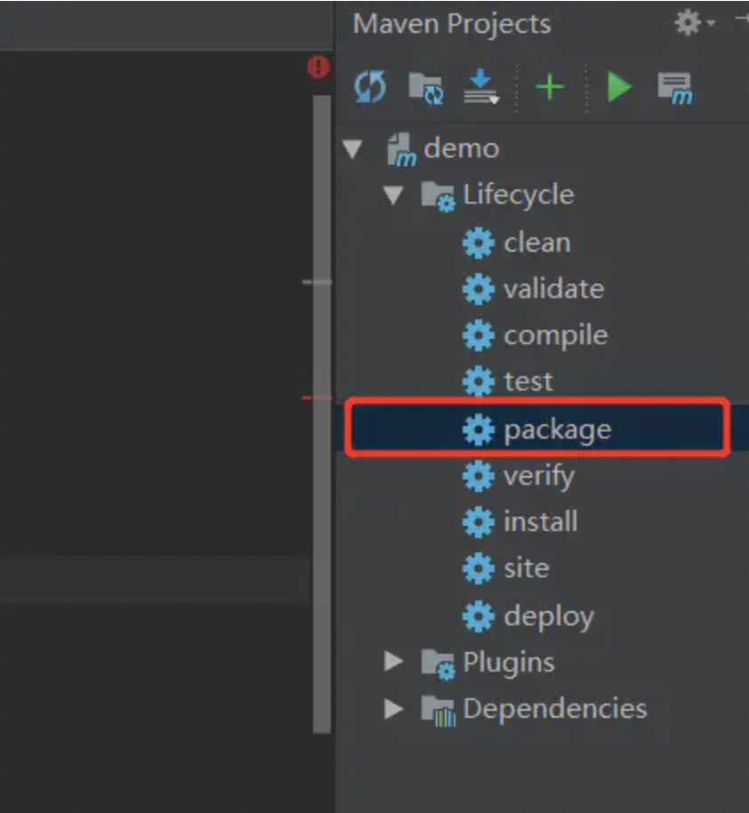

# Docker部署

## 1、spring-boot打包

跳过test检测

pom.xml 在properties节点下添加

```xml
<properties>
        <project.build.sourceEncoding>UTF-8</project.build.sourceEncoding>
        <project.reporting.outputEncoding>UTF-8</project.reporting.outputEncoding>
        <java.version>1.8</java.version>

        <skipTests>true</skipTests>
</properties>
```

### 1）idea打包



### 2、命令打包

在项目根目录执行

```bash
# 不执行测试用例，但编译测试用例类生成相应的class文件至target/test-classes下。
mvn clean package -DskipTests
```

```bash
# 不执行测试用例，也不编译测试用例类。
mvn clean package -Dmaven.test.skip=true
```

## 2、编写Dockerfile文件

```dockerfile
FROM openjdk:8-jdk-alpine

ADD target/springboot-es-api-0.0.1.jar app.jar

ENTRYPOINT ["java", "-jar", "/app.jar"]
```

## 3、构建镜像

```bash
docker build -t xxx.xxx.xxx:5000/guoguo/springboot-es-api .
```

## 4、上传镜像

```bash
docker push xxx.xxx.xxx:5000/guoguo/springboot-es-api
```

## 5、启动镜像

```bash
docker run --name springboot-es-api  -d -p 8000:8080 xxx.xxx.xxx:5000/guoguo/springboot-es-api
```

## 6、完美撒花