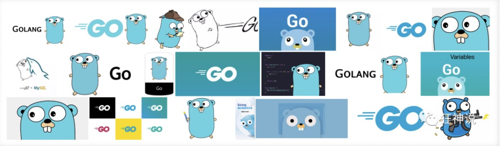
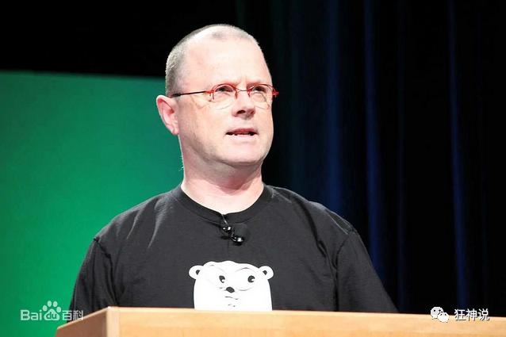
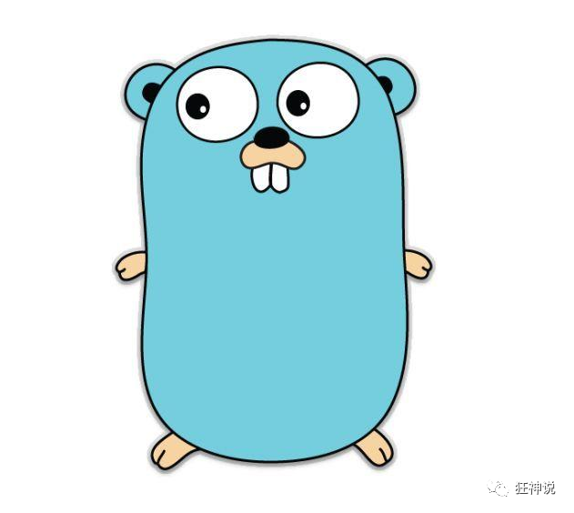
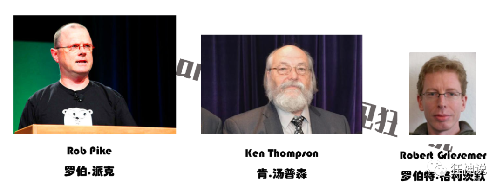
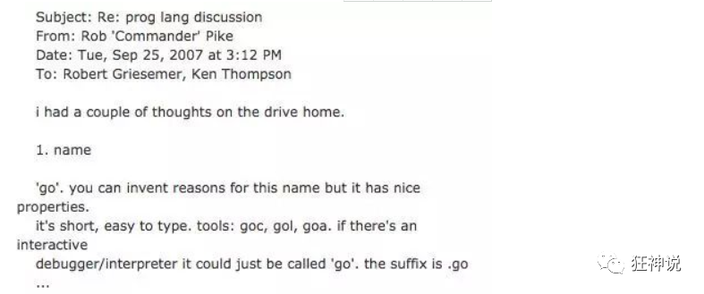
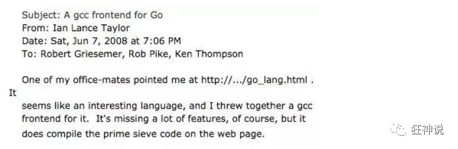

## Go语言的Logo

作为程序员，我们每天会用到大量的编程语言，打开界面会碰到很多logo，在正式学习Go语言之前，我们先来了解一下Go语言的Logo。也就是它,下面这个动物，gopher [ˈɡoʊfər] ，囊地鼠，是北美的一种地鼠。也有人说这是土拨鼠，大家自行理解吧。



> 故事

Rob Pike是Go的发明者之一，贝尔实验室UNIX小组成员之一，UTF-8的设计人。他最喜欢做似乎就是：

- 发明操作系统
- 发明编辑器
- 发明语言



Go语言这萌萌的吉祥物是由Rob Pike的妻子 Renee French绘制的，golang吉祥物的设计者Renee French是一位知名插画师，她的画风是这样的：


就是她设计出了Golang吉祥物，可爱的 Gordon [ˈgɔrdən]

比心心！



## 谷歌工程师的20%时间

谷歌的“20%时间”工作方式，允许工程师拿出20%的时间来研究自己喜欢的项目。语音服务Google Now、谷歌新闻Google News、谷歌地图Google Map上的交通信息等，全都是20%时间的产物。

Go语言最开始也是20%时间的产物。

> 为什么需要一个新的语言

最近十年来，C/C++在计算领域没有很好得到发展，并没有新的系统编程语言出现。对开发程度和系统效率在很多情况下不能兼得。要么执行效率高，但低效的开发和编译，如C++；要么执行低效，但拥有有效的编译，如.NET、Java；所以需要一种拥有较高效的执行速度、编译速度和开发速度的编程语言，Go就横空出世了。

传统的语言比如c++，大家花费太多时间来学习如何使用这门语言，而不是如何更好的表达写作者的思想，同时编译花费的时间实在太长，对于编写-编译-运行这个链条来说周期太长。动态语言如Python，由于没有强类型的约束，很多问题需要在运行时发现，这种低级错误更应该交给编译器来发现。

人力成本越来越高

机器越来越便宜

机器的性能越来越厉害

在开发效率和运行速度上达到平衡

go出现之前，无论汇编语言、还是动态脚本语言，在执行效率和开发效率上都不能兼备。

这个世界上总有一帮人在想着做这种事情，别人的用的不舒服，就自己开发了一个！

## Go语言的创始人

Go的三个作者分别是：Rob Pike（罗伯.派克），Ken Thompson（肯.汤普森）和Robert Griesemer（罗伯特.格利茨默） 。

Rob Pike：曾是贝尔实验室（Bell Labs）的Unix团队，和Plan 9操作系统计划的成员。他与Thompson共事多年，并共创出广泛使用的UTF-8 字元编码。

Ken Thompson：主要是B语言、C语言的作者、Unix之父。1983年图灵奖（Turing Award）和1998年美国国家技术奖（National Medal of Technology）得主。他与Dennis Ritchie是Unix的原创者。Thompson也发明了后来衍生出C语言的B程序语言。

Robert Griesemer：在开发Go之前是Google V8、Chubby和HotSpot JVM的主要贡献者。



此外还有Plan 9开发者Russ Cox、和曾改善目前广泛使用之开原码编译器GCC的Ian Taylor。

## Google为什么要创造Go语言

1. 计算机硬件更新频繁，性能提高很快，目前主流的编程语言发展明显落后于硬件，不能合理利用多核cpu的优势，提升软件的系统性能
2. 软件系统复杂度越来越高，维护成本也越来越高，目前缺乏一个足够简洁高效的编程语言【现有的编程语言：1.风格不统一  2计算能力不够  3.处理大并发不好】
3. 企业运行维护很多的c/c++的项目，c/c++的程序运行速度虽然很快，但是编译速度很慢，同时还存在内存泄露等一系列困扰问题

## Go语言的发展

- 2007年，谷歌工程师Rob Pike，Ken Thompson和Robert Griesemer开始设计一门全新的语言，这是Go语言的最初原型。
- 2009年11月10日，Google将Go语言以开放源代码的方式向全球发布。
- 2015年8月19日，Go1.5版发布，本次更新中移除了”最后残余的c代码” 【用go重构了go】
- 2017年2月17日，Go语言Go1.8版发布。
- 2017年8月24日，Go语言Go1.9版发布。
- 2018年2月16日，Go语言Go1.10版发布。

> 故事一：名字的来源



这是一封由 Rob Pike 在 2007 年 9 月 25 号，星期二，下午 3：12 回复给 Robert Griesemer、Ken Thompson 的有关编程语言讨论主题的邮件。

邮件正文大意为：

在开车回家的路上我得到了些灵感，给这门编程语言取名为“go”，它很简短，易书写。工具类可以命名为：goc、 gol、goa。交互式的调试工具也可以直接命名为“go”。语言文件后缀名为 .go 等等

这就是 Go 语言名字的来源。

自此之后 Robert、Rob 和 Ken 三个人开始在 Google 内部进行了研发，一直到了 2009 年，Go 正式开源了。

Go 项目团队将 2009 年 11 月 10 日，即该语言正式对外开源的日子作为其官方生日。

源代码最初托管在 [http://code.google.com](http://code.google.com/) 上，之后几年才逐步的迁移到 GitHub 上。

> 故事二：新伙伴的加入



这是一封由 Ian Lance Taylor 在 2008 年 6月 7 日（星期六）的晚上 7：06 写给 Robert Griesemer、Rob Pike、 Ken Thompson 的关于 Go gcc 编译器前端的邮件。

邮件正文大意如下：

我的同事向我推荐了这个网站 http://…/go_lang.html 。这似乎是一门很有趣的编程语言。我为它写了一个 gcc 编译器前端。虽然这个工具仍缺少很多的功能，但它确实可以编译网站上展示的那个素数筛选程序了。

Ian Lance Taylor 的加入以及第二个编译器 (gcc go) 的实现 在带来震惊的同时，也伴随着喜悦。

这对 Go 项目来说不仅仅是鼓励，更是一种对可行性的证明。语言的第二次实现对制定语言规范和确定标准库的过程至关重要，同时也有助于保证其高可移植性，这也是 Go 语言承诺的一部分。

自此之后 Ian Lance Taylor 成为了设计和实现 Go 语言及其工具的核心人物。

> 故事三：http.HandlerFunc、I/O 库

Russ Cox 在2008年带着他的语言设计天赋和编程技巧加入了刚成立不久的 Go 团队。Russ 发现 Go 方法的通用性意味着函数也能拥有自己的方法，这直接促成了 http.HandlerFunc 的实现，这是一个让 Go 一下子变得无限可能的特性。

Russ 还提出了更多的泛化性的想法，比如 io.Reader 和 io.Writer 接口，奠定了所有 I/O 库的整体结构。

> 故事四：cryptographic

安全专家 Adam Langley 帮助 Go 走向 Google 外面的世界。

Adam 为 Go 团队做了许多不为外人知晓的工作，包括创建最初的 [http://golang.org](http://golang.org/) 网站以及 build dashboard。

不过他最大的贡献当属创建了 cryptographic 库。

起先，在我们中的部分人看来，这个库无论在规模还是复杂度上都不成气候。但是就是这个库在后期成为了很多重要的网络和安全软件的基础，并且成为了 Go 语言开发历史的关键组成部分。

许多网络基础设施公司，比如 Cloudflare，均重度依赖 Adam 在 Go 项目上的工作，互联网也因它变得更好。我记得当初 beego 设计的时候，session 模块设计的时候也得到了 Adam 的很多建议，因此，就 Go 而言，我们由衷地感谢 Adam。

> 时间线小结

- 2007年9月，Rob Pike在Google分布式编译平台上进行C++编译，在漫长的等待过程中，他和Robert Griesemer探讨了程序设计语言的一些关键性问题，他们认为，简化编程语言相比于在臃肿的语言上不断增加新特性，会是更大的进步。随后他们在编译结束之前说服了身边的Ken Thompson，觉得有必要为此做一些事情。几天后，他们发起了一个叫Golang的项目，将它作为自由时间的实验项目。
- 2008年5月 Google发现了GO语言的巨大潜力，得到了Google的全力支持，这些人开始全职投入GO语言的设计和开发。
- 2009年11月 GO语言第一个版本发布。2012年3月 第一个正式版本Go1.0发布。
- 2015年8月 go1.5发布，这个版本被认为是历史性的。完全移除C语言部分，使用GO编译GO，少量代码使用汇编实现。另外，他们请来了内存管理方面的权威专家Rick Hudson，对GC进行了重新设计，支持并发GC，解决了一直以来广为诟病的GC时延（STW）问题。并且在此后的版本中，又对GC做了更进一步的优化。到go1.8时，相同业务场景下的GC时延已经可以从go1.1的数秒，控制在1ms以内。GC问题的解决，可以说GO语言在服务端开发方面，几乎抹平了所有的弱点。

在GO语言的版本迭代过程中，语言特性基本上没有太大的变化，基本上维持在GO1.1的基准上，并且官方承诺，新版本对老版本下开发的代码完全兼容。事实上，GO开发团队在新增语言特性上显得非常谨慎，而在稳定性、编译速度、执行效率以及GC性能等方面进行了持续不断的优化。

> 故事五：Docker、Kubernetes。

一家叫做 Docker 的公司。就是使用 Go 进行项目开发，并促进了计算机领域的容器行业，进而出现了像 Kubernetes 这样的项目。现在，我们完全可以说 Go 是容器语言，这是另一个完全出乎意料的结果。

除了大名鼎鼎的Docker，完全用GO实现。业界最为火爆的容器编排管理系统kubernetes完全用GO实现。之后的Docker Swarm，完全用GO实现。

除此之外，还有各种有名的项目，如etcd/consul/flannel，七牛云存储等等 均使用GO实现。有人说，GO语言之所以出名，是赶上了云时代。但为什么不能换种说法？也是GO语言促使了云的发展。

除了云项目外，还有像今日头条、UBER这样的公司，他们也使用GO语言对自己的业务进行了彻底的重构。

> 展望

Go语言是谷歌2009年发布的第二款开源编程语言（系统开发语言)，它是基于编译、垃圾收集和并发的编程语言。

Go语言专门针对多处理器系统应用程序的编程进行了优化，使用Go编译的程序可以媲美 C / C++代码的速度，而且更加安全、支持并行进程。

作为出现在21世纪的语言，其近C的执行性能和近解析型语言的开发效率，以及近乎于完美的编译速度，已经风靡全球。

特别是在云项目中，大部分都使用了Golang来开发。不得不说，Golang早已深入人心。而对于一个没有历史负担的新项目，Golang或许就是个不二的选择。

很多人将Go语言称为21世纪的C语言，因为Go不仅拥有C的简洁和性能。而且还很好的提供了21世纪互联网环境下服务端开发的各种实用特性。

被称为Go语言之父的罗勃·派克(Rob Pike)就曾说过，你是否同意Go语言，取决于你是认可少就是多，还是少就是少(Less is more or less is less)。Go语言的整个设计哲学就是：将简单、实用体现得淋漓尽致。

如今 Go 已经是云计算编程语言，GO语言背靠Google这棵大树，又不乏牛人坐镇，是名副其实的“牛二代”。想象一下：一个只有十几年发展经历的编程语言，已经成为了如此巨大而且正在不断发展的行业的主导者，这种成功是每个人都无法想象的。

## Go语言的特点

Go语言保证了既能达到静态编译语言的安全和性能，又能达到动态语言开发维护的高效率，使用一个表达式来表示，就是Go = Python + C ，说明既有Python的快速开发，又有c静态语言的运行速度

1、从c语言中继承了很多的概念，包括了表达式语法，控制结构，基础数据类型，调用参数传值，指针等，也保留了和c语言一样的编译执行方法及弱化的指针

2、引入包的概念，用于组织程序结构，Go语言的一个文件都要归属于一个包，而不能单独存在

3、垃圾回收机制，内存自动回收，无需开发人员管理

4、天然并发【支持大并发】

​	1）从语言层面支持并发，实现简单

​    2）goroutine，轻量级线程，可实现大并发处理，高效利用多核

​    3）基于CPS并发模型（Communicating Sequential Processes）实现

5、吸收了管道通信机制，形成了go语言特有的管道channel，通过管道channel，可以实现不同的goroute之间的相互通信

6、函数返回多个值

7、新的创新： 比如切片，延时执行defer等

## 使用Go语言的项目

下面列举的是原生使用Go语言进行开发的部分项目。

> Docker

Docker 是一种操作系统层面的虚拟化技术，可以在操作系统和应用程序之间进行隔离，也可以称之为容器。Docker 可以在一台物理服务器上快速运行一个或多个实例。例如，启动一个 CentOS 操作系统，并在其内部命令行执行指令后结束，整个过程就像自己在操作系统一样高效。

项目链接：https://github.com/docker/docker

> Go语言

Go语言自己的早期源码使用C语言和汇编语言写成。从 Go 1.5 版本后，完全使用Go语言自身进行编写。Go语言的源码对了解Go语言的底层调度有极大的参考意义，建议希望对Go语言有深入了解的读者读一读。

项目链接：https://github.com/golang/go

> Kubernetes

Google 公司开发的构建于 Docker 之上的容器调度服务，用户可以通过 Kubernetes 集群进行云端容器集群管理。系统会自动选取合适的工作节点来执行具体的容器集群调度处理工作。其核心概念是 Container Pod（容器仓）。

项目链接：https://github.com/kubernetes/kubernetes

> etcd

一款分布式、可靠的 KV 存储系统，可以快速进行云配置。由 CoreOS 开发并维护键值存储系统，它使用Go语言编写，并通过 Raft 一致性算法处理日志复制以保证强一致性。

项目链接：https://github.com/coreos/etcd

> beego

beego 是一个类似 Python 的 Tornado 框架，采用了 RESTFul 的设计思路，使用Go语言编写的一个极轻量级、高可伸缩性和高性能的 Web 应用框架。

项目链接：https://github.com/astaxie/beego

> martini

一款快速构建模块化的 Web 应用的Go语言框架。

项目链接：https://github.com/go-martini/martini

> codis

国产的优秀分布式 Redis 解决方案。可以将 codis 理解成为 Web 服务领域的 Nginx，它实现了对 Redis 的反向代理和负载均衡。

项目链接：https://github.com/CodisLabs/codis

> delve

Go语言强大的调试器，被很多集成环境和编辑器整合。

项目链接：https://github.com/derekparker/delve

## 哪些大公司在用

Go语言是谷歌在 2009 年发布的一款编程语言，自面世以来它以高效的开发效率和完美的运行速度迅速风靡全球，被誉为“21 世纪的C语言”。

现在越来越多的公司开始使用Go语言开发自己的服务，同时也诞生了很多使用Go语言开发的服务和应用，比如 Docker、k8s 等，

## Go语言代码清爽

Go语言语法类似于C语言，因此熟悉C语言及其派生语言（[C++]、[C#]、Objective-C 等）的人都会迅速熟悉这门语言。

C语言的有些语法会让代码可读性降低甚至发生歧义。Go语言在C语言的基础上取其精华，弃其糟粕，将C语言中较为容易发生错误的写法进行调整，做出相应的编译提示。

> 去掉循环冗余括号

Go语言在众多大师的丰富实战经验的基础上诞生，去除了C语言语法中一些冗余、烦琐的部分。下面的代码是C语言的数值循环：

```
// C语言的for数值循环for(int a =0;a<10;a++){// 循环代码}
```

在Go语言中，这样的循环变为：

```
for a :=0;a<10;a++{// 循环代码}
```

for 两边的括号被去掉，int 声明被简化为`:=`，直接通过编译器右值推导获得 a 的变量类型并声明。

> 去掉表达式冗余括号

同样的简化也可以在判断语句中体现出来，以下是C语言的判断语句：

```
if(表达式){// 表达式成立}
```

在Go语言中，无须添加表达式括号，代码如下：

```
if表达式{// 表达式成立}
```

> 强制的代码风格

Go语言中，左括号必须紧接着语句不换行。其他样式的括号将被视为代码编译错误。这个特性刚开始会使开发者有一些不习惯，但随着对Go语言的不断熟悉，开发者就会发现风格统一让大家在阅读代码时把注意力集中到了解决问题上，而不是代码风格上。

同时Go语言也提供了一套格式化工具。一些Go语言的开发环境或者编辑器在保存时，都会使用格式化工具对代码进行格式化，让代码提交时已经是统一格式的代码。

> 不再纠结于 i++ 和 ++i

C语言非常经典的考试题为：

```
int a, b;a = i++;b =++i;
```

这种题目对于初学者简直摸不着头脑。为什么一个简单的自增表达式需要有两种写法？

在Go语言中，自增操作符不再是一个操作符，而是一个语句。因此，在Go语言中自增只有一种写法：

```
i++
```

如果写成前置自增`++i`，或者赋值后自增`a=i++`都将导致编译错误。


