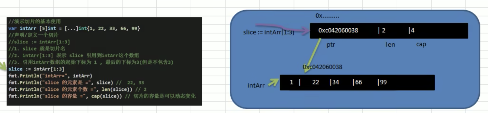
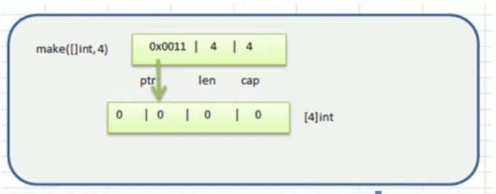

## 数组

### 定义

数组是具有相同唯一类型的一组已编号且长度固定的数据项序列，这种类型可以是任意的原始类型例如整型、字符串或者自定义类型。

### 初始化

```bash
var variable_name [SIZE] variable_type = [SIZE]variable_type{xxx,xxx,xxx}
```

```go
	// 1
	var arr1 [3]int = [3]int{1,2,3}
	fmt.Println(arr1)
	// 2
	var arr2 = [3]int{1,2,3}
	fmt.Println(arr2)
	// 3
	// [...]是规定的写法
	var arr3 = [...]int{1,2,3}
	fmt.Println(arr3)
	// 4
	var arr4 = [...]int{1:800,0:100,2:900}
	fmt.Println(arr4)

	// 类型推导
	arr5 := [...]string{1: "tom", 0:"jack"}
	fmt.Println("strarr5", arr5)
```

### 遍历

常规遍历

for-range遍历

```go
	arr6 := [5]int{0, 1, 2, 3, 4}

	for i := 0; i < len(arr6); i++ {
		fmt.Println("index=", i, "vale=", arr6[i])
	}

	for index, value := range arr6 {
		fmt.Println("index=", index, "vale=", value)
	}
```

### 注意事项

1、数组是多个相同类型数据的组合，   一个数组一旦声明

2、`var arr []int` 这个属于切片，后面单独说

3、数组中的元素可以是任意数据类型，包括值类型和引用类型，但是不能混用

4、数组创建之后，如果没有赋值，有默认值

- 数值类型：0
- 字符串类型：空串“”
- bool：false

5、使用数组的步骤：

- 声明数组
- 数组各个元素赋值
- 使用数组

6、数组下标0开始

7、数组下标需要在数组长度范围内，否组数组越界，panic异常

8、go的数组属于**值类型**，在默认情况下是值传递，在进行拷贝的时候，数组之间不会相互影响

9、如果在其他函数中，想去改变原来的数组，我们可以使用引用传递（指针的方式，传递数组地址）

10、长度也是数组类型的一部分，在传递函数的参数时，需要考虑数组的长度

```go
	var test = func(arr *[3]int) {
		(*arr)[0] = 10;
	}
	arr7:= [3]int{1,2,3}
	fmt.Print("arr7", arr7)  // arr7[1 2 3]
	test(&arr7)
	fmt.Print("arr7", arr7)  // arr7[10 2 3]%
```

### 练习

```go
	// 随机生成5个数，并反转打印，
	var arr8 [5]int
	lenth := len(arr8)
	rand.Seed(time.Now().UnixNano())
	for i := 0; i < lenth; i++ {
		arr8[i] = rand.Intn(100)
	}
	fmt.Println("交换前=", arr8)
	// 开始交换
	temp :=0;
	for i := 0; i < lenth/2; i++ {
		temp = arr8[lenth-1-i]
		arr8[lenth-1-i] = arr8[i]
		arr8[i] = temp
	}
	fmt.Println("交换后=", arr8)
```


## 切片

### 基本介绍

1. 切片的英文是slice
2. 切边是数组的一个引用，因此切片是引用类型，在进行传递时，遵守引用传递的机制
3. 切片的使用和数组类似，遍历切片，访问切片的元素和切片的长度`len(slice)`都一样
4. 切片的长度是可以变化的，因此切片是一个可以动态变化的数组
5. 切片的定义： `var 切片名 []类型`

### 定义

```bash
# 字面量
var identifier []type

# 使用make来创建切片
var slice1 []type = make([]type, len)

# 也可以简写为
slice1 := make([]type, len)

# 也可以指定容量，其中 capacity 为可选参数。
make([]T, length, capacity)
```

### 内存布局分析

  

1.  slice 的确是一个引用类型

2. slice 从底层来说，其实就是一个数据结构（struct结构体）

   ```go
   type  slice struct {
     	ptr *[2]int
     	len int
     	cap int
   }
   ```

### 使用方式

```go
package main

import "fmt"

func main() {
	fmt.Println("slice")

  // 数组引用
	var intArr [5]int = [5]int{1, 2, 3, 4, 5}
	fmt.Printf("intarr=%T,", intArr)
	slice := intArr[1:2]
	fmt.Printf("intarr=%T, intarr=%v \n", intArr, intArr)
	fmt.Printf("slice=%T, sliec= %v \n", slice, slice)
	fmt.Println("slice元素个数=", len(slice)) //1
  // slice 应用数组的指定索引起始位置到数组结尾就是 slice 的容量
	fmt.Println("slice的容量", cap(slice))   // 4

	// make
	slice1 := make([]int, 5,10)
	fmt.Println("slice1=", slice1)

	// 直接定义切片
	slice2 := []int {1,2,3,4,5}
	fmt.Println("slice2=", slice2)
	fmt.Println("slice元素个数=", len(slice2))
	fmt.Println("slice2的容量", cap(slice2))   
}
```

### 引用和make的区别

1. 引用是直接引用数组，这个数组是事先存在的，程序员是可见的

2. make来创建切片，make也会创建一个数组，是由切片在底层进行维护的，程序员是不可见

   

### 遍历

```go
package main

import "fmt"

func main() {
	fmt.Println("slice for")

	// 直接定义切片
	slice := []int {1,2,3,4,5}
	fmt.Println("slice=", slice)
	fmt.Println("slice元素个数=", len(slice))
	fmt.Println("slice的容量", cap(slice))   

	// for
	for i := 0; i < len(slice); i++ {
		fmt.Println("i=",i,"v=", slice[i])
	}

	//  for-range
	fmt.Println("for-range")
	for _, v := range slice {
		fmt.Println(v)
	}
	
}

```

### 注意事项

1. 切片初始化时 `var slice = arr[startIndex: endIndex]`

   说明：[ startIndex, endIndex )

2. 切片初始化时，仍然不能越界，范围在 [ 0 , len(slice) ] 之间，但是可以动态增长

   ```go
   // 直接引用
   s := arr[:]
   // startIndex 到末尾
   s := arr[startIndex:]
   // 开始 至 endIndex
   s := arr[:endIndex] 
   ```

3. cap是一个内置函数，用与统计切片的容量，即最大的可以存放的元素

4. 切片定义完后，还不能使用，因为本身就是一个空的，需要让其引用到一个数组或者make一个空间供切片使用

5. 切片之后还可以继续切片

6. `append`内置函数，可以对切片进行动态增加

   ```go
   	// 使用 append 内置函数，对slice进行动态追加
   	// 内建函数append将元素追加到切片的末尾。若它有足够的容量，其目标就会重新切片以容纳新的元素。否则，就会分配一个新的基本数组。append返回更新后的切片，因此必须存储追加后的结果。
   
   	var slice []int = []int{1, 2, 3, 4, 5}
   	fmt.Println("slice=", slice)
   	slice = append(slice, 6, 7, 8)
   	fmt.Println("append slice=", slice)
   
   	slice = append(slice, slice...)
   	fmt.Println("append slice  =", slice)
   ```

7. 切片的拷贝

   ```go
   	// 切片的拷贝
   	// 内建函数copy将元素从来源切片复制到目标切片中，也能将字节从字符串复制到字节切片中。copy返回被复制的元素数量，它会是 len(src) 和 len(dst) 中较小的那个。来源和目标的底层内存可以重叠。
   	var slice2 []int = []int{100, 200, 300}
   	var slice3 = make([]int, 5, 10)
   	copy(slice3, slice2)
   	fmt.Println("copy slice2 =", slice2)
   	fmt.Println("copy slice3 =", slice3)
   ```

8. slice是引用传递，在拷贝和复制，是修改的地址，会修改所有引用到slice的数值

## string 和 slice 的区别

```go
package main

import "fmt"

func main() {
	// string 底层是一个byte数组，因此string也可以是进行切片处理
	str := "hello@guoguo";
	// 使用slice获取到guoguo
	slice := str[6:]
	fmt.Println("slice=",slice)

	// string 是不可变额，也就是说不能通过 str[0]='z' 方式来修改字符串
	// 如果需要修改字符串，可以先将 string-> []byte / []rune -> 修改 -> 重写为string
	arr1 := []byte(str);
	arr1[0] ='A';
	str = string(arr1)
	fmt.Println("str=",str)

	// 细节：我们转为 []byte 后，可以处理英文和数字，但是不能处理中文
	// 原因，[]byte 是通过字节来处理的，而一个汉字是3个字节，因此会出现乱码
	// 可以转为 []rune, 是通过字符来处理

	arr2 := []rune(str);
	arr2[0] ='爱';
	str = string(arr2)
	fmt.Println("str=",str)
} 
```


## 参考文章

```bash
【Go】深入剖析slice和array:
https://blog.thinkeridea.com/201901/go/shen_ru_pou_xi_slice_he_array.html
```


