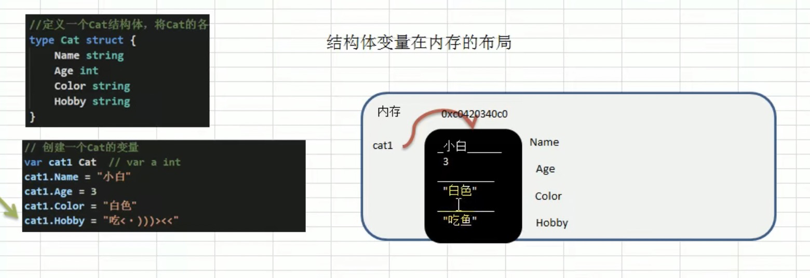

## 结构体

### 面向对象介绍

1. Golang 支持面向对象编程（oop），但是和传统的面向对象有区别，并不是纯粹的面向对象的语言，所以我们说**golang是支持面向对象编程特性**是比较准确的
2. golang 没有类（class），go语言的结构体（struct）和 其他编程语言的（class）有同等地位，可以理解为golang是基于struct来实现OOP特性的
3. golang面向对象非常简洁，去掉了传统的OOP语言的继承，方法重载，构造函数和析构函数，隐藏的this指针等
4. golang仍然有面向对象编程的继承，封装和多态的特性，只是实现的方式和其他OOP语言不一样，比如**继承**:golang中没有extend关键字，继承是通过匿名字段来实现的
5. golang面向对象很优雅，OOP本身就是语言类型系统的一部分，通过接口interface来关联，耦合性低，也非常灵活，在golang中**面向接口编程**是非常重要的特性

### 结构体和结构体变量实例的区别

1. 结构体是自动以数据类型，代表一类事物
2. 结构体变量是具体的，实际的，代表一个具体的事物

### 结构体变量在内存中布局



### 语法声明

```bash
type struct_variable_type struct {
   member definition
   member definition
   ...
   member definition
}

# 一旦定义了结构体类型，它就能用于变量的声明，语法格式如下：

variable_name := structure_variable_type {value1, value2...valuen}
# 或
variable_name := structure_variable_type { key1: value1, key2: value2..., keyn: valuen}
```

### 注意事项

1. 字段声明同变量，示例：字段名 字段类型
2. 字段的类型可以为： 基本类型、数组或者引用类型
3. 在创建一个结构体变量后，如果没有给这个段复制，都会有一个对应的零值（默认值）
   1. 布尔类型是false，数值为0，字符串为“”
   2. 数组类型的默认值和它的内部元素有关，score[3]int 则为[0 ,0, 0]
   3. 指针，slice，和map的零值都是 nil， 即没有分配空间
4. 不同的结构体变量的字段是独立的，互补影响，在简单类型时，若存在引用类型，修改值，也会引起同步修改

```go
package main

import "fmt"

type Person struct {
	// 首字母大写可以被外界访问到
	Name string
	Age int
	Scores [5]float32
	ptr *int
	slice []int
	map1 map[string]string
}

func main() {
	fmt.Println("struct");

	// 定义结构体
	var p1 Person
	fmt.Println("p1",p1)

	if(p1.ptr == nil) {
		fmt.Println("p1.ptr is nil")
	}

	if(p1.slice == nil) {
		fmt.Println("p1.slice is nil")
	}

	if(p1.map1 == nil) {
		fmt.Println("p1.map1 is nil")
	}

	// 使用slice
	p1.slice = make([]int, 3)
	p1.slice[0] = 100;

	// 使用map
	p1.map1 = make(map[string]string, 0)
	p1.map1["key1"] = "value"
	fmt.Println("p1=", p1)

	// 复制，相互独立，但是设计到引用类型的，会修改地址，同步更新
	p2 := p1
	p2.Age = 200
	p2.map1["key1"] = "value2"
	fmt.Println("p1=", p1)
	fmt.Println("p2=" , p2)

}
```

### 创建结构体的实例的方式

```go
package main

import "fmt"

type Person struct {
	Name string
	Age  int
}

func main() {
	fmt.Println("init")

	// 第一种方式
	var p1 Person
	p1.Name = "p1"
	fmt.Println("p1", p1)

	// 第二种方式
	p2 := Person{Name: "p2", Age: 20}
	fmt.Println("p2", p2)

	// 第三种方式
	// p3是结构体指针
	// var p3 *Person = new(Person)
	var p3 *Person = new(Person)
	// 因为p3是一个指针，因此标准的给字段赋值方式
	// (*p3).Name = "aaa" 也可以 p3.Name = "bbb"
	// 原因，因为go的设计者，方便程序员使用方便，底层会对 p3.Name 进行处理， 加上取值运算 (*p3).Name
	(*p3).Name = "aaa"
	p3.Name = "bbb"
	fmt.Println("p3", *p3)

	// 第四种方式，同3
	var p4 *Person = &Person{}
	(*p4).Name = "aaa"
	p4.Name = "bbb"
	fmt.Println("p4", *p4)

}

```

### 使用细节

1. 结构体的所有字段在内存中是连续的
2. 结构体是用户单独定义的类型，和其他类型进行转换时，需要有完全相同的字段（名字，个数和类型）
3. 结构体在进行type时，相当于起别名，golang认为是新的数据类型，但是相互之间可以进行强转

```go
type Person struct {
	Name string `json:"name"`
	Age  int    `json:"age"`
}

	// json 序列化
	jsonStr, err := json.Marshal(p4)
	if err != nil {
		fmt.Println("json err")
	}
	fmt.Println("jsonStr", string(jsonStr))  // jsonStr {"name":"bbb","age":0}
```

## 方法

golang中的方法是作用在指定的数据类型上的（即和指定的数据类型绑定），因此自定义类型，都可以有方法，不仅仅是 struct

```go
package main

import "fmt"

type Person struct {
	Name string
}

// 方法是绑定在自定义的类型上的
func (p Person) eat() {
	fmt.Println("p.name", p.Name)
}
func (p Person) getSun(n1 int, n2 int) int {
	fmt.Println("p.name getSun", p.Name)
	return n1 + n2
}

func main() {
	fmt.Println("method")

	p := Person{"张三"}
	p.eat()
	p.getSun(1, 2)
}

```

### 注意事项

1. 结构体类型是值类型，在方法调用中，遵守值类型的传递机制，是值拷贝传递方式
2. 如果我们希望修改结构体变量的值，通过指针传递
3. ggolang中的方法是作用在指定数据类型上的，不仅仅是struct，int也可以
4. 方法的访问范围控制，和函数一样，方法名首字母小写，本包内访问；首字母大写，可以在本包和其他包内访问
5. 如果一个变量实现了 `String() `方法，那么fmt.println默认会调用这个变量的`String()` 方法

```go
package main

import "fmt"

type integer int

func (i integer) print() {
	fmt.Println("i=", i)
}

func (i *integer) change() {
	*i = *i + 1
}

type Student struct {
	Name string
	Age  int
}

func (student Student) String() string {
	return fmt.Sprintf("guoguo:Name=[%v] Age=[%v]", student.Name, student.Age)
}

func main() {
	fmt.Println("int")

	var i integer = 1
	i.print()
	i.change()
	fmt.Println("i==", i)

	stu := Student{"xiaoming", 12}
	fmt.Println("stu", &stu)
}

```

## 方法和函数的区别

### 相同点

go语⾔，同时有函数和⽅法，⽅法的本质是函数，但是⽅法和函数⼜具有不同点。

### 不同点

1. 含义不同
   1. 函数function是⼀段具有独⽴功能的代码，可以被反复多次调⽤，从⽽实现代码复⽤。⽽⽅法method是⼀个类的⾏为功能，只有该类的对象才能调⽤。
2. ⽅法有接受者，⽽函数⽆接受者
   1. Go语⾔的⽅法method是⼀种作⽤于特定类型变量的函数，这种特定类型变量叫做Receiver（接受者、接收者、接收器）；
   2. 接受者的概念类似于传统⾯向对象语⾔中的this或self关键字；
   3. Go语⾔的接受者强调了⽅法具有作⽤对象，⽽函数没有作⽤对象；
   4. ⼀个⽅法就是⼀个包含了接受者的函数；
   5. Go语⾔中， 接受者的类型可以是任何类型，不仅仅是结构体， 也可以是struct类型外的其他任何类型。
3. 函数不可以重名，⽽⽅法可以重名
   1. 只要接受者不同，则⽅法名可以⼀样。
4. 调用方式不一样
   1. 方法是struct对象通过.点号+名称来调用，而函数是直接使用名称来调用

## 工厂模式

我们可以封装model，因为如果我们直接修改struct的属性，例如public改为private，所有的使用都得变化，所以进行工厂模式封装，如果修改，只修改model即可

```go
// model.go
package utils

type student struct {
	Name string
	age  float64
}

func NewStudent(name string, age float64) *student {
	return &student{
		Name: name,
		age:  age,
	}
}

func (s *student)GetAge() float64{
	return s.age 
}
```

```go
// func.go 
package main

import (
	"fmt"

	"../utils"
)

func main() {
	fmt.Println("model")

	var stu = utils.NewStudent("xiaoming", 12)
	fmt.Println("stu", *stu, "age=", stu.GetAge())

}

```


