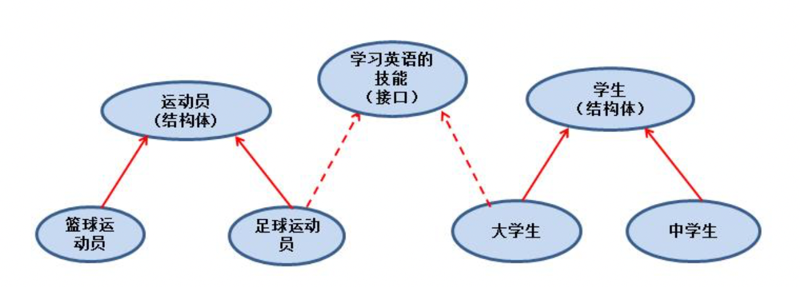

## 封装

封装就是把抽象出来的字段和对字段的操作封装在一起，数据被保护在内部，程序的其它包只要通过被授权的操作（方法），才能对字段进行操作 

### 好处

1. 隐藏实现的细节
2. 可以对数据进行验证，保证安全合理

### 提现

1. 对结构体中的属性进行封装
2. 通过方法，包，实现封装

### 实现

就是实现该结构体的get和set方法，通过GetXXX或者Setxxx去修改内部struct的数据

## 继承

### 引出

1、汽车和挖掘机都是车，2个结构体的方法和字段都一样，复用性不强

2、出现冗余代码，不利于代码维护，不利于功能扩展，【比如车会跑，需要在2个上面都加】

```go
type Goods struct{
	Name string
	Age int
}

type Book struct{
	Goods  // 嵌套的匿名结构体
	Writer string
}
```

```go
package main

import "fmt"

type Animal struct {
	Name string
	Age  int
}

func (animal Animal) eat() {
	fmt.Println(animal.Name, ":eat...")
}

type Dog struct {
	Animal
}

type Cat struct {
	Animal
}

func main() {
	fmt.Println("oop")

	cat := Cat{}
	cat.Name = "cat"
	cat.Animal.Age = 10
	cat.eat()

	dog := Dog{}
	dog.Name = "dog"
	dog.eat()
	dog.Animal.eat()

}

```

### 注意事项

1. 当结构体和匿名结构体中有相同的字段和方法时，编译器会**采用就近访问原则**访问，如果希望访问匿名结构体的字段和方法，可以通过匿名机构体名来区分
2. 结构体中嵌套了2个或者多个匿名结构体，但是匿名结构体中有相同字段，但是结构体本身没有这个字段，需要在访问这个字段的时候，指定匿名结构体的名字
3. 如果结构体中嵌套了一个有名结构体，这种模式就是组合，我们在访问有名结构体时，需要带上结构体的名字
4. 嵌套匿名结构体，可以在创建的时候，直接指定各个匿名结构体的字段的值

```go

type A struct {
	Name string
}

type B struct {
	Name string
}
type C struct {
	A
	B
}
// 组合
type D struct {
	a A
	B
}

func main() {
  	c := C{}
    c.A.Name = "cc"
    d := D{}
    d.a.Name = "dd"
}
```

  如果结构体中有几本数据类型

```go
type E struct {
	Name string
	int
}

func main() {
  e := E{"张三", 100}
	fmt.Println("e=", e)
}	
```

### 多重继承

一个 struct 嵌套了多个匿名结构体，那么该结构体可以直接访问匿名结构体的字段和方法，从而实现多重继承

#### 细节说明

1、嵌入的结构体有相同的字段名或者方法名，则在访问时，需要通过匿名结构体类型名区分

2、为了保证代码的简洁性，建议大家**尽量不使用多重继承**

```go
type A struct {
	Name string
}

type B struct {
	Name string
}
type C struct {
	A
	B
}
type G struct {
	c    C
	name string
}

func main() {
  	g := G{}
    g.name = "g-name"
    g.c.A.Name = "gca-name"
    fmt.Println("g=", g)
 
}

// 多重继承实例化
g2 := G{Name: "name", C: C{A: A{Name: "aa"}, B: B{Name: "bb"}}}
fmt.Println("g2=", g2.C.A.Name)
```


## 接口interface

Go 语言提供了另外一种数据类型即接口，**它把所有的具有共性的方法定义在一起，任何其他类型只要实现了这些方法就是实现了这个接口。**

接口可以让我们将不同的类型绑定到一组公共的方法上，从而实现多态和灵活的设计。

Go 语言中的接口是隐式实现的，也就是说，**如果一个类型实现了一个接口定义的所有方法，那么它就自动地实现了该接口**。因此，我们可以通过将接口作为参数来实现对不同类型的调用，从而实现多态。

```go
/* 定义接口 */
type interface_name interface {
   method_name1 [return_type]
   method_name2 [return_type]
   method_name3 [return_type]
   ...
   method_namen [return_type]
}

/* 定义结构体 */
type struct_name struct {
   /* variables */
}

/* 实现接口方法 */
func (struct_name_variable struct_name) method_name1() [return_type] {
   /* 方法实现 */
}
...
func (struct_name_variable struct_name) method_namen() [return_type] {
   /* 方法实现*/
}
```

Test:

```go
package main

import "fmt"

type Usb interface {
	start()
	stop()
}
type Phone struct{}

func (p Phone) start() {
	fmt.Println("phone start...")
}
func (p Phone) stop() {
	fmt.Println("phone stop...")
}

type Camera struct{}

func (c Camera) start() {
	fmt.Println("camrea start...")
}
func (c Camera) stop() {
	fmt.Println("camrea stop...")
}

type Computer struct{}

func (c Computer) Working(usb Usb) {
	usb.start()
	usb.stop()
}

func main() {
	fmt.Println("interface")
	computer := Computer{}
	phone := Phone{}
	camera := Camera{}

	computer.Working(phone)
	computer.Working(camera)
}

```

### 小结说明：

1、接口的所有方法都没有方法体，即接口是规范，没有方法的实现，接口体现了程序设计的多态和高内聚低耦合的思想

2、golang中的接口不需要显式的声明，只要一个变量，含有接口类型中的**所有方法**，那么这个变量就实现了这个接口，因此，golang中没有implement这样的关键字

### 注意事项

1、接口本身不能创建实例，但是可以指向一个实现了该接口的自定义类型的变量

```go
type Usb interface {
	start()
	stop()
}
type Phone struct{}

func (p Phone) start() {
	fmt.Println("phone start...")
}
func (p Phone) stop() {
	fmt.Println("phone stop...")
}	

func main() {
  	var b Usb = phone
		b.start()
}
```

2、接口中所有的方法都没有方法体，没有方法的实现

3、golang中，一个自定义的类型需要将某个接口的所有的方法都实现，我们就说这个类型实现了这个接口

4、一个自定义类型实现了某个解耦，才能将这个自定义类型的实例（变量）赋给接口类型

5、只要是自定义类型，就可实现接口，不仅仅是结构体类型

6、一个自定义类型可以实现多个接口

7、接口中不能有任何变量

8、一个接口可以继承多个接口，但是如果要实现这个接口，需要把所有的方法都实现

```go
type A interface {
	A()
}
type B interface {
	B()
}
type C interface {
	A
	B
	C()
}
```

9、interface是一个指针类型，如果没有对interface进行初始化，就是nil

10、空接口 `interface{}` 没有任何方法，所以所有类型都实现空接口，我们可以任何一个变量赋值给空接口

### 最佳实践

实现对结构体切片的排序

```go
package main

import (
	"fmt"
	"sort"
)

type Person struct {
	Name string
	Age  int
}

func (p Person) String() string {
	return fmt.Sprintf("%s: %d", p.Name, p.Age)
}

type ByAge []Person

func (a ByAge) Len() int {
	return len(a)
}
func (a ByAge) Swap(i, j int) {
	a[i], a[j] = a[j], a[i]
}
func (a ByAge) Less(i, j int) bool {
	return a[i].Age < a[j].Age
}
func main() {
	people := []Person{
		{"Bob", 31},
		{"John", 42},
		{"Michael", 17},
		{"Jenny", 26},
	}
	fmt.Println(people)
	sort.Sort(ByAge(people))
	fmt.Println(people)
	// Output:
	// [Bob: 31 John: 42 Michael: 17 Jenny: 26]
	// [Michael: 17 Jenny: 26 Bob: 31 John: 42]
}

```


## 接口vs继承

```go
package main

import "fmt"

// 结构体
type Monkey struct {
	Name string
}

// interface
type BridAble interface {
	Flying()
}
type FishAble interface {
	Swimming()
}

func (this *Monkey) climbing() {
	fmt.Println(this.Name, "生来会爬树~")
}

func (this *LittleMonkey) Flying() {
	fmt.Println(this.Name, "通过学习，会飞~")
}

func (this *LittleMonkey) Swimming() {
	fmt.Println(this.Name, "通过学习，会游泳~")
}

// 继承猴子的小猴子
type LittleMonkey struct {
	Monkey
}

func main() {
	fmt.Println("inter-vs-extend")

	littleMonkey := LittleMonkey{
		Monkey: Monkey{
			Name: "悟空",
		},
	}
	littleMonkey.climbing()
  
  // 通过小猴子实现了接口，对老猴子没有影响
	littleMonkey.Flying()
	littleMonkey.Swimming()
}

```

### 小结



1、当A结构体继承了B结构体，那么A结构体就自动的继承了B结构体的字段和方法，并且可以直接进行使用

2、当A结构体需要扩展功能，同时不希望去破坏继承关系，则可以去实现某个接口，因为我们可以认为，实现接口是对继承机制的一个补充

3、接口和继承解决的问题是不同的

​	1）继承的价值主要在于：**解决代码的复用性和可维护性**

​	2）接口的价值主要在于：**设计，**设计好各种**规范**（方法），让其自定义类型去实现这些方法

4、接口比继承更加灵活 Person  Student  BridAble

​	接口比继承更加灵活，继承是满足 is - a 的关系，而接口只需要满足 like - a 的关系

5、接口在一定程度上实现了**代码的解耦**

## 多态

### 基本介绍

变量(实例)具有多种形态 ，在go语言中，多态特征是通过接口来实现的，可以按照统一的接口来调用不同的实现，这时候接口变量就呈现不同的形体

### 快速入门

在前面的Usb的接口案例中，Usb usb ，既可以接受手机变量，又可以接收相机变量，就体现了USB接口的多态特性，

就是通过接口在实现统一的标准规范，然后传入不同的结构体，从而实现多态


