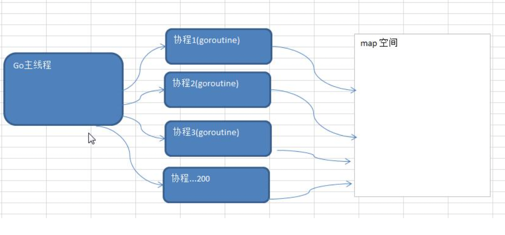
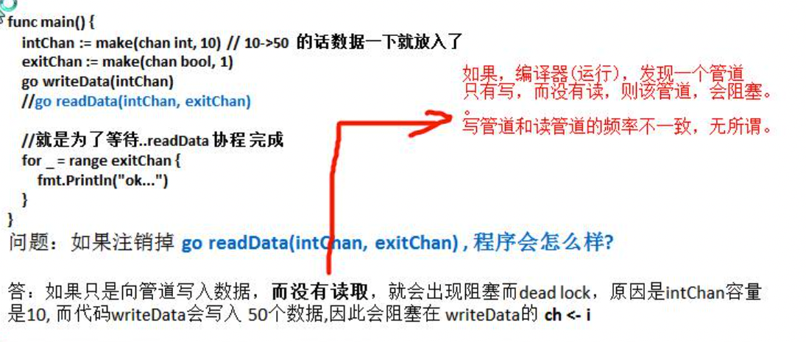

## goroutine

### 进程和线程介绍


### 并发和并行

1) 多线程程序在单核上运行，就是并发 
2) 多线程程序在多核上运行，就是并行


### go协程和go主线程

Go 主线程(有程序员直接称为线程/也可以理解成进程): 一个 Go 线程上，可以起多个协程，你可以

这样理解，协程是轻量级的线程[编译器做优化]。

#### Go协程的特点

1) 有独立的栈空间

2) 共享程序堆空间

3) 调度由用户控制

4) 协程是轻量级的线程


### goroutine-快速入门

```go
package main

import (
	"fmt"
	"strconv"
	"time"
)

/**
1) 在主线程(可以理解成进程)中，开启一个 goroutine, 该协程每隔 1 秒输出 "hello,world"
2) 在主线程中也每隔一秒输出"hello,golang", 输出 10 次后，退出程序
3) 要求主线程和 goroutine 同时执行.
*/


func test() {
	for i := 0; i < 10; i++ {
		fmt.Println("test() hello world" + strconv.Itoa(i))
		time.Sleep(time.Second)
	}
}

func main() {
	fmt.Println("goroutine")
	go test()

	for i := 0; i < 10; i++ {
		fmt.Println("main() hello world" + strconv.Itoa(i))
		time.Sleep(time.Second)
	}
}
```

#### 主线程和协程执行流程图


#### 小结

1) 主线程是一个物理线程，直接作用在 cpu 上的。是重量级的，非常耗费 cpu 资源。
2) 协程从主线程开启的，是轻量级的线程，是逻辑态。对资源消耗相对小。
3) Golang的协程机制是重要的特点，可以轻松的开启上万个协程。其它编程语言的并发机制是一般基于线程的，开启过多的线程，资源耗费大，这里就突显 Golang 在并发上的优势了

### goroutine 的调度模型

#### MPG 模式基本介绍


#### MPG 模式运行的状态 1


#### MPG 模式运行的状态 2


### 设置 Golang 运行的 cpu 数

```go
	// 获取当前的cpu数量
	num := runtime.NumCPU()
	// 设置CPU的数量
	runtime.GOMAXPROCS(num - 1)
	fmt.Println("num", num)
```

#### 小结

1. go1.8后，默认让程序运行在多核上，不用进行设置
2. Go1.8前，还是要设置一下，更高效的利用cpu

## channel(管道)

### 小需求

计算1-200的各个数的阶乘，并且把各个数的阶乘放入到 map 中。最后显示出来。16.6 channel(管道)-看个需求 要求使用 goroutine 完成

#### 分析

1. 使用 goroutine 来完成，效率高，但是会出现并发/并行安全问题.
2. 这里就提出了不同 goroutine 如何通信的问题

#### 代码实现

1. 使用 goroutine 来完成(看看使用 gorotine 并发完成会出现什么问题? 然后我们会去解决)
2. 在运行某个程序时，如何知道是否存在资源竞争问题。 方法很简单，在编译该程序时，-race 即可

```go
package main

import (
	"fmt"
	"time"
)

var (
	myMap = make(map[int]int, 10)
)

func test(n int) {
	res := 1
	for i := 1; i <= n; i++ {
		res *= i
	}
	//这里我们将 res 放入到 myMap
	myMap[n] = res //concurrent map writes?
}
func main() {
	fmt.Println("factorial")

	for i := 1; i <= 200; i++ {
		go test(i)
	}

	//休眠 10 秒钟【第二个问题 】
	time.Sleep(time.Second * 10)

	//这里我们输出结果,变量这个结果
	for i, v := range myMap {
		fmt.Printf("map[%d]=%d\n", i, v)
	}

}

```

#### 示意图:



## 不同 goroutine 之间如何通讯?

1. 全局变量的互斥锁
2. 使用管道 channel 来解决

### 全局变量的互斥锁

#### 分析

1. 因为没有对全局变量 m 加锁，因此会出现资源争夺问题，代码会出现错误，提示 concurrent map writes

#### 解决

加入互斥锁

#### 代码改进

```go
package main

import (
	"fmt"
	"sync"
	"time"
)
// 我们的数的阶乘很大，结果会越界,可以将求阶乘改成 sum += uint64(i)
var (
	myMap = make(map[int]int, 10)

	lock sync.Mutex
)

func test(n int) {
	
	res := 1
	for i := 1; i <= n; i++ {
		res *= i
	}
	lock.Lock()
	//这里我们将 res 放入到 myMap
	myMap[n] = res //concurrent map writes?
	lock.Unlock()
}
func main() {
	fmt.Println("factorial")

	for i := 1; i <= 200; i++ {	
		go test(i)
	}

	//休眠 10 秒钟【第二个问题 】
	time.Sleep(time.Second * 10)

	//这里我们输出结果,变量这个结果
	lock.Lock()
	for i, v := range myMap {
		fmt.Printf("map[%d]=%d\n", i, v)
	}
	lock.Unlock()

}

```

### 管道 channel 

#### 为什么需要

1. 前面使用全局变量加锁同步来解决 goroutine 的通讯，但不完美

2. 主线程在等待所有 goroutine 全部完成的时间很难确定，我们这里设置 10 秒，仅仅是估算。

3. 如果主线程休眠时间长了，会加长等待时间，如果等待时间短了，可能还有 goroutine 处于工作

   状态，这时也会随主线程的退出而销毁

4. 通过全局变量加锁同步来实现通讯，也并不利用多个协程对全局变量的读写操作。

5. 上面种种分析都在呼唤一个新的通讯机制-channel

#### 基本介绍

1. channle本质就是一个数据结构-队列
2. 数据是先进先出【FIFO : first in first out】
3. 线程安全，多 goroutine 访问时，不需要加锁，就是说 channel 本身就是线程安全的
4. channel有类型的，一个string的channel只能存放string类型数据。

#### 示意图


#### 定义/声明

```go
var 变量名 chan 数据类型
```

```go
var intChan chan int (intChan 用于存放 int 数据)
var mapChan chan map[int]string (mapChan 用于存放 map[int]string 类型) 
var perChan chan Person
var perChan2 chan *Person
```

#### 说明

```bash
1、channel 是引用类型
2、channel 必须初始化才能写入数据, 即 make 后才能使用 
3、管道是有类型的，intChan 只能写入 整数 int
```

#### 管道初始化

```go
package main

import "fmt"

func main() {
	//演示一下管道的使用
	//1. 创建一个可以存放 3 个 int 类型的管道
	var intChan chan int
	intChan = make(chan int, 3)
	//2. 看看 intChan 是什么
	fmt.Printf("intChan 的值=%v intChan 本身的地址=%p\n", intChan, &intChan)
	//3. 向管道写入数据
	intChan <- 10
	num := 211
	intChan <- num
	intChan <- 50
	// intChan<- 98//注意点, 当我们给管写入数据时，不能超过其容量
	//4. 看看管道的长度和 cap(容量)
	fmt.Printf("channel len= %v cap=%v \n", len(intChan), cap(intChan)) // 3, 3
	//5. 从管道中读取数据
	var num2 int
	num2 = <-intChan
	fmt.Println("num2=", num2)
	fmt.Printf("channel len= %v cap=%v \n", len(intChan), cap(intChan)) // 2, 3
	// 6. 在没有使用协程的情况下，如果我们的管道数据已经全部取出，再取就会报告 deadlock
	num3 := <-intChan
	num4 := <-intChan
	num5 := <-intChan
	fmt.Println("num3=", num3, "num4=", num4, "num5=", num5)
}

```

#### 注意事项

1.  channel中只能存放指定的数据类型
2. channle的数据放满后，就不能再放入了
3. 如果从 channel 取出数据后，可以继续放入
4. 在没有使用协程的情况下，如果 channel 数据取完了，再取，就会报 dead lock

#### 读写案例

```go
package main

import "fmt"

func main() {
	fmt.Println("chan")

	var intchan chan int
	intchan = make(chan int, 3)

	intchan <- 10
	intchan <- 20
	intchan <- 30

	num1 := <-intchan
	num2 := <-intchan
	num3 := <-intchan
	fmt.Println(num1, num2, num3, intchan)
}

```

```go
package main

import "fmt"

type Cat struct {
	Name string
}

func main() {
	fmt.Println("chan")

	var allchan chan interface{}
	allchan = make(chan interface{}, 3)

	cat1 := Cat{
		"tom",
	}
	cat2 := Cat{
		"tom2",
	}

	allchan <- cat1
	allchan <- cat2
	allchan <- 30

	cat11 := <-allchan
	cat22 := <-allchan
	num3 := <-allchan

	// 使用类型断言
	fmt.Println(cat11.(Cat).Name, cat22, num3, allchan)
}

```

#### 遍历和关闭

##### 关闭

使用内置函数 close 可以关闭 channel, 当 channel 关闭后，就不能再向 channel 写数据了，但是仍然 可以从该 channel 读取数据

```go
package main

import "fmt"

type Cat struct {
	Name string
}

func main() {
	fmt.Println("chan")

	var allchan chan interface{}
	allchan = make(chan interface{}, 3)

	cat1 := Cat{
		"tom",
	}
	cat2 := Cat{
		"tom2",
	}

	allchan <- cat1
	allchan <- cat2
	// 关闭之后，不能再写入数据到chan
	close(allchan)
	// allchan <- 30


	// 但是可以继续读取数据
	cat11 := <-allchan
	cat22 := <-allchan
	num3 := <-allchan

	// 使用类型断言
	fmt.Println(cat11.(Cat).Name, cat22, num3, allchan)
}

```

##### 遍历

channel 支持 for--range 的方式进行遍历，请注意两个细节

1. 在遍历时，如果 channel 没有关闭，则回出现 deadlock 的错误
2. 在遍历时，如果 channel 已经关闭，则会正常遍历数据，遍历完后，就会退出遍历。

```go
package main

import "fmt"

func main() {
	fmt.Println("chan")

	var intchan chan int
	intchan = make(chan int, 3)

	intchan <- 10
	intchan <- 20
	intchan <- 30

	num1 := <-intchan
	num2 := <-intchan
	// num3 := <-intchan

	// 1、不能使用普通的for循环
	// 2、在遍历时，如果 channel 没有关闭，则回出现 deadlock 的错误
	// 3、在遍历时，如果 channel 已经关闭，则会正常遍历数据，遍历完后，就会退出遍历。
	close(intchan)
	for v := range intchan {
		fmt.Println("v", v)
	}
	fmt.Println(num1, num2, intchan)
}

```

#### 应用案例

##### 一边读一边写


思路分析:


```go
package main

import (
	"fmt"
)

func writeData(intChan chan int) {
	for i := 0; i < 50; i++ {
		intChan <- i
		fmt.Println("write", i)
	}
	close(intChan)
}

func readData(intChan chan int, exitChan chan bool) {
	for {
		v, ok := <-intChan
		if !ok {
			break
		}
		fmt.Println("read", v)
	}
	exitChan <- true
	close(exitChan)
}

func main() {
	fmt.Println("边读边写")

	intChan := make(chan int, 50)
	exitChan := make(chan bool, 1)
	close(intChan)
	go writeData(intChan)
	go readData(intChan, exitChan)

	for {
		_, ok := <-exitChan
		fmt.Println(ok)
		if !ok {
			break
		}
	}
}

```

##### 堵塞




##### 素数

要求统计 1-200000 的数字中，哪些是素数?这个问题在本章开篇就提出了，现在我们有 goroutine和 channel 的知识后，就可以完成了 [测试数据: 80000]

思路：

传统的方法，就是使用一个循环，循环的判断各个数是不是素数【ok】。 使用并发/并行的方式，将统计素数的任务分配给多个(4 个)goroutine 去完成，完成任务时间短。


#### 使用细节和注意事项

1. channel可以声明为只读，或者只写性质

   

2. 使用 select 可以解决从管道取数据的阻塞问题

   ```go
   package main
   
   import (
   	"fmt"
   	"time"
   )
   
   func main() {
   	fmt.Println("select deal lock")
   
   	//使用 select 可以解决从管道取数据的阻塞问题
   	//1.定义一个管道 10 个数据 int
   	intChan := make(chan int, 10)
   	for i := 0; i < 10; i++ {
   		intChan <- i
   	}
   	// 2.定义一个管道 5 个数据 string
   	stringChan := make(chan string, 5)
   
   	for i := 0; i < 5; i++ {
   		stringChan <- "hello" + fmt.Sprintf("%d", i)
   	}
   	//传统的方法在遍历管道时，如果不关闭会阻塞而导致 deadlock
   	//问题，在实际开发中，可能我们不好确定什么关闭该管道. //可以使用 select 方式可以解决
   	//label:
   	for {
   		select {
   		//注意: 这里，如果 intChan 一直没有关闭，不会一直阻塞而 deadlock
   		//，会自动到下一个 case 匹配
   		case v := <-intChan:
   			fmt.Printf("从 intChan 读取的数据%d\n", v)
   			time.Sleep(time.Second)
   		case v := <-stringChan:
   			fmt.Printf("从 stringChan 读取的数据%s\n", v)
   			time.Sleep(time.Second)
   		default:
   		}
   	}
   }
   
   ```

3. goroutine中使用recover，解决协程中出现panic，导致程序崩溃问题

   

```go
package main

import (
	"fmt"
	"time"
)

// 函数
func sayHello() {
	for i := 0; i < 10; i++ {
		time.Sleep(time.Second)
		fmt.Println("hello,world")
	}
}

// 函数
func test() {
	// 这里我们可以使用 defer + recover
	defer func() {
		// 捕获 test 抛出的 panic
		if err := recover(); err != nil {
			fmt.Println("test() 发生错误", err)
		}
	}()
	// 定义了一个 map
	var myMap map[int]string
	myMap[0] = "golang" //error
}

func main() {
	fmt.Println("recover")

	go sayHello()
	go test()
	for i := 0; i < 10; i++ {
		fmt.Println("main() ok=", i)
		time.Sleep(time.Second)
	}
}
```


