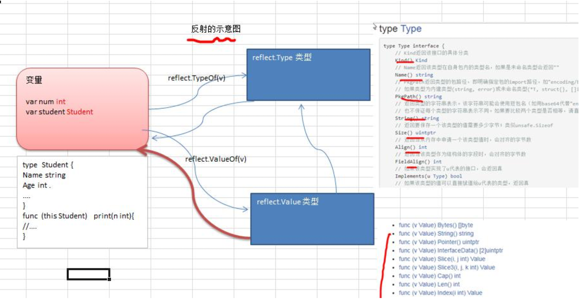
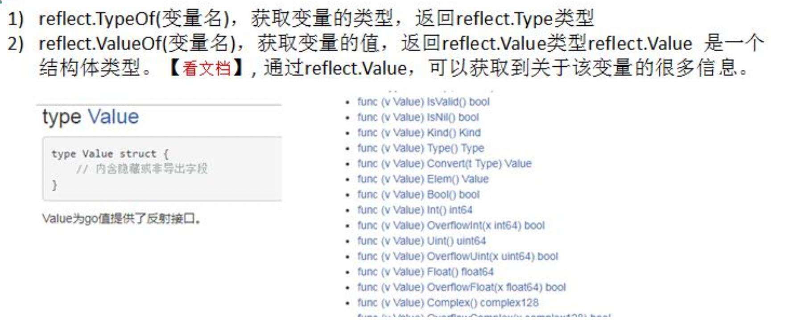
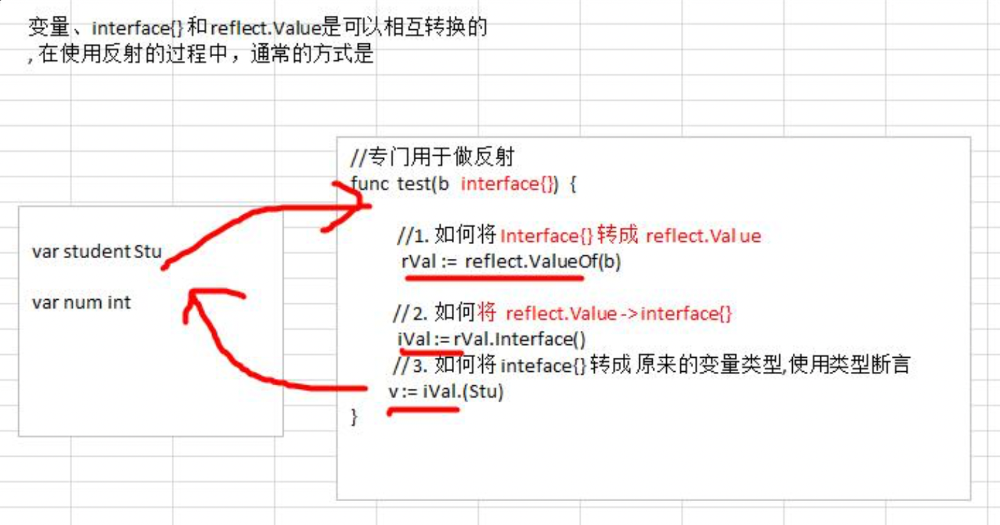
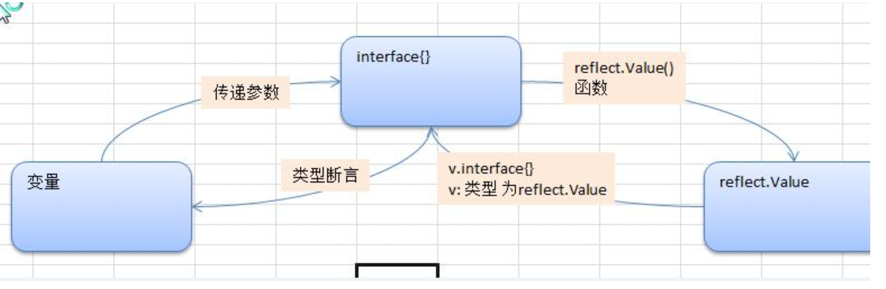
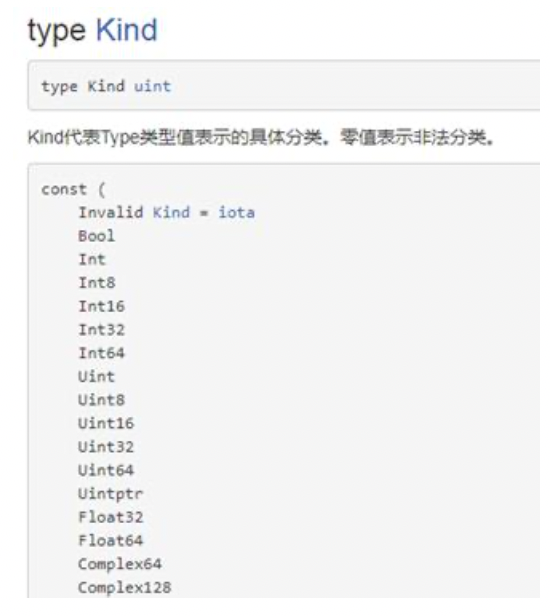
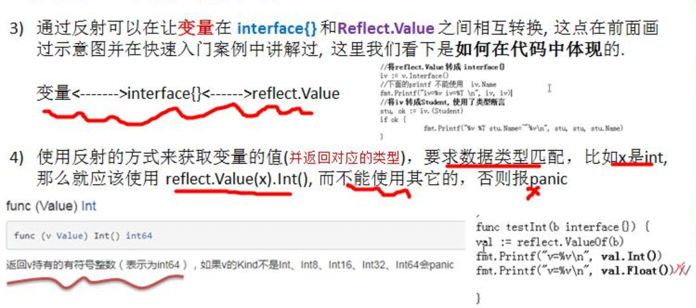

## 基本介绍

1. 反射可以在运行时动态获取变量的各种信息, 比如变量的类型(type)，类别(kind)
2. 如果是结构体变量，还可以获取到结构体本身的信息(包括结构体的字段、方法)
3. 通过反射，可以修改变量的值，可以调用关联的方法。
4. 使用反射，需要 import (“**reflect**”)



## 重要函数和概念



3、变量、interface{} 和 reflect.Value 是可以相互转换的，这点在实际开发中，会经常使用到。画 出示意图





## 快速入门

```go
package main

import (
	"fmt"
	"reflect"
)

// 专门演示反射
func reflectTest01(b interface{}) {
	//通过反射获取的传入的变量的 type , kind, 值

	// 1. 先获取到 reflect.Type
	rTyp := reflect.TypeOf(b)
	fmt.Println("rType=", rTyp)
	// 2. 获取到 reflect.Value
	rVal := reflect.ValueOf(b)
	n2 := 2 + rVal.Int()
	fmt.Println("n2=", n2)
	fmt.Printf("rVal=%v rVal type=%T\n", rVal, rVal)
	// 下面我们将 rVal 转成 interface{}
	iV := rVal.Interface()
	// 将 interface{} 通过断言转成需要的类型
	num2 := iV.(int)
	fmt.Println("num2=", num2)
}

// 专门演示反射[对结构体的反射]
func reflectTest02(b interface{}) {
	// 通过反射获取的传入的变量的 type , kind, 值
	//1. 先获取到 reflect.Type
	rTyp := reflect.TypeOf(b)
	fmt.Println("rType=", rTyp)
	//2. 获取到 reflect.Value
	rVal := reflect.ValueOf(b)
	fmt.Println("rval", rVal)
	// 下面我们将 rVal 转成 interface{}
	iV := rVal.Interface()
	fmt.Printf("iv=%v iv type=%T \n", iV, iV)
	//将 interface{} 通过断言转成需要的类型
	//这里，我们就简单使用了一带检测的类型断言.
	//同学们可以使用 swtich 的断言形式来做的更加的灵活
	stu, ok := iV.(Student)
	if ok {
		fmt.Printf("stu.Name=%v\n", stu.Name)
	}
}

type Student struct {
	Name string
	Age  int
}

func main() {
	fmt.Println("reflect")

	//请编写一个案例，
	//演示对(基本数据类型、interface{}、reflect.Value)进行反射的基本操作
	//1. 先定义一个 int
	var num int = 100
	reflectTest01(num)

	// 2. 定义一个 Student 的实例
	stu := Student{
		Name: "tom",
		Age:  20,
	}
	reflectTest02(stu)
}

```

## 注意事项和细节

1. reflect.Value.Kind，获取变量的类别，返回的是一个常量

   		 	

2. Type 和 Kind 的区别

   1. Type 是类型,
   2.  Kind 是类别， 
   3. Type 和 Kind 可能是相同的，也可能是不同的**.**
   4. 比如:  var num int = 10 num的Type是int , Kind也是int
   5. 比如:  var stu Student stu 的 Type 是 pkg1.Student , Kind 是 struct



5、通过反射的来修改变量, 注意当使用 SetXxx 方法来设置需要通过对应的指针类型来完成, 这样才能改变传入的变量的值, 同时需要使用到 reflect.Value.Elem()方法

```go
func main() {
	fmt.Println("reflect change val")

	var num = 100;
	fn := reflect.ValueOf(&num)
	fmt.Println("fn", fn)
	fn.Elem().SetInt(200)
	fmt.Println("num=", num)
}
```


