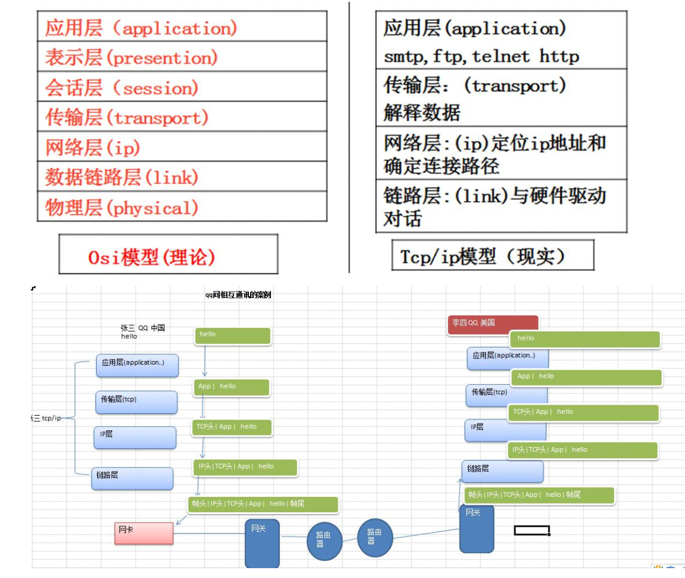
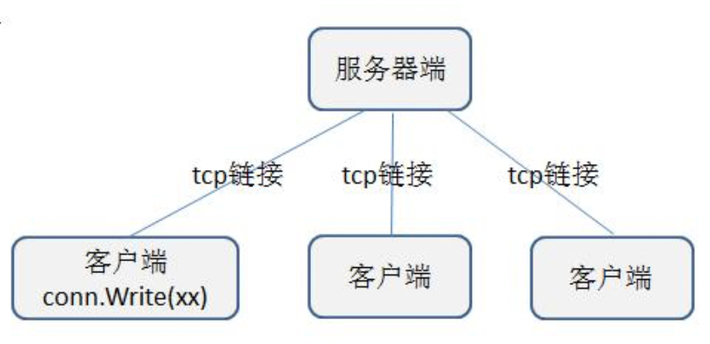

## 基本介绍

1. TCPsocket编程，是网络编程的主流。之所以叫Tcpsocket编程，是因为底层是基于Tcp/ip协议的. 比如: QQ 聊天 
2. b/s结构的http编程，我们使用浏览器去访问服务器时，使用的就是http协议，而http底层依旧是用 tcp socket 实现的

## 协议(tcp/ip)

TCP/IP(Transmission Control Protocol/Internet Protocol)的简写,中文译名为传输控制协议/因特网互 联协议，又叫网络通讯协议，这个协议是 Internet 最基本的协议、Internet 国际互联网络的基础，简单 地说，就是由网络层的 IP 协议和传输层的 TCP 协议组成的。

## OSI 与 Tcp/ip 参考模型



## ip 地址

概述:每个internet上的主机和路由器都有一个ip地址，它包括网络号和主机号，ip地址有ipv4(32

位)或者 ipv6(128 位). 可以通过 **ipconfig** 来查看

## tcp socket 编程的客户端和服务器端



```go
// client.go
package main

import (
	"bufio"
	"fmt"
	"net"
	"os"
	"strings"
)

func main() {
	fmt.Println("client")

	conn, err := net.Dial("tcp", "10.250.33.92:8888")
	if err != nil {
		fmt.Println("client dial err=", err)
		return
	}
	//功能一:客户端可以发送单行数据，然后就退出
	reader := bufio.NewReader(os.Stdin) //os.Stdin 代表标准输入[终端]

	// 循环输入
	for {
		// 从终端读取一行用户输入，并准备发送给服务器
		line, err := reader.ReadString('\n')
		if err != nil {
			fmt.Println("readString err=", err)
		}

		// 如果用户输入 exit 就退出
		line = strings.Trim(line, " \r\n")
		if line == "exit" {
			fmt.Println("客户端退出")
			break
		}

		// 再将 line 发送给 服务器

		_, err = conn.Write([]byte(line + "\n"))
		if err != nil {
			fmt.Println("conn.Write err=", err)
		}
		// fmt.Printf("客户端发送了 %d 字节的数据，并退出", n)
	}

}

```

```go
// server.go
package main

import (
	"fmt"
	"net"
)

func process(conn net.Conn) {
	//这里我们循环的接收客户端发送的数据
	defer conn.Close() //关闭 conn
	for {
		//创建一个新的切片
		buf := make([]byte, 1024)
		//conn.Read(buf)
		//1. 等待客户端通过 conn 发送信息
		//2. 如果客户端没有 wrtie[发送]，那么协程就阻塞在这里
		fmt.Printf("服务器在等待客户端%s 发送信息\n", conn.RemoteAddr().String())
		n, err := conn.Read(buf) //从 conn 读取
		if err != nil {
			fmt.Printf("客户端退出 err=%v", err)
			return //!!!
		}
		//3. 显示客户端发送的内容到服务器的终端
		fmt.Print(string(buf[:n]))
	}
}

func main() {
	fmt.Println("server")

	fmt.Println("服务器开始监听....")
	//net.Listen("tcp", "0.0.0.0:8888")
	//1. tcp 表示使用网络协议是 tcp
	//2. 0.0.0.0:8888 表示在本地监听 8888 端口
	listen, err := net.Listen("tcp", "0.0.0.0:8888")
	if err != nil {
		fmt.Println("listen err=", err)
		return
	}
	defer listen.Close() //延时关闭 listen

	//循环等待客户端来链接我
	for {
		//等待客户端链接
		fmt.Println("等待客户端来链接....")
		conn, err := listen.Accept()
		if err != nil {
			fmt.Println("Accept() err=", err)

		} else {
			fmt.Printf("Accept() suc con=%v 客户端 ip=%v\n", conn, conn.RemoteAddr().String())
		} //这里准备其一个协程，为客户端服

		go process(conn)
	}
	//fmt.Printf("listen suc=%v\n", listen)
}

```


