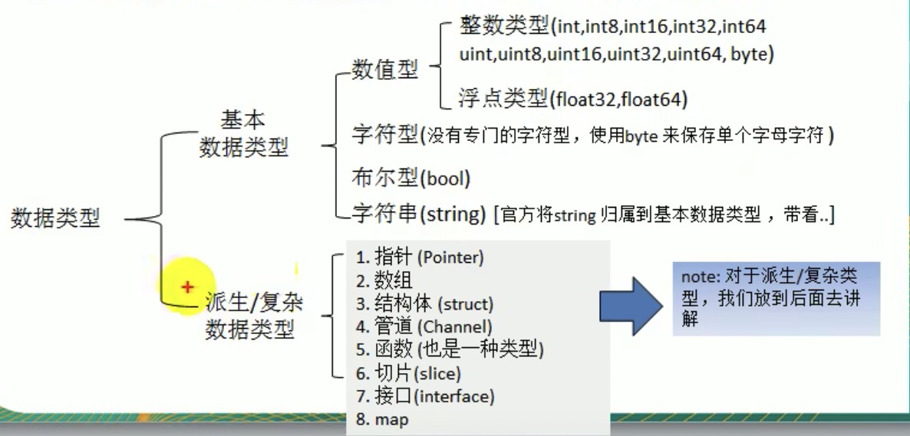
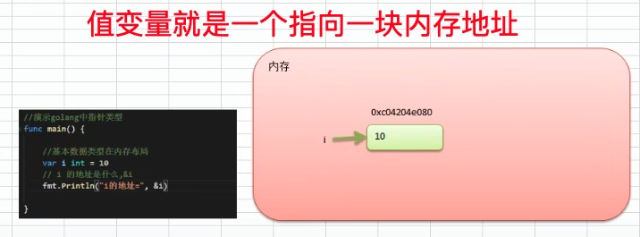
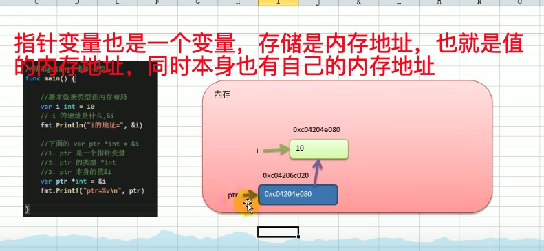
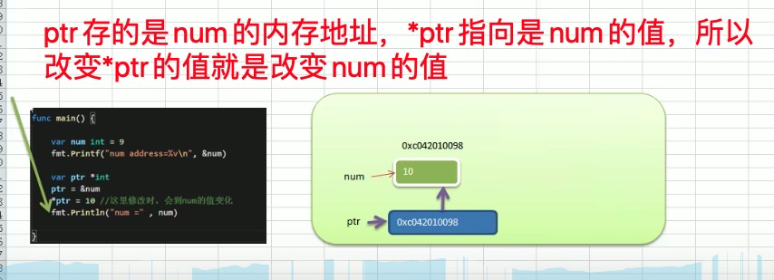
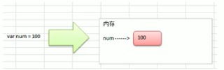
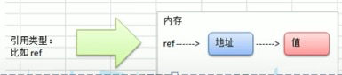
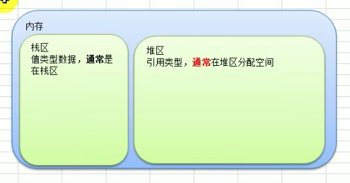
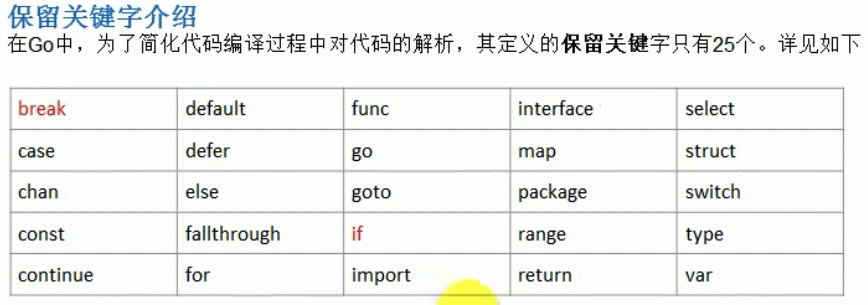
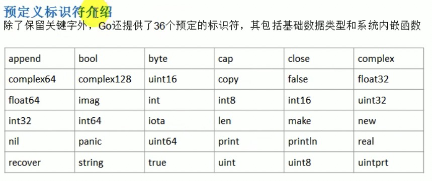

## 1、转义字符

```bash
1、\t，表示一个制表符，通常使用它可以排版；
2、\n，表示换行符；
3、\\，表示一个\符号；
4、\"一个双引号"
5、\r，表示一个回车。但是只能替换当前长度的字符
fmt.Println("雪山飞狐\r李四")    // 李四飞狐
```

## 2、注释

```go
func main()  {
  // 单行注释
	fmt.Println("hello world")
 
	/*
		多行注释/块注释
	*/
	fmt.Println("雪山飞狐\r李四")
}
```

## 3、变量声明

1、变量 = 变量名+值+数据类型

2、在同一个作用域中，变量不允许重名

3、变量的数据只可以在同一个类型范围内不断变化

4、变量如果没有赋予初始值，编译器会使用默认值，eg：int=0，string=空串

```go
package main

import "fmt"

// var global1 = 100
// var global2 = "jack"

var (
	global1 = 100
	global2 = "jack"
)


func main()  {
	// 1 先类型定义，再类型赋值
	var num int
	num = 10
	fmt.Println(num);

	// 2  自行类型推导
	var age = 10
	fmt.Println(age)

	// 3  省略var ，相当于 var name string;  name="tom"
	name := "tom";
	fmt.Println(name)

	// 4  一次性声明多个变量[变量类型一样]
	var n1, n2,n3 int
	fmt.Println(n1,n2,n3)

	// 5  一次性声明多个变量,类型推导[变量类型不一样]
	var m1, m2, m3 = 100, "tom" , 888
	fmt.Println(m1,m2,m3)

	// 6  一次性声明多个变量,类型推导，省略var[变量类型不一样]
	b1, b2, b3 := 100, "to m" , 888
	fmt.Println(b1,b2,b3)

	// 7  全局变量声明
	fmt.Println(global1, global2)
}
```

## 4、数据类型



### 浮点型

complex64 |  complex128

### 其他数字类型

byte  |  rune  | uint  | int  | uintptr

### 有符号和无符号的区别

int8就是用8个比特位来保存整数，第一位用来表示符号，索引int8的整数范围是-127到127；

uint8表示无符号整数，没有符号位，8个比特位全部用来表示整数，所以数据范围是0到255。

### 字符类型的本质讨论

1. 字符型 存储到 计算机， 需要将字符对应的码值（整数）找出来
   1. 存储： 字符-》对应的码值-》二进制-》存储
   2. 读取：二进制-》码值-》字符-》读取
2. 字符和码值的对应关系是通过字符码表来决定的
3. go语言的编码都统一成了utf-8啦，所以不会再有编码乱码的问题

### 代码示例

```go
package main

import (
	"fmt"
	"unsafe"
)

func main() {
	fmt.Println("hello")

	/******************* 整数类型, 默认是int ****************/

	// 有符号整数
	// int8范围 -128 ~ 127 【第一位是0|1表示符号，+0和-0，就把-0给了-128】
	// int16,int32,int64 以此类推
	var i int8 = -128
	fmt.Println("i=", i)

	// 无符号整数
	// uint8 0 ~ 255
	// uint16, uint32,uint64,以此类推
	var k uint8 = 0
	fmt.Println("k=", k)

	// int， uint，rune，byte
	var a int = 9800
	fmt.Println("a=", a)

	// 查看数据类型
	var aa = 100
	fmt.Printf("aa的默认type= %T ", aa)

	// 查看某个变量占用的字节大小
	var bb int64 = 10
	fmt.Printf("bb 的 type %T bb 的字节数是 %d", bb, unsafe.Sizeof(bb))

	/*********************** 浮点类型， 默认float64 ***********************************/
	// 浮点数都是有符号的
	// 浮点数 = 符号位 + 指数位 +尾数位
	// 使用浮点数，有可能会精度丢失，尾数位部分丢失，64位的精度比32位的精度更准确
	var f float32 = 12.12
	fmt.Println("f= ", f)

	var ff float64 = -123123123.12312312
	fmt.Println("ff", ff)

	var fff = 3.1232
	fmt.Printf("fff type = %T", fff)

	f2 := 5.23
	f3 := .123123
	fmt.Println("f2", f2, "f3", f3)
	f4 := 5.12e2  //  5.12 * 10的2次方
	f5 := 5.12e2  //  5.12 * 10的2次方
	f6 := 5.12e-2 //  5.12 / 10的2次方

	fmt.Println(f4, f5, f6)

	/******************* 字符类型 *************************************/
	// 传统的字符串，是通过一串固定的字符连接起来的字符序列，但是go的字符串是由单个字节连接起来的
	var b1 byte = 'a'
	var b2 byte = '0'
	fmt.Println(b1, b2) // 97 48
	fmt.Printf("b1 = %c b2= %c", b1, b2)

	var b3 int = '好'
	fmt.Printf("b3=%c  b3的码值= %d \n", b3, b3)

	var b4 = 10 + 'a'
	fmt.Println("b4=", b4)

	/********************  布尔类型  **************************************/

	var isBool = false
	fmt.Println("isbool=", isBool)
	fmt.Println("bool的占用空间 = ", unsafe.Sizeof(isBool))

	/********************  字符串类型   ************************/
	// 1 字符串一旦被賦值了，字符串就不能再修改啦，但是可以整体赋值
	// 2 字符串可以直接通过双引号进行赋值，也可以通过字符串魔板进行赋值，不会对内容进行转义，会原样输出
	var str string = "北京"
	// str[0] = "123"
	fmt.Println("str = ", str)

	var str2 = `
		package main; "牛逼"
	`
	fmt.Println("str2", str2)

	// 3 字符串拼接
	str3 := str + str2
	str3 += "hah"
	fmt.Println("str3=", str3)

	// 4 当一个拼接操作很长的时候，我们可以分行写，但是要注意，需要将操作符，留在上一行，表示这个语句还没有结束

	str4 := "hello" + "word" + "word" + "word" +
		"word" + "word" + "word" + "word" +
		"word" + "word"
	fmt.Println("str4=", str4)

}

```

### 基本数据类型的默认值

| 数据类型 | 默认值 |
| -------- | ------ |
| 整型     | 0      |
| 浮点型   | 0      |
| 字符串   | ”“     |
| 布尔类型 | false  |

## 5、类型转换

go在不同类型之间赋值需要显示进行显示转换，也就是golang中的数据类型，不能进行自动转换

### 基本语法

表达式T(v), 将v类型的转换为T类型，变量本身的数据类型并不会发生变化

示例：

```go
package main

import "fmt"

func main() {
	var i int32 = 100
	var n1 float32 = float32(i)
	var n2 int8 = int8(i)
	var n3 int64 = int64(i)

	fmt.Printf("i=%v n1=%v n2=%v n3=%v \n", i, n1, n2, n3)

	// 高精度 -> 低精度 ,编译不会报错，但是转换的结构会按溢出处理，与期望值不一致
	var num1 int64 = 99999;
	var num2 int8 = int8(num1);
	fmt.Println(num1, num2)

	// 练习
	var v1 int32 = 12;
	var v2 int64
	var v3 int8
	// v2 = v1 + 20;  // int32 ---> int63 compile error
	// v3 = v1 + 20   // int32 ---> int8  compile error
	v2 = int64(v1) + 20;  
	v3 = int8(v1) + 20   
	fmt.Println(v2, v3)

	// v3 = int8(v1) + 127 //【编译通过，但是结果不是127+12，按溢出处理】
	// v3 = int8(v1) + 128 //【编译不通过，因为128大于int8的范围】
}
```

### 基本数据类型和string的转换

#### basic2string

```go
package main

import (
	"fmt"
	"strconv"
)

func main() {

	// 基本数据类型转string

	// 第一种方式： fmt.Sprintf
	var num1 int = 99
	var num2 float64 = 23.456
	var b bool = true
	var c byte = 'h'
	var str string // 空的str

	str = fmt.Sprintf("%d", num1)
	fmt.Printf("str type %T str = %q \n", str, str)

	str = fmt.Sprintf("%f", num2)
	fmt.Printf("str type %T str = %q \n", str, str)

	str = fmt.Sprintf("%t", b)
	fmt.Printf("str type %T str = %q \n", str, str)

	str = fmt.Sprintf("%c", c)
	fmt.Printf("str type %T str = %q \n", str, str)

	// 第二种方式， strconv 函数
	var num3 int = 99
	var num4 float64 = 23.2343
	var b2 bool = true

	str = strconv.FormatInt(int64(num3), 10)
	fmt.Printf("str type %T str = %q \n", str, str)

	// 说明：
	// ”f“: 格式，'f'（-ddd.dddd）、'b'（-ddddp±ddd，指数为二进制）
	// 10: 精度，小数点后面的个数
	// 64/32: 来源类型（32：float32、64：float64），会据此进行舍入。
	str = strconv.FormatFloat(num4, 'f', 10, 64)
	fmt.Printf("str type %T str = %q \n", str, str)

	str = strconv.FormatBool(b2);
	fmt.Printf("str type %T str = %q \n", str, str)
  
  // int to string
	str = strconv.Itoa(num3);
	fmt.Printf("str type %T str = %q \n", str, str)
}

```

#### string2basic

```go
package main

import (
	"fmt"
	"strconv"
)

// string 类型转基本类型
func main() {

	var str string = "true"
	var b bool
	b, _ = strconv.ParseBool(str)
	fmt.Printf("b type %T b = %v \n", b, b)

	var str2 string = "12343"
	var n1 int64
	var n2 int
	n1, _ = strconv.ParseInt(str2, 10, 64)
	n2 = int(n1)
	fmt.Printf("n1 type %T n1 = %v \n", n1, n1)
	fmt.Printf("n2 type %T n2 = %v \n", n2, n2)

	var str3 string = "123.1"
	var f1 float64
	var err error
	f1, err = strconv.ParseFloat(str3, 64)

	fmt.Println(err)

	fmt.Printf("f1 type %T f1 = %v \n", f1, f1)
}
```

##### 注意

1、不支持对不同类型的变量进行自动转换，比如`ParseFloat` 返回是`float64`，如果我们想变为`float32`，可以做如下操作

```go
var f64 float64         //必须是float64的参数来接收返回值
f64, _ = strconv.ParseFloat(str, 32)        
var f32 float32 = float32(f64)

```

2、在将string转为基本数据类型的时候，我们要确保string类型类型能够转为有效的数据

比如：

```go
"12313" => 12313
"hello" => int ???
// 如果不能有效转换，strconv会把数值转为默认值，同时返回异常
int => 0
float64 => 0
bool => false

// 示例
var str3 string = "123.1能力"
var f1 float64
var err error
f1, err = strconv.ParseFloat(str3, 64)
// 可以做一层err判断
if err != nil {
  ......
}
fmt.Println(err)  // strconv.ParseFloat: parsing "123.1能力": invalid syntax
fmt.Printf("f1 type %T f1 = %v \n", f1, f1)  // f1 type float64 f1 = 0
```

## 6、指针类型

1、基本数据类型，变量存的是值，也叫值类型

2、获取变量的内存地址，用&，比如 &num

3、指针类型，变量存的就是一个地址，这个地址指向的空间才是真正的值

4、获取指针类型所指向的值，使用`*`，比如 `*ptr` 来获取p只指向的值

```go
package main
import "fmt"

func main(){
	fmt.Println("---pointer---")
	// 值类型
	var num int = 3;
	// 获取当前值的内存的地址
	fmt.Println(&num) // // 0xc000194008 

	// 初始一个指针，指向num的内存的地址
	var ptr *int = &num;

	// 指针可以认为是一个存《内存地址》的变量，它本身也有自己的内存地址，取值用*ptr进行取值
	fmt.Println(ptr, &ptr, *ptr) // 0xc0000ac008 0xc0000a6020 3
}
```

### 值变量



### 指针变量



### 练习

1) 将num的地址赋给指针ptr，并通过ptr去修改num的值

```go
package main

import "fmt"

func main(){
	fmt.Println("---pointer---")
	// 值类型
	var num int = 9;
	// 获取当前值的内存的地址
	fmt.Println(&num) // // 0xc000194008 

	var ptr *int = &num;

	*ptr = 10

	fmt.Println("*ptr=", *ptr, "num=", num)

}
```



### 细节

1、值类型，都有对应的**指针类型**，形式为 `*数据类型`，比如`int`对应的指针就是`*int`,`float32`对应的指针类型就是`*float32`，以此类推

2、值类型包括，基本的数据类型（int系列， float系列，bool，string）数组，和结构体（struct）


## 7、值类型和引用类型

### 值类型

基本数据类型int系列，float系列，bool，string，数组和结构体struct

变量直接存储值，内存**通常**在**栈中分配**



### 引用类型

指针，slice切片，map，管道chan，interface类等

变量存储的是一个地址，这个地址对应的空间才是真正存储的数据值，内存**通常**在堆中分配，当没有任何变量来引用这个地址时，该地址对应的数据空间就成为了一个垃圾，由GC来回收



**内存栈区和堆区的示意图**



## 8、标识符

### 概念

1、golang 对各种变量，方法等命名时使用的字符序列称为标识符

2、凡是自己可以起名字的地方都叫标识符

### 命名规范

1、由26个英文字母大小写，0-9，下划线_ 组成

2、数字不能开头

3、严格区分大小写

4、标识符中不能包含空格

5、下划线”_“本身在go中是一个特殊的标识符，称为<font color="red">空标识符</font> .可以代表任何其它的标识符，但是它对应的值会被忽略，所以仅能作为占位符使用，不能作为标识符使用

6、不能以<font color="red">系统保留关键字</font>作为标识符，比如： break，if等

7、不建议用类型来命名，比如 var int int = 1

### 注意事项

1、包名，保持package的名字与目录名字一致，尽量采取有意义的包名，简短，有意义，不要和标准库的冲突

2、变量名，函数名，常量名，采取驼峰法

3、如果变量名，函数名，常量名首字母大写，则可以被其他的包访问，如果首字母小写，则只能在本包中是用（首字母大写是公有的，首字母小写是私有的）

## 9、系统保留关键字



## 10、预定义标识符




