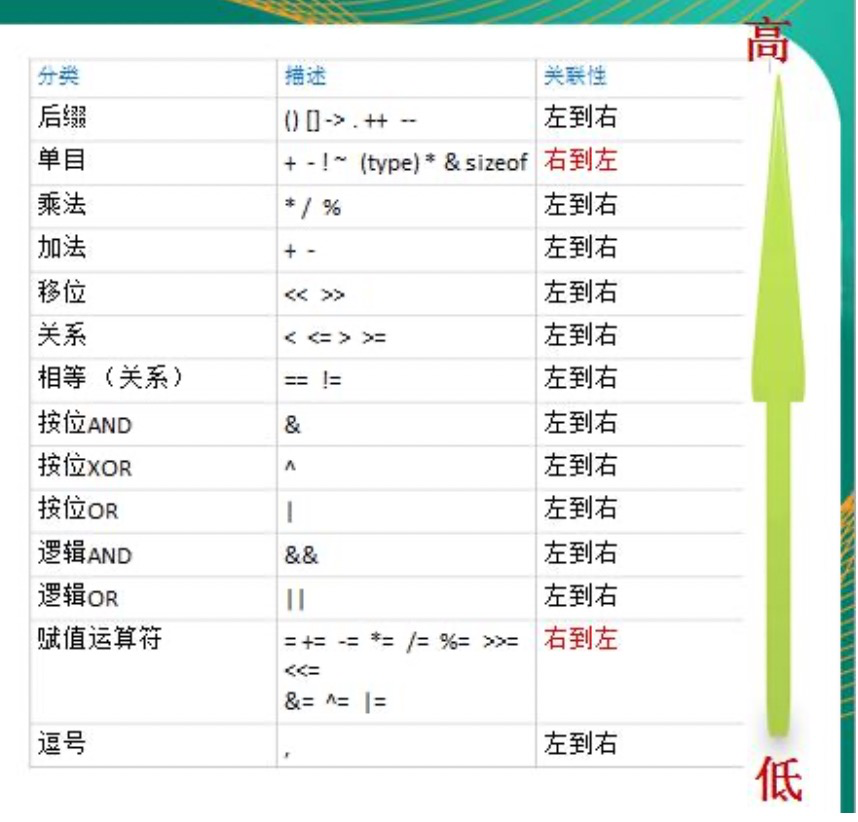

## 1、基本介绍 

运算符是一种特殊的符号，用以表示数据的运算，赋值和比较等【去掉了三元运算符，用if-else表示】

- 算术运算符
- 赋值运算符
- 比较运算符/关系运算符
- 逻辑运算符
- 位运算符
- 其他运算符

## 2、运算符

### 2、算术运算符

算术运算符是对数值类型的变量进行运算的，比如，加减乘除

```bash
+  加号 或者 正号 或者字符串相加
-  减号 或者 负号
*
/
%
++
--
```

```go
package main

import "fmt"

func main() {
	fmt.Println("arithmetic")

	// 说明： 如果运算符都是整数，那么除后，去掉小数部分，保留整数部分
	fmt.Println(10 / 4)

	var n1 float32 = 10 / 4
	fmt.Println(n1)

	// 如果我们希望保留小数部分，就需要让浮点数参数运算
	var n2 float32 = 10.0 / 4
	fmt.Println(n2)

	var n3 = 10.4 * 4;
	fmt.Println(n3)

	// % 取模的使用
	// 计算公式： a % b = a - a / b * b
	fmt.Println("10%3", 10%3)
	fmt.Println("-10%3", -10%3)
	fmt.Println("10%-3", 10%-3)
	fmt.Println("-10%3", -10%3)

	// ++ 和 -- 的使用
	var i int = 10
	i++ // i = i + 1
	fmt.Println("i", i)

	i-- // i = i -1
	fmt.Println("i", i)
	
}

```

#### 细节说明

1. 对于除号，它的整数除和小数除是有区别的，整数之间做除法，只保留整数部分而舍弃小数部分
2. 当一个数取模 % 时，可以等价于 a % b = a - a%b * b
3. go中的自增自减只能当做独立语言使用，不能组合使用 b:= i++
4. go中的 ++ 和 -- 只能写在变量后面，不能写在变量前面

### 3、关系运算符

也叫比较运算符

1、关系运算符的结果都是bool型，也就是要么是true，要么是false

2、关系表达式，经常用于if结构的条件中或者循环结构的条件中

```bash
==
!=
<
>
<=
>=
```

```go
package main

import "fmt"

func main() {
	// 关系运算符
	var n1 int = 9
	var n2 int = 10

	fmt.Println(n1 == n2)
	fmt.Println(n1 != n2)
	fmt.Println(n1 > n2)
	fmt.Println(n1 < n2)
	fmt.Println(n1 >= n2)
	fmt.Println(n1 <= n2)

	flag := n1 > n2
	fmt.Println("flag=", flag)
}
```

#### 细节说明

1. 关系运算符的结果都是bool型，也就是要么是true，要么是false
2. 关系运算符的表达式，我们称为关系表达式： a > b 
3. 比较运算符 ”==“ 不要误写为 ”=“

### 4、逻辑运算符

用于连接多个条件（一般来讲就是关系表达式），最终的结果也是一个bool

```bash
&&
||
!
```

```go
package main

import "fmt"

func main() {
	// 逻辑运算法
	var age int = 40
	if age > 30 && age == 40 {
		fmt.Println("ok")
	}
	if age > 30 || age == 40 {
		fmt.Println("ok")
	}
	if !(age < 30) {
		fmt.Println("ok")
	}

}
```

#### 细节说明

1. && 也叫短路与，如果第一个条件为false，则第二个条件不会判断，最终结果为false
2. ||  也叫短路或，如果第一个条件为true， 则第二个条件不会判断，最终结果为true

### 5、赋值运算符

赋值运算符就是将某个运算后的值，赋给指定的变量

```bash
=
+=
-=
%=
/=
# 二进制相关运算符
<<=
>>=
&=
^=
|=
```

```go
package main

import "fmt"

func test() int {
	return 10
}

func main() {
	fmt.Println("赋值运算符")

	// 数值交换
	a := 9
	b := 2
	fmt.Printf("a=%v,b=%v \n", a, b)
	t := a
	a = b
	b = t
	fmt.Printf("a=%v,b=%v \n", a, b)

	a += 10
	fmt.Printf("a=%v \n", a)

	a = test() + 10
	fmt.Printf("a=%v \n", a)
}
```

#### 面试题

有2个变量，进行数值交换，但是不允许使用中间变量

```go
	// 有2个变量，进行数值交换，但是不允许使用中间变量
	fmt.Println("面试题")
	var j int = 10
	var k int = 20
	j = j + k // j = j + k
	k = j - k // k = j + k - k  =>  k = j;
	j = j - k // j = j + k - j  =>  j = k

	fmt.Printf("j=%v,k=%v \n", j, k)
```

### 6、位运算符


### 7、其他运算符

```bash
& 返回变量的存储地址
* 指针变量
```

```go
	var aaa int = 100
	ptr := &aaa
	fmt.Printf("&ptr = %v %p  %v", aaa, ptr, *ptr)
```


## 3、运算符优先级



#### 大概优先级

1. 括号， ++ ，--
2. 单目运算符
3. 算术运算符
4. 移位运算符
5. 关系运算符
6. 位运算符
7. 逻辑运算符
8. 赋值运算符
9. 逗号


