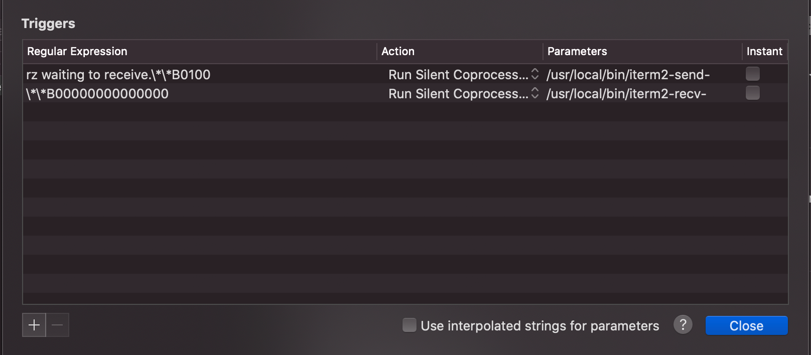

## rz和sz实现服务器文件上传下载

### 简介

rz，sz是Linux/Unix同Windows进行ZModem文件传输的命令行工具。

lrzsz是一款在linux里可代替ftp上传和下载的程序。通过下载它来使用rz，sz

### 优点

就是不用再开一个sftp工具登录上去上传下载文件

### 前提

服务器已经安装了 ` lrzsz`   

### 本地安装教程

#### 安装Homebrew

安装教程：https://zhuanlan.zhihu.com/p/90508170
检查是否安装成功 

```bash
brew -v
```

#### 安装lrzsz命令

lrzsz是一款在linux里可代替ftp上传和下载的程序。通过下载它来使用rz，sz

```bash
brew install lrzsz
```

#### 安装iTerm2

iTerm2是一个Mac下的终端工具，非常好用的命令行工具。Mac自带的终端是不支持lrzsz的，需要先下载支持它的iterms

[下载地址](https://www.iterm2.com/) ，下载到本地后直接解压安装，并将文件拖入到Applications

#### 配置iterm2

##### 1、创建触发的脚本

```bash
$ cd /usr/local/bin
$ vi iterm2-recv-zmodem.sh
...
$ wq!

$ vi iterm2-send-zmodem.sh 
...
$ wq!
```

iterm2-recv-zmodem.sh (https://raw.githubusercontent.com/aikuyun/iterm2-zmodem/master/iterm2-send-zmodem.sh)

```bash
#!/bin/bash
 
osascript -e 'tell application "iTerm2" to version' > /dev/null 2>&1 && NAME=iTerm2 || NAME=iTerm
if [[ $NAME = "iTerm" ]]; then
    FILE=$(osascript -e 'tell application "iTerm" to activate' -e 'tell application "iTerm" to set thefile to choose folder with prompt "Choose a folder to place received files in"' -e "do shell script (\"echo \"&(quoted form of POSIX path of thefile as Unicode text)&\"\")")
else
    FILE=$(osascript -e 'tell application "iTerm2" to activate' -e 'tell application "iTerm2" to set thefile to choose folder with prompt "Choose a folder to place received files in"' -e "do shell script (\"echo \"&(quoted form of POSIX path of thefile as Unicode text)&\"\")")
fi
 
if [[ $FILE = "" ]]; then
    echo Cancelled.
    # Send ZModem cancel
    echo -e \\x18\\x18\\x18\\x18\\x18
    sleep 1
    echo
    echo \# Cancelled transfer
else
    cd "$FILE"
    /usr/local/bin/rz -E -e -b --bufsize 4096
    sleep 1
    echo
    echo
    echo \# Sent \-\> $FILE
fi
```

iterm2-send-zmodem.sh ( https://raw.githubusercontent.com/aikuyun/iterm2-zmodem/master/iterm2-recv-zmodem.sh)

```bash
#!/bin/bash

osascript -e 'tell application "iTerm2" to version' > /dev/null 2>&1 && NAME=iTerm2 || NAME=iTerm
if [[ $NAME = "iTerm" ]]; then
    FILE=`osascript -e 'tell application "iTerm" to activate' -e 'tell application "iTerm" to set thefile to choose file with prompt "Choose a file to send"' -e "do shell script (\"echo \"&(quoted form of POSIX path of thefile as Unicode text)&\"\")"`
else
    FILE=`osascript -e 'tell application "iTerm2" to activate' -e 'tell application "iTerm2" to set thefile to choose file with prompt "Choose a file to send"' -e "do shell script (\"echo \"&(quoted form of POSIX path of thefile as Unicode text)&\"\")"`
fi
if [[ $FILE = "" ]]; then
    echo Cancelled.
    # Send ZModem cancel
    echo -e \\x18\\x18\\x18\\x18\\x18
    sleep 1
    echo
    echo \# Cancelled transfer
else
    /usr/local/bin/sz "$FILE" -e -b
    sleep 1
    echo
    echo \# Received $FILE
fi
```

##### 2、iterm2配置触发器

此步骤是关键步骤，打开iTerm2终端，依次点击"Preference"——>"Profiles"——>"Default"——>"Advanced"——>"Edit"

Regular expression:     rz waiting to receive.\*\*B0100
Action:                         Run Silent Coprocess
Parameters:                  /usr/local/bin/iterm2-send-zmodem.sh

Regular expression:      \*\*B00000000000000
Action:                           Run Silent Coprocess
Parameters:                  /usr/local/bin/iterm2-recv-zmodem.sh



### 使用

rz上传功能：在bash中，也就是iTerm2终端输入rz会弹出文件选择框，选择文件 choose 就开始上传，会上传到当前目录

```
[root@iZ2zecdubpn7xpbst0beqiZ ~]# rz
....
```

sz 下载功能：sz fileName(你要下载的文件的名字) 回车，会弹出窗体，我们选择要保存的地方即可

```bash
[root@iZ2zecdubpn7xpbst0beqiZ ~]# ll
总用量 132
-rw-r--r--  1 root root 100786 3月   8 15:46 111.json
[root@iZ2zecdubpn7xpbst0beqiZ ~]# sz 111
```

### 命令参数

sz命令 用途说明：sz命令是利用ZModem协议来从Linux服务器传送文件到本地，一次可以传送一个或多个文件。相对应的从本地上传文件到Linux服务器，可以使用rz命令。 常用参数：

```javascript
-a 以文本方式传输（ascii）。
-b 以二进制方式传输（binary）。
-e 对控制字符转义（escape），这可以保证文件传输正确。
如果能够确定所传输的文件是文本格式的，使用 sz -a files
如果是二进制文件，使用 sz -be files
```

rz命令

```javascript
-b 以二进制方式，默认为文本方式。（Binary (tell it like it is) file transfer override.）
-e 对所有控制字符转义。（Force sender to escape all control characters; normally XON, XOFF, DLE, CR-@-CR, and Ctrl-X are escaped.）
```

### 注意事项

 如果要保证上传的文件内容在服务器端保存之后与原始文件一致，最好同时设置这两个标志，如下所示方式使用：

大文件也用这个

```javascript
rz -be
sz -be fileName.ext
```

此命令执行时，会弹出文件选择对话框，选择好需要上传的文件之后，点确定，就可以开始上传的过程了。上传的速度取决于当时网络的状况。 如果执行完毕显示“0错误”，文件上传就成功了，其他显示则表示文件上传出现问题了。


### M芯片

```bash
/usr/local/bin/sz 和 /usr/local/bin/rz 路径更改一下为  /opt/homebrew/bin/xx
```


