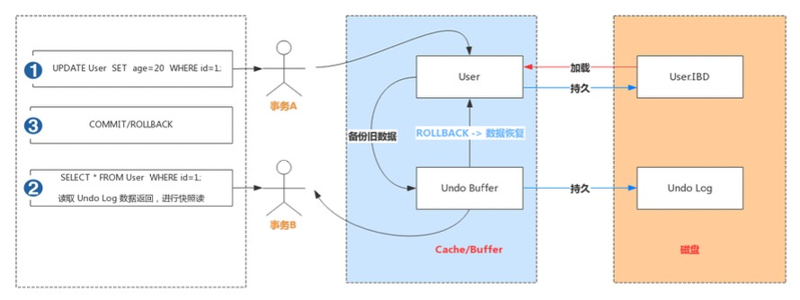
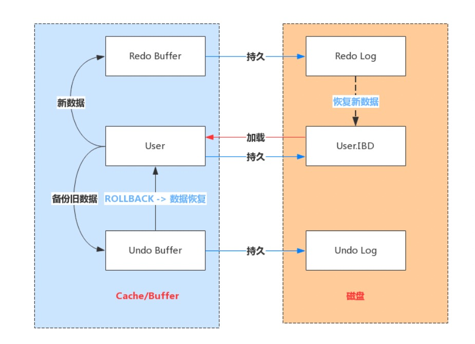
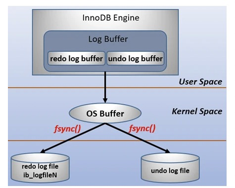
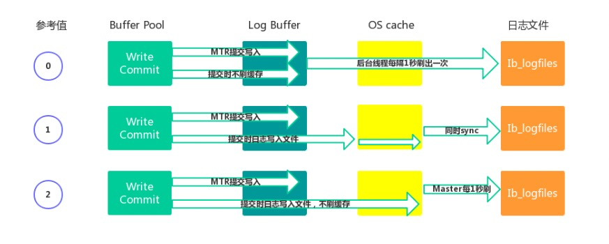
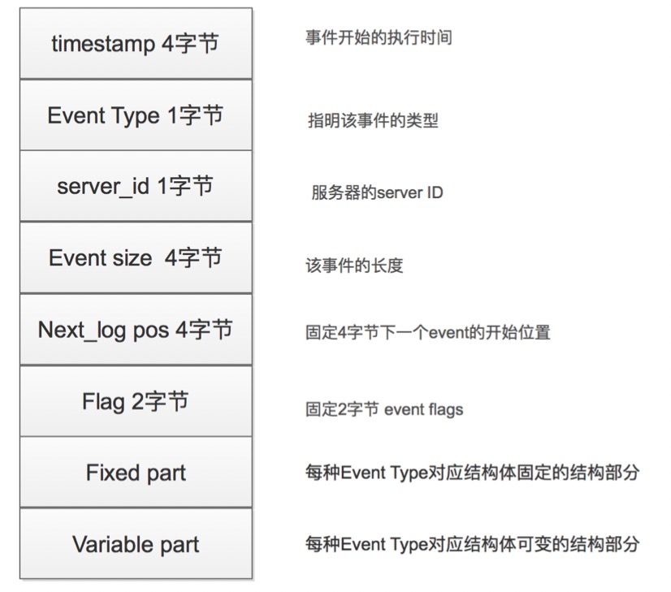

## 数据库日志

日志是 `mysql `数据库的重要组成部分，记录着数据库运行期间各种状态信息。 `mysql`日志主要包括错误日志、查询日志、慢查询日志、事务日志、二进制日志几大类。

作为开发，我们重点需要关注的是**二进制日志( `binlog `)和事务日志(包括**
**`redo log `和 `undo log `)**

### 简单入门

- **逻辑日志**： 可以简单理解为记录的就是sql语句 。
- **物理日志**： `mysql `数据最终是保存在数据页中的，物理日志记录的就是数据页变更 。

**binlog和undolog是逻辑日志，redolog是物理日志**

事务的4中特性：原子性、一致性、隔离性和持久性，那么事务的四种特性到底是基于什么机制实现的呢？

- 事务的隔离性是由`锁机制`进行实现的
- 而事务的原子性、一致性和持久性是由事务的`redo日志`和`undo`日志来实现的
  - redo log 称为 `重做日志`，提供再写入操作，恢复提交事务修改的页操作，用来保证事务的持久性
  - undo log 称为 `回滚日志`，回滚记录到某个特性的版本，用来保证事务的原子性和一致性

有些人会认为undo log是redo log的逆过程，其实不然，red和undo都是一种恢复操作，但是有以下不同

- redo log ：是存储引擎层（innodb）生成的日志，记录的是`物理级别`上的页的修改操作，比如页号，偏移量yyy，写入zzz数据，主要是为了保证数据的可靠性
- undo log:  ：是存储引擎层（innodb）生成的日志，记录的是`逻辑操作`日志，比如对某一个行数据进行了insert操作，那么undo log就会记录一条与之相反的delete的操作，主要用于`事务的回滚`（undo log记录的是每个修改操作的逆操作）和`一致性非锁定读`（undo log回滚记录到某种特定的版本--mvcc，即多版本并发控制）

### Undo log

#### 介绍

- Undo:意为撤销或取消，以撤销操作为目的，返回指定某个状态的操作。

- Undo Log:数据库事务开始之前，会将要修改的记录存放到 Undo 日志里，当事务回滚时或者数 据库崩溃时，可以利用 Undo 日志，撤销未提交事务对数据库产生的影响。

- Undo Log产生和销毁:Undo Log在事务开始前产生;事务在提交时，并不会立刻删除undo log，innodb会将该事务对应的undo log放入到删除列表中，后面会通过后台线程purge thread进 行回收处理。Undo Log属于逻辑日志，记录一个变化过程。例如执行一个delete，undolog会记 录一个insert;执行一个update，undolog会记录一个相反的update。

- Undo Log存储:undo log采用段的方式管理和记录。在innodb数据文件中包含一种rollback segment回滚段，内部包含1024个undo log segment。可以通过下面一组参数来控制Undo log存 储。

  ```mysql
  show variables like '%innodb_undo%';
  ```

#### 作用

- 实现事务的原子性【要么都成功，要么都失败，不会出现一般成功，一般失败的情况】
  - Undo Log 是为了实现事务的原子性而出现的产物。事务处理过程中，如果出现了错误或者用户执 行了 ROLLBACK 语句，MySQL 可以利用 Undo Log 中的备份将数据恢复到事务开始之前的状态。
- 实现多版本并发控制(MVCC)
  - Undo Log 在 MySQL InnoDB 存储引擎中用来实现多版本并发控制。事务未提交之前，Undo Log 保存了未提交之前的版本数据，Undo Log 中的数据可作为数据旧版本快照供其他并发事务进行快 照读。
  - 

事务A手动开启事务，执行更新操作，首先会把更新命中的数据备份到 Undo Buffer 中。 

事务B手动开启事务，执行查询操作，会读取 Undo 日志数据返回，进行快照读

### Redo log

#### 介绍

- Redo:顾名思义就是重做。以恢复操作为目的，在数据库发生意外时重现操作。
- Redo Log:指事务中修改的任何数据，将最新的数据备份存储的位置(Redo Log)，被称为重做 日志。
- Redo Log 的生成和释放:随着事务操作的执行，就会生成Redo Log，在事务提交时会将产生 Redo Log写入Log Buffer，并不是随着事务的提交就立刻写入磁盘文件。等事务操作的脏页写入 到磁盘之后，Redo Log 的使命也就完成了，Redo Log占用的空间就可以重用(被覆盖写入)。

#### 工作原理

Redo Log 是为了实现事务的持久性而出现的产物。防止在发生故障的时间点，尚有脏页未写入表 的 IBD 文件中，在重启 MySQL 服务的时候，根据 Redo Log 进行重做，从而达到事务的未入磁盘 数据进行持久化这一特性。



#### 相关配置

`redo log `包括两部分：一个是内存中的日志缓冲( `redo log buffer `)，另一个是磁盘上的日志文件( ` redo log
file `)。 `mysql `每执行一条 `DML `语句，先将记录写入 `redo log buffer `
，后续某个时间点再一次性将多个操作记录写到 `redo log file `。这种 **先写日志，再写磁盘** 的技术就是 `MySQL`
里经常说到的 `WAL(Write-Ahead Logging) `技术。

在计算机操作系统中，用户空间( `user space `)下的缓冲区数据一般情况下是无法直接写入磁盘的，中间必须经过操作系统内核空间( `
kernel space `)缓冲区( `OS Buffer `)。因此， `redo log buffer `写入 `redo log
file `实际上是先写入 `OS Buffer `，然后再通过系统调用 `fsync() `将其刷到 `redo log file `
中，过程如下：



每个InnoDB存储引擎至少有1个重做日志文件组(group)，每个文件组至少有2个重做日志文 件，默认为ib_logfile0和ib_logfile1。可以通过下面一组参数控制Redo Log存储:

```mysql
show variables like '%innodb_log%'; 
```

Redo Buffer 持久化到 Redo Log 的策略，可通过 Innodb_flush_log_at_trx_commit 设置:

| 参数值              | 含义                                                         |
| ------------------- | ------------------------------------------------------------ |
| 0（延迟写）         | 事务提交时不会将 `redo log buffer `中日志写入到 `os buffer `，而是每秒写入 `os buffer `并调用 `fsync() `写入到 `redo log file `中。也就是说设置为0时是(大约)每秒刷新写入到磁盘中的，当系统崩溃，会丢失1秒钟的数据。 【Redo buffer ->OS cache -> flush cache to disk，】 |
| 1（实时写，实时刷） | 事务每次提交都会将 `redo log buffer `中的日志写入 `os buffer `并调用 `fsync() `刷到 `redo log file `中。这种方式即使系统崩溃也不会丢失任何数据，但是因为每次提交都写入磁盘，IO的性能较差。最安全，性能最差的方式。【Redo Buffer -> OS cache -> flush cache to disk】 |
| 2（实时写，延迟刷） | 每次提交都仅写入到 `os buffer `，然后是每秒调用 `fsync() `将 `os buffer `中的日志写入到 `redo log file `。【Redo Buffer -> OS cache，然后由后台Master线程再每隔1秒执行OS cache -> flush cache to disk 】 |



**一般建议选择取值2，因为 MySQL 挂了数据没有损失，整个服务器挂了才会损失1秒的事务提交数据。**

#### 写入机制

`redo log `实际上记录数据页的变更，而这种变更记录是没必要全部保存，因此 `redo log`实现上采用了大小固定，循环写入的方式，当写到结尾时，会回到开头循环写日志。如下图：


同时我们很容易得知， 在innodb中，既有` redo log `需要刷盘，还有 `数据页 `也需要刷盘， `redo log `存在的意义主要就是降低对 `数据页 `刷盘的要求 **。在上图中， `write pos `表示 `redo log `当前记录的 `LSN` (逻辑序列号)位置， `check point `表示** 数据页更改记录** 刷盘后对应 `redo log `所处的 `LSN `(逻辑序列号)位置。 `write pos `到 `check point `之间的部分是 `redo log `空着的部分，用于记录新的记录；` check point `到 `write pos `之间是 `redo log `待落盘的数据页更改记录。当 `write pos `追上 `check point `时，会先推动 `check point `向前移动，空出位置再记录新的日志。

启动 `innodb `的时候，不管上次是正常关闭还是异常关闭，总是会进行恢复操作。因为 `redo log `记录的是数据页的物理变化，因此恢复的时候速度比逻辑日志(如 `binlog `)要快很多。 重启 `innodb `时，首先会检查磁盘中数据页的 `LSN `，如果数据页的 `LSN `小于日志中的 `LSN `，则会从 `checkpoint `开始恢复。 还有一种情况，在宕机前正处于
`checkpoint `的刷盘过程，且数据页的刷盘进度超过了日志页的刷盘进度，此时会出现数据页中记录的 `LSN `大于日志中的 `LSN`
，这时超出日志进度的部分将不会重做，因为这本身就表示已经做过的事情，无需再重做。

### Bin log

#### 介绍

Redo Log 是属于InnoDB引擎所特有的日志，而MySQL Server也有自己的日志，即 Binary log(二进制日志)，简称Binlog。Binlog是记录所有数据库表结构变更以及表数据修改的二进制 日志，不会记录SELECT和SHOW这类操作。Binlog日志是以事件形式记录，还包含语句所执行的 消耗时间

`binlog `用于记录数据库执行的写入性操作(不包括查询)信息，以二进制的形式保存在磁盘中。 `binlog `是 `mysql`的逻辑日志，并且由 `Server `层进行记录，使用任何存储引擎的 `mysql `数据库都会记录 `binlog `日志。

`binlog `是通过追加的方式进行写入的，可以通过 `max_binlog_size `参数设置每个 `binlog`，文件的大小，当文件大小达到给定值之后，会生成新的文件来保存日志。

#### 使用场景

在实际应用中， `binlog `的主要使用场景有两个，分别是 **主从复制** 和 **数据恢复** 。

1. **主从复制** ：在 `Master `端开启 `binlog `，然后将 `binlog `发送到各个 `Slave `端， `Slave `端重放 `binlog `从而达到主从数据一致。
2. **数据恢复** ：通过使用 `mysqlbinlog `工具来恢复数据。

#### 文件结构

MySQL的binlog文件中记录的是对数据库的各种修改操作，用来表示修改操作的数据结构是Log event。不同的修改操作对应的不同的log event。比较常用的log event有:Query event、Row event、Xid event等。binlog文件的内容就是各种Log event的集合。

Binlog文件中Log event结构如下图所示:



#### 写入机制

- 根据记录模式和操作触发event事件生成log event(事件触发执行机制)
- 将事务执行过程中产生log event写入缓冲区，每个事务线程都有一个缓冲区
  - Log Event保存在一个binlog_cache_mngr数据结构中，在该结构中有两个缓冲区，一个是 stmt_cache，用于存放不支持事务的信息;另一个是trx_cache，用于存放支持事务的信息。
- 事务在提交阶段会将产生的log event写入到外部binlog文件中。
   不同事务以串行方式将log event写入binlog文件中，所以一个事务包含的log event信息在
- binlog文件中是连续的，中间不会插入其他事务的log event。

#### 日志格式

`binlog `日志有三种格式，分别为 `STATMENT `、 `ROW `和 `MIXED `。

> 在 `MySQL 5.7.7 `之前，默认的格式是 `STATEMENT `， `MySQL 5.7.7 `之后，默认值是 `ROW `。日志格式通过 `binlog-format `指定。

- `STATMENT `： 基于` SQL `语句的复制( `statement-based replication, SBR `)，每一条会修改数据的sql语句会记录到 `binlog `中 。slave在复制的时候SQL进程会解析成和原来master端执行过的相同的 SQL再次执行。简称SQL语句复制。

  ```autohotkey
  * 优点： 不需要记录每一行的变化，减少了` binlog ` 日志量，节约了 ` IO ` , 从而提高了性能； 日志量小，减少磁盘IO，提升存储和恢复速度
  * 缺点： 在某些情况下会导致主从数据不一致，比如执行` sysdate() ` 、 ` slepp() ` `last_insert_id()`、`now() `等 。 
  ```

- `ROW `： 基于行的复制(` row-based replication, RBR `)，不记录每条sql语句的上下文信息，仅需记录哪条数据被修改了 。

  - 优点： 能清楚记录每一个行数据的修改细节，能完全实现主从数据同步和数据的恢复。不会出现某些特定情况下的存储过程、或function、或trigger的调用和触发无法被正确复制的问题 ；
  - 缺点： 批量操作，会产生大量的日志，尤其是` alter table `的时候会让日志暴涨

- `MIXED `： 基于` STATMENT `和 `ROW `两种模式的混合复制( `mixed-based replication, MBR `)，一般的复制使用 `STATEMENT `模式保存 `binlog `，对于 `STATEMENT `模式无法复制的操作使用 `ROW `模式保存 `binlog`

#### 刷磁盘时机

对于 `InnoDB `存储引擎而言，只有在事务提交时才会记录 `biglog `，此时记录还在内存中，那么 `biglog`
是什么时候刷到磁盘中的呢？ `mysql `通过 `sync_binlog `参数控制 `biglog `的刷盘时机，取值范围是 `0-N`
：

- 0：不去强制要求，由系统自行判断何时写入磁盘；
- 1：每次 `commit `的时候都要将 `binlog `写入磁盘；
- N：每N个事务，才会将 `binlog `写入磁盘。

从上面可以看出， `sync_binlog `最安全的是设置是 `1 `，这也是 `MySQL 5.7.7`
之后版本的默认值。但是设置一个大一些的值可以提升数据库性能，因此实际情况下也可以将值适当调大，牺牲一定的一致性来获取更好的性能。

#### 文件操作【实操】

1、Binlog状态查看

```sql
show variables like 'log_bin';
show variables like '%log_bin%';
```

2、开启Binlog功能

```sql
mysql> set global log_bin=mysqllogbin;
ERROR 1238 (HY000): Variable 'log_bin' is a read only variable
```

1）需要修改my.cnf或my.ini配置文件，在[mysqld]下面增加log_bin=mysql_bin_log，重启 MySQL服务。

```sql
#log-bin=ON 
#log-bin-basename=mysqlbinlog 
binlog-format=ROW  # binlog的日志格式
log-bin=mysqlbinlog # 开启binlog并且命中binlogName
```

2）执行开启语句【read only variable】

```sql
set global log_bin=mysqllogbin;
```

3、使用show binlog events命令

```sql
show binary logs; //等价于show master logs; 
show master status; 
show binlog events; 
show binlog events in 'mysqlbinlog.000001'\G;
结果:
     Log_name: mysql_bin.000001   //此条log存在那个文件中
        Pos: 174                 //log在bin-log中的开始位置 
     Event_type: Intvar          //log的类型信息 
        Server_id: 1  //可以查看配置中的server_id,表示log是那个服务器产生 
     End_log_pos: 202          //log在bin-log中的结束位置 
        Info: INSERT_ID=2    //log的一些备注信息，可以直观的看出进行了什么操作 
```

4、使用mysqlbinlog 命令【mysql工具自带，在bin目录下】

```sql
mysqlbinlog "文件名"
mysqlbinlog "文件名" > "文件名比如:test.sql"
```

5、使用 binlog 恢复数据

```sql
//按指定时间恢复
mysqlbinlog --start-datetime="2020-04-25 18:00:00" --stop- datetime="2020-04-26 00:00:00" mysqlbinlog.000002 | mysql -uroot -p1234 //按事件位置号恢复
mysqlbinlog --start-position=154 --stop-position=957 mysqlbinlog.000002 | mysql -uroot -p1234
```

**mysqldump:定期全部备份数据库数据。mysqlbinlog可以做增量备份和恢复操作。**

6、删除Binlog文件

```sql
purge binary logs to 'mysqlbinlog.000001'; //删除指定文件
purge binary logs before '2020-04-28 00:00:00'; //删除指定时间之前的文件 
reset master; //清除所有文件
```

可以通过设置expire_logs_days参数来启动自动清理功能。

```sql
#默认值为0表示没启用。设置为1 表示超出1天binlog文件会自动删除掉。
show variables like 'expire_logs_days';
set global expire_logs_days=7;
```

 **生效触发时机**：

1. binlog大小超过max_binlog_size
2. 手动执行flush logs
   1. flush logs;
3. 重新启动时(MySQL **将会new一个新文件用于记录binlog)**

**如果binlog非常多，不要轻易设置改参数，有可能导致io争用，这时候可以使用purge命令予以清除:**

#### Redo Log和 Binlog 区别

- Redo Log是属于InnoDB引擎功能，Binlog是属于MySQL Server自带功能，并且是以二进制文件记录。
- Redo Log属于物理日志，记录该数据页更新状态内容，Binlog是逻辑日志，记录更新过程。
- Redo Log日志是循环写，日志空间大小是固定，Binlog是追加写入，写完一个写下一个，不会覆盖使用。
- Redo Log作为服务器异常宕机后事务数据自动恢复使用，Binlog可以作为主从复制和数据恢复使用。Binlog没有自动crash-safe能力。

|          | Redo log                                                     | Bin log                                                      |
| -------- | ------------------------------------------------------------ | ------------------------------------------------------------ |
| 文件大小 | `redo log `的大小是固定的。                                  | `binlog `可通过配置参数 `max_binlog_size `设置每个` binlog `文件的大小。 |
| 实现方式 | `redo log `是 `InnoDB `引擎层实现的，并不是所有引擎都有。    | `binlog `是 `Server` 层实现的，所有引擎都可以使用 `binlog `日志 |
| 记录方式 | redo log 采用循环写的方式记录，当写到结尾时，会回到开头循环写日志。 | binlog通过追加的方式记录，当文件大小大于给定值后，后续的日志会记录到新的文件上 |
| 适用场景 | `redo log `适用于崩溃恢复(crash-safe)                        | `binlog `适用于主从复制和数据恢复                            |

(**crash-safe** 即在 InnoDB 存储引擎中，事务提交过程中任何阶段，MySQL突然奔溃，重启后都能保证事务的完整性，已提交的数据不会丢失，未提交完整的数据会自动进行回滚。这个能力依赖的就是redo log和unod log两个日志。)

##### 总结

由 `binlog `和 `redo log `的区别可知： `binlog `日志只用于归档，只依靠 `binlog `是没有 `crash-safe `能力的。但只有 `redo log `也不行，因为 `redo log `是 `InnoDB `特有的，且日志上的记录落盘后会被覆盖掉。因此需要 `binlog `和 `redo log`二者同时记录，才能保证当数据库发生宕机重启时，数据不会丢失。


