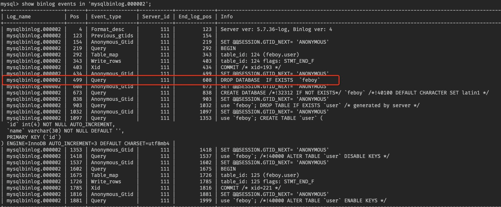

## 删库不跑路实战

[参考](https://mp.weixin.qq.com/s/w4vPFHJkog2nbl68_0LOnw)

- 模拟一个数据库
- 存入2条数据
- 定时备份
- 再插入2条数据
- 删库
- 恢复数据【不跑路】

### 1、开启binlog

查看binlog的状态，mysql默认是关闭的

```sql
show variables like '%log_bin%';

mysql> show variables like '%log_bin%';
+---------------------------------+-------+
| Variable_name                   | Value |
+---------------------------------+-------+
| log_bin                         | OFF   |
| log_bin_basename                |       |
| log_bin_index                   |       |
| log_bin_trust_function_creators | OFF   |
| log_bin_use_v1_row_events       | OFF   |
| sql_log_bin                     | ON    |
+---------------------------------+-------+
6 rows in set (0.01 sec)
```

这个 OFF 就表示 binlog 是一个关闭状态，没有开启，接下来我们来开启 binlog。

开启 binlog 主要是修改 MySQL 的配置文件 mysqld.cnf，该文件在容器的 `/etc/mysql/mysql.conf.d` 目录下。

```bash
root@39adf66c3d5c:/# cd /etc/mysql/mysql.conf.d/
root@39adf66c3d5c:/etc/mysql/mysql.conf.d# ls
mysqld.cnf
root@39adf66c3d5c:/etc/mysql/mysql.conf.d# cat mysqld.cnf

# cat /etc/mysql/mysql.conf.d/mysqld.cnf
```

针对该配置文件，我们做如下修改：

```sql
#数据库日志级别
binlog-format=ROW

# 这个参数表示启用 binlog 功能，并指定 binlog 的存储目录
log-bin=mysqlbinlog

# 设置一个 binlog 文件的最大字节
# 设置最大 100MB
max_binlog_size=104857600

# 设置了 binlog 文件的有效期（单位：天）
expire_logs_days = 7

# binlog 日志只记录指定库的更新（配置主从复制的时候会用到）
#binlog-do-db=javaboy_db

# binlog 日志不记录指定库的更新（配置主从复制的时候会用到）
#binlog-ignore-db=javaboy_no_db

# 写缓存多少次，刷一次磁盘，默认 0 表示这个操作由操作系统根据自身负载自行决定多久写一次磁盘
# 1 表示每一条事务提交都会立即写磁盘，n 则表示 n 个事务提交才会写磁盘
sync_binlog=0

# 为当前服务取一个唯一的 id（MySQL5.7 之后需要配置）
server-id=1

```


因为docker容器中没有vim编辑器，有几种方案，1.就是安装vim编辑器；2.就是从宿主机copy文件; 3.进行数据卷挂载的可以直接进行修改

copy

```bash
docker cp /root/docker/mysql/conf/mysqld.cnf mysql:/etc/mysql/mysql.conf.d/
```

不过我们的mysql容器已经进行数据库的挂载了，直接修改即可

mysqld.cnf添加如下

```bash
#数据库日志级别
binlog-format=ROW
# 这个参数表示启用 binlog 功能，并指定 binlog 的存储目录
log-bin=mysqlbinlog
# 设置一个 binlog 文件的最大字节
# 设置最大 100MB
max_binlog_size=104857600
# 设置了 binlog 文件的有效期（单位：天）
expire_logs_days = 7
# 为当前服务取一个唯一的 id（MySQL5.7 之后需要配置）
server-id=1
```

配置完成后，执行如下命令重启 mysql 容器（mysql 是我这里容器的名字）：

```bash
docker restart mysql
```

查看binlog状态，成功开启

```sql
> mysql: show variables like '%log_bin%';
+---------------------------------+----------------------------------+
| Variable_name                   | Value                            |
+---------------------------------+----------------------------------+
| log_bin                         | ON                               |
| log_bin_basename                | /var/lib/mysql/mysqlbinlog       |
| log_bin_index                   | /var/lib/mysql/mysqlbinlog.index |
| log_bin_trust_function_creators | OFF                              |
| log_bin_use_v1_row_events       | OFF                              |
| sql_log_bin                     | ON                               |
+---------------------------------+----------------------------------+
6 rows in set (0.01 sec)
```

这里除了 log_bin 变量外，还有两个变量名也值得我们关注：

- log_bin_basename：这个是将来产生的 binlog 日志文件的名称前缀，换句话说，根据大家目前所看到的配置，将来产生的 binlog 日志文件名为 mysqlbinlog，这个文件中将会用来记录所有的 DDL 和 DML 语句事件。

- log_bin_index：这个是 binlog 的索引文件，保存了所有 binlog 的目录，因为 binlog 可能会有多个。我们可以来查看一下现在的 mysqlbinlog 文件：

  可以看到，目前只有一个 logbin 文件。

  ```bash
  [root@guoguo data]# cat mysqlbinlog.index
  ./mysqlbinlog.000001
  ```

### 2、常用命令

#### 查看所有 binlog 日志

```sql
show master logs;
# 等价于
show binary logs; 
```

```sql
mysql> show master logs;
+--------------------+-----------+
| Log_name           | File_size |
+--------------------+-----------+
| mysqlbinlog.000001 |       154 |
+--------------------+-----------+
1 row in set (0.00 sec)

mysql> show binary logs;
+--------------------+-----------+
| Log_name           | File_size |
+--------------------+-----------+
| mysqlbinlog.000001 |       154 |
+--------------------+-----------+
1 row in set (0.00 sec)
```

可以看到，我这里目前只有一个日志文件，文件名为 `mysqlbinlog.000001`，File_size 表示这个文件占用的字节大小是 154。

#### 查看 master 状态

```sql
show master status;
```

```sql
mysql> show master status;
+--------------------+----------+--------------+------------------+-------------------+
| File               | Position | Binlog_Do_DB | Binlog_Ignore_DB | Executed_Gtid_Set |
+--------------------+----------+--------------+------------------+-------------------+
| mysqlbinlog.000001 |      154 |              |                  |                   |
+--------------------+----------+--------------+------------------+-------------------+
1 row in set (0.00 sec)
```

这个时候可以看到最新的 binlog 日志文件名称以及最后一个操作事件的 Position 值，可以知道目前正在存入的日志是哪个文件

#### 刷新 binlog

正常来说，一个 binlog 写满之后，会自动切换到下一个 binlog 开始写，不过我们也可以执行一个 `flush logs` 命令来手动刷新 binlog，手动刷新 binlog 之后，就会产生一个新的 binlog 日志文件，接下来所有的 binlog 日志都将记录到新的文件中。如下：

```sql
mysql> flush logs;
Query OK, 0 rows affected (0.02 sec)

mysql> show master logs;
+--------------------+-----------+
| Log_name           | File_size |
+--------------------+-----------+
| mysqlbinlog.000001 |       203 |
| mysqlbinlog.000002 |       154 |
+--------------------+-----------+
2 rows in set (0.00 sec)

mysql> show master status;
+--------------------+----------+--------------+------------------+-------------------+
| File               | Position | Binlog_Do_DB | Binlog_Ignore_DB | Executed_Gtid_Set |
+--------------------+----------+--------------+------------------+-------------------+
| mysqlbinlog.000002 |      154 |              |                  |                   |
+--------------------+----------+--------------+------------------+-------------------+
1 row in set (0.00 sec)
```

由上图可以看到，我们刷新日志之后，再通过 `show master logs` 去查看日志，发现日志文件已经多了一个新产生的了，然后再通过 `show master status` 去查看最新的日志文件信息，发现也已经变为 `mysqlbinlog.000002`。

#### 重置 binlog

`reset master` 可以重置 binlog 日志文件，让日志重新从 000001 开始记录，不过如果当前主机有一个或者多个从机在运行，那么该命令就运行不了（因为从机是通过 binlog 来实现数据库同步的，主机把 binlog 清空了，从机会报找不到 binlog 的错误）。

```sql
mysql> reset master;
Query OK, 0 rows affected (0.01 sec)

mysql> show master logs;
+--------------------+-----------+
| Log_name           | File_size |
+--------------------+-----------+
| mysqlbinlog.000001 |       154 |
+--------------------+-----------+
1 row in set (0.00 sec)

mysql> show master status;
+--------------------+----------+--------------+------------------+-------------------+
| File               | Position | Binlog_Do_DB | Binlog_Ignore_DB | Executed_Gtid_Set |
+--------------------+----------+--------------+------------------+-------------------+
| mysqlbinlog.000001 |      154 |              |                  |                   |
+--------------------+----------+--------------+------------------+-------------------+
1 row in set (0.00 sec)
```

#### 查看 binlog

由于 binlog 是二进制日志文件，所以要是直接打开，那肯定是看不了的：

```bash
[root@guoguo data]# cat mysqlbinlog.000001
_binc��bow{5.7.36-logc��b8


**4�c��b#o���+3�[root@guoguo data]#
```

没有看到任何有用的信息。

为了查看 binlog，MySQL 为我们提供了两个官方工具，我们一个一个来看，`mysqlbinlog` 命令 和 `show event`;

准备工作

```sql
SHOW DATABASES;
CREATE DATABASE IF NOT EXISTS  `feboy`;

use `feboy`;

CREATE TABLE IF NOT EXISTS `user` (
	`id` int(4) NOT NULL AUTO_INCREMENT COMMENT '学号',
	`name` VARCHAR(30) NOT NULL DEFAULT '匿名' COMMENT '姓名',
	PRIMARY KEY(id)
)ENGINE=INNODB DEFAULT CHARSET=utf8mb4;


INSERT INTO `user`(`name`) VALUES ('zhangsan'),('lisi');

INSERT INTO `user`(`name`) VALUES ('wangwu'),('zhaoliu');

DROP DATABASE  IF EXISTS  `feboy`;
```

##### mysqlbinlog查看

```mysql
# mysql 提供的命令
mysqlbinlog binlog文件；
```

```bash
root@0df3cb73c54c:/# mysqlbinlog /var/lib/mysql/mysqlbinlog.000001
/*!50530 SET @@SESSION.PSEUDO_SLAVE_MODE=1*/;
/*!50003 SET @OLD_COMPLETION_TYPE=@@COMPLETION_TYPE,COMPLETION_TYPE=0*/;
DELIMITER /*!*/;
# at 4
#220627 10:39:12 server id 111  end_log_pos 123 CRC32 0xc3d3019d 	Start: binlog v 4, server v 5.7.36-log created 220627 10:39:12 at startup
# Warning: this binlog is either in use or was not closed properly.
ROLLBACK/*!*/;
BINLOG '
0Ii5Yg9vAAAAdwAAAHsAAAABAAQANS43LjM2LWxvZwAAAAAAAAAAAAAAAAAAAAAAAAAAAAAAAAAA
AAAAAAAAAAAAAAAAAADQiLliEzgNAAgAEgAEBAQEEgAAXwAEGggAAAAICAgCAAAACgoKKioAEjQA
AZ0B08M=
'/*!*/;
# at 123
#220627 10:39:12 server id 111  end_log_pos 154 CRC32 0x51b110de 	Previous-GTIDs
# [empty]
# at 154
#220627 10:39:22 server id 111  end_log_pos 219 CRC32 0x63dac32a 	Anonymous_GTID	last_committed=0	sequence_number=1	rbr_only=no
SET @@SESSION.GTID_NEXT= 'ANONYMOUS'/*!*/;
# at 219
#220627 10:39:22 server id 111  end_log_pos 333 CRC32 0x8862495e 	Query	thread_id=7	exec_time=0	error_code=0
SET TIMESTAMP=1656326362/*!*/;
SET @@session.pseudo_thread_id=7/*!*/;
SET @@session.foreign_key_checks=1, @@session.sql_auto_is_null=0, @@session.unique_checks=1, @@session.autocommit=1/*!*/;
SET @@session.sql_mode=1436549152/*!*/;
SET @@session.auto_increment_increment=1, @@session.auto_increment_offset=1/*!*/;
/*!\C latin1 *//*!*/;
SET @@session.character_set_client=8,@@session.collation_connection=8,@@session.collation_server=8/*!*/;
SET @@session.lc_time_names=0/*!*/;
SET @@session.collation_database=DEFAULT/*!*/;
CREATE DATABASE IF NOT EXISTS  `feboy`
/*!*/;
# at 333
#220627 10:39:30 server id 111  end_log_pos 398 CRC32 0xb084ffbd 	Anonymous_GTID	last_committed=1	sequence_number=2	rbr_only=no
SET @@SESSION.GTID_NEXT= 'ANONYMOUS'/*!*/;
# at 398
#220627 10:39:30 server id 111  end_log_pos 663 CRC32 0x858bc4e7 	Query	thread_id=7	exec_time=0	error_code=0
use `feboy`/*!*/;
SET TIMESTAMP=1656326370/*!*/;
CREATE TABLE IF NOT EXISTS `user` (
`id` int(4) NOT NULL AUTO_INCREMENT COMMENT '',
`name` VARCHAR(30) NOT NULL DEFAULT '' COMMENT '',
PRIMARY KEY(id)
)ENGINE=INNODB DEFAULT CHARSET=utf8mb4
/*!*/;
# at 663
#220627 10:39:36 server id 111  end_log_pos 728 CRC32 0x609c8557 	Anonymous_GTID	last_committed=2	sequence_number=3	rbr_only=yes
/*!50718 SET TRANSACTION ISOLATION LEVEL READ COMMITTED*//*!*/;
SET @@SESSION.GTID_NEXT= 'ANONYMOUS'/*!*/;
# at 728
#220627 10:39:36 server id 111  end_log_pos 801 CRC32 0x331536e8 	Query	thread_id=7	exec_time=0	error_code=0
SET TIMESTAMP=1656326376/*!*/;
BEGIN
/*!*/;
# at 801
#220627 10:39:36 server id 111  end_log_pos 852 CRC32 0xfa3f467f 	Table_map: `feboy`.`user` mapped to number 123
# at 852
#220627 10:39:36 server id 111  end_log_pos 911 CRC32 0x201fcfa5 	Write_rows: table id 123 flags: STMT_END_F

BINLOG '
6Ii5YhNvAAAAMwAAAFQDAAAAAHsAAAAAAAEABWZlYm95AAR1c2VyAAIDDwJ4AAB/Rj/6
6Ii5Yh5vAAAAOwAAAI8DAAAAAHsAAAAAAAEAAgAC//wBAAAACHpoYW5nc2Fu/AIAAAAEbGlzaaXP
HyA=
'/*!*/;
# at 911
#220627 10:39:36 server id 111  end_log_pos 942 CRC32 0x2557b629 	Xid = 141
COMMIT/*!*/;
SET @@SESSION.GTID_NEXT= 'AUTOMATIC' /* added by mysqlbinlog */ /*!*/;
DELIMITER ;
# End of log file
/*!50003 SET COMPLETION_TYPE=@OLD_COMPLETION_TYPE*/;
/*!50530 SET @@SESSION.PSEUDO_SLAVE_MODE=0*/;
```

虽然看起来乱糟糟的，不过仔细看着其实都有迹可循。因为我这里是一个新安装的数据库，里边只是创建了一个名为 feboy 的库，然后创建了一个名为 user 的表加了两条数据，其他什么事情都没做，所以创建库的脚本我们其实能够从纷杂的文件中找到。

产生的日志文件中有一个 end_log_pos 是日志文件的 pos 点，这个将来在数据恢复的时候有用。

不过这种查看方式不够人性化，我们说 binlog 是按照事件来记录日志的，所以如果我们能够按照事件的方式查看日志，就会好很多，我们再来看看如下一个命令;

##### Show event

```sql
show binlog events [IN 'log_name'] [FROM pos] [LIMIT [offset,] row_count];
```

这个表示以事件的方式来查看 binlog，这里涉及到几个参数：

- log_name：可以指定要查看的 binlog 日志文件名，如果不指定的话，表示查看最早的 binlog 文件。
- pos：从哪个 pos 点开始查看，凡是 binlog 记录下来的操作都有一个 pos 点，这个其实就是相当于我们可以指定从哪个操作开始查看日志，如果不指定的话，就是从该 binlog 的开头开始查看。
- offset：这是是偏移量，不指定默认就是 0。
- row_count：查看多少行记录，不指定就是查看所有。

```sql
mysql> show binlog events in 'mysqlbinlog.000001';
+--------------------+-----+----------------+-----------+-------------+------------------------------------------------------------------------------------------------------------------------------------------------------------------------------------------------------------+
| Log_name           | Pos | Event_type     | Server_id | End_log_pos | Info                                                                                                                                                                                                       |
+--------------------+-----+----------------+-----------+-------------+------------------------------------------------------------------------------------------------------------------------------------------------------------------------------------------------------------+
| mysqlbinlog.000001 |   4 | Format_desc    |       111 |         123 | Server ver: 5.7.36-log, Binlog ver: 4                                                                                                                                                                      |
| mysqlbinlog.000001 | 123 | Previous_gtids |       111 |         154 |                                                                                                                                                                                                            |
| mysqlbinlog.000001 | 154 | Anonymous_Gtid |       111 |         219 | SET @@SESSION.GTID_NEXT= 'ANONYMOUS'                                                                                                                                                                       |
| mysqlbinlog.000001 | 219 | Query          |       111 |         333 | CREATE DATABASE IF NOT EXISTS  `feboy`                                                                                                                                                                     |
| mysqlbinlog.000001 | 333 | Anonymous_Gtid |       111 |         398 | SET @@SESSION.GTID_NEXT= 'ANONYMOUS'                                                                                                                                                                       |
| mysqlbinlog.000001 | 398 | Query          |       111 |         663 | use `feboy`; CREATE TABLE IF NOT EXISTS `user` (
`id` int(4) NOT NULL AUTO_INCREMENT COMMENT '',
`name` VARCHAR(30) NOT NULL DEFAULT '' COMMENT '',
PRIMARY KEY(id)
)ENGINE=INNODB DEFAULT CHARSET=utf8mb4 |
| mysqlbinlog.000001 | 663 | Anonymous_Gtid |       111 |         728 | SET @@SESSION.GTID_NEXT= 'ANONYMOUS'                                                                                                                                                                       |
| mysqlbinlog.000001 | 728 | Query          |       111 |         801 | BEGIN                                                                                                                                                                                                      |
| mysqlbinlog.000001 | 801 | Table_map      |       111 |         852 | table_id: 123 (feboy.user)                                                                                                                                                                                 |
| mysqlbinlog.000001 | 852 | Write_rows     |       111 |         911 | table_id: 123 flags: STMT_END_F                                                                                                                                                                            |
| mysqlbinlog.000001 | 911 | Xid            |       111 |         942 | COMMIT /* xid=141 */                                                                                                                                                                                       |
+--------------------+-----+----------------+-----------+-------------+------------------------------------------------------------------------------------------------------------------------------------------------------------------------------------------------------------+
11 rows in set (0.00 sec)
```

这下就清晰多了，我们可以看到之前的所有操作，例如：

- 在 Pos 219-333 之间创建了一个库。
- 在 Pos 398-663 之间创建了一张表。
- 在 Pos 852-911 之间添加了一条记录。
- ...

### 3、实战

步骤：

```bash
在A公司，小明接到pm的需求，开发一个后台的需求，小明很兴奋，周一创建了一个的数据库，添加了user表，顺变添加了2条人员数据，公司有安全机制，每周三凌晨会进行数据库备份，到了周四，小明已经开发好了需求，又添加了2条人员数据，这时候pm来找茬，加个很多不合理的需求改动,大吵一架，小明很生气，一气之下，删库准备跑路啦，删完之后后悔不该这么做，然后寻求方法进行数据库回复~
大家开发需求，一定要放平心态，切不可带有情绪上班，工作而已，别丢了工作，进了局子。
```

梳理一下流程

```bash
周一
1、建一个数据库
2、建一个user表
3、添加2条数据
周三
4、数据库全量备份
周四
5、添加2条数据
6、删库跑路
回头是岸
7、恢复数据【全量+增量】
```

#### 1、新建数据库

```sql
# 如果存在先进行删除, 
mysql> DROP DATABASE  IF EXISTS  `feboy`;
Query OK, 1 row affected (0.02 sec)

# 方便看日志，我们重置一下日志
mysql> reset master;
Query OK, 0 rows affected (0.01 sec)

mysql> CREATE DATABASE IF NOT EXISTS  `feboy`;
Query OK, 1 row affected (0.03 sec)

mysql> SHOW DATABASES;
+--------------------+
| Database           |
+--------------------+
| information_schema |
| feboy              |
| goods              |
| mysql              |
| performance_schema |
| school             |
| shop               |
| sys                |
+--------------------+
8 rows in set (0.00 sec)

mysql> use `feboy`;
Database changed
```

#### 2、建表

```sql
mysql> CREATE TABLE IF NOT EXISTS `user` (
    -> `id` int(4) NOT NULL AUTO_INCREMENT COMMENT '',
    -> `name` VARCHAR(30) NOT NULL DEFAULT '' COMMENT '',
    -> PRIMARY KEY(id)
    -> )ENGINE=INNODB DEFAULT CHARSET=utf8mb4;
Query OK, 0 rows affected (0.07 sec)
```

#### 3、插入2条数据

```sql
mysql> INSERT INTO `user`(`name`) VALUES ('zhangsan'),('lisi');
Query OK, 2 rows affected (0.01 sec)
Records: 2  Duplicates: 0  Warnings: 0
```

#### 4、数据库自动全量备份

```sql
root@0df3cb73c54c:~# ls
root@0df3cb73c54c:~# mysqldump -uroot -p123456 --flush-logs --lock-tables -B feboy > /root/feboy.bak.sql
mysqldump: [Warning] Using a password on the command line interface can be insecure.
root@0df3cb73c54c:~# ls
feboy.bak.sql
```

这里有几个参数跟大家解释下：

- -u、-p 这两个就不用说了。
- --flush-logs：这个表示在导出之前先刷新 binlog，刷新 binlog 之后将会产生新的 binlog 文件，后续的操作都存在新的 binlog 中。
- --lock-tables：这个表示开始导出前，锁定所有表。需要注意的是当导出多个数据库时，--lock-tables 分别为每个数据库锁定表，因此这个选项不能保证导出文件中的表在数据库之间的逻辑一致性，不同数据库表的导出状态可以完全不同。
- -B：这个表示指定导出的数据库名称，如果使用 `--all-databases` 或者 `-A` 代替 `-B` 表示导出所有的数据库。

#### 5、再插入2条数据

```sql
mysql> INSERT INTO `user`(`name`) VALUES ('wangwu'),('zhaoliu');
Query OK, 2 rows affected (0.01 sec)
Records: 2  Duplicates: 0  Warnings: 0

mysql> select * from user;
+----+----------+
| id | name     |
+----+----------+
|  1 | zhangsan |
|  2 | lisi     |
|  3 | wangwu   |
|  4 | zhaoliu  |
+----+----------+
4 rows in set (0.00 sec)
```

#### 6、删库跑路

```sql
mysql> DROP DATABASE  IF EXISTS  `feboy`;
Query OK, 1 row affected (0.02 sec)

mysql> SHOW DATABASES;
+--------------------+
| Database           |
+--------------------+
| information_schema |
| goods              |
| mysql              |
| performance_schema |
| school             |
| shop               |
| sys                |
+--------------------+
7 rows in set (0.00 sec)
```

#### 7、数据恢复

##### 全量备份数据恢复

分析： 周三的时候，我们进行了数据库的备份导出了sql，有周三之前的全量的数据，先恢复这个

```sql
root@0df3cb73c54c:~# mysql -uroot -p123456 < /root/feboy.bak.sql;
mysql: [Warning] Using a password on the command line interface can be insecure.

mysql> SHOW DATABASES;
+--------------------+
| Database           |
+--------------------+
| information_schema |
| feboy              |
| goods              |
| mysql              |
| performance_schema |
| school             |
| shop               |
| sys                |
+--------------------+
8 rows in set (0.00 sec)

mysql> use feboy;
Reading table information for completion of table and column names
You can turn off this feature to get a quicker startup with -A

Database changed
mysql> select * from user;
+----+----------+
| id | name     |
+----+----------+
|  1 | zhangsan |
|  2 | lisi     |
+----+----------+
2 rows in set (0.00 sec)
```

现在周三之前的数据都有，但是周三到周四之间的数据丢失啦，下面我们就通过binlog进行数据恢复

##### 增量数据恢复

这个时候我们就要借助于 binlog 来恢复了。大家还记得，我们星期三凌晨三点执行备份的时候，用了一个参数叫做 `--flush-logs`，使用了该参数表示从备份那一刻起，新的 binlog 将产生在一个新的日志文件中，对于我们这里来说，新的 binlog 文件当然就是 `mysqlbinlog.000002` 了，我们去查看一下该文件：

```sql
mysql> show binlog events in 'mysqlbinlog.000002';
+--------------------+------+----------------+-----------+-------------+---------------------------------------------------------------------------------------------------------------------------------------------------------------------------------------------------+
| Log_name           | Pos  | Event_type     | Server_id | End_log_pos | Info                                                                                                                                                                                              |
+--------------------+------+----------------+-----------+-------------+---------------------------------------------------------------------------------------------------------------------------------------------------------------------------------------------------+
| mysqlbinlog.000002 |    4 | Format_desc    |       111 |         123 | Server ver: 5.7.36-log, Binlog ver: 4                                                                                                                                                             |
| mysqlbinlog.000002 |  123 | Previous_gtids |       111 |         154 |                                                                                                                                                                                                   |
| mysqlbinlog.000002 |  154 | Anonymous_Gtid |       111 |         219 | SET @@SESSION.GTID_NEXT= 'ANONYMOUS'                                                                                                                                                              |
| mysqlbinlog.000002 |  219 | Query          |       111 |         292 | BEGIN                                                                                                                                                                                             |
| mysqlbinlog.000002 |  292 | Table_map      |       111 |         343 | table_id: 124 (feboy.user)                                                                                                                                                                        |
| mysqlbinlog.000002 |  343 | Write_rows     |       111 |         403 | table_id: 124 flags: STMT_END_F                                                                                                                                                                   |
| mysqlbinlog.000002 |  403 | Xid            |       111 |         434 | COMMIT /* xid=193 */                                                                                                                                                                              |
| mysqlbinlog.000002 |  434 | Anonymous_Gtid |       111 |         499 | SET @@SESSION.GTID_NEXT= 'ANONYMOUS'                                                                                                                                                              |
| mysqlbinlog.000002 |  499 | Query          |       111 |         608 | DROP DATABASE  IF EXISTS  `feboy`                                                                                                                                                                 |
| mysqlbinlog.000002 |  608 | Anonymous_Gtid |       111 |         673 | SET @@SESSION.GTID_NEXT= 'ANONYMOUS'                                                                                                                                                              |
| mysqlbinlog.000002 |  673 | Query          |       111 |         838 | CREATE DATABASE /*!32312 IF NOT EXISTS*/ `feboy` /*!40100 DEFAULT CHARACTER SET latin1 */                                                                                                         |
| mysqlbinlog.000002 |  838 | Anonymous_Gtid |       111 |         903 | SET @@SESSION.GTID_NEXT= 'ANONYMOUS'                                                                                                                                                              |
| mysqlbinlog.000002 |  903 | Query          |       111 |        1032 | use `feboy`; DROP TABLE IF EXISTS `user` /* generated by server */                                                                                                                                |
| mysqlbinlog.000002 | 1032 | Anonymous_Gtid |       111 |        1097 | SET @@SESSION.GTID_NEXT= 'ANONYMOUS'                                                                                                                                                              |
| mysqlbinlog.000002 | 1097 | Query          |       111 |        1353 | use `feboy`; CREATE TABLE `user` (
  `id` int(4) NOT NULL AUTO_INCREMENT,
  `name` varchar(30) NOT NULL DEFAULT '',
  PRIMARY KEY (`id`)
) ENGINE=InnoDB AUTO_INCREMENT=3 DEFAULT CHARSET=utf8mb4 |
| mysqlbinlog.000002 | 1353 | Anonymous_Gtid |       111 |        1418 | SET @@SESSION.GTID_NEXT= 'ANONYMOUS'                                                                                                                                                              |
| mysqlbinlog.000002 | 1418 | Query          |       111 |        1537 | use `feboy`; /*!40000 ALTER TABLE `user` DISABLE KEYS */                                                                                                                                          |
| mysqlbinlog.000002 | 1537 | Anonymous_Gtid |       111 |        1602 | SET @@SESSION.GTID_NEXT= 'ANONYMOUS'                                                                                                                                                              |
| mysqlbinlog.000002 | 1602 | Query          |       111 |        1675 | BEGIN                                                                                                                                                                                             |
| mysqlbinlog.000002 | 1675 | Table_map      |       111 |        1726 | table_id: 125 (feboy.user)                                                                                                                                                                        |
| mysqlbinlog.000002 | 1726 | Write_rows     |       111 |        1785 | table_id: 125 flags: STMT_END_F                                                                                                                                                                   |
| mysqlbinlog.000002 | 1785 | Xid            |       111 |        1816 | COMMIT /* xid=221 */                                                                                                                                                                              |
| mysqlbinlog.000002 | 1816 | Anonymous_Gtid |       111 |        1881 | SET @@SESSION.GTID_NEXT= 'ANONYMOUS'                                                                                                                                                              |
| mysqlbinlog.000002 | 1881 | Query          |       111 |        1999 | use `feboy`; /*!40000 ALTER TABLE `user` ENABLE KEYS */                                                                                                                                           |
+--------------------+------+----------------+-----------+-------------+---------------------------------------------------------------------------------------------------------------------------------------------------------------------------------------------------+
24 rows in set (0.00 sec)
```



可以看到，在 499-608这个 Pos 中发生了删库跑路事件，那么我们只需要回放该文件将数据恢复到 499 这个位置即可。

由于 `mysqlbinlog.000002` 文件是在星期三凌晨三点备份之后产生的新文件，因此这个文件从起始到 499 这个 Pos 之间的操作，就是星期三凌晨到删库之前的操作了。

那么我们来看下通过 binlog 来恢复数据的命令：

```sql
root@0df3cb73c54c:~# mysqlbinlog /var/lib/mysql/mysqlbinlog.000002 --stop-position=499 --database=feboy | mysql -uroot -p123456;
mysql: [Warning] Using a password on the command line interface can be insecure.
WARNING: The option --database has been used. It may filter parts of transactions, but will include the GTIDs in any case. If you want to exclude or include transactions, you should use the options --exclude-gtids or --include-gtids, respectively, instead.
```

那么这里涉及到两个参数：

- --stop-position=764 表示恢复到 764 这个 Pos，不指定的话就把按整个文件恢复了，如果按当前文件恢复的话，由于这个 binlog 文件中有删除数据库的语句，那么就会导致执行完该 binlog 之后，javaboy 库又被删除了。
- --database=javaboy 表示恢复 javaboy 这个库。

另外还有一个我们这里没用到的参数叫做 `--start-position`，这个表示起始的 Pos，不指定的话表示从头开始数据恢复。

好啦，弄完之后，再来查看数据库：

```sql
mysql> select * from user;
+----+----------+
| id | name     |
+----+----------+
|  1 | zhangsan |
|  2 | lisi     |
|  3 | wangwu   |
|  4 | zhaoliu  |
+----+----------+
4 rows in set (0.00 sec)
```

##### 大功告成！！！

#### 8、sql语句汇总

```sql
-- 是否开启
show variables like '%log_bin%';
-- 查看所有日志
show master logs;
-- 查看目前master日志
show master status;
-- 刷新日志
flush logs;
-- 重置日志
reset master;


# 删除库
DROP DATABASE  IF EXISTS  `feboy`;
# 重置log
reset master;
# 创建库
CREATE DATABASE IF NOT EXISTS  `feboy`;
# 查看库
SHOW DATABASES;
# 创建表
CREATE TABLE IF NOT EXISTS `user` (
	`id` int(4) NOT NULL AUTO_INCREMENT COMMENT '学号',
	`name` VARCHAR(30) NOT NULL DEFAULT '匿名' COMMENT '姓名',
	PRIMARY KEY(id)
)ENGINE=INNODB DEFAULT CHARSET=utf8mb4;
# 插入数据
INSERT INTO `user`(`name`) VALUES ('zhangsan'),('lisi');
# 备份数据
mysqldump -uroot -p123456 --flush-logs --lock-tables -B feboy > /root/feboy.bak.sql;
# 插入数据
INSERT INTO `user`(`name`) VALUES ('wangwu'),('zhaoliu');
# 删库跑路
DROP DATABASE  IF EXISTS  `feboy`;
# 导入数据
mysql -uroot -p123456 < /root/feboy.bak.sql;
# 查看binlog event
show binlog events in 'mysqlbinlog.000002';
# 增量恢复
mysqlbinlog /var/lib/mysql/mysqlbinlog.000002 --stop-position=499 --database=feboy | mysql -uroot -p123456;
```


