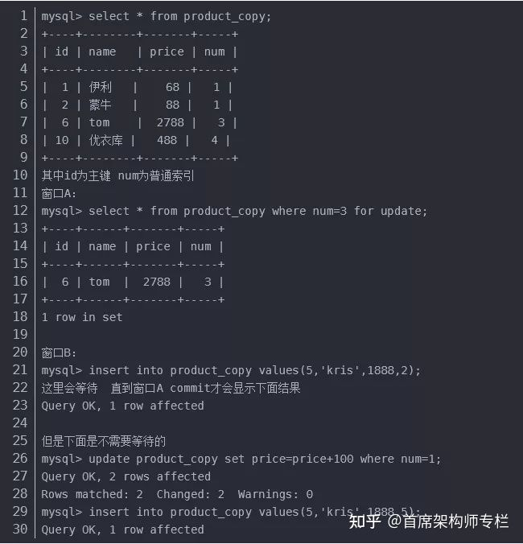

**mysql锁**

[参考知乎](https://zhuanlan.zhihu.com/p/420761461)

[百家号](https://baijiahao.baidu.com/s?id=1714552391233535969&wfr=spider&for=pc)

Mysql中锁的分类按照不同类型的划分可以分成不同的锁，

按照「锁的粒度」划分可以分成：表锁、页锁、行锁；

按照思想的划分：「乐观锁」和「悲观锁」。

下面我们对着这几种划分的锁进行详细的解说和介绍，在了解设计者设计锁的概念的同时，也能深入的理解设计者的设计思想。

## **1. 行锁**

行级锁定最大的特点就是锁定对象的粒度很小，也是目前各大数据库管理软件所实现的锁定颗粒度最小的。由于锁定颗粒度很小，所以发生锁定资源争用的概率也最小，能够给予应用程序尽可能大的并发处理能力而提高一些需要高并发应用系统的整体性能。虽然能够在并发处理能力上面有较大的优势，但是行级锁定也因此带来了不少弊端。由于锁定资源的颗粒度很小，所以每次获取锁和释放锁需要做的事情也更多，带来的消耗自然也就更大了。此外，行级锁定也最容易发生死锁。**使用行级锁定的主要是InnoDB存储引擎。**

### **1.1 共享锁和排他锁**

InnoDB的行级锁定按使用方式同样分为两种类型，共享锁和排他锁，而在锁定机制的实现过程中为了让行级锁定和表级锁定共存，InnoDB也同样使用了意向锁（表级锁定）的概念，也就有了意向共享锁和意向排他锁这两种。意向锁是InnoDB自动加的，不需用户干预。对于UPDATE、DELETE和INSERT语句，InnoDB会自动给涉及数据集加排他锁（X)；对于普通SELECT语句，InnoDB不会加任何锁；事务可以通过以下语句显示给记录集加共享锁或排他锁。

共享锁（S）：SELECT*FROM table_name WHERE ... LOCK IN SHARE MODE

排他锁（X)：SELECT*FROM table_name WHERE ... FORUPDATE

意向共享锁(IS锁):一个事务在获取（任何一行/或者全表）S锁之前，一定会先在所在的表上加IS锁。

意向排他锁(IX锁):一个事务在获取（任何一行/或者全表）X锁之前，一定会先在所在的表上加IX锁。

> IS、IX锁是表级锁，该锁的目的是为了在之后加表级别的S锁和X锁时可以快速判断表中的记录是否被上锁，避免用遍历的方式来查看表中有没有上锁的记录

#### **什么是共享锁？**

共享锁又称读锁 (read lock)，是读取操作创建的锁。其他用户可以并发读取数据，但任何事务都不能对数据进行修改（获取数据上的排他锁），直到已释放所有共享锁。当如果事务对读锁进行修改操作，很可能会造成死锁。

#### **什么是排它锁？**

排他锁 exclusive lock（也叫 writer lock）又称写锁，排它锁是悲观锁的一种实现。

若某个事物对某一行加上了排他锁，只能这个事务对其进行读写，在此事务结束之前，其他事务不能对其进行加任何锁，其他进程可以读取,不能进行写操作，需等待其释放。

若事务 1 对数据对象 A 加上 X 锁，事务 1 可以读 A 也可以修改 A，其他事务不能再对 A 加任何锁，直到事物 1 释放 A 上的锁。这保证了其他事务在事物 1 释放 A 上的锁之前不能再读取和修改 A。排它锁会阻塞所有的排它锁和共享锁。

### **1.2 record lock**，**Gap Lock（间隙锁）、Next-key Lock锁**

在InnoDB中完整行锁包含三部分：**Record Lock**、**Gap Lock（间隙锁）、Next-Key Lock**

#### **1）Record Lock（记录锁）**

单条索引上加锁，record lock 永远锁的是索引，而非数据本身，如果innodb表中没有索引，那么会自动创建一个隐藏的聚集索引，锁住的就是这个聚集索引。所以说当一条sql没有走任何索引时，那么将会在每一条聚集索引后面加X锁，这个类似于表锁，但原理上和表锁应该是完全不同的。

#### **2）Gap Lock（间隙锁）**

间隙锁要么锁住索引记录中间的值，要么锁住第一个索引记录前面的值或最后一个索引记录后面的值。当我们用范围条件而不是相等条件检索数据，并请求共享或排他锁时，InnoDB会给符合条件的已有数据记录的索引项加锁；对于键值在条件范围内但并不存在的记录，叫做“间隙（GAP)”，InnoDB也会对这个“间隙”加锁，这种锁机制就是所谓的间隙锁（GAP Lock）。直接通过例子来说明什么是间隙锁：

通过上面的例子可以看出Gap 锁的作用是在1,3的间隙之间加上了锁。而且并不是锁住了表，我更新num=1，5的数据是可以的.可以看出锁住的范围是（1,3]U[3,4)。

##### **a. 主键索引/唯一索引+当前读会加上Gap锁吗？**

例子说明的其实就是行锁的原因，我只将id=6的行数据锁住了，用Gap锁的原理来解释的话：因为主键索引和唯一索引的值只有一个，所以满足检索条件的只有一行，故并不会出现幻读，所以并不会加上Gap锁。

##### b. 通过范围查询是否会加上Gap锁

其实原因都是一样，只要满足检索条件的都会加上Gap锁。

##### c. 检索条件并不存在的当前读会加上Gap吗？

###### **c1. 等值查询**

原因一样会锁住（4,5]U[5,n）的区间。

###### **c2. 范围查询**

上面的2例子看出当你查询并不存在的数据的时候，mysql会将有可能出现区间全部锁住。

**间隙锁有一个比较致命的弱点**，就是当锁定一个范围键值之后，即使某些不存在的键值也会被无辜的锁定，而造成在锁定的时候无法插入锁定键值范围内的任何数据。在某些场景下这可能会对性能造成很大的危害。

#### **3）Next-Key Lock**

这个锁机制其实就是前面两个锁相结合的机制，既锁住记录本身还锁住索引之间的间隙。

### **1.3 InnoDB行锁优化建议**

**特别注意的事情，innodb 的行锁是在有索引的情况下,没有索引的表是锁定全表的**。在Innodb引擎中既支持行锁也支持表锁，那么什么时候会锁住整张表，什么时候或只锁住一行呢？只有通过索引条件检索数据，InnoDB才使用行级锁，否则，InnoDB将使用表锁！InnoDB存储引擎由于实现了行级锁定，虽然在锁定机制的实现方面所带来的性能损耗可能比表级锁定会要更高一些，但是在整体并发处理能力方面要远远优于MyISAM的表级锁定的。当系统并发量较高的时候，InnoDB的整体性能和MyISAM相比就会有比较明显的优势了。但是，InnoDB的行级锁定同样也有其脆弱的一面，当我们使用不当的时候，可能会让InnoDB的整体性能表现不仅不能比MyISAM高，甚至可能会更差。

#### (1) 要想合理利用InnoDB的行级锁定，做到扬长避短，我们必须做好以下工作：

a)尽可能让所有的数据检索都通过索引来完成，从而避免InnoDB因为无法通过索引键加锁而升级为表级锁定；

b)合理设计索引，让InnoDB在索引键上面加锁的时候尽可能准确，尽可能的缩小锁定范围，避免造成不必要的锁定而影响其他Query的执行；

c)尽可能减少基于范围的数据检索过滤条件，避免因为间隙锁带来的负面影响而锁定了不该锁定的记录；

d)尽量控制事务的大小，减少锁定的资源量和锁定时间长度；

e)在业务环境允许的情况下，尽量使用较低级别的事务隔离，以减少MySQL因为实现事务隔离级别所带来的附加成本。

#### (2) 由于InnoDB的行级锁定和事务性，所以肯定会产生死锁，下面是一些比较常用的减少死锁产生概率的小建议：

a)类似业务模块中，尽可能按照相同的访问顺序来访问，防止产生死锁；

b)在同一个事务中，尽可能做到一次锁定所需要的所有资源，减少死锁产生概率；

c)对于非常容易产生死锁的业务部分，可以尝试使用升级锁定颗粒度，通过表级锁定来减少死锁产生的概率。

## **2. 表锁**

表级别的锁定是MySQL各存储引擎中最大颗粒度的锁定机制。该锁定机制最大的优点是实现逻辑非常简单，带来的系统负面影响最小。所以获取锁和释放锁的速度很快。由于表级锁一次会将整个表锁定，所以可以很好的避免困扰我们的死锁问题。当然，锁定颗粒度大所带来最大的缺点就是出现锁定资源争用的概率也会最高，致使并发度大打折扣。**使用表级锁定的主要是MyISAM，MEMORY，CSV等一些非事务性存储引擎。**由于MyISAM存储引擎使用的锁定机制完全是由MySQL提供的表级锁定实现，所以下面我们将以MyISAM存储引擎作为示例存储引擎。

### **1) MySQL表级锁的锁模式**

MySQL的表级锁有两种模式：表共享读锁（Table Read Lock）和表独占写锁（Table Write Lock）。锁模式的兼容性：

对MyISAM表的读操作，不会阻塞其他用户对同一表的读请求，但会阻塞对同一表的写请求；

对MyISAM表的写操作，则会阻塞其他用户对同一表的读和写操作；

MyISAM表的读操作与写操作之间，以及写操作之间是串行的。当一个线程获得对一个表的写锁后，只有持有锁的线程可以对表进行更新操作。其他线程的读、写操作都会等待，直到锁被释放为止。

### **2) 如何加表锁**

MyISAM在执行查询语句（SELECT）前，会自动给涉及的所有表加读锁，在执行更新操作（UPDATE、DELETE、INSERT等）前，会自动给涉及的表加写锁，这个过程并不需要用户干预，因此，用户一般不需要直接用LOCK TABLE命令给MyISAM表显式加锁。

### **3) MyISAM表锁优化建议**

对于MyISAM存储引擎，虽然使用表级锁定在锁定实现的过程中比实现行级锁定或者页级锁所带来的附加成本都要小，锁定本身所消耗的资源也是最少。但是由于锁定的颗粒度比较大，所以造成锁定资源的争用情况也会比其他的锁定级别都要多，从而在较大程度上会降低并发处理能力。所以，在优化MyISAM存储引擎锁定问题的时候，最关键的就是如何让其提高并发度。由于锁定级别是不可能改变的了，所以我们首先需要尽可能让锁定的时间变短，然后就是让可能并发进行的操作尽可能的并发。

（1）查询表级锁争用情况

（2）缩短锁定时间

如何让锁定时间尽可能的短呢？唯一的办法就是让我们的Query执行时间尽可能的短。

（3）分离能并行的操作

（4）合理利用读写优先级

## **3. 页锁**

页级锁定是MySQL中比较独特的一种锁定级别，在其他数据库管理软件中也并不是太常见。页级锁定的特点是锁定颗粒度介于行级锁定与表级锁之间，所以获取锁定所需要的资源开销，以及所能提供的并发处理能力也同样是介于上面二者之间。另外，页级锁定和行级锁定一样，会发生死锁。**使用页级锁定的主要是BerkeleyDB存储引擎。**

**总的来说，MySQL这3种锁的特性可大致归纳如下：**

表级锁：开销小，加锁快；不会出现死锁；锁定粒度大，发生锁冲突的概率最高，并发度最低；

行级锁：开销大，加锁慢；会出现死锁；锁定粒度最小，发生锁冲突的概率最低，并发度也最高；

页面锁：开销和加锁时间界于表锁和行锁之间；会出现死锁；锁定粒度界于表锁和行锁之间，并发度一般。

**适用范围**：从锁的角度来说，表级锁更适合于以查询为主，只有少量按索引条件更新数据的应用，如Web应用；而行级锁则更适合于有大量按索引条件并发更新少量不同数据，同时又有并发查询的应用，如一些在线事务处理（OLTP）系统。

## **4.** **乐观锁和悲观锁**

**1) 乐观锁**：假设不会发生并发冲突，只在提交操作时检查是否违反数据完整性。在修改数据的时候把事务锁起来，通过version的方式来进行锁定。实现方式：乐一般会使用版本号机制或CAS算法实现。

**乐观锁的优点和不足：**乐观并发控制相信事务之间的数据竞争(data race)的概率是比较小的，因此尽可能直接做下去，直到提交的时候才去锁定，所以不会产生任何锁和死锁。但如果直接简单这么做，还是有可能会遇到不可预期的结果，例如两个事务都读取了数据库的某一行，经过修改以后写回数据库，这时就遇到了问题。

**2) 悲观锁**：假定会发生并发冲突，屏蔽一切可能违反数据完整性的操作。在查询完数据的时候就把事务锁起来，直到提交事务。实现方式：使用数据库中的锁机制。

**悲观锁的优点和不足**：悲观锁实际上是采取了“先取锁在访问”的策略，为数据的处理安全提供了保证，但是在效率方面，由于额外的加锁机制产生了额外的开销，并且增加了死锁的机会。并且降低了并发性；当一个事物所以一行数据的时候，其他事物必须等待该事务提交之后，才能操作这行数据。

**两种锁的使用场景**

从上面对两种锁的介绍，我们知道两种锁各有优缺点，不可认为一种好于另一种，像乐观锁适用于写比较少的情况下（多读场景），即冲突真的很少发生的时候，这样可以省去了锁的开销，加大了系统的整个吞吐量。但如果是多写的情况，一般会经常产生冲突，这就会导致上层应用会不断的进行retry，这样反倒是降低了性能，所以一般多写的场景下用悲观锁就比较合适。

## 死锁

### **01 死锁的产生和预防**

#### 产生条件

发生死锁的**必要条件**有4个，分别为互斥条件、不可剥夺条件、请求与保持条件和循环等待条件，如图1-6所示。

▲图1-6 死锁的必要条件

**1. 互斥条件**

在一段时间内，计算机中的某个资源只能被一个进程占用。此时，如果其他进程请求该资源，则只能等待。

**2. 不可剥夺条件**

某个进程获得的资源在使用完毕之前，不能被其他进程强行夺走，只能由获得资源的进程主动释放。

**3.** **请求与保持条件**

进程已经获得了至少一个资源，又要请求其他资源，但请求的资源已经被其他进程占有，此时请求的进程就会被阻塞，并且不会释放自己已获得的资源。

**4. 循环等待条件**

系统中的进程之间相互等待，同时各自占用的资源又会被下一个进程所请求。例如有进程A、进程B和进程C三个进程，进程A请求的资源被进程B占用，进程B请求的资源被进程C占用，进程C请求的资源被进程A占用，于是形成了循环等待条件，如图1-7所示。

▲图1-7 死锁的循环等待条件

需要注意的是，只有4个必要条件都满足时，才会发生死锁。

处理死锁有4种方法，分别为预防死锁、避免死锁、检测死锁和解除死锁，如图1-8所示。

▲图1-8 处理死锁的方法

#### 如果解决？

**预防死锁：**处理死锁最直接的方法就是破坏造成死锁的4个必要条件中的一个或多个，以防止死锁的发生。

**避免死锁：**在系统资源的分配过程中，使用某种策略或者方法防止系统进入不安全状态，从而避免死锁的发生。

**检测死锁：**这种方法允许系统在运行过程中发生死锁，但是能够检测死锁的发生，并采取适当的措施清除死锁。

**解除死锁：**当检测出死锁后，采用适当的策略和方法将进程从死锁状态解脱出来。

在实际工作中，通常采用有序资源分配法和银行家算法这两种方式来避免死锁，大家可自行了解。

### **02 MySQL中的死锁问题**

1. 尽量让数据表中的数据检索都通过索引来完成，避免无效索引导致行锁升级为表锁。
2. 合理设计索引，尽量缩小锁的范围。
3. 尽量减少查询条件的范围，尽量避免间隙锁或缩小间隙锁的范围。
4. 尽量控制事务的大小，减少一次事务锁定的资源数量，缩短锁定资源的时间。
5. 如果一条SQL语句涉及事务加锁操作，则尽量将其放在整个事务的最后执行。
6. 尽可能使用低级别的事务隔离机制。

