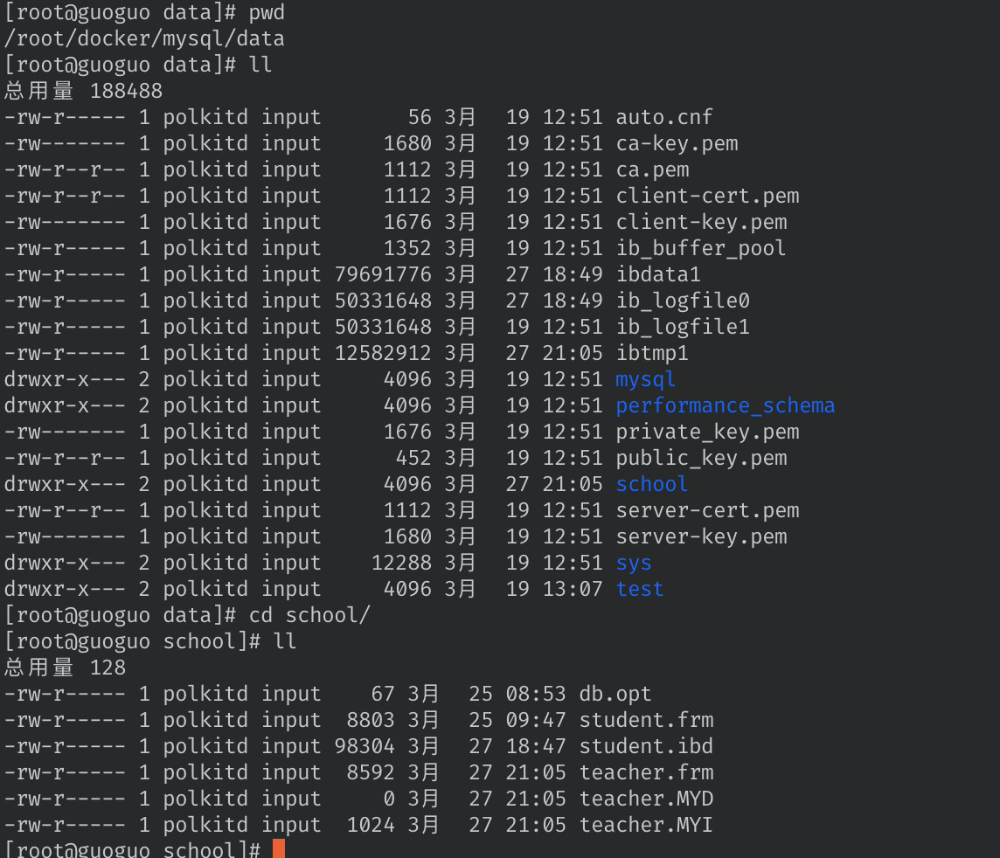
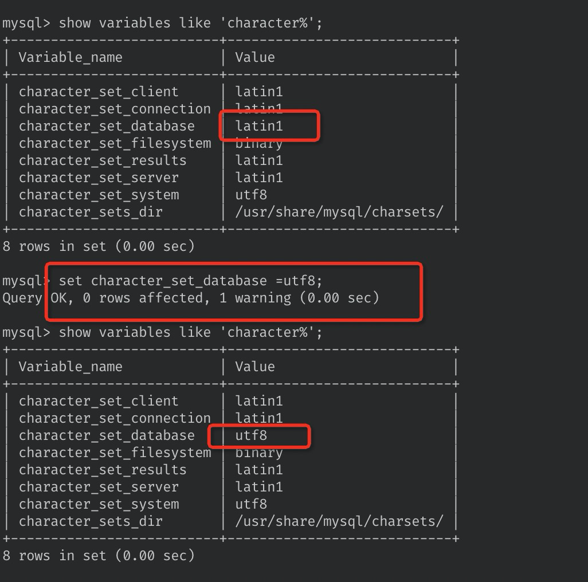
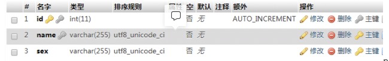
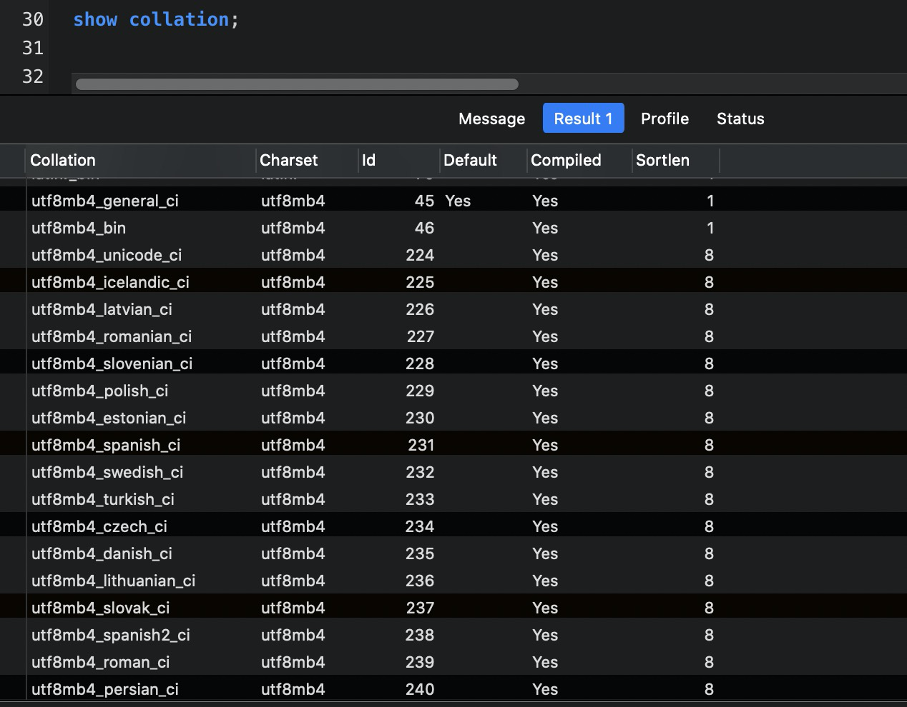

## 2.操作数据库

### 2.1操作数据库

操作数据库 > 操作数据库中的表 > 操作数据库表中的数据

<font color="red">mysql关键字是不区分大小写</font>

1、创建数据库

```sql
CREATE DATABASE [ IF NOT EXISTS ] westos;
```

2、删除数据库

```sql
DROP DATABASE [ IF EXISTS ] westos;
```

3、使用数据库

```sql
#  表名 或者 字段名 有可能是一个特殊字符，就需要带 ``, 建议 表名 或者 字段名 都用``包裹
USE test;
```

4、查看数据库

```sql
# 查看所有的数据库
SHOW DATABASES;
```

*具体语句可以对照可视化软件的历史log来查看Ï*

### 2,2、数据库的列类型

#### 数值

| 类型            | 大小                                     | 备注                                                    |
| --------------- | ---------------------------------------- | ------------------------------------------------------- |
| tinyint         | 1个字节                                  | 十分小的数据                                            |
| smallint        | 2个字节                                  | 较小的数据                                              |
| mediumint       | 3个字节                                  | 中等大小的数据                                          |
| **int/integer** | 4个字节                                  | 标准的整数 【**常用**】                                 |
| bigint          | 8个字节                                  | 较大的数据                                              |
| float           | 4个字节                                  | 浮点数                                                  |
| double          | 8个字节（精度问题）                      | 浮点数                                                  |
| decimal         | 对DECIMAL(M,D) ，如果M>D，为M+2否则为D+2 | 字符串形式的浮点数  金融计算的时候，一般是使用的decimal |

#### 字符串

| 类型       | 大小              | 备注                           |
| ---------- | ----------------- | ------------------------------ |
| **char**   | 0-255 字节        | 定长的字符串                   |
| **varchar** | 0-65535 字节      | 可变长度的字符串，常用的string |
| tinyblob   | 0-255 字节        | 二进制字符串                   |
| tinytext   | 0-255 字节        | 端文本字符串                   |
| blob       | 0-65535 字节      | 二进制形式的长文本数据         |
| **text**   | 0-65535 字节  2的16次方-1 | 长文本数据                     |
| mediumblob | 0-16777215 字节   | 二进制形式的中等长度文本数据   |
| mediumtext | 0-16777215 字节   | 中等长度文本数据               |
| longblob   | 0-4294967295 字节 | 二进制形式的极大文本数据       |
|longtext|0-4294967295 字节|极大文本数据|

char(n) 和 varchar(n) 中括号中 n 代表字符的个数，并不代表字节个数，比如 CHAR(30) 就可以存储 30 个字符。

*一个汉字就是1个字符，ASCII一个汉字2个字节，utf8就是3个字节*

#### 时间日期

| 类型          | 格式                | 备注                             |
| ------------- | ------------------- | -------------------------------- |
| date          | YYYY-MM-DD          | 日期                             |
| time          | HH:MM:SS            | 时间值或者持续时间               |
| year          | YYYY                | 年份值                           |
| **datetime**  | YYYY-MM-DD HH:MM:SS | 混合日期和时间值                 |
| **timestamp** | YYYYMMDD HHMMSS     | 时间戳【1970.1.1到现在的毫秒数】 |

#### null

- 没有值
-  <font color="red">注意：不要用null进行运算，因为结果也是null</font>

### 2.3、数据库的字段属性（重点）

 <font color="red">Unsigned：</font>

- 无符号整数
- 声明了该列不能声明为负数

<font color="red">zerofill：</font>

- 0填充
- 不足的位数，使用0 来填充，int(3)， 5 ---> 005

<font color="red">自增：</font>

- 通常里理解的自增，自动在上一条记录的基础上+1（默认）
- 通常用来设计唯一的主键-index，必须是整数类型
- 可以自定义设计主键自增的起始值和步长

<font color="red">非空：NULL   Not Null</font>

- 假设设置为 not null， 如果不给它赋值，就会报错
- Null，如果不填写值，默认就是null

<font color="red">默认default：</font>

- 设置默认的值
- sex，默认为男，如果不指定该列的值，会有默认的值

拓展：

```sql
/*
	每一个表，都必须有一下几个字段，未来用来做项目使用，标识一个记录存在的意义
	
	id					          主键
	version		          	乐观锁
	is_delete             伪删除
	gmt_create/createdAt  创建时间
	gmt_update/updateAt   更新时间
*/
```

> 1、int(m) :在存储上，也是4个字节，m代表是0填充的位数，
>
> eg：int(4)，如果设置了0填充，那么3 -> 0003
>
> 2、varchar(m):这个是字符长度

### 2.4、创建数据库表

```sql
-- 目标：创建一个school 数据库
-- 创建学生表（列，字段），使用sql进行创建
-- 学号int 登录密码varchar 姓名，性别，出生日期(datetime)，家庭住址，email

-- 注意点，使用英文的(), 表的名称 和 字段 尽量使用 `` 括起来
-- 字符串使用 '' 单引号括起来
-- 所有的语句后面加 `,`  （英文的），最后一个不用加

CREATE TABLE IF NOT EXISTS `student` (
	`id` int(4) NOT NULL AUTO_INCREMENT COMMENT '学号',
	`name` VARCHAR(30) NOT NULL DEFAULT '匿名' COMMENT '姓名',
	`pwd` VARCHAR(20) NOT NULL DEFAULT '12345' COMMENT '密码',
	`sex` VARCHAR(2) NOT NULL DEFAULT '男' COMMENT '性别',
	`birthday` DATETIME DEFAULT NULL COMMENT '出生日期',
	`address` VARCHAR(100) DEFAULT NULL COMMENT '家庭住址 ',
	`email` VARCHAR(50) DEFAULT NULL COMMENT '邮箱',
	PRIMARY KEY(id)
)ENGINE=INNODB DEFAULT CHARSET=utf8mb4
```

#### 格式

```sql
CREATE TABLE [ IF NOT EXISTS ] `表名` (
	`字段名` 列类型 [属性] [索引] [注释],
	`字段名` 列类型 [属性] [索引] [注释],
	...
	`字段名` 列类型 [属性] [索引] [注释],
	PRIMARY KEY(id)
)[表类型][字符集类型][注释]
```

常用的命令

```sql
SHOW CREATE DATABASE `school`; -- 查看创建数据库的语句
SHOW CREATE TABLE `student`; -- 查看school数据表的定义语句
DESC `student`; -- 显示表的结构
```

### 2.5、数据库表的类型

```sql
-- 关于数据库引擎
/*
INNODB 默认使用
MYISAM 早些年使用
*/
```

|                        | MYISAM | INNODB        |
| ---------------------- | ------ | ------------- |
| 事务支持               | 不支持 | 支持          |
| 数据的锁定             | 不支持 | 支持          |
| 外键约束               | 不支持 | 支持          |
| 全文索引               | 支持   | 不支持        |
| 表空间大小             | 较小   | 较大，约为2倍 |
| mvcc【多版本并发控制】 | 不支持 | 支持          |

常规使用操作：

- MYISAM 	节约空间，速度较快【`*.frm` , `*.MYD` , `*.MYI`】
- INNODB     安全性高，事务的处理，多表多用户操作【`*.frm` , *.ibd`` , 上层文件ibdata1文件`】

#### 在物理空间存在的位置

本质：还是文件的存储

MySQL的Data目录结构



#### 1、每一个数据库是一个独立的文件夹 

文件下都有一个`db.opt` 文件，保存数据库的配置信息，比如该库默认的**字符集编码和字符集排序规则**。如果你创建数据库时指定了字符集和排序规则，**后续创建**的表没有指定字符集和排序规则，那么该表将采用db.opt文件中**默认的属性**。

#### 2、MySQL 引擎在物理文件上的区别

- Innodb 在数据库表中有一个*.frm文件和.ibd文件，以及上层目录下的 ibdata1 文件 【设计到.ibd 和 ibdata1的区别】
- MYISAM会有3个对应文件
  - .frm       表结构的定义文件
  - .MYD    数据文件（data）
  - .MYI      索引文件（Index）

#### 3、设置数据库表的字符集编码

```sql
建表语句中的 `CHARSET=utf8`  设置字符集编码
```

不设置的话，会是mysql的默认编码，（不支持中文）

MySQL默认编码是Lantin1，不支持中文

#### 4、修改字符集编码的方式

1、在my.ini中配置默认编码【不建议，因为是物理设置，在迁移中容易忘记，导致配置出问题】

```sql
-- 查看编码
show variables like 'character%';

#编辑mysql的配置文件
vim /etc/my.cnf

#在[mysqld] 下面添加utf8配置
character_set_server = utf8
collation-server=utf8_general_ci

#重启服务
service mysql restart
```

2、直接通过命令来修改编码

```sql
-- 连接数据库
-- 查看编码
show variables like 'character%';
-- 命令设置
set character_set_database =utf8;
set character_set_results =utf8;
set character_set_server =utf8;
set character_set_system =binary;
SET collation_server = utf8_general_ci;
SET collation_database = utf8_general_ci;
```



### 2.6、修改删除表

#### 1、修改【alter关键字】

```sql
-- 修改表 : ALTER TABLE `旧表名` RENAME as `新表名`;
ALTER TABLE `teacher` RENAME as `teacher1`;
-- 增加表的字段: ALTER TABLE `表名` ADD `字段名` 列属性;
ALTER TABLE `teacher1` ADD `age` INT(11);

-- 修改表的字段（重命名，修改约束）
-- ALTER TABLE `表名` MODIFY `列名` 列属性
ALTER TABLE `teacher1` MODIFY `age` VARCHAR(11) -- 修改列的约束
-- ALTER TABLE `表名` CHANGE `旧名字` `新名字` 列约束
ALTER TABLE `teacher1` CHANGE `age` `age1` INT(11) -- 字段重命名

-- 删除表的字段:  ALTER TABLE `表名` DROP `字段名`;
ALTER TABLE `teacher1` DROP `age1`;
```

change和modify的区别

```sql
相同点：都可以修改表的定义和约束
不同点：
1、change后面需要写两次列名，不方便，但可以修改列名称进行重命名。
2、modify则不能修改列名称。
modify更加方便，change除了可以rename列名，其他都一样，改列名就直接物理修改啦，建议用modify
```

#### 2、删除

```sql
-- 删除表（如果存在再删除）
DROP TABLE IF EXISTS `teacher1`;
```

<font color="red">所有的创建和删除操作尽量加上判断，以免报错~ </font>

注意点：

- 字段名，表名，尽量都用飘进行包裹~
- 注释 -- 或者 /** */
- sql的关键字大小写不敏感，建议大家都用小写，因为好辨认
- 所有的符号 全部用英文


## 问：创建数据库或者表的时候的COLLATE是什么？

eg: 如果字符串有 emoji 表情，会导致sql查询或者排序有问题？

```sql
eg：select name from table where binary name = 😍 -- 在where查询字段添加binary关键字，BINARY不是函数，是类型转换运算符，它用来强制它后面的字符串为一个二进制字符串，可以理解为在字符串比较的时候区分大小写 
or eg：select name from table where name = 😍
```


```sql
-- 建库
CREATE DATABASE shop CHARACTER SET utf8 COLLATE utf8_general_ci;

-- 建表
CREATE TABLE `table1` (
    `id` bigint(20) unsigned NOT NULL AUTO_INCREMENT,
    `field1` text COLLATE utf8_unicode_ci NOT NULL COMMENT '字段1',
    `field2` varchar(128) COLLATE utf8_unicode_ci NOT NULL DEFAULT '' COMMENT '字段2',
    PRIMARY KEY (`id`)
) ENGINE=InnoDB DEFAULT CHARSET=utf8mb4 COLLATE=utf8_unicode_ci
```



所谓`utf8_unicode_ci`，其实是用来排序的规则。对于mysql中那些字符类型的列，如`VARCHAR`，`CHAR`，`TEXT`类型的列，都需要有一个`COLLATE`类型来告知mysql如何对该列进行排序和比较。简而言之，**COLLATE会影响到ORDER BY语句的顺序，会影响到WHERE条件中大于小于号筛选出来的结果，会影响**`**DISTINCT**`**、**`**GROUP BY**`**、**`**HAVING**`**语句的查询结果**。另外，mysql建索引的时候，如果索引列是字符类型，也**会影响索引创建**，只不过这种影响我们感知不到。总之，**凡是涉及到字符类型比较或排序的地方，都会和COLLATE有关**。

### 各种COLLATE的区别

> `COLLATE`通常是和数据编码（`CHARSET`）相关的，一般来说每种`CHARSET`都有多种它所支持的`COLLATE`，并且每种`CHARSET`都指定一种`COLLATE`为默认值。例如`Latin1`编码的默认`COLLATE`为`latin1_swedish_ci`，`GBK`编码的默认`COLLATE`为`gbk_chinese_ci`，`utf8mb4`编码的默认值为`utf8mb4_general_ci`。

这里顺便讲个题外话，mysql中有`utf8`和`utf8mb4`两种编码，***\*在mysql中请大家忘记\****`**utf8**`***\*，永远使用\****`**utf8mb4**`。这是mysql的一个遗留问题，mysql中的`utf8`最多只能支持3bytes长度的字符编码，对于一些需要占据4bytes的文字，mysql的`utf8`就不支持了，要使用`utf8mb4`才行。

很多`COLLATE`都带有`_ci`字样，这是Case Insensitive的缩写，即大小写无关，也就是说"A"和"a"在排序和比较的时候是一视同仁的。`selection * from table1 where field1="a"`同样可以把field1为"A"的值选出来。与此同时，对于那些`_cs`后缀的`COLLATE`，则是Case Sensitive，即大小写敏感的。

在mysql中使用`show collation`指令可以查看到mysql所支持的所有`COLLATE`。以`utf8mb4`为例，该编码所支持的所有`COLLATE`如下图所示



在国内比较常用的是`utf8mb4_general_ci`（默认）、`utf8mb4_unicode_ci`、`utf8mb4_bin`这三个。我们来探究一下这三个的区别：

首先`utf8mb4_bin`的比较方法其实就是直接将所有字符看作二进制串，然后从最高位往最低位比对。所以很显然它是区分大小写的。

而`utf8mb4_unicode_ci`和`utf8mb4_general_ci`对于中文和英文来说，其实是没有任何区别的。对于我们开发的国内使用的系统来说，随便选哪个都行。只是对于某些西方国家的字母来说，`utf8mb4_unicode_ci`会比`utf8mb4_general_ci`更符合他们的语言习惯一些，`general`是mysql一个比较老的标准了。例如，德语字母`“ß”`，在`utf8mb4_unicode_ci`中是等价于`"ss"`两个字母的（这是符合德国人习惯的做法），而在`utf8mb4_general_ci`中，它却和字母`“s”`等价。不过，这两种编码的那些微小的区别，对于正常的开发来说，很难感知到。本身我们也很少直接用文字字段去排序，退一步说，即使这个字母排错了一两个，真的能给系统带来灾难性后果么？从网上找的各种帖子讨论来说，更多人推荐使用`utf8mb4_unicode_ci`，但是对于使用了默认值的系统，也并没有非常排斥，并不认为有什么大问题。结论：推荐使用`utf8mb4_unicode_ci`，对于已经用了`utf8mb4_general_ci`的系统，也没有必要花时间改造。

### COLLATE设置级别及其优先级

如果全都显示设置了，那么优先级顺序是 SQL语句 > 列级别设置 > 表级别设置 > 库级别设置 > 实例级别设置。也就是说列上所指定的`COLLATE`可以覆盖表上指定的`COLLATE`，表上指定的`COLLATE`可以覆盖库级别的`COLLATE`。如果没有指定，则继承下一级的设置。即列上面没有指定`COLLATE`，则该列的`COLLATE`和表上设置的一样

参考：https://blog.csdn.net/HD243608836/article/details/119957403

参考： https://stackoverflow.com/questions/41147829/how-can-i-search-by-emoji-in-mysql-using-utf8mb4


