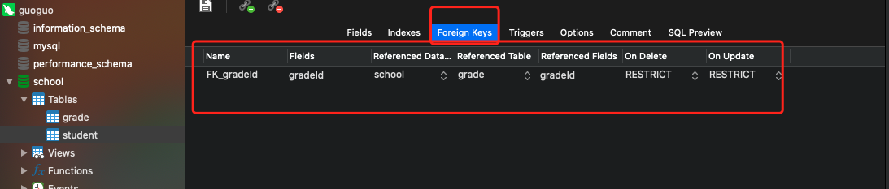

## 3、MySQL数据管理

### 3.1、外键（了解即可）



#### 1、方式一、创建表的时候带有外键关系，添加约束（，麻烦，比较复杂）

```sql
CREATE TABLE IF NOT EXISTS `grade` (
	`gradeId` int(4) NOT NULL AUTO_INCREMENT COMMENT '年级ID',
	`gradeName` VARCHAR(30) NOT NULL COMMENT '年级名称',
	PRIMARY KEY(`gradeId`)
)ENGINE=INNODB DEFAULT CHARSET=utf8mb4;

-- 学生表的 gradeId 字段，要去引用的年级表的 gradeId
-- 定义外键key
-- 给这个外键添加约束（执行引用）。references 引用
CREATE TABLE IF NOT EXISTS `student` (
	`id` int(4) NOT NULL AUTO_INCREMENT COMMENT '学号',
	`name` VARCHAR(30) NOT NULL DEFAULT '匿名' COMMENT '姓名',
	`pwd` VARCHAR(20) NOT NULL DEFAULT '12345' COMMENT '密码',
	`sex` VARCHAR(2) NOT NULL DEFAULT '男' COMMENT '性别',
	`birthday` DATETIME DEFAULT NULL COMMENT '出生日期',
	`address` VARCHAR(100) DEFAULT NULL COMMENT '家庭住址 ',
	`email` VARCHAR(50) DEFAULT NULL COMMENT '邮箱',
	`gradeId` int(4) NOT NULL COMMENT '年级ID',
	PRIMARY KEY(id),
	KEY `FK_gradeId` (`gradeId`),
	CONSTRAINT `FK_gradeId` FOREIGN KEY (`gradeId`) REFERENCES `grade` (`gradeId`)
)ENGINE=INNODB DEFAULT CHARSET=utf8mb4;
```

*删除有外键关系的表的时候，必须要先删除引用别人的表（从表），再删除被引用的表（主表）*

#### 2、方式二、创建表成功后，手动添加外键关系

```sql
CREATE TABLE IF NOT EXISTS `grade` (
	`gradeId` int(4) NOT NULL AUTO_INCREMENT COMMENT '年级ID',
	`gradeName` VARCHAR(30) NOT NULL COMMENT '年级名称',
	PRIMARY KEY(`gradeId`)
)ENGINE=INNODB DEFAULT CHARSET=utf8mb4;

-- 学生表的 gradeId 字段，要去引用的年级表的 gradeId
-- 定义外键key
-- 给这个外键添加约束（执行引用）。references 引用
CREATE TABLE IF NOT EXISTS `student` (
	`id` int(4) NOT NULL AUTO_INCREMENT COMMENT '学号',
	`name` VARCHAR(30) NOT NULL DEFAULT '匿名' COMMENT '姓名',
	`pwd` VARCHAR(20) NOT NULL DEFAULT '12345' COMMENT '密码',
	`sex` VARCHAR(2) NOT NULL DEFAULT '男' COMMENT '性别',
	`birthday` DATETIME DEFAULT NULL COMMENT '出生日期',
	`address` VARCHAR(100) DEFAULT NULL COMMENT '家庭住址 ',
	`email` VARCHAR(50) DEFAULT NULL COMMENT '邮箱',
	`gradeId` int(4) NOT NULL COMMENT '年级ID',
	PRIMARY KEY(id)
)ENGINE=INNODB DEFAULT CHARSET=utf8mb4;

-- 创建表的时候没有外键关系
Alter TABLE `student`
ADD CONSTRAINT `FK_gradeId` FOREIGN KEY(`gradeId`) REFERENCES `grade`(`gradeId`);

-- ALTER TABLE `表名` ADD CONSTRAINT `约束名` FOREIGN KEY(`作为外键的列`) REFERENCES `引用的表`(`引用标的字段`);
```

以上的操作都是物理外键，数据级别的外键，我们不建议使用！（避免数据过多造成困扰，这里了解即可）

<font color="red">最佳实践</font>

- 数据库就是单纯的表，只用来存数据，只有行（数据）和列（字段）
- 我们想使用多张表的，想使用外键（程序去实现）


### 3.2、DML语言（全部记住）

**数据库的意义**：数据存储。数据管理

DML语言，数据操作语言

- insert
- update
- delete

### 3.3、添加【insert】

```sql
-- 插入语句
-- insert into `表名`([字段名，字段名...]) values ('值1', '值2',...),[('值1', '值2',...),,,];
INSERT INTO `grade`(`gradeName`) VALUES ('大四');

INSERT INTO `grade`(`gradeId`,`gradeName`) VALUES (2, '大四');

-- 插入多个字段
INSERT into `grade`(`gradeName`) VALUES ('二年级'),('三年级')

-- 如果不指定字段名，就按照表的结构value值，一一匹配
INSERT INTO `grade` VALUES (6, '大三');
-- 自增id这列可以不写，会自动填充，或者写具体的值，或者写null，都会自增
INSERT INTO `grade` VALUES (null, '大三');
```

语法：**insert into `表名`([字段名，字段名...]) values ('值1', '值2',...),[('值1', '值2',...),,,];**

注意事项：

1. 字段和字段之间使用 `英文逗号` 隔开
2. 字段是可以省略的，但是后面的值要一一对应，不能少
3. 可以同时插入多条数据，VALUES后面跟多个值，需要使用  `英文逗号` 隔开即可 **VALUAES(...) , (....)**


### 3.4、修改【update】

> Update  修改谁？（条件 ） set 原来的值 = 新值

```sql
-- 修改学员的名字
UPDATE student SET `name`='guoguo' WHERE id = 1;

-- 不指定条件的情况下，会修改表的所有行
UPDATE student SET `name`='长江7号';

-- 修改多个属性，用逗号隔开
UPDATE student SET `name`='哈哈', email="187...@qq.com" WHERE id = 1;

-- 语法
-- UPDATE 表名 SET `列名`='值', [`列名`='值', ...] WHERE [条件];
```

条件： where 子句，运算符 id = 某个值，大于 或者 在某个区间进行修改

**操作符会返回 布尔值**

| 操作符           | 含义         | 范围        | 结果  |
| ---------------- | ------------ | ----------- | ----- |
| =                | 等于         | 5=6         | false |
| <> 或 !=         | 不等于       | 5<>6        | true  |
| >                |              |             |       |
| <                |              |             |       |
| >=               |              |             |       |
| <=               |              |             |       |
| BETWEEN...AND... | 在某个范围内 | [ 2, 5 ]    |       |
| AND              | 我和你 &&    | 5>1 and 1>2 | false |
| OR               | 我或你  \|\| | 5>1 or 1>2  | true  |

```sql
--  通过多个条件定位数据
UPDATE student SET `name`="guoguo" WHERE `name`="长江7号" AND pwd="12345" AND id=4;

-- 语法
UPDATE 表名 SET `列名`=名字, [`列名`=名字, ...] WHERE [ 条件 ]; 
```

注意：

- 列名 是数据库的列，尽量待上飘`` 
- 条件，筛选的条件，如果没有指定，则会修改所有的列
- value，是一个具体的值，也可以是一个变量
- 多个修改set的属性之间，使用英文逗号隔开

```sql
--  通过多个条件定位数据
UPDATE student SET `name`="果果2号", birthday=CURRENT_TIME WHERE `name`="guoguo" AND pwd="12345" AND id=4;
```


### 3.5、删除【delete 和 truncate】

> delete 命令

```sql
-- 删除数据（避免这么写）
DELETE FROM student;

-- 删除指定数据
DELETE FROM student WHERE id = 1;
```

> truncate 命令

作用：完全清空一个数据库表，表的结构和索引约束不会变！

```sql
-- 清空某个表
TRUNCATE student;
```

#### **delete 和 truncate 的区别**

- 相同点： 都是能删除数据，都不会删除表结构
- 不同点：
  - truncate 重新设置，自增列，计数器会归零
  - truncate 不会影响事务，在事务中也无法进行回滚

```sql
-- 测试delete 和 truncate 的区别
CREATE TABLE `test`(
	`id` INT(4) NOT NULL AUTO_INCREMENT,
	`coll` VARCHAR(20) NOT NULL,
	PRIMARY KEY(`id`)
) ENGINE=INNODB DEFAULT CHARSET=utf8;

INSERT INTO `test`(`coll`) VALUES('1'),('2'),('3'),('4'),('5');
DELETE FROM `test`;  -- 不会影响自增
TRUNCATE TABLE `test`; -- 自增会归零
```

DELETE 删除是的问题，重启数据库，现象

- InnoDB：  自增列会重1开始，（这个数据存在内存中的，断电就会消失）
- MyISAM：继续从上一个自增量开始（是存在文件中的，不会丢失）


