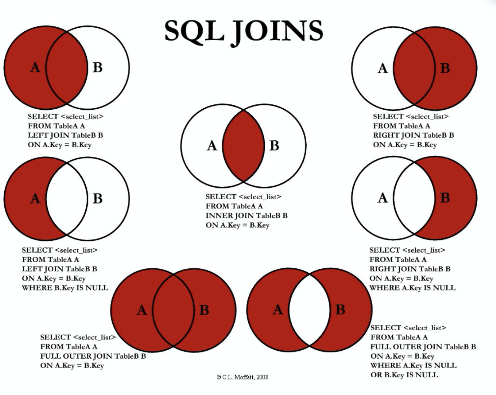

## 4.DQL查询数据（最重点）

### 4.1、DQL

（data query language: 数据库查询语言）

- 所有的查询操作都用它，Select
- 简单的查询，复杂的查询它都能做
- <font color="red">数据库中最核心的语言，最重要的语句</font>
- 使用频率最高的语句

#### select语法

```
SELECT [ALL | DISTINCT]
{* | table.* | [table.field1[as alias1][,table.field2[as alias2]][,...]]}
FROM table_name [as table_alias]
  [left | right | inner join table_name2]  -- 联合查询
  [WHERE ...]  -- 指定结果需满足的条件
  [GROUP BY ...]  -- 指定结果按照哪几个字段来分组
  [HAVING]  -- 过滤分组的记录必须满足的次要条件
  [ORDER BY ...]  -- 指定查询记录按一个或多个条件排序
  [LIMIT {[offset,]row_count | row_countOFFSET offset}];
   -- 指定查询的记录从哪条至哪条
```

### 4.2、查询指定字段

```sql
-- 查询全部的学生， SELECT 字段 FROM 
SELECT * from student;

-- 查询指定字段
SELECT StudentNo, StudentName FROM student;

-- 别名，给结果起一个名字 AS 可以给字段起别名，也可以给表起别名
SELECT StudentNo AS '学号', StudentName AS '学生姓名' from student AS stu;

-- 函数 concat(a,b) 字符串拼接
SELECT CONCAT('姓名：',StudentName) AS '新名字' FROM student;
```

有时候，列的名字并不是见名知意，我们起比别名 AS 

- 字段名  AS   别名
- 表名     AS    别名

#### 去重【distinct】

作用：去除SELECT查询出来的结果中有重复的数据，重复的数据只保留一条

```sql
-- 查询一共有哪些同学参加了考试
SELECT * FROM result; -- 查询全部的考试成绩；
SELECT StudentNo FROM result; -- 查询有哪些同学参加了考试；
SELECT DISTINCT StudentNo FROM result;  -- 发现重复数据，去重
```

#### 数据库的列（表达式）

```sql
SELECT VERSION(); -- 查询系统版本（函数）
SELECT 100*3-1 AS '计算结果'; -- 用来计算 （表达式）
SELECT @@auto_increment_increment; -- 查询自增步长（变量）

-- 学员考试成绩+1分
SELECT StudentNo, StudentResult + 1 as '提分' FROM result;
```

<font color='red'>数据库中表达式：文本值，列，null，函数，计算表达式，系统变量...</font>

用法：select `表达式` from 表

### 4.3、where条件子句

作用：检索条件中符合条件的值

检索的条件是由一个或者多个表达式组成，结果是个布尔值！

#### 逻辑运算符

| 运算符      | 语法                    | 描述                              |
| ----------- | ----------------------- | --------------------------------- |
| and   &&    | a and b      a && b     | 逻辑与，2个都为真，结果为真       |
| or     \|\| | a or b         a \|\| b | 逻辑或，2个中有一个为真，结果为真 |
| not   ！    | not a          !a       | 逻辑非，真为假，假为真            |

<font color='red'>尽量使用英文字母，sql里大部分都是英文</font>

```sql
-- =========满足条件的查询(where)===========
SELECT Studentno,StudentResult FROM result;

-- 查询考试成绩在95-100之间的
SELECT Studentno,StudentResult FROM result WHERE StudentResult>=95 AND StudentResult<=100;

-- AND也可以写成 &&
SELECT Studentno,StudentResult FROM result WHERE StudentResult>=95 && StudentResult<=100;

-- 模糊查询(对应的词:精确查询)
SELECT Studentno,StudentResult FROM result WHERE StudentResult BETWEEN 95 AND 100;

-- 除了1000号同学,要其他同学的成绩
SELECT studentno,studentresult FROM result WHERE studentno!=1000;

-- 使用NOT
SELECT studentno,studentresult FROM result WHERE NOT studentno=1000;
```

#### 比较运算符

| 运算符           | 语法              | 描述                                           |
| ---------------- | ----------------- | ---------------------------------------------- |
| is null          | a is null         | 如果操作符是null，结果为真                     |
| is not null      | a is not null     | 如果操作符不为null，结果为真                   |
| between...and... | a between b and c | a在b和c之间，结果为真                          |
| like             | a like b          | sql匹配，如果a匹配到b，结果为真，与&_ 结合使用 |
| in               | in [....]         | 在[a1,a2,a3....]中的某个值，结果为真           |

```sql
-- 模糊查询 between and \ like \ in \ null

-- =============================================
-- LIKE
-- =============================================
-- 查询姓刘的同学的学号及姓名
-- like结合使用的通配符 : % (代表0到任意个字符) _ (一个字符)
SELECT * FROM student WHERE StudentName LIKE '刘%';

-- 查询姓刘的同学,后面只有一个字的
SELECT * FROM student WHERE StudentName LIKE '刘_';

-- 查询姓刘的同学,后面只有两个字的
SELECT * FROM student WHERE studentname LIKE '刘__';

-- 查询姓名中含有 大 字的
SELECT * FROM student WHERE studentname LIKE '%大%';

-- 查询姓名中含有特殊字符的需要使用转义符号 '\'
-- 自定义转义符关键字: ESCAPE ':'

-- =============================================
-- IN: 里面的值是精准匹配
-- =============================================
-- 查询学号为1000,1001,1002的学生姓名
SELECT * FROM student WHERE studentno IN (1000,1006,1007);

-- 查询地址在北京,南京,河南洛阳的学生
SELECT * FROM student WHERE address IN ('北京','南京','河南洛阳');

-- =============================================
-- NULL 空
-- =============================================
-- 查询出生日期没有填写的同学
-- 不能直接写=NULL , 这是代表错误的 , 用 is null
SELECT * FROM student WHERE BornDate IS NULL;

-- 查询出生日期填写的同学
SELECT * FROM student WHERE BornDate IS NOT NULL;

-- 查询没有写家庭住址的同学(空字符串不等于null)
SELECT * FROM student WHERE Address='' OR Address IS NULL;
```

### 4.4、联表查询【join】

#### join

##### join有5中连接方式：

- 内连接(inner join…on…)
- 左连接（left join…on…)
- 右连接（right join…on…)
- 全外连接（full join…on…)
  - 全外连接其实是左连接和右连接的一个合集，也就是说他会查询出左表和右表的全部数据，匹配不上的会显示为null
- 交叉连接(cross join …on…) 
  - 交叉连接，也称为笛卡尔积，查询返回结果的行数等于两个表行数的乘积。



```sql
-- ============联表查询==============
-- 查询 参加了考试的同学（学号，姓名，科目编号，分数）
SELECT * FROM student;
SELECT * FROM result;

/*思路：
1、分析需求，分析查询的字段来自哪一张表，（连接查询）
2、确定使用那种连接查询？7种
确定交叉点（这2张表中的哪些数据是相同的）
判断条件： 学生表的中的 studentNo = 成绩表的 studentNo
*/

-- join (连接的表) on（判断的条件） 连接查询, 会生成临时表
-- where 等值查询 ，在临时表生成好之后，进行等值查询

-- 普通 where 连接
SELECT s.StudentNo, StudentName, SubjectNo, StudentResult FROM student AS s ,result AS r 
WHERE s.StudentNo = r.StudentNo; 

-- inner join 
-- 和上面普通的效果一样
SELECT s.StudentNo, StudentName, SubjectNo, StudentResult FROM student AS s 
INNER JOIN result AS r 
WHERE s.StudentNo = r.StudentNo; 

-- right join
SELECT s.StudentNo, StudentName, SubjectNo, StudentResult FROM student AS s 
RIGHT JOIN result AS r 
on s.StudentNo = r.StudentNo; 

-- left join
SELECT s.StudentNo, StudentName, SubjectNo, StudentResult FROM student AS s 
LEFT JOIN result AS r 
on s.StudentNo = r.StudentNo; 

-- 查询缺考的学生
SELECT s.StudentNo, StudentName, SubjectNo, StudentResult FROM student AS s 
LEFT JOIN result AS r 
on s.StudentNo = r.StudentNo
WHERE StudentResult is NULL; 

-- 查询参加考试的同学（学号，姓名，科目编号，科目名，分数）
SELECT s.StudentNo, StudentName, SubjectName, StudentResult FROM student AS s 
RIGHT JOIN result AS r 
ON s.StudentNo = r.StudentNo
-- INNER JOIN `subject` sub
LEFT JOIN `subject` sub
ON r.SubjectNo = sub.SubjectNo;


-- 要点： 我要查询哪些数据 select ....
-- 从哪几张表中查 from 表  xxx join 连接的表  on 交叉条件
-- 假设存在一种或者多张表查询，慢慢来，先查询2张表，然后再慢慢的增加

-- from a left join b
-- from a right  join b
```

| 操作       | 描述                                       |
| ---------- | ------------------------------------------ |
| inner join | 如果2张表中至少有一个匹配，会就返回，交集  |
| left join  | 会从左表中返回所有的值，即使右表中没有匹配 |
| right join | 会从右表中返回所有的值，即使左表中没有匹配 |

####  自连接

```sql
/*
自连接
   数据表与自身进行连接

需求:从一个包含栏目ID , 栏目名称和父栏目ID的表中
    查询父栏目名称和其他子栏目名称
*/
```

```sql
-- 创建sql
CREATE TABLE `category`(
 `categoryid` INT(10) UNSIGNED NOT NULL AUTO_INCREMENT COMMENT '主题id',
 `pid` INT(10) NOT NULL COMMENT '父id',
 `categoryname` VARCHAR(50) NOT NULL COMMENT '主题名字',
PRIMARY KEY (`categoryid`) 
 ) ENGINE=INNODB  AUTO_INCREMENT=9 DEFAULT CHARSET=utf8; 

INSERT INTO `category` (`categoryid`, `pid`, `categoryname`) 
VALUES ('2','1','信息技术'),
('3','1','软件开发'),
('5','1','美术设计'),
('4','3','数据库'),
('8','2','办公信息'),
('6','3','web开发'),
('7','5','ps技术');

-- 编写SQL语句。将栏目中的父子关系呈现出来，（父栏目名称和子栏目名称）
-- 核心： 就是把一下账表看成两张表一模一样的表，然后将这2张变进行连接查询（自连接）
SELECT a.categoryName AS '父栏目', b.categoryName AS '子栏目'
FROM category AS a, category AS b
WHERE a.categoryid = b.pid;
```

### 4.5、分页和排序

> 排序

```sql
-- 排序： 升序ASC 降序DESC
-- ORDER BY 通过那个字段排序，怎么排
-- 查询的结果根据 成绩降序 排序
SELECT s.StudentNo, s.StudentName, sub.SubjectName, StudentResult 
FROM student s 
INNER JOIN result r
ON s.StudentNo = r.StudentNo
INNER JOIN `subject` sub
ON r.SubjectNo = sub.SubjectNo
WHERE sub.SubjectNo = 1
ORDER BY StudentResult DESC
```

> 分页

```sql
语法： `limit( 查询的起始下标 , pageSize)`
-- 100万条数据
-- 为什么要分页
-- 缓解数据库的压力，给人更好的体验，瀑布流

-- 分页，每页只显示5条数据
-- 语法，limit 起始值，页面的大小
-- 网页应用： 当前的页数，每页的条数，页面的大小
-- limit 0，5   1-5
-- limit 1，5   2-6
SELECT s.StudentNo, s.StudentName, sub.SubjectName, StudentResult 
FROM student s 
INNER JOIN result r
ON s.StudentNo = r.StudentNo
INNER JOIN `subject` sub
ON r.SubjectNo = sub.SubjectNo
WHERE sub.SubjectNo = 1
ORDER BY StudentResult DESC
LIMIT 1,1

-- 第1页 limit 0，5
-- 第2页 limit 5，5
-- 第3页 limit 10，5
-- 第N页 limit (n-1) * pageSize, pageSize
-- [pageSize: 页面大小]
-- [(n-1)*pageSize: 起始值]
-- [n: 当前页]
-- [数据总数/页面大小 = 总页数]
```

### 4.6、子查询和嵌套查询

where（这个值是计算出来的）

本质：`在where语句中嵌套一个子查询语句,可以无限的嵌套`

```sql
-- ================ where ===============
-- 1、查询查询数据库中的 subjectNo = 1的考试结果(学号，科目编号，成绩) 降序排列
-- 方式一、使用连接查询
SELECT StudentNo, SubjectName, StudentResult
FROM result r
INNER JOIN `subject` sub
ON r.SubjectNo = sub.SubjectNo
WHERE sub.SubjectNo = 1
ORDER BY StudentResult DESC;

-- 方式二、使用子查询(由里即外)
-- 查询所有subje ctNo = 1 的学生的学号
SELECT StudentNo, SubjectNo, StudentResult
FROM result r
WHERE SubjectNo = (SELECT SubjectNo FROM `subject` WHERE SubjectNo = 1)
ORDER BY StudentResult DESC;

-- 练习
-- 分数不小于80分，subjectNo=1000的学生的学号和姓名
SELECT DISTINCT s.StudentNo, StudentName, SubjectNo,StudentResult 
FROM student s
INNER JOIN result r
ON s.StudentNo = r.StudentNo
WHERE StudentResult >= 80 AND SubjectNo = 1;

-- 改造
SELECT DISTINCT s.StudentNo, StudentName, SubjectNo,StudentResult 
FROM student s
INNER JOIN result r
ON s.StudentNo = r.StudentNo
WHERE StudentResult >= 80 AND SubjectNo = (
	SELECT SubjectNo FROM `subject` WHERE SubjectName = '高等数学-1'
);

-- 继续改造
SELECT DISTINCT StudentNo, StudentName 
FROM student 
WHERE StudentNo IN (
	SELECT StudentNo FROM result WHERE StudentResult > 80 AND SubjectNo = (
		SELECT SubjectNo FROM `subject` WHERE SubjectName = '高等数学-1'
	)
)
```

### 4.7、分组和过滤

```sql
-- 查询不同课程的平均分，最高分，最低分，平均分大于 20
-- 核心： 根据不同的课程进行分组
SELECT SubjectName, AVG(StudentResult) AS 平均分, MAX(StudentResult), MIN(StudentResult)
FROM result r
INNER JOIN `subject` sub
ON r.SubjectNo = sub.SubjectNo
GROUP BY r.SubjectNo -- 通过什么字段来查
HAVING 平均分 > 20
```


