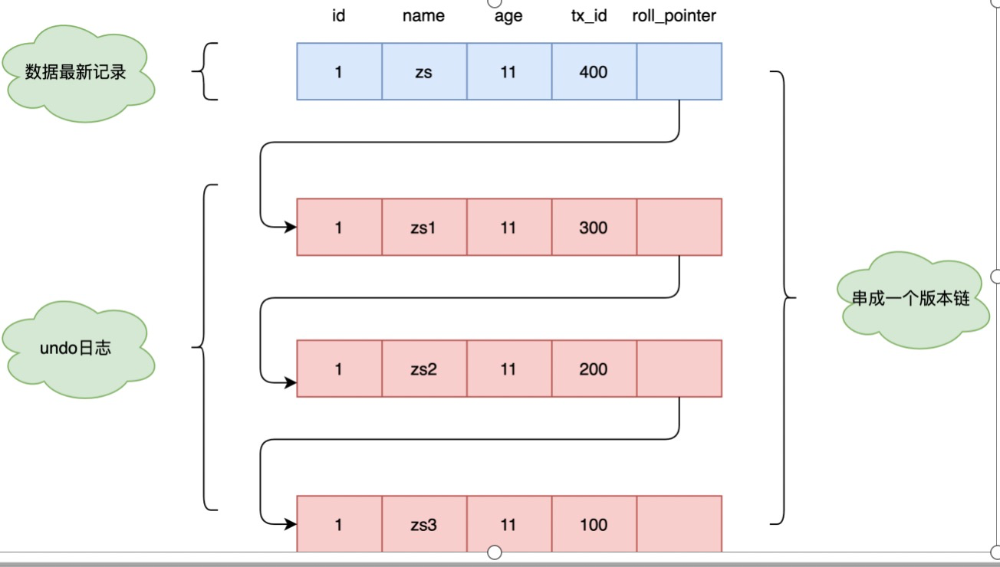

## 6.事务

### 6.1 、什么是事务

重点：<font color='red'>要么都成功，要么都失败</font>

1、SQL执行  A 给 B 转账200，A减少200元  

2、SQL执行， B 收到 A的转账， B增加200元

#### 事务4大原则《ACID原则》

> 原子性、一致性、隔离性（脏读，幻读，不可重复读。。。。）、持久性      

具体参考，网搜数据库acid原则

##### 原子性（Atomicity）

事务的整体是一个不可分割的单位，要么都成功，要么都失败，a给b转账，a扣款，断电了，b没有收到款

##### 一致性（Consistency）

事务前后的数据整体性保持一致，转账前后金额的数据是一致的

##### 持久性（Durability）

事务一旦提交则不可逆，被持久化到数据库，不会被回滚

##### 隔离性（Isolation）

数据的隔离性是多个用户访问数据库时，数据库为每一个用户开启的事务，不能被其他事务的操作数据所干扰，事务之间要相互隔离

> 隔离所导致的一些问题

###### 脏读

一个事务读取了另一个事务未提交的数据，而这个数据是有可能回滚的；

###### 不可重复读

在数据库访问中，一个事务范围内两个相同的查询却返回了不同数据。这是由于查询时系统中其他事务修改的提交而引起的

###### 幻读

事务不是独立执行时发生的一种现象，例如第一个事务对一个表中的数据进行了修改，这种修改涉及到表中的全部数据行。同时，第二个事务也修改这个表中的数据，这种修改是向表中插入一行新数据。那么，以后就会发生操作第一个事务的用户发现表中还有没有修改的数据行，就好象发生了幻觉一样.

###### 丢失更新

两个事务同时读取同一条记录，A先修改记录，B也修改记录（B是不知道A修改过），B提交数据后B的修改结果覆盖了A的修改结果。

### 数据库的隔离级别

为了避免上述几种事务之间的影响，SQL Server通过设置不同的隔离级别来进行不同程度的避免。因为高的隔离等级意味着更多的锁，从而牺牲性能。所以这个选项开放给了用户根据具体的需求进行设置。不过默认的隔离级别Read Commited符合了多数的实际需求.

| **隔离级别**              | **脏读** | **丢失更新** | **不可重复读** | **幻读** | **并发模型** | **更新冲突检测** |
| ------------------------- | -------- | ------------ | -------------- | -------- | ------------ | ---------------- |
| 未提交读：Read Uncommited | 是       | 是           | 是             | 是       | 悲观         | 否               |
| 已提交读：Read commited   | 否       | 是           | 是             | 是       | 悲观         | 否               |
| 可重复读：Repeatable Read | 否       | 否           | 否             | 是       | 悲观         | 否               |
| 可串行读：Serializable    | 否       | 否           | 否             | 否       | 悲观         | 否               |

**SQL Server隔离事务之间的影响是通过锁来实现的，通过阻塞来阻止上述影响。不同的隔离级别是通过加不同的锁，造成阻塞来实现的，所以会以付出性能作为代价；安全级别越高，处理效率越低；安全级别越低，效率高。**

​    **\*使用方法：\***SET TRANSACTIONISOLATION LEVEL REPEATABLE READ

#### 未提交读

在读数据时不会检查或使用任何锁。因此，在这种隔离级别中可能读取到没有提交的数据。 

#### 已提交读【默认】

只读取提交的数据并等待其他事务释放排他锁。读数据的共享锁在读操作完成后立即释放。已提交读是SQL Server的默认隔离级别。 

#### 可重复读 

像已提交读级别那样读数据，但会保持共享锁直到事务结束。 

####  可串行读

工作方式类似于可重复读。但它不仅会锁定受影响的数据，还会锁定这个范围。这就阻止了新数据插入查询所涉及的范围。


### 6.2、执行事务

```sql
-- mysql 是默认开始事务自动提交的
SET autocommit = 0 /* 关闭 */
SET autocommit = 1 /* 开启 */

-- 手动处理事务
START TRANSACTION -- 标记一个事务的开始，从这个之后的 sql 都在一个事务里

-- 操作的sql
INSERT xxx;
INSERT xxx;

-- 提交，持久化（成功）
COMMIT；

-- 回滚，回到原来的样子（失败）
ROLLBACK；

-- 事务结束
SET autocommit = 1 -- 开启自动提交

-- 了解
SAVEPOINT 保存事务点名 -- 设置一个事务的保存点
ROLLBACK TO 保存事务点名 -- 回滚到保存点
RELEASE SAVEPOINT 保存事务点名 -- 撤销保存点

```

#### 测试：模拟转账

```sql
-- 转账
CREATE DATABASE shop CHARACTER SET utf8 COLLATE utf8_general_ci;
USE shop;

CREATE TABLE `account` (
	`id` int(3) not null auto_increment,
	`name` varchar(30) not null,
	`money`  decimal(9,2) not null, --  第一个参数是总位数，第2个参数为小数点的位数，整数为1参数-2参数
	primary key (`id`)
) engine=innodb default charset=utf8;

INSERT INTO account(`name`, `money`)
VALUES('A',2000.00),('B',10000.00);

SELECT * from `account`;

-- 模拟转账：事务
set autocommit = 0; -- 关闭自动提交 
start TRANSACTION; -- 开启一个事务

UPDATE account set money=money-500 where name='A'; -- a - 500
UPDATE account set money=money+500 where name='B'; -- b + 500

COMMIT; -- 提交事务，就被持久化到数据库啦
ROLLBACK; -- 回滚

set autocommit = 1; -- 回复默认值
```

#### set autocommit=0 和 start transaction区别

##### 相同之处

- set autocommit=0 是显示设置手动提交事务【隐式开启】
- start transaction 是隐式的设置手动提交事务【显示开启】

##### 不同之处

###### start transaction

> To disable autocommit mode implicitly for a single [series](https://so.csdn.net/so/search?q=series&spm=1001.2101.3001.7020) of statements, use the `START TRANSACTION` statement:

**对于 start transaction 去手动提交事务，中间执行了多条 sql 语句后，当执行了 commit之后，手动事务就结束了**

###### set autocommit=0

> If [`autocommit`](https://dev.mysql.com/doc/refman/5.7/en/server-system-variables.html#sysvar_autocommit) mode is disabled within a session with `SET autocommit = 0`, the session always has a transaction open. A [`COMMIT`](https://dev.mysql.com/doc/refman/5.7/en/commit.html) or [`ROLLBACK`](https://dev.mysql.com/doc/refman/5.7/en/commit.html) statement ends the current transaction and a new one starts.

**对于 set autocommit=0 方式设置手动提交事务的，中间执行多条 sql 语句后， 当 执行了 commit 后， 会结束当前事务，并开启新的事务， 所以事务是没有结束的，继续sql更新，是可以rollback的，只有设置 set autocommit=1 才会结束当前这组事务**


### 6.3/MVCC原理

MVCC（Multi-Version Concurrency Control）多版本并发控制，是数据库控制并发访问的一种手段。

> - 特别要注意**MVCC**只在 **读已提交(RC)** 和 **可重复度（RR）** 这两种事务隔离级别下才有效
> - 是 **数据库引擎（InnoDB）** 层面实现的，用来处理读写冲突的手段（不用加锁），提高访问性能

MVCC是怎么实现的呢？它靠的就是**版本链**和**一致性视图**

#### 1. 版本链

- 版本链是一条链表，链接的是每条数据曾经的修改记录

**那么这个版本链又是如何形成的呢，每条数据又是靠什么链接起来的呢？**

其实是这样的，对于InnoDB存储引擎的表来说，它的聚簇索引记录包含两个隐藏字段

- **trx_id:** 存储修改此数据的事务id，只有这个事务操作了某些表的数据后当更改操作发生的时候（update,delete,insert），才会分配唯一的事务id,并且此事务id是递增的
- **roll_pointer:** 指针，指向上一次修改的记录
- row_id(非必须): 当有主键或者有不允许为null的unique键时，不包含此字段

每次对记录进行改动，都会记录一条undo日志，每条undo日志也都有一个roll_pointer属性，可以将这些undo日志都连起来，串成一个链表：



#### 2.一致性视图

ReadView概念：InnoDB在实现MVCC时用到的读视图，用于支持RC（Read Committed，读提交）和RR（Repeatable Read，可重复读）隔离级别的实现。

READ COMMITTED和REPEATABLE READ隔离级别下 就是通过快照读来解决脏读和不可重复读的，所以这两个隔离级别下是怎么判断该读取哪个快照版本的数据呢？

在MySQL中，READ COMMITTED和REPEATABLE READ隔离级别的一个非常大的区别就是它们生成ReadView的时机不同：
1、READ COMMITTED —— 在<font color='red'>每一次</font>读取数据前都生成一个ReadView
2、REPEATABLE READ —— 在<font color='red'>第一次</font>读取数据时生成一个ReadView

**也叫快照读(Snapshot Read)**

MySQL数据库，InnoDB存储引擎，为了提高并发，使用MVCC机制，在并发事务时，通过读取数据行的历史数据版本，不加锁，来提高并发的一种不加锁一致性读(Consistent Nonlocking Read)。

**1/读提交(Read Committed)**

- 数据库领域，事务隔离级别的一种，简称RC
- 它解决“读脏”问题，保证读取到的数据行都是已提交事务写入的
- 它可能存在“读幻影行”问题，同一个事务里，连续相同的read可能读到不同的结果集

**2/可重复读(Repeated Read)**

- 数据库领域，事务隔离级别的一种，简称RR
- 它不但解决“读脏”问题，还解决了“读幻影行”问题，同一个事务里，连续相同的read读到相同的结果集

**在读提交(RC)，可重复读(RR)两个不同的事务的隔离级别下，快照读有什么不同呢？**

#### 结论

- 事务总能够读取到，自己写入(update /insert /delete)的行记录
- RC下，快照读总是能读到最新的行数据快照，当然，必须是已提交事务写入的
- RR下，某个事务首次read记录的时间为T，**未来不会读取到T时间之后已提交事务写入的记录，**以保证连续相同的read读到相同的结果集
