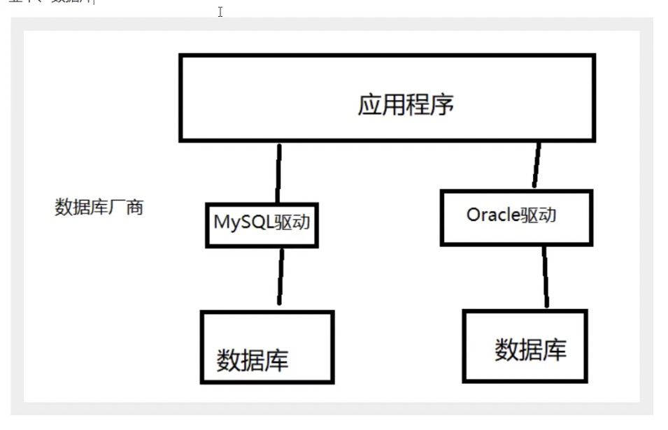
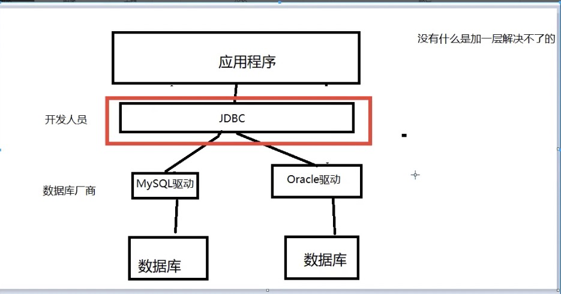

## 

## 12.JDBC 

### 1、数据库驱动

驱动： 声卡，显卡，数据库

我们的程序会通过 数据库 驱动，和数据打交道

### 2、jdbc

SUN公司为了简化开发人员的（对数据库的统一）操作，提供了一个（JAVA操作数据库）的规范，俗称JDBC

这些规范的实现是由具体的厂商去做~

对于开发人员，我们只需要掌握jdbc接口的操作即可~

### 3、node驱动

#### MySQL驱动

- https://www.npmjs.com/package/mysql
- https://www.npmjs.com/package/mysql2

#### Oracle驱动

- https://github.com/oracle/node-oracledb