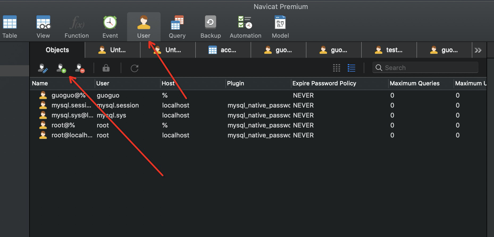
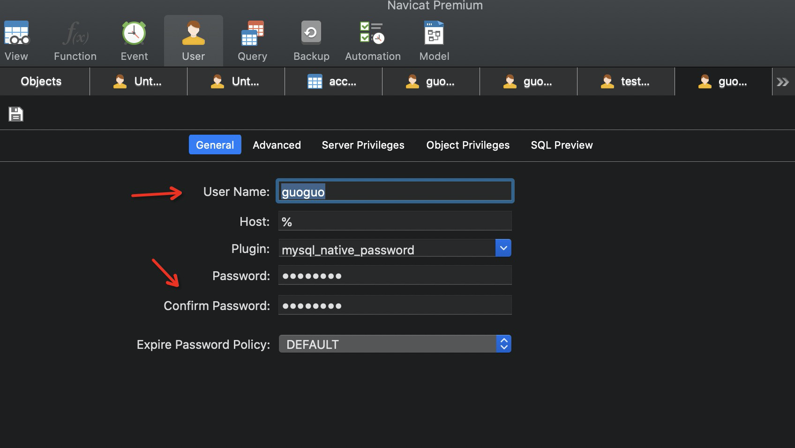
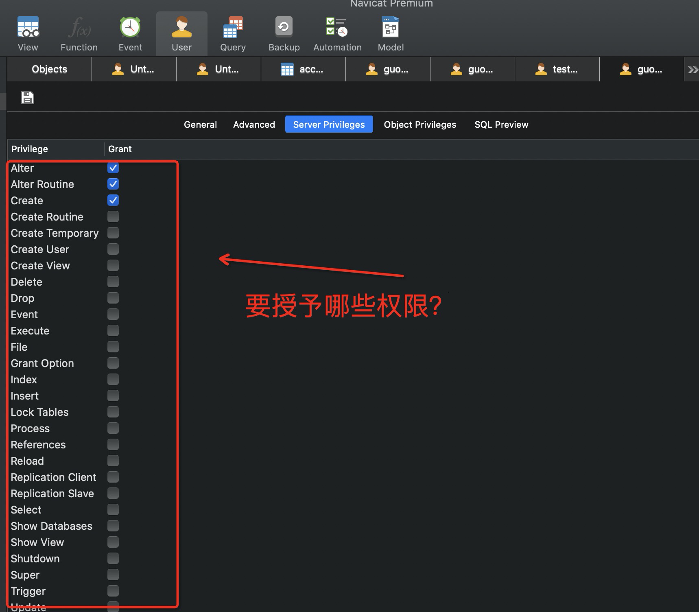

## 8.数据库用户管理

### 8.1、用户管理

#### 1、**Navicat 可视化管理**







#### 2、SQL命令操作

```sql
/* 用户和权限管理 */ ------------------
用户信息表：mysql.user

-- 刷新权限
FLUSH PRIVILEGES

-- 增加用户 CREATE USER test IDENTIFIED BY '123456'
CREATE USER 用户名 IDENTIFIED BY [PASSWORD] 密码(字符串)
  - 必须拥有mysql数据库的全局CREATE USER权限，或拥有INSERT权限。
  - 只能创建用户，不能赋予权限。
  - 用户名，注意引号：如 'user_name'@'192.168.1.1'
  - 密码也需引号，纯数字密码也要加引号
  - 要在纯文本中指定密码，需忽略PASSWORD关键词。要把密码指定为由PASSWORD()函数返回的混编值，需包含关键字PASSWORD

-- 重命名用户 RENAME USER test TO test2
RENAME USER old_user TO new_user

-- 设置密码
-- SET PASSWORD = PASSWORD('111111') 
SET PASSWORD = PASSWORD('密码')    -- 为当前用户设置密码
-- SET PASSWORD FOR test = PASSWORD('123456')
SET PASSWORD FOR 用户名 = PASSWORD('密码')    -- 为指定用户设置密码

-- 分配权限/添加用户
GRANT 权限列表 ON 表名 TO 用户名 [IDENTIFIED BY [PASSWORD] 'password']
  - all privileges 表示所有权限
  - *.* 表示所有库的所有表
  - 库名.表名 表示某库下面的某表
  
-- GRANT all privileges ON *.* TO test IDENTIFIED BY '123456' 
-- 可以设置除了grant权限之外的所有权限，可视化面板勾上这个权限，就和root权限一样啦

-- 查看权限   SHOW GRANTS FOR root@localhost;
SHOW GRANTS FOR 用户名
-- 查看当前用户权限
SHOW GRANTS; 或 SHOW GRANTS FOR CURRENT_USER; 或 SHOW GRANTS FOR CURRENT_USER();
  
SHOW GRANTS FOR root -- GRANT ALL PRIVILEGES ON *.* TO 'root'@'%' WITH GRANT OPTION
SHOW GRANTS FOR test -- GRANT ALL PRIVILEGES ON *.* TO 'root'@'%' WITH GRANT OPTION


-- 撤消权限
-- REVOKE ALL PRIVILEGES ON *.* FROM test;
REVOKE 权限列表 ON 表名 FROM 用户名
REVOKE ALL PRIVILEGES, GRANT OPTION FROM 用户名    -- 撤销所有权限


-- 删除用户 DROP USER kuangshen2
DROP USER 用户名
```

### 8.2、权限解释

```sql
-- 权限列表
ALL [PRIVILEGES]    -- 设置除GRANT OPTION之外的所有简单权限
ALTER    -- 允许使用ALTER TABLE
ALTER ROUTINE    -- 更改或取消已存储的子程序
CREATE    -- 允许使用CREATE TABLE
CREATE ROUTINE    -- 创建已存储的子程序
CREATE TEMPORARY TABLES        -- 允许使用CREATE TEMPORARY TABLE
CREATE USER        -- 允许使用CREATE USER, DROP USER, RENAME USER和REVOKE ALL PRIVILEGES。
CREATE VIEW        -- 允许使用CREATE VIEW
DELETE    -- 允许使用DELETE
DROP    -- 允许使用DROP TABLE
EXECUTE        -- 允许用户运行已存储的子程序
FILE    -- 允许使用SELECT...INTO OUTFILE和LOAD DATA INFILE
INDEX     -- 允许使用CREATE INDEX和DROP INDEX
INSERT    -- 允许使用INSERT
LOCK TABLES        -- 允许对您拥有SELECT权限的表使用LOCK TABLES
PROCESS     -- 允许使用SHOW FULL PROCESSLIST
REFERENCES    -- 未被实施
RELOAD    -- 允许使用FLUSH
REPLICATION CLIENT    -- 允许用户询问从属服务器或主服务器的地址
REPLICATION SLAVE    -- 用于复制型从属服务器（从主服务器中读取二进制日志事件）
SELECT    -- 允许使用SELECT
SHOW DATABASES    -- 显示所有数据库
SHOW VIEW    -- 允许使用SHOW CREATE VIEW
SHUTDOWN    -- 允许使用mysqladmin shutdown
SUPER    -- 允许使用CHANGE MASTER, KILL, PURGE MASTER LOGS和SET GLOBAL语句，mysqladmin debug命令；允许您连接（一次），即使已达到max_connections。
UPDATE    -- 允许使用UPDATE
USAGE    -- “无权限”的同义词
GRANT OPTION    -- 允许授予权限


/* 表维护 */

-- 分析和存储表的关键字分布
ANALYZE [LOCAL | NO_WRITE_TO_BINLOG] TABLE 表名 ...
-- 检查一个或多个表是否有错误
CHECK TABLE tbl_name [, tbl_name] ... [option] ...
option = {QUICK | FAST | MEDIUM | EXTENDED | CHANGED}
-- 整理数据文件的碎片
OPTIMIZE [LOCAL | NO_WRITE_TO_BINLOG] TABLE tbl_name [, tbl_name] ...
```


